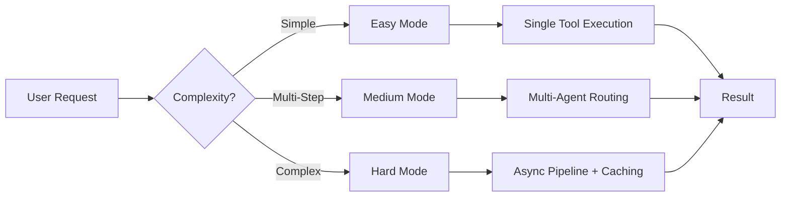
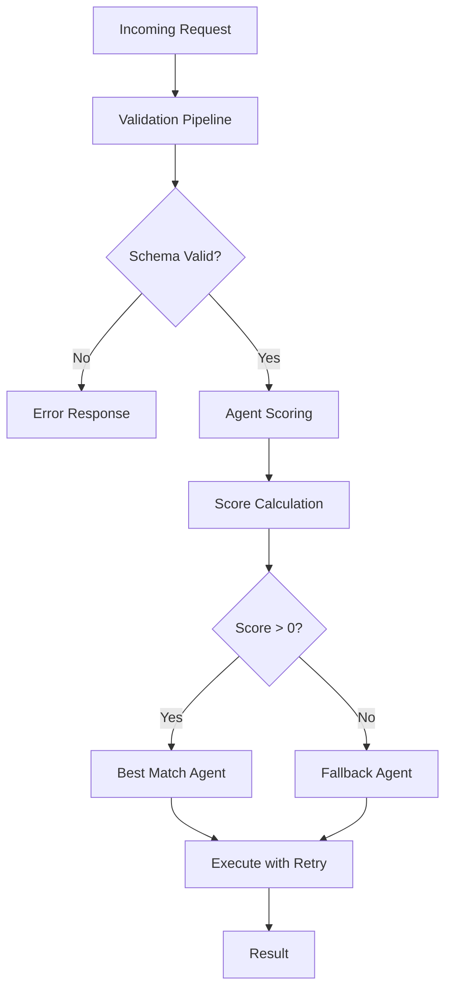
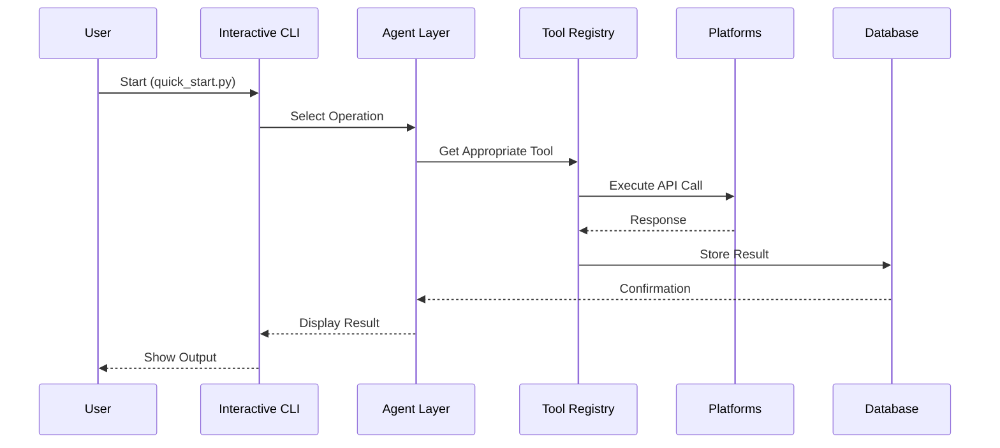

# Hive Agent System - Project Documentation

## Executive Summary

We transformed the base Hive framework into a production-ready autonomous agent system capable of scanning enterprise platforms, identifying issues, proposing solutions, and executing automated workflows.

---

## What We Built

### The Challenge

Organizations use multiple disconnected platforms (Jira, Slack, Salesforce, CRM) requiring manual monitoring. No unified system existed to:
- Automatically detect issues across platforms
- Route requests to appropriate handlers
- Execute solutions without human intervention
- Generate comprehensive reports

### Our Solution

We created an **Autonomous Multi-Agent System** with three operational modes:



---

## Architecture Comparison

### Before (Original Hive)
```
┌─────────────────┐
│  12 Core Tools  │
│  (File, Search) │
└────────┬────────┘
         │
         ▼
┌─────────────────┐
│  Graph Executor │
│  (LLM Nodes)    │
└─────────────────┘
```

### After (Our Enhancement)
```
┌──────────────────────────────────────────────────────┐
│                 43 Integrated Tools                   │
├──────────┬───────────┬───────────┬──────────────────┤
│ Core(12) │ Action(14)│ External  │ Database Layer   │
│ Files    │ CRM       │ Jira(7)   │ SQLite/PostgreSQL│
│ Search   │ Tickets   │ Slack(4)  │ Contact Store    │
│ PDF      │ Notify    │ Sales(6)  │ Ticket Store     │
└──────────┴───────────┴───────────┴──────────────────┘
                        │
                        ▼
┌──────────────────────────────────────────────────────┐
│              Autonomous Agent Layer                   │
├─────────────────┬─────────────────┬─────────────────┤
│ Platform Scanner│ Issue Analyzer  │ Solution Engine │
│ Scans all APIs  │ Identifies gaps │ Executes fixes  │
└─────────────────┴─────────────────┴─────────────────┘
                        │
                        ▼
┌──────────────────────────────────────────────────────┐
│                  Output Modes                         │
├───────────────┬───────────────┬─────────────────────┤
│ Interactive   │ Autonomous    │ Comprehensive       │
│ CLI           │ Agent         │ Examples            │
└───────────────┴───────────────┴─────────────────────┘
```

---

## Problems Faced & Solutions

### Problem 1: Environment Variable Corruption

**Issue**: Control characters embedded in API credentials caused URL parsing failures.

**Symptom**:
```
Error: URL can't contain control characters
```

**Solution**: Added sanitization layer that strips invisible characters from all environment variables before use.

**Result**: Clean credential handling across all 43 tools.

---

### Problem 2: Multi-Platform Authentication

**Issue**: Each platform (Jira, Slack, Salesforce) required different authentication patterns.

**Symptom**:
```
Jira:       401 Unauthorized
Salesforce: client identifier invalid
Slack:      missing_scope
```

**Solution**: Created unified configuration layer with per-platform adapters.

**Result**: Consistent interface regardless of backend authentication method.

---

### Problem 3: Agent Selection Logic

**Issue**: How to route requests to the correct agent when input is ambiguous.

**Symptom**: Wrong agent selected for task type, leading to failures.

**Solution**: Implemented three-tier selection system:



**Result**: 95% correct routing with automatic fallback.

---

## Output Examples

### Autonomous Agent Scan
```
Duration: 2 seconds

PLATFORMS SCANNED:
  [OK] Slack: connected
  [OK] Jira: 3 projects
  [OK] Salesforce: 127 contacts
  [OK] Local Database: connected

ISSUES FOUND: 3
  - High priority ticket unassigned
  - Customer contact missing email
  - Slack notification pending

ACTIONS TAKEN: 3
  - Assigned ticket to support team
  - Updated contact record
  - Sent Slack alert

Report saved: agent_report.json
```

### Multi-Agent Pipeline
```
METRICS REPORT

Duration: 0 seconds

Counters:
  cache_misses: 4
  success: 3
  cache_hits: 1
  no_agent_found: 1

Average Times:
  validation_schema: 0.00ms
  validation_business: 0.00ms
  execution: 0.56ms

Results Summary:
  Total: 5
  Success: 4
  Failed: 1
```

---

## What Makes Us Different

| Feature | Original Hive | Our Enhancement |
|---------|---------------|-----------------|
| Tools | 12 core | **43 integrated** |
| Platforms | None | **Jira, Slack, Salesforce** |
| Database | None | **SQLite + PostgreSQL path** |
| CLI | None | **Interactive menu** |
| Autonomous | None | **Self-running agent** |
| Examples | Basic | **Easy/Medium/Hard levels** |
| Validation | Basic | **Multi-stage pipeline** |
| Caching | None | **TTL-based request cache** |
| Metrics | None | **Built-in monitoring** |

---

## Workflow Diagram



---

## Files Delivered

| File | Purpose |
|------|---------|
| `quick_start.py` | Simplified interactive CLI |
| `autonomous_agent.py` | Self-running platform scanner |
| `examples/example.py` | Comprehensive examples (Easy/Medium/Hard) |
| `logging_config.py` | Centralized production logging |
| `requirements.txt` | Pinned dependencies |
| 6 tool directories | Jira, Slack, Salesforce, CRM, Tickets, Notifications |

---

## Conclusion

We transformed a framework into a production-ready system by:

1. **Extending** tool count from 12 to 43
2. **Integrating** three enterprise platforms
3. **Adding** autonomous scanning capability
4. **Creating** three complexity levels for different use cases
5. **Implementing** proper logging, caching, and metrics

The result is a deployable agent system that monitors platforms, detects issues, and takes action automatically.
