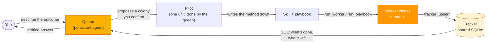

<p align="center">
  
</p>

<p align="center">
  <a href="README.md">English</a> |
  <a href="docs/i18n/zh-CN.md">简体中文</a> |
  <a href="docs/i18n/es.md">Español</a> |
  <a href="docs/i18n/hi.md">हिन्दी</a> |
  <a href="docs/i18n/pt.md">Português</a> |
  <a href="docs/i18n/ja.md">日本語</a> |
  <a href="docs/i18n/ru.md">Русский</a> |
  <a href="docs/i18n/ko.md">한국어</a>
</p>

<p align="center">
  <a href="https://github.com/aden-hive/hive/blob/main/LICENSE"></a>
  <a href="https://www.ycombinator.com/companies/aden"></a>
  <a href="https://discord.com/invite/MXE49hrKDk"></a>
  <a href="https://x.com/aden_hq"></a>
  <a href="https://www.linkedin.com/company/teamaden/"></a>
</p>

<h3 align="center">Colonies of AI agents that run your business processes.</h3>

<p align="center">
  Describe an outcome. A queen does the first piece of the work herself, then grows a colony of worker agents to finish the rest in parallel, with every result in a shared ledger you can query, resume and audit.
</p>

<p align="center">
  <a href="docs/assets/readme/demo.mp4"></a>
  <br />
  <sub>Recorded from a real run; only the waiting is sped up. <a href="docs/assets/readme/demo.mp4">Watch in full quality (MP4)</a>.</sub>
</p>

## What you just watched

A growth team planning a Show HN asks how five developer tools' own launches did on Hacker News. Here is what Hive did with that one message:

1. **You hand it to a queen.** Each queen is a persistent agent with a role, here Head of Growth, plus her own memory and tools.
2. **She asks the one question that changes the answer:** original launches only, or any launch? You pick an option and she carries on.
3. **She proposes a colony, and you confirm.** Five products are five parallel jobs, so the chat becomes a colony: the queen plus as many worker agents as the job needs.
4. **She does one unit herself.** She takes Supabase, the awkward case (its biggest launch thread has no "Launch HN" in the title), settles what counts as a launch, and writes the method down as a reusable skill.
5. **She runs it as a playbook:** one worker per product, in parallel, each following her skill and writing its row to the colony's tracker, a shared SQLite table.
6. **She checks every row before answering.** The edge cases stay visible: Cal.com had no qualifying launch under either of its names, so it's charted as missing, not as zero.

Nothing in that flow was wired up in advance. There is no workflow graph to design: the queen grows the colony at runtime, and the tracker on disk, not anyone's memory, records what is done and what is left.

## Quick start

**You need:** Python 3.11+, Node.js 20+ and git. The quickstart installs `uv` and `ripgrep` if they're missing and offers to install Node.

**And a model.** The quickstart walks you through any of these:

- an API key: Anthropic, OpenAI, Google Gemini, Groq, Cerebras or OpenRouter
- a coding subscription you already have: Claude Code, OpenAI Codex, Kimi Code, MiniMax, Z.AI or Antigravity
- Hive LLM
- a local model through Ollama, with no key at all

```bash
git clone https://github.com/aden-hive/hive.git
cd hive
./quickstart.sh          # macOS / Linux
.\quickstart.ps1         # Windows (PowerShell 5.1+)
```

The quickstart creates one Python environment for the workspace, stores your API key in an encrypted credential store under `~/.hive`, asks which model to use, builds the dashboard and opens it at `http://127.0.0.1:8787`. To reopen it later, run `hive open` from the repository.

> [!NOTE]
> Hive is a `uv` workspace, not a pip package. `pip install -e .` installs a placeholder that won't run; use the quickstart.

**Then:** type a task on the home screen and pick the queen to hand it to, or open the **Prompt Library** and deploy a ready-made prompt straight to the queen it was written for.

## How it works



Hive has **one execution primitive**: an agent loop. The queen is one; every worker is a clone of it with its own task, a narrower tool set and a strict budget. Orchestration is a tool call, not a compiled graph:

- **`run_worker`** fans tasks out and returns immediately, so the queen keeps talking to you while workers run. Up to four run at once by default; the rest queue. Each finished worker's report arrives in the queen's conversation as a new turn.
- **The tracker** is the colony's shared state. The queen defines the table and which columns workers may write; workers upsert one row per unit of work; the queen checks progress with SQL. It lives on disk, at `~/.hive/colonies/<name>/tracker/tracker.db`.
- **`run_playbook`** runs a proven protocol over every row: retries with backoff, rate-limited lanes, a dead-letter list for rows that keep failing. Because "what's left" is always a fresh tracker query, re-running a playbook resumes it.

The **[architecture overview](docs/architecture/README.md)** covers the loop, the tool surface, memory, human oversight and how state survives a crash.

<table>
  <tr>
    <td width="50%"><br /><sub><b>Home.</b> Your queens and their colonies on one map. Describe a task and pick who takes it.</sub></td>
    <td width="50%"><br /><sub><b>Workers.</b> One per unit of work, each with its own task and budget, all reporting to the queen.</sub></td>
  </tr>
  <tr>
    <td width="50%"><br /><sub><b>Tracker.</b> Results land in a shared table as workers finish, ready to query, export or resume from.</sub></td>
    <td width="50%"><br /><sub><b>Result.</b> A verified answer with sources and a chart, in the chat.</sub></td>
  </tr>
</table>

## What's inside

**Queens with a job and a memory.** Thirteen persona queens ship with Hive: six are active by default (Growth, RevOps, Content, Lead Generation, Outbound, Brand & Design), the rest can be hired from the Org Chart, and you can create your own. Each keeps scoped markdown memory written by a reflection step, and relevant past conversations are recalled into her context automatically.

**Built-in tools, in-process.** Shell commands and background jobs, file editing, fast code search, PDFs, attachments and images, web scraping, charts (ECharts and Mermaid), CSV files, and image generation with Hive LLM. They run inside Hive itself, with no tool servers to start.

**Your browser, driven by your agents.** The Hive Browser Bridge extension lets agents operate your own Chrome, where your logins already work. Each worker gets its own tab group.

**Skills.** Reusable instructions in the open [Agent Skills](https://agentskills.io) format. Hive ships with a set, queens write new ones when a protocol proves out, and you can manage them in the Skills Library.

**Any MCP server.** Add an external MCP server with `hive mcp add` and its tools join the same allowlists as the built-ins. The full integration catalog in [`tools/`](tools/src/aden_tools/tools) (GitHub, Gmail, HubSpot, Slack, Notion and many more) runs as one; see [docs/tools.md](docs/tools.md).

**Runs while you're away.** Colonies can schedule themselves with cron, interval or webhook triggers. **Sentinel**, opt-in per colony, watches a queen when she stops: it nudges her on, or escalates to you through the Hive inbox, Telegram or Slack, and she resumes when you reply.

**Built to survive.** Every agent persists its state to disk and resumes after a crash or restart exactly where it stopped. Large tool results spill to files instead of flooding the context, long sessions compact themselves, stuck or looping turns are detected, and every worker runs under a hard tool-call budget.

**Any model.** Anything [LiteLLM](https://docs.litellm.ai/docs/providers) supports, including OpenAI, Anthropic, Gemini, OpenRouter, Hive LLM, any OpenAI-compatible endpoint and local models through Ollama. Workers can use a different model from their queen, and text-only models still see images through a vision fallback.

## Is Hive for you?

Hive fits when the hard part is no longer the model but everything around it:

- A process with **many similar units of work**, such as leads, accounts, tickets, repositories or documents, that you want done in parallel and done the same way.
- Work that **runs for hours or on a schedule** and has to survive restarts.
- Results you need to **check, query and audit**, not just read in a chat.
- A **human who stays in charge** of the decisions that matter.

For a single prompt or a one-off script, a plain agent is simpler.

## Documentation

- [Getting started](docs/getting-started.md): setup in more detail
- [Architecture overview](docs/architecture/README.md): how colonies, the loop, tools and memory fit together
- Key concepts: [colony](docs/key_concepts/colony.md), [queen](docs/key_concepts/queen.md), [workers](docs/key_concepts/worker_agent.md), [coordination](docs/key_concepts/coordination.md), [the loop](docs/key_concepts/the_loop.md), [goals and outcomes](docs/key_concepts/goals_outcome.md), [how colonies improve](docs/key_concepts/improvement.md)
- [Tools](docs/tools.md): built-in tools, MCP servers and the integration catalog
- [Configuration](docs/configuration.md) and the [developer guide](docs/developer-guide.md)
- [docs.adenhq.com](https://docs.adenhq.com/): hosted documentation

## FAQ

**Which models does Hive support?**
Any provider [LiteLLM](https://docs.litellm.ai/docs/providers) supports, plus any OpenAI-compatible endpoint. The quickstart sets up the common ones, including coding subscriptions such as Claude Code and OpenAI Codex; [docs/configuration.md](docs/configuration.md) covers the rest.

**Can I run it with local models?**
Yes. Choose Ollama in the quickstart, or set a model such as `ollama/llama3` with Ollama running locally.

**How is this different from other agent frameworks?**
Most frameworks have you design a graph of agents and wire their inputs and outputs. Hive has one kind of agent: the queen is an agent loop and every worker is a clone of it. Orchestration happens at runtime through tool calls, and coordination goes through a shared SQL tracker instead of messages passed along edges. The harness features (persistence, resume, budgets, compaction, oversight) live in that one loop, so every agent has them.

**Where does my data live?**
On your machine. Sessions, colonies, trackers and memory are plain files under `~/.hive` (or wherever `HIVE_HOME` points), and API keys are stored there encrypted.

**How do I keep costs under control?**
Each worker runs under hard limits on turns and tool calls, so a stuck worker stops on its own, and concurrency is capped. Usage is metered on every model call. There are no dollar-denominated spend limits yet.

**Can agents use my own tools and APIs?**
Yes: through the built-in shell and browser, through any MCP server you add, and through skills that teach them your procedures.

**Is Hive open source?**
Yes, under the [Apache License 2.0](LICENSE).

## Contributing

Contributions are welcome, especially tools, integrations and skills ([#2805](https://github.com/aden-hive/hive/issues/2805)). Please read [CONTRIBUTING.md](CONTRIBUTING.md) first, and get assigned to an issue before you open a pull request: comment on the issue and a maintainer will assign you. Issues with reproduction steps or a proposal are prioritized.

## Community

- [Discord](https://discord.com/invite/MXE49hrKDk) for questions, feature requests and discussion
- [X / Twitter](https://x.com/aden_hq) and [LinkedIn](https://www.linkedin.com/company/teamaden/) for updates
- [HoneyComb](http://honeycomb.open-hive.com/): a community market that tracks which jobs AI agents are automating. Go long or short on a job with compute tokens, not money.

**We're hiring** in engineering, research and go-to-market. [See open positions](https://jobs.adenhq.com/a8cec478-cdbc-473c-bbd4-f4b7027ec193/applicant).

## Security

To report a vulnerability, see [SECURITY.md](SECURITY.md).

## License

Apache License 2.0. See [LICENSE](LICENSE).

## Star history

<a href="https://www.star-history.com/?type=date&repos=aden-hive%2Fhive">
 <picture>
   <source media="(prefers-color-scheme: dark)" srcset="https://api.star-history.com/chart?repos=aden-hive/hive&type=date&theme=dark&legend=top-left&sealed_token=vfX1DG8w_KTkonUUtIEjFRLvBopgDzxQpyb8hiYT22sobcDIpvQiMciZghLsDu5hyU3LJs-ZddFjl8eYFx5zRrY-kcMRsfyQ3vAiacsroPoqgRYmZaES3Q" />
   <source media="(prefers-color-scheme: light)" srcset="https://api.star-history.com/chart?repos=aden-hive/hive&type=date&legend=top-left&sealed_token=vfX1DG8w_KTkonUUtIEjFRLvBopgDzxQpyb8hiYT22sobcDIpvQiMciZghLsDu5hyU3LJs-ZddFjl8eYFx5zRrY-kcMRsfyQ3vAiacsroPoqgRYmZaES3Q" />
   
 </picture>
</a>

---

<p align="center">Made with 🔥 Passion in San Francisco</p>
