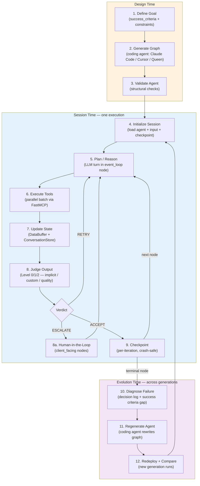

# Agent Lifecycle, Observability & Production Trust

> A developer-facing map for understanding how a Hive agent behaves over time, how to inspect what it did, how to evaluate it, and how to take it to production.

This guide was written in response to [#6687](https://github.com/aden-hive/hive/issues/6687). It does not introduce new runtime features — it organizes existing ones into a single trust-building narrative and links to the underlying source and deeper concept docs.

---

## Why This Guide Exists

Hive is positioned around long-running, self-improving agents that run real business workflows. Trusting an agent in production requires answering five concrete questions:

1. **Lifecycle** — what stages does an agent move through, from definition to adaptation?
2. **State** — what gets persisted between iterations, sessions, and generations?
3. **Observability** — how do I see what the agent decided and why?
4. **Evaluation** — how do I know it is getting better (or worse)?
5. **Production readiness** — what guardrails do I get out of the box, and where do I bolt on more?

The sections below answer each in turn, then walk through a concrete template agent end-to-end.

---

## 1. Agent Lifecycle

A Hive agent is not a single function call — it is a multi-stage cycle that spans **design time** (when the graph is generated), **session time** (when it executes), and **evolution time** (across generations).



### Stage-by-stage mapping to the codebase

| Stage | What happens | Where it lives |
| ----- | ------------ | -------------- |
| **1. Define Goal** | A `Goal` is declared with weighted `success_criteria` and hard/soft `constraints`. | [`docs/key_concepts/goals_outcome.md`](key_concepts/goals_outcome.md); `core/framework/orchestrator/goal.py` |
| **2. Generate Graph** | A coding agent (or the Queen) produces an `agent.json` describing nodes, edges, and entry/terminal points. | [`docs/key_concepts/graph.md`](key_concepts/graph.md); `core/framework/orchestrator/node.py`, `edge.py` |
| **3. Validate** | `hive validate <path>` checks structural integrity before execution. | `core/framework/loader/agent_loader.py`; `hive validate` in `core/framework/cli.py` |
| **4. Initialize Session** | The runtime loads the agent, hydrates input, and (if resuming) restores from a checkpoint. | `core/framework/host/colony_runtime.py`; `core/framework/storage/checkpoint_store.py` |
| **5. Plan / Reason** | The active `event_loop` node calls the LLM with the three-layer prompt onion (identity / narrative / focus). | `core/framework/agent_loop/agent_loop.py`; prompt composer in `core/framework/orchestrator/prompt_composer.py` |
| **6. Execute Tools** | Tool calls run in parallel via FastMCP. Large results spill to disk and become pointers in the conversation (see [Tool Result Truncation](architecture/README.md#tool-result-truncation--pointer-pattern)). | `tools/src/aden_tools/`; `core/framework/loader/tool_registry.py` |
| **7. Update State** | `set_output(key, value)` writes through to the `DataBuffer` and `ConversationStore` for crash recovery. | `core/framework/storage/conversation_store.py` |
| **8. Judge** | A three-level pipeline decides ACCEPT / RETRY / ESCALATE — implicit key-presence check, optional custom judge, then LLM quality judge against `success_criteria`. | `core/framework/orchestrator/validator.py`, `conversation_judge.py` |
| **8a. HITL** | Nodes with `client_facing=True` pause the session, persist state, and resume when a human responds (minutes, hours, or days later). | `docs/key_concepts/graph.md#human-in-the-loop` |
| **9. Checkpoint** | Each accepted iteration is persisted so a crash, deploy, or pause never loses progress. | `core/framework/storage/checkpoint_store.py` |
| **10. Diagnose** | Failure data — which node, which criterion, what was tried — is structured for analysis. | `core/framework/tracker/decision_tracker.py` |
| **11. Regenerate** | A coding agent rewrites prompts, edges, tool choices, or graph shape based on the diagnosis. | [`docs/key_concepts/evolution.md`](key_concepts/evolution.md) |
| **12. Redeploy + Compare** | The new generation runs and its outcomes feed the next diagnosis. | Same evolution loop. |

### What persists between runs

| Scope | Lives in | Survives |
| ----- | -------- | -------- |
| Conversation history (messages, tool calls, tool results, judge feedback) | `~/.hive/` session storage; spillover files alongside | Process crash, deploy, resume |
| `DataBuffer` outputs (everything written via `set_output`) | `ConversationStore` cursor (write-through) | Process crash, resume |
| Spillover tool results (`web_search_1.txt`, etc.) | Session spillover directory | Process crash, resume — counter restored from existing files |
| Decision log (intent / options / choice / outcome) | `core/framework/tracker/runtime_log_store.py` JSONL | Forever, until pruned — used by evolution |
| LLM debug logs (raw prompt + response) | `~/.hive/llm_logs/*.jsonl` | Forever, until pruned — used by `hive debugger` |
| Encrypted credentials | `~/.hive/credentials`, unlocked by `HIVE_CREDENTIAL_KEY` | Process lifetime — never logged |
| Agent code itself | `exports/<agent_name>/` | Until evolution regenerates it |

---

## 2. Observability & Debugging

Hive emits four kinds of signal during a session. They are designed to be combined: structured logs tell you *what happened in order*, decision logs tell you *why*, LLM debug logs tell you *exactly what the model saw*, and checkpoints tell you *where it was when it stopped*.

### 2.1 Structured logs (trace IDs)

Logging is configured automatically by `AgentRunner`. Every log line carries `trace_id`, `execution_id`, `agent_id`, `goal_id`, and (when set) `node_id`, propagated via `ContextVar` so they survive async hops.

```bash
# Development — human-readable, colour-coded
hive run exports/my_agent -v -i '{...}'

# Production — JSON, one line per log entry, OTel-aligned IDs
LOG_FORMAT=json hive run exports/my_agent -i '{...}'
# or
ENV=production hive run exports/my_agent -i '{...}'

# Maximum verbosity (internal subsystems: memory reflection, recall)
hive run exports/my_agent --debug -i '{...}'
```

See [`core/framework/observability/README.md`](../core/framework/observability/README.md) for the full schema and custom-field guidance.

### 2.2 The `hive debugger` — LLM debug log viewer

Every LLM call is recorded as a JSONL entry under `~/.hive/llm_logs/`. The bundled visualizer renders sessions as a browsable timeline.

```bash
# Launch the viewer (picks a free port, opens browser)
hive debugger

# Jump straight to a specific execution
hive debugger --session <execution_id>

# Generate a static HTML report instead of starting a server
hive debugger --output trace.html
```

Use this when:

- A node refused to terminate and you want to see what the LLM was actually shown each turn.
- A tool returned something unexpected and you need the raw response before pointer-truncation.
- The judge issued a confusing RETRY verdict and you need the feedback string verbatim.

### 2.3 Decision logs

`DecisionTracker` records the **intent → options → choice → outcome** tuple for every meaningful agent decision. This is the raw material for both human review and the evolution loop (see [§4](#4-evaluation-framework)). It is queryable via `BuilderQuery`:

```python
from framework import BuilderQuery

query = BuilderQuery("/path/to/storage")

patterns = query.find_patterns("my_goal")
print(f"Success rate: {patterns.success_rate:.1%}")

analysis = query.analyze_failure("run_123")
print(f"Root cause: {analysis.root_cause}")
for s in query.suggest_improvements("my_goal"):
    print(f"[{s['priority']}] {s['recommendation']}")
```

### 2.4 Event stream / SSE

The HTTP server emits Server-Sent Events for every node lifecycle event (start, iteration, tool call, judge verdict, accept, terminate). Wire these into dashboards or alerting.

```bash
hive serve --port 8787
# then subscribe to: GET http://127.0.0.1:8787/sessions/<id>/events
```

Routes are defined in `core/framework/server/routes_events.py` and `sse.py`.

### 2.5 Resume from a checkpoint

When something goes wrong, you do not have to restart from scratch:

```bash
# Resume from the last checkpoint of a session
hive run exports/my_agent --resume-session <session_id>

# Resume from a specific checkpoint within that session
hive run exports/my_agent --resume-session <session_id> --checkpoint <checkpoint_id>
```

Resuming preserves the `DataBuffer`, conversation history, spillover files, and the spill counter — so the agent never duplicates work or filename-clashes with a prior run.

---

## 3. Inspecting Failures

When a session fails, work outward from the smallest signal:

| Symptom | First place to look | Then |
| ------- | ------------------- | ---- |
| Wrong final output but no error | `success_criteria` weights + LLM judge feedback in `hive debugger` | Decision log for the accepting iteration |
| Loop / never terminates | Iteration count vs node `max_iterations`; Level 0 judge (missing output keys) | Inspect Layer 3 system prompt — is the goal expressible? |
| Tool failure | Tool result `is_error=true` in `hive debugger` | Spillover file for the full payload |
| Crashed mid-run | Last checkpoint ID in session storage | `--resume-session <id> --checkpoint <id>` |
| HITL never resumed | Session status in `hive session list` | `routes_messages.py` for the pending escalation |
| Cost overrun | Per-LLM-call entries in JSON logs (`tokens_used`, `latency_ms`) | Decision log: which options the agent considered |

---

## 4. Evaluation Framework

Hive evaluates agents at three levels: **per-iteration** (does this turn meet the bar?), **per-session** (did the run satisfy the goal?), and **per-generation** (is this version better than the last?).

### 4.1 What "improvement" means

Improvement is measured against a `Goal`, not against tests. A goal has:

- **`success_criteria`** — weighted, multi-dimensional. `metric` can be `llm_judge`, `output_contains`, `custom`, etc. Weights sum to 1.0.
- **`constraints`** — hard or soft. Hard constraint violations trigger ESCALATE (never silently accepted).
- Optional **principles** that align the Queen Bee's oversight.

A better generation is one that, across a sample of runs, raises the weighted criterion satisfaction rate **and** does not regress on constraints. See [`docs/key_concepts/goals_outcome.md`](key_concepts/goals_outcome.md).

### 4.2 Triangulated verification

Per-iteration evaluation does not trust any single signal. The judge pipeline combines three:

1. **Deterministic rules** — priority-ordered, zero ambiguity. Catch security patterns, format violations, known error signatures.
2. **LLM semantic evaluation** — handles intent and quality. Gated by a confidence threshold; below the threshold, the verdict is ESCALATE (not ACCEPT).
3. **Human judgment** — invoked when rules and LLM disagree, or when confidence is too low. Decisions feed back into rule generation.

The full theory and roadmap are in [`docs/architecture/README.md`](architecture/README.md). For developers the practical takeaways are:

- Write `EvaluationRule`s for anything you can express deterministically (security, format, banned patterns). They are cheap and immune to LLM drift.
- Pick a confidence threshold consistent with the cost of being wrong. Security goals want a higher threshold than UX goals.
- Treat every escalation as a training signal — it is what will let evolution close the loop in future generations.

### 4.3 Built-in agent tests

Each exported agent ships with a test harness. Tests are generated via MCP tools (`generate_constraint_tests`, `generate_success_tests`) and run via:

```bash
# Run all tests for an exported agent
PYTHONPATH=exports uv run python -m my_agent test

# Just success-criteria tests
PYTHONPATH=exports uv run python -m my_agent test --type success

# Just constraint tests (what must not happen)
PYTHONPATH=exports uv run python -m my_agent test --type constraint

# Parallel + fail-fast
PYTHONPATH=exports uv run python -m my_agent test --parallel 4 --fail-fast
```

Test failures, like session failures, feed the evolution loop — they are the most common "diagnosis" signal because they are reproducible.

### 4.4 Regression detection

Two practical patterns:

- **Per-generation comparison.** Run the new generation on the same input fixtures as the previous one and diff weighted criterion scores. The decision log makes this comparison concrete (which choices changed, not just which outputs).
- **Pinned constraint tests.** Constraint tests for hard guarantees (e.g., "no plaintext password ever appears in `result.logs`") should never go red. CI gates regenerations on these.

### 4.5 Human-in-the-loop validation

`client_facing=True` nodes are evaluation points as much as approval gates. Every human input becomes a labelled example — what the agent proposed, what the human chose, why. This is the signal Phase 2/3 of the calibration roadmap consumes (see architecture doc §"Online Learning").

---

## 5. Production Readiness

### 5.1 Out-of-the-box guardrails

| Guardrail | Mechanism | Where |
| --------- | --------- | ----- |
| Cost enforcement | Per-call metering; budget caps on the `Goal` | `core/framework/host/colony_runtime.py` |
| Iteration ceilings | `max_iterations` per node — prevents runaway loops | Node spec |
| Hard constraints | `constraint_type="hard"` → ESCALATE on violation, never silent | `Goal.constraints` |
| Credential isolation | Encrypted store at `~/.hive/credentials`, never logged, unlocked by `HIVE_CREDENTIAL_KEY` | `tools/src/aden_tools/credentials/` |
| Crash recovery | Per-iteration checkpoints; conversation/buffer write-through | `core/framework/storage/checkpoint_store.py` |
| Sub-agent isolation | Sub-agents get read-only memory snapshots and filtered tools; nested delegation is blocked | `docs/architecture/README.md` |
| Tool sandbox | `aden_tools.file_ops` enforces a registered `home`, deny-lists system + credential paths | `tools/src/aden_tools/file_ops.py` |
| Approval gates | `client_facing=True` nodes pause for human input before irreversible actions | `docs/key_concepts/graph.md#human-in-the-loop` |

### 5.2 Safe deployment patterns

- **Shadow mode first.** New generations should run alongside the prior one on real traffic without their outputs being acted on. Compare decision logs. Promote only after the new generation matches or beats the old one on the success-criterion mix.
- **Approval gates on irreversible actions.** Any node that sends a message, takes a payment, modifies a third-party system, or writes to a shared resource should be `client_facing=True` until you have enough data to justify auto-approval.
- **Budget caps per goal.** Set the goal's spend cap to a fraction of the worst plausible run. The runtime stops the agent before it overshoots — silent burn-through is impossible.
- **Pin the model.** `--model` accepts any LiteLLM-compatible name. Pin a specific revision (e.g. `claude-haiku-4-5-20251001`) in production rather than tracking the latest alias.
- **Log to JSON.** Set `LOG_FORMAT=json` (or `ENV=production`) so logs are stream-parseable by your observability stack. Trace IDs are W3C/OTel-aligned 32-hex strings — they slot into existing tracing pipelines.

### 5.3 Fallback and rollback

- **Rollback to a prior generation.** Generations are just `exports/<agent>` directories. Keep the previous one and re-deploy it with one CLI flag.
- **Rollback to a prior checkpoint.** A bad iteration is recoverable: `hive run --resume-session <id> --checkpoint <pre-bad-iteration-id>`.
- **Failure edges in the graph.** Edges with `on_failure` conditions wire deterministic fallback paths — e.g., if `draft_message` fails three times, route to `escalate_to_human` rather than retrying indefinitely. See [`docs/key_concepts/graph.md`](key_concepts/graph.md).

### 5.4 Best practices

- Treat `success_criteria` as a living contract. If you find yourself fighting the judge, your criteria are mis-specified — fix them rather than weakening the judge.
- Keep nodes small and single-purpose. A node trying to do two things is a node whose judge cannot give actionable feedback.
- Capture every human override in the decision log. Without that signal, evolution has nothing to learn from.
- Run `make check` and `make test` before every PR. Lint and the non-`live` test suite are CI-gated.

---

## 6. End-to-End Example: Deep Research Agent

The `examples/templates/deep_research_agent/` template is a complete worked example you can trace through every stage above.

### 6.1 Setup

```bash
# One-time
./quickstart.sh                       # macOS / Linux
.\quickstart.ps1                      # Windows

# Verify the workspace
uv run python -c "import framework; import aden_tools; print('OK')"
```

### 6.2 Inspect the agent definition

```bash
# Linux / Mac
PYTHONPATH=core:examples/templates uv run python -m deep_research_agent --help

# Windows PowerShell
$env:PYTHONPATH = "core;examples\templates"; uv run python -m deep_research_agent --help
```

Look at `examples/templates/deep_research_agent/agent.json` to see the graph: an entry node, a research node, a synthesis node, and a terminal node, with explicit `success_criteria` for comprehensiveness and citation backing.

### 6.3 Execute — without spending API credits

```bash
PYTHONPATH=core:examples/templates uv run python -m deep_research_agent run \
  --mock --topic "Artificial Intelligence"
```

`--mock` runs the graph with a simulated LLM, so you can watch every lifecycle stage without paying for tokens.

### 6.4 Execute — with the dashboard

```bash
hive open                              # starts the server, opens the dashboard
# In the dashboard, point at examples/templates/deep_research_agent and click Run.
```

The dashboard surfaces, in real time:

- Which node is active (stage 5 in the lifecycle).
- Tool calls and their pointer-saved results (stage 6).
- Judge verdicts per iteration (stage 8).
- Checkpoints as they are written (stage 9).

### 6.5 Inspect the trace

```bash
# Find the execution_id from the dashboard or session list
hive session list --cold

# Open the LLM debug viewer scoped to that execution
hive debugger --session <execution_id>
```

You can step through every LLM turn — system prompt, message history, tool call, tool result, judge feedback — exactly as the model saw it.

### 6.6 Evaluate

```bash
PYTHONPATH=core:examples/templates uv run python -m deep_research_agent test \
  --type success --parallel 4
```

This runs the agent against generated success-criteria tests and reports weighted satisfaction per criterion — the same numbers a coding agent would use to diagnose a regression and propose an improved generation.

### 6.7 Iterate

If a criterion regresses, the workflow is:

1. Open the failing session in `hive debugger` and the matching entries in `BuilderQuery.analyze_failure(...)`.
2. Decide whether the fix belongs in the prompt (most common), the graph shape, the tool selection, or the criteria themselves.
3. Have a coding agent (or yourself) edit `agent.json` and the relevant prompts in `nodes/`.
4. Re-run the test suite. Promote the new generation only when it matches or beats the old one across the criterion mix.

---

## Where to Look Next

- **Concepts** — [`docs/key_concepts/`](key_concepts/) (goals, graph, worker agent, evolution)
- **Architecture deep-dive** — [`docs/architecture/README.md`](architecture/README.md) (triangulated verification, memory reflection, sub-agent framework)
- **Developer reference** — [`docs/developer-guide.md`](developer-guide.md) (CLI flags, agent package layout, code style)
- **Runtime internals** — [`docs/runtime_initialization.md`](runtime_initialization.md), [`docs/agent_runtime.md`](agent_runtime.md)
- **Observability source** — [`core/framework/observability/README.md`](../core/framework/observability/README.md)
- **Configuration knobs** — [`docs/configuration.md`](configuration.md)
