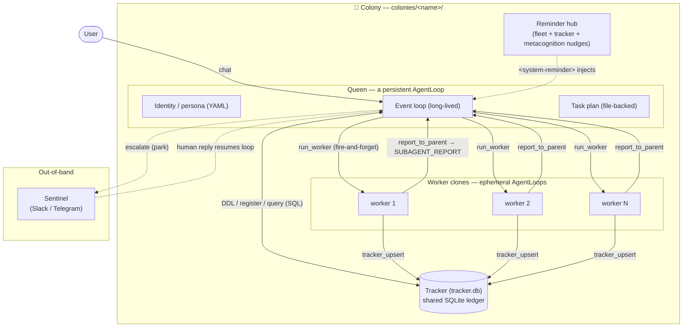
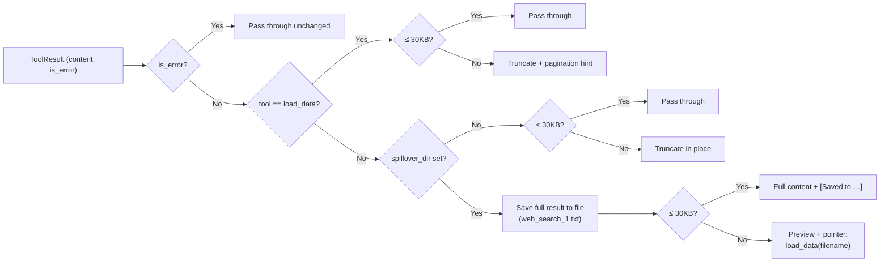

# Hive Architecture: Colonies of Agents

Hive's unit of work is not "an agent," and not "a graph of hand-wired agents." It is a **colony**: a group of specialized agents that operate together to run and scale one business process. A colony has a **Queen** — the persistent, client-facing lead — and however many **worker** agents the work needs. The Queen grows the colony on demand; you never wire it by hand.

The mechanism that makes a colony work is **one loop controlling many loops**. Hive has exactly one execution primitive, the `AgentLoop`. The Queen *is* an AgentLoop. Every worker is a **clone** of that same loop — same tools, same prompt, same model — with a tighter budget and one injected task. There are no graphs, no edges, no nodes, and no shared data buffer. The colony coordinates through four lightweight substrates instead: a fan-out tool, a shared SQLite **tracker**, a persistent **task plan**, and a **reminder hub**. From `core/framework/host/colony_runtime.py`:

> *"Each worker is an exact copy of the queen's AgentLoop — same tools, same prompt, same LLM… The ColonyRuntime replaces both AgentHost and ExecutionManager. There are no graphs, no edges, no nodes, no data buffers. Just: spawn N independent clones, let them run, collect results."*

---

## System overview


```mermaid
flowchart TB
    User([User])

    subgraph Colony["🐝 Colony — colonies/&lt;name&gt;/"]
        direction TB

        subgraph Queen["Queen — a persistent AgentLoop"]
            Q_ID["Identity / persona (YAML)"]
            Q_LOOP["Event loop (long-lived)"]
            Q_PLAN["Task plan (file-backed)"]
        end

        subgraph Workers["Worker clones — ephemeral AgentLoops"]
            W1["worker 1"]
            W2["worker 2"]
            W3["worker N"]
        end

        Tracker[("Tracker (tracker.db)<br/>shared SQLite ledger")]
        Reminders["Reminder hub<br/>(fleet + tracker + metacognition nudges)"]
    end

    subgraph Escalation["Out-of-band"]
        Sentinel["Sentinel<br/>(Slack / Telegram)"]
    end

    User -->|"chat"| Q_LOOP
    Q_LOOP -->|"run_worker (fire-and-forget)"| W1
    Q_LOOP -->|"run_worker"| W2
    Q_LOOP -->|"run_worker"| W3
    W1 -->|"report_to_parent → SUBAGENT_REPORT"| Q_LOOP
    W2 -->|"report_to_parent"| Q_LOOP
    W3 -->|"report_to_parent"| Q_LOOP

    Q_LOOP <-->|"DDL / register / query (SQL)"| Tracker
    W1 -->|"tracker_upsert"| Tracker
    W2 -->|"tracker_upsert"| Tracker
    W3 -->|"tracker_upsert"| Tracker

    Reminders -.->|"&lt;system-reminder&gt; injects"| Q_LOOP
    Q_LOOP -.->|"escalate (park)"| Sentinel
    Sentinel -.->|"human reply resumes loop"| Q_LOOP
```

The Queen fans out worker clones with a single tool call and stays unblocked. Workers do their piece, write rows to the shared tracker, and report back — each report arrives in the Queen's own loop as a `[WORKER_REPORT]` turn. Nothing is a compiled artifact; the topology is whatever the Queen calls into being at runtime.

---

## The colony

A **colony** is Hive's unit of deployment. On disk it is a single directory, `colonies/<name>/`, that holds everything the colony shares: its worker spec (`worker.json`), its tracker ledger (`data/tracker.db`), and its task plan. A colony is:

- **Portable** — export/import as a tarball (`POST /api/colonies/import`), so a working colony can be handed to another user or machine.
- **Schedulable** — cron triggers fire directly into the owning Queen's session, so a colony can wake itself on a clock.
- **Long-lived** — the Queen persists across sessions; workers come and go as the work demands.

Everything below is *how* a colony runs.

## One primitive: the `AgentLoop`

`AgentLoop` (`core/framework/agent_loop/agent_loop.py`) is a multi-turn streaming LLM loop and the only execution unit in Hive. Each turn: stream the model's response, execute any tool calls (in a parallel batch), feed the results back, and either terminate (judge-gated or on a clean text-only turn) or iterate again. That single class runs everything:

- **The Queen** is one `AgentLoop` configured for long-running conversational oversight — effectively unbounded iterations, a large context window, a generous tool budget.
- **Each worker** is a **clone** of that loop with a tighter `LoopConfig`. The worker profile (`agents/queen/worker_definition.py`) is the single source of truth: **3 work iterations + 1 grace iteration**, a per-turn tool-call budget, and a **lifetime** tool-call budget so a worker can never fan out unboundedly. The grace iteration is a guaranteed wrap-up turn restricted to `report_to_parent` / `task_update` / `tracker_upsert`, so a worker that exhausts its budget still reports instead of dying silently.

A worker is deliberately narrow: no persona, no memory of prior runs, no escalation channel, no ability to spawn or delegate. It reads its task, uses its tools, and calls `report_to_parent`. Fail-fast is the contract — if a worker is blocked, it persists partial state to the tracker and reports `failed`/`partial` rather than looping on workarounds.

## One loop controls many

In the **colony phase**, the Queen delegates with a single tool, `run_worker` (`tools/queen_lifecycle_tools.py`):

```
run_worker(tasks=[{"task": ..., "data": {...}}, ...], timeout=600)
```

- **Fire-and-forget.** `run_worker` returns immediately. Workers run in the background; the Queen stays unblocked and can keep talking to the user or dispatch more work.
- **Reports come home as turns.** When a worker finishes it emits a `SUBAGENT_REPORT` event, which the Queen sees as a `[WORKER_REPORT]` user turn in her own conversation — status, one-paragraph summary, optional structured payload. This is how "many loops" report to "one loop" without any shared call stack.
- **Concurrency is scheduled, not manual.** The colony admits all N tasks; up to `max_concurrent_workers` (default 4, `HIVE_MAX_CONCURRENT_WORKERS`) run at once and the rest queue, starting as peers terminate. The Queen sees the split (`running_now` / `queued` / `batch_remaining`).
- **Timeouts are soft then hard.** `timeout` (default 600s) is a soft deadline that injects a "report now" nudge into each still-running worker; a derived hard deadline force-stops stragglers. Force-stopped or timed-out workers can be resumed (`resume_worker_ids`, optional `guidance`) from their saved conversation.

Workers cannot see, message, or wait on each other. Coordination is entirely through the shared substrates below.

## Coordination substrates (what replaced edges and the data buffer)

### 1. The tracker — a shared SQLite blackboard

Every colony has exactly one `tracker.db`, identified by an immutable **`ColonyBinding {name, dir, tracker_db}`** (`host/colony_binding.py`). The binding is threaded to the Queen through her tool-execution context and to workers through their `input_data`, so both sides always resolve the *same* database. Tools that have no binding **refuse** the call — they never synthesize a path (this is what prevents split-brain "phantom colony" directories).

The tracker is the colony's structured shared state:

- The **Queen** sets up schema (`tracker_sql` for DDL) and declares which columns workers may write (`tracker_register_writable`).
- **Workers** record findings with `tracker_upsert` — one row per unit of work.
- The **Queen** validates progress with `tracker_query` (SELECT-only). "What's done / what's left" is always a fresh SQL query, never in-memory state that a crash could lose.

### 2. The task plan — the Queen's persistent spine

A file-backed task system (`core/framework/tasks/`) gives the Queen a durable, structured plan for every conversation (`task_create` / `task_update` / `task_list`). It is visible to the user, editable on the fly, and survives session reload — the plan outlives any single agent run. Colonies can ship a template task list the Queen adopts on entry, so recurring workflows always start from the same plan.

### 3. The event bus

`host/event_bus.py` is the colony's pub/sub backbone: `SUBAGENT_REPORT` carries worker results back to the Queen, and `CLIENT_*` events stream the live transcript to the UI.

### 4. The reminder hub — engineered attention

The single loop stays coherent because the framework continuously injects advisory `<system-reminder>` context at well-known points (`agent_loop/reminders.py`, `ReminderHub` / `ReminderSource` / `ReminderPoint`):

- **Lifecycle points** — `SESSION_START`, `POST_TOOL_USE`, `TOOL_BUDGET_CHECKPOINT`, `PRE_COMPACT`, `POST_COMPACT`, `STOP`.
- **Temporal points** — `IDLE_TICK` (a background ticker can nudge even while the loop is parked) and `STREAM_STALLED` (reactive, when the stream watchdog trips).

Sources keep the Queen fleet-aware and disciplined: `active_workers_reminder` (re-surfaces in-flight workers when the user re-engages, preventing duplicate dispatch), `tracker_snapshot_reminder` and `colony_worker_snapshot_reminder` (surface tracker tables and the live worker fleet at tool-budget checkpoints), `colony_parallel_nudge` (after a pilot, suggests factoring the protocol into a playbook), `idle_nudge`, and `tool_skill_reminders` (lists the available tool/skill surface by name and how to load full schemas on demand, instead of baking it all into a static prompt). This is engineered metacognition — the framework managing the model's attention across a long-running, high-fan-out session.

## The maturation arc: execute first, then systematize

A Queen doesn't design a colony up front. She grows into one across two phases (see `agents/queen/nodes/__init__.py`):

1. **Independent** — the Queen is a standalone conversational agent doing the work herself. She has `suggest_colony` to propose scaling up when a task turns out to be parallel, recurring, or long-running.
2. **Colony** — the Queen forks a headless worker spec to disk and enters fan-out mode. Forking is expensive (it ends the interactive chat and the colony runs unattended), so the commit point is an explicit user confirmation in the frontend popup rather than something the Queen decides alone.

The defining move is **execute-first-then-systematize**. The Queen does one unit of the work end-to-end herself — the **pilot** — and records the result in the tracker. Then she factors the proven protocol into a reusable **skill + playbook** and calls `run_playbook` — "the convergence spine" (`host/playbook/runner.py`): a deterministic runner that owns no durable state, treats the tracker as the source of truth, dispatches a worker clone per row (with retry/backoff, lanes, and a dead-letter path), and — because "what's left" is always a fresh tracker query — makes **re-running a playbook resume by construction**.

## Queens as identities

Queens are not interchangeable orchestrators; they are personas. Hive ships **13 YAML-backed Queens** (`agents/queen/queen_defaults/*.yaml` — sales, growth, legal, finance, talent, technology, operations, product strategy, brand & design, content, market research, outbound, lead-gen), each with traits, background, and behavior triggers injected into the system prompt. An LLM **CEO-style router** picks the best-matching Queen for each new request.

Each Queen carries **Queen Memory v2** (`agents/queen/queen_memory_v2.py`, `reflection_agent.py`, `recall_selector.py`): scoped markdown memory files under `~/.hive/memories/` (global, per-colony, per-queen), written through a cooldown-gated reflection agent and retrieved by a recall selector — not a vector store.

## Reliability is in the primitive

Because every actor is the same loop, the harness features live in one place and every agent inherits them:

- **Park / resume.** A loop persists a cursor to disk and parks when it needs something — `ASK_USER`, `CREDENTIAL_FORM`, `COLONY_SUGGESTION`, `AWAITING_QUEEN`, `USER_STOPPED`, `COLD_INTERRUPTED` (mid-turn when the runtime died), `LLM_ERROR`, `DOOM_LOOP`. Disk is the source of truth, so a crash or restart resumes exactly where it left off (`internals/cursor_persistence.py`).
- **Context management.** Structure-preserving compaction plus the tool-result **pointer/spillover pattern** (below) keep long sessions inside the context budget without losing information.
- **Stall & doom-loop detection.** A TTFT/inter-event stream watchdog plus n-gram similarity checks catch stuck turns and repeated tool calls.
- **Judge-gated termination.** A turn only "accepts" when the judge pipeline (below) is satisfied.
- **Human-in-the-loop is out-of-band.** Escalation isn't a node in a graph — the Queen `escalate`s to a human through **Sentinel** (`internals/sentinel_tool.py`, `core/framework/sentinel/`), an account-bound Slack/Telegram channel. The loop parks; a human reply is injected and the loop resumes.

---

## Tool result truncation and the pointer pattern

Agents routinely produce or consume tool results that exceed the context budget (web searches, scraped pages, large API responses). Hive uses a **pointer pattern**: large results are persisted to disk and replaced in the conversation with a compact file reference the agent dereferences on demand via `load_data()`.


```mermaid
flowchart LR
    ToolResult["ToolResult (content, is_error)"]
    IsError{is_error?}
    ToolResult --> IsError
    IsError -->|"Yes"| PassThrough["Pass through unchanged"]
    IsLoadData{tool == load_data?}
    IsError -->|"No"| IsLoadData
    IsLoadData -->|"Yes"| LDSize{"≤ 30KB?"}
    LDSize -->|"Yes"| LDPass["Pass through"]
    LDSize -->|"No"| LDTrunc["Truncate + pagination hint"]
    IsLoadData -->|"No"| HasSpillDir{"spillover_dir set?"}
    HasSpillDir -->|"No"| InlineTrunc{"≤ 30KB?"}
    InlineTrunc -->|"Yes"| InlinePass["Pass through"]
    InlineTrunc -->|"No"| InlineCut["Truncate in place"]
    HasSpillDir -->|"Yes"| SaveFile["Save full result to file<br/>(web_search_1.txt)"]
    SaveFile --> SpillSize{"≤ 30KB?"}
    SpillSize -->|"Yes"| SmallRef["Full content + [Saved to …]"]
    SpillSize -->|"No"| LargeRef["Preview + pointer:<br/>load_data(filename)"]
```

**How it works:**

1. **Every tool result is saved to a file** (when a spillover dir is configured), with short monotonic names (`web_search_1.txt`) to minimize token cost. JSON is pretty-printed so `load_data`'s line-based pagination works. The counter restores from existing files on resume.
2. **The conversation gets a pointer, not the payload.** Results ≤ 30KB pass through with a `[Saved to '…']` annotation (so the agent can act on them in the same turn); larger results are replaced by a preview plus a `load_data(...)` pointer. The 30KB threshold is deliberately generous to avoid extra round-trips.
3. **`load_data(filename, offset, limit)`** retrieves full results on demand and is never itself re-spilled (no circular references); an over-large `load_data` result is truncated with a pagination hint.
4. **Pointers survive compaction.** Structure-preserving compaction keeps tool-call messages (already tiny pointers) and spills freeform prose to numbered `conversation_N.md` files, replacing it with a reference. The agent retains exact knowledge of every tool it called and where each result lives.
5. **The system prompt lists all spillover files** each turn, so the agent always knows what it can re-read.

---

## The judge pipeline

Termination is decided by a three-level judge (`agent_loop/internals/judge_pipeline.py`), evaluated in order:

| Level | Trigger | Mechanism | Verdict |
| ----- | ------- | --------- | ------- |
| **Level 0** (short-circuits) | Always | Are required output keys set? Are tool calls still pending? | `RETRY` if keys missing; continue if tools running |
| **Level 1** (custom judge) | A `JudgeProtocol` is set | User-provided judge inspects assistant text, tool calls, accumulator state, iteration count — full authority | `ACCEPT` / `RETRY` / `ESCALATE` with feedback |
| **Level 2** (implicit) | No custom judge; keys present | Output-key check, then an optional conversation-aware quality gate against `success_criteria` | `ACCEPT` or `RETRY` with feedback |

A `RETRY` verdict's feedback is injected as a `[Judge feedback]` user message, so on the next turn the agent sees its prior attempt and the critique and adjusts. This in-context reflexion — feedback → reflection → correction — is how agents self-correct **within a session**, without any model retraining. (Where the older docs described "Triangulated Verification," it survives here as the layering of deterministic checks, semantic evaluation, and human escalation across these levels plus Sentinel.)

---

## How a colony improves over time

Hive does **not** regenerate a graph across "generations." Colonies get better through four in-band mechanisms:

- **Reflexion within a session** — judge feedback injected as conversation memory (above).
- **Queen Memory v2** — cooldown-gated reflections written to scoped markdown memory and recalled on later sessions.
- **Learned, tool-gated skills** — protocols a Queen proves out become skills that activate when their required tools are present and join her baseline.
- **Systematization** — the incubating → pilot → **playbook** arc turns a one-off success into a deterministic, resumable process that converges the rest of the batch across worker clones.

---

## Summary

1. **The colony is the unit.** A Queen plus as many worker clones as the work needs, sharing one on-disk workspace, one tracker, and one plan.
2. **One loop, many loops.** A single `AgentLoop` primitive is both the Queen and every worker; orchestration is a runtime `run_worker` fan-out, not a compiled graph.
3. **Coordination without a graph.** A shared SQLite tracker, a persistent task plan, an event bus, and a reminder hub replace edges and data buffers.
4. **Execute first, then systematize.** Independent → incubating → colony; pilot the work, then factor it into a skill + playbook and converge with `run_playbook`.
5. **Reliability in the primitive.** Park/resume from disk, compaction + pointer pattern, stall/doom-loop detection, judge-gated termination, and out-of-band Sentinel escalation — inherited by every agent because there is only one kind of agent.
