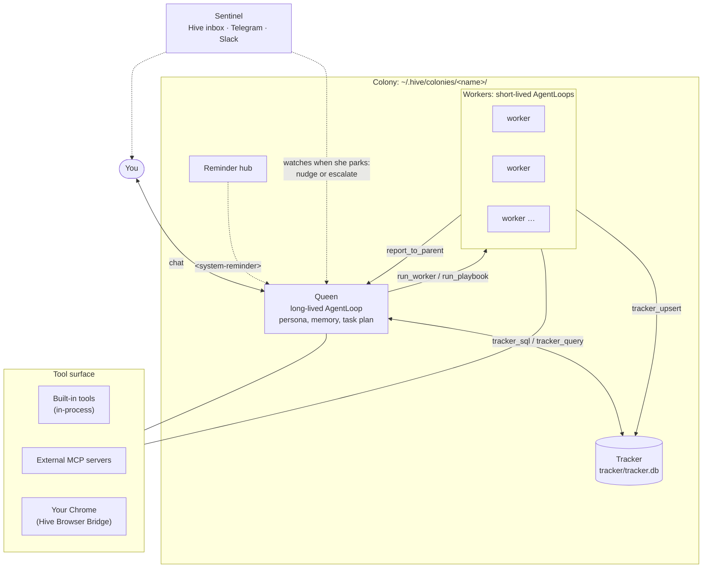

# Hive architecture

Hive's unit of work is not an agent and not a graph of hand-wired agents. It is a **colony**: a group of agents that together run and scale one business process. A colony has a **queen**, the persistent agent you talk to, and as many **worker** agents as the work needs. The queen grows the colony at runtime; nobody wires it by hand.

What makes that work is **one loop controlling many loops**. Hive has exactly one execution primitive, the `AgentLoop`. The queen is one. Every worker is another instance of the same class, given one task, a narrower set of tools and a strict budget. There are no graphs, edges or shared data buffers. Agents coordinate through a fan-out tool, a shared SQLite **tracker**, a persistent **task plan**, an **event bus** and a **reminder hub**. In the words of `core/framework/host/colony_runtime.py`:

> *"There are no graphs, no edges, no nodes, no data buffers. Just: spawn N independent clones, let them run, collect results."*

This document explains how those pieces fit. Paths are relative to `core/framework/` unless they start with `tools/` or `frontend/`.

---

## System overview


```mermaid
flowchart TB
    User([You])

    subgraph Colony["Colony: ~/.hive/colonies/&lt;name&gt;/"]
        direction TB
        Queen["Queen<br/>long-lived AgentLoop<br/>persona, memory, task plan"]
        subgraph Workers["Workers: short-lived AgentLoops"]
            W1["worker"]
            W2["worker"]
            W3["worker …"]
        end
        Tracker[("Tracker<br/>tracker/tracker.db")]
        Hub["Reminder hub"]
    end

    subgraph Tools["Tool surface"]
        Harness["Built-in tools<br/>(in-process)"]
        MCP["External MCP servers"]
        Browser["Your Chrome<br/>(Hive Browser Bridge)"]
    end

    Sentinel["Sentinel<br/>Hive inbox · Telegram · Slack"]

    User <-->|"chat"| Queen
    Queen -->|"run_worker / run_playbook"| Workers
    Workers -->|"report_to_parent"| Queen
    Queen <-->|"tracker_sql / tracker_query"| Tracker
    Workers -->|"tracker_upsert"| Tracker
    Hub -.->|"&lt;system-reminder&gt;"| Queen
    Queen --- Tools
    Workers --- Tools
    Sentinel -.->|"watches when she parks:<br/>nudge or escalate"| Queen
    Sentinel -.-> User
```

The queen fans workers out with one tool call and stays responsive. Workers do their piece, write rows to the tracker and report back; each report arrives in the queen's own conversation as a new turn. Nothing is compiled ahead of time: the topology is whatever the queen creates at runtime.

---

## The colony

A colony is a directory under `~/.hive/colonies/<name>/` (or under `HIVE_HOME`) that holds everything its agents share (`config.py`, `colony_dir`):

| Path | What it holds |
| --- | --- |
| `worker.json` | The worker spec the colony's workers are cloned from |
| `tracker/tracker.db` | The tracker: the colony's shared SQLite ledger |
| `colony.db` | Bookkeeping, such as the playbook run log |
| `skills/` | Skills the queen wrote for this colony |
| `playbooks/` | Saved playbook scripts (`<name>.play.py`) |
| `triggers.json` | Scheduled and webhook triggers |
| `queens/<queen>/sessions/<id>/` | The queen's sessions in this colony: conversation, events, task plan |
| `workers/<id>/` | Each worker's run state |

Colonies can be **scheduled**: `set_trigger` adds a cron, interval or webhook trigger that wakes the colony queen with a task (`host/triggers.py`). Timers fire while the colony is loaded; ticks missed while it wasn't are reported when it loads. A colony can be **imported** from a tarball (`POST /api/colonies/import`).

## One primitive: the `AgentLoop`

`AgentLoop` (`agent_loop/agent_loop.py`) is a multi-turn streaming LLM loop and Hive's only execution unit. Each turn it streams the model's reply, executes the tool calls (tools marked concurrency-safe run in parallel, up to ten at a time; the rest run in order), feeds the results back and decides whether to continue.

- **The queen** is configured for long-running conversation: effectively unlimited turns, a large context window, a 30-call-per-turn tool budget (50 once she runs a colony). Her turn ends when she replies without calling a tool; the loop then **parks** until you answer.
- **A worker** gets a worker system prompt with no persona (`agents/queen/worker_definition.py`), a subset of the queen's tools without the queen-only ones, and optionally a different model (`worker_llm` in configuration). Its budget is fixed: **3 working turns plus 1 grace turn**, 30 tool calls per turn (hard stop at 90) and 200 over its lifetime, which the colony can adapt. The grace turn may only call `report_to_parent`, `tracker_upsert` and `task_update`, so a worker that runs out of budget still reports instead of vanishing.

A worker is deliberately narrow. It has no memory of earlier runs, can't spawn other workers and can't talk to the user. It reads its task, does the work and calls `report_to_parent` with `success`, `partial` or `failed`. If it's blocked, it saves what it has to the tracker and reports, rather than looping on workarounds.

Agents that declare success criteria are checked by a judge before a turn is accepted (`agent_loop/internals/judge_pipeline.py`); a `RETRY` verdict comes back as a `[Judge feedback]` message the agent sees on its next turn. The queen skips the judge (you are her judge); workers end when they report.

## One loop controls many

In a colony the queen delegates with one tool, `run_worker` (`tools/queen_lifecycle_tools.py`):

```
run_worker(tasks=[{"task": "...", "data": {...}}, ...], timeout=600)
```

- **It returns immediately.** Workers run in the background while the queen keeps talking to you or dispatches more work.
- **Reports come home as turns.** A finished worker emits a `SUBAGENT_REPORT` event, which the queen receives as a `[WORKER_REPORT]` message: status, a short summary and an optional structured payload.
- **Concurrency is scheduled.** All tasks are admitted; up to four run at once (`HIVE_MAX_CONCURRENT_WORKERS`) and the rest queue. The queen sees how many are running, queued and left.
- **Timeouts are soft, then hard.** At `timeout` each running worker is told to report now; at the hard deadline (four times the soft one, at least ten minutes more, at most an hour) stragglers are stopped. Stopped workers can be resumed from their saved conversation with `resume_worker_ids` and optional guidance.

Workers can't see or message each other. Everything they share goes through the substrates below.

## Coordination: what replaces edges and data buffers

### The tracker

Every colony has one `tracker.db`, identified by an immutable `ColonyBinding {name, dir, tracker_db}` (`host/colony_binding.py`). The binding reaches the queen through her tool context and the workers through their task input, so both always open the same database; a tracker tool without a binding refuses the call rather than guessing a path.

- The **queen** creates tables with `tracker_sql` and declares which columns workers may write with `tracker_register_writable`.
- **Workers** record results with `tracker_upsert`, one row per unit of work.
- The **queen** checks progress with `tracker_query` (read-only SQL). "What's done and what's left" is always a fresh query, never state a crash could lose.

### The task plan

Each session has a file-backed plan (`tasks/`, stored as the session's `tasks.json`) that the queen maintains with `task_create`, `task_update`, `task_list` and `task_get`. You see it as the **Action Plan**, it survives reloads, and it outlives any single worker run.

### The event bus

`host/event_bus.py` carries worker reports back to the queen (`SUBAGENT_REPORT`) and streams the live transcript to the UI (`CLIENT_*` events over server-sent events).

### The reminder hub

The loop stays coherent over long, high-fan-out sessions because the framework injects short `<system-reminder>` context at fixed points (`agent_loop/reminders.py`): session start, each user message, after tool use, tool-budget checkpoints, before and after compaction, idle ticks while parked, and stalled streams. Sources include the current task plan, in-flight workers (so she doesn't dispatch the same work twice), tracker snapshots, the colony's worker fleet, a nudge to turn a proven pilot into a playbook, relevant past conversations, the tools she can load on demand and the skills available to her.

## From chat to colony: execute first, then systematize

A queen doesn't design a colony up front. She has two phases (`QUEEN_PHASES` in `tools/queen_lifecycle_tools.py`):

1. **Independent.** She is a standalone agent doing the work herself. When a task turns out to be parallel, recurring or long-running, she calls `suggest_colony`.
2. **Colony.** You confirm in the Create Colony dialog, and the chat becomes the colony queen's session. A short chat is carried over verbatim; a long one is summarized first. She continues there with the colony tools: `run_worker`, the tracker, `write_skill`, `run_playbook` and triggers.

The defining move is **execute first, then systematize**. The queen does one unit of the work end to end herself, the **pilot**, and records it in the tracker. Then she writes the proven protocol down as a **skill** and runs a **playbook** (`tools/playbook_tools.py`, `host/playbook/runner.py`): a script that dispatches workers over the tracker's rows. It retries with backoff, supports rate-limited lanes and a circuit breaker, and lists rows that keep failing in a dead letter. It owns no durable state, because the tracker is the source of truth, so **re-running a playbook resumes it**. Playbooks run up to 8 workers at once by default (32 at most) and work best when each worker takes a chunk of rows.

## Queens

Queens are personas, not interchangeable orchestrators. Thirteen ship with Hive as YAML profiles (`agents/queen/queen_defaults/*.yaml`): Growth, RevOps, Content, Lead Generation, Outbound, Brand & Design, Technology, Operations, Product Strategy, Market Research, Finance, Legal and Talent. Each brings traits, background and behavior triggers to her system prompt, plus a default set of tool categories for her role. Six are active out of the box; the rest are hired from the Org Chart, and you can create your own.

You choose which queen takes a request. (An LLM classifier still exists server-side as a fallback for sessions created without a queen.)

## The tool surface

Agents only ever see ordinary function calls, but those come from three places.

**Built-in tools run in-process.** `tools/harness_tools.py` registers Hive's own tools inside the host, grouped as `terminal-tools` (shell, background jobs, ripgrep and glob search), `files-tools`, `chart-tools` (ECharts and Mermaid), `memory-tools` (conversation search) and `hive_tools` (attachments, PDFs, web scraping, CSV, image generation and a few more). They start with no subprocesses.

**External MCP servers** are registered with `hive mcp add` or `hive mcp install` and stored in `~/.hive/mcp_registry/installed.json` (`loader/mcp_registry.py`). Their tools join the same allowlists as the built-ins. The full `aden_tools` integration catalog in `tools/` runs this way; see [docs/tools.md](../tools.md).

**Gating.** What an agent can call is decided by tool **categories** (`agents/queen/queen_tools_defaults.py`), each queen's role defaults and per-queen and per-colony allowlists you edit in the Skills Library's MCP Tools tab. A small always-on set is loaded up front; everything else appears in a manifest the agent loads on demand with `search_tools`, which keeps prompts short.

**The browser** is your own Chrome. The Hive Browser Bridge extension (`tools/browser-extension/`) connects to a long-lived bridge process (`tools/src/gcu/bridge_host.py`), and agents drive it through the `hive-browser` CLI from the terminal. The in-process `browser_setup` tool makes the browser discoverable and gateable. Each worker gets its own tab group in the same Chrome profile, so your logins carry over.

**Images.** Models that support vision see screenshots and attachments directly; on APIs that can't carry images inside a tool result, they're moved into the next user message. Text-only models get a caption from a configured vision model instead (`llm/capabilities.py`, `agent_loop/internals/vision_fallback.py`).

## Memory

A queen remembers in three ways, all of them plain files:

- **Reflection.** Every few turns a reflection step writes durable notes as markdown under `~/.hive/memories/`, scoped globally or to the queen (`agents/queen/queen_memory_v2.py`, `reflection_agent.py`). Before each turn a selector picks the notes relevant to your message and injects them as a reminder (`recall_selector.py`).
- **Past conversations.** Relevant excerpts of earlier sessions are found by keyword search over the queen's history, or the colony's, and injected automatically (`tools/src/memory_tools/recall.py`). The queen can also search that history herself with `search_messages`.
- **Timeline** (opt-in, the `memory_timeline` flag). Events, facts and plans you mention are extracted once per session with their dates resolved, so she can answer *when* and *how often* questions with `search_timeline` (`agents/queen/timeline.py`).

## Skills

A skill is a `SKILL.md` package in the open [Agent Skills](https://agentskills.io) format (`skills/`). Hive ships default and preset skills; queens and colonies have their own skill directories; and a colony queen turns a proven protocol into a colony skill with `write_skill`, which her workers then load from the catalog. Foundation skills for the browser, terminal and charts are activated automatically when an agent has those tools.

## Human in the loop

- **Questions.** Any time she needs a decision, the queen asks with `ask_user`; her loop parks until you answer.
- **Commit points.** Turning a chat into a colony always needs your confirmation.
- **Sentinel**, opt-in per colony (`sentinel/`), keeps a colony moving while you're away. When the queen parks, a classifier decides whether to nudge her on, mark the work done or escalate to you through the Hive inbox, Telegram or Slack; your reply resumes her.
- **Workers escalate to the queen**, never to you directly, through the `escalate` tool.

## Reliability is in the primitive

Because every agent is the same loop, these live in one place and every agent has them:

- **Park and resume.** A loop saves its position to disk whenever it waits: on a question, a credential form, a colony suggestion, a stop, an error or a crash mid-turn. Disk is the source of truth, so a restart resumes exactly where it stopped (`agent_loop/internals/cursor_persistence.py`).
- **Large tool results go to files.** Any result over 30,000 characters (configurable) is saved as `<tool>_<n>.txt`; the conversation keeps a preview, the file's path and a hint to search it with the terminal tools (`agent_loop/internals/tool_result_handler.py`).
- **Compaction.** As a session nears its context budget, older tool results are cleared to point at their saved files, then the oldest turns are summarized by the model, while the most recent turns stay intact (`agent_loop/internals/compaction.py`).
- **Stall and loop detection.** A stream watchdog catches turns that stop producing output; similarity checks and tool-call fingerprints catch an agent repeating itself (`agent_loop/internals/stall_detector.py`).
- **Budgets.** Per-turn and lifetime tool-call budgets, worker turn limits and concurrency caps bound what any agent can do.

## The server and the UI

`hive serve` (and `hive open`, which also opens a browser) runs an aiohttp server on `127.0.0.1:8787` (`server/app.py`). `POST /api/sessions` opens a queen chat or a colony, or forks a chat into a new colony; messages go to `POST /api/sessions/<id>/chat`; and events stream back over server-sent events. The React frontend (`frontend/`) is served from the same port: the home screen and hive map, queen chats, colony pages (Data, Plan, Automations and Workers), the Org Chart, and the prompt, skill, memory and credentials libraries.

## Code map

| Concern | Where |
| --- | --- |
| The loop | `agent_loop/agent_loop.py`, `agent_loop/internals/` |
| Reminders | `agent_loop/reminders.py` and the `*_reminder.py` sources |
| Colonies and workers | `host/colony_runtime.py`, `host/worker.py`, `agents/queen/worker_definition.py` |
| Queen tools (`run_worker`, `suggest_colony`, triggers) | `tools/queen_lifecycle_tools.py` |
| Tracker | `host/colony_binding.py`, `tools/tracker_tools.py` |
| Playbooks | `tools/playbook_tools.py`, `host/playbook/runner.py` |
| Queens and memory | `agents/queen/` |
| Built-in tools | `tools/harness_tools.py`, `tools/src/` (repo root) |
| MCP servers and tool registry | `loader/mcp_registry.py`, `loader/tool_registry.py` |
| Skills | `skills/` |
| Sentinel | `sentinel/` |
| HTTP server | `server/` |
| UI | `core/frontend/src/` |

## Summary

1. **The colony is the unit.** A queen plus as many workers as the work needs, sharing one directory, one tracker and one plan.
2. **One loop, many loops.** One `AgentLoop` class is the queen and every worker; orchestration is a runtime fan-out, not a compiled graph.
3. **Coordination without a graph.** A shared SQLite tracker, a task plan, an event bus and a reminder hub replace edges and data buffers.
4. **Execute first, then systematize.** The queen pilots one unit, writes the protocol down as a skill and converges the rest with a resumable playbook.
5. **Reliability in the primitive.** Park and resume from disk, file-backed tool results, compaction, stall detection and hard budgets, which every agent has because there is only one kind of agent.
