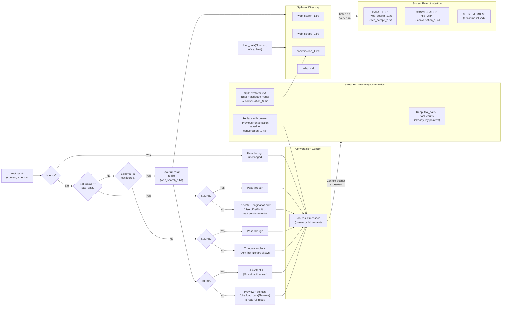
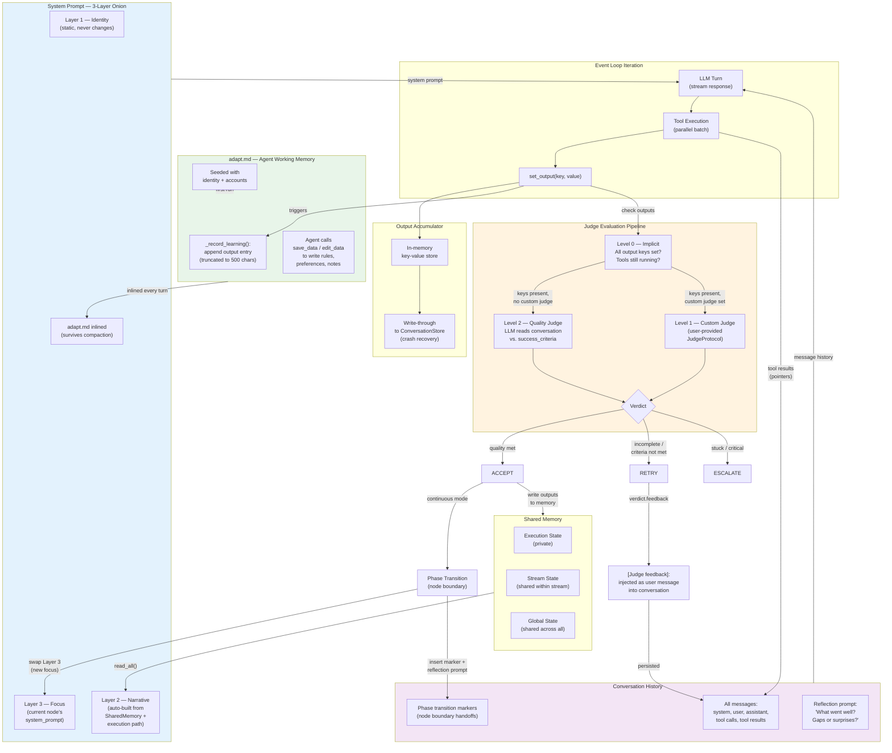

# Hive Agent Framework: Triangulated Verification for Reliable Goal-Driven Agents

## System Architecture Overview

The Hive framework is organized around five core subsystems that collaborate to execute goal-driven agents reliably. The following diagram shows how these subsystems connect:

```mermaid
flowchart TB
    %% Main Entity
    User([User])

    %% =========================================
    %% EXTERNAL EVENT SOURCES
    %% =========================================
    subgraph ExtEventSource [External Event Source]
        E_Sch["Schedulers"]
        E_WH["Webhook"]
        E_SSE["SSE"]
    end

    %% =========================================
    %% SYSTEM NODES
    %% =========================================
    subgraph WorkerBees [Worker Bees]
        WB_C["Conversation"]
        WB_SP["System prompt"]

        subgraph Graph [Graph]
            direction TB
            N1["Node"] --> N2["Node"] --> N3["Node"]
            N1 -.-> AN["Active Node"]
            N2 -.-> AN
            N3 -.-> AN

            %% Nested Event Loop Node
            subgraph EventLoopNode [Event Loop Node]
                ELN_L["listener"]
                ELN_SP["System Prompt<br/>(Task)"]
                ELN_EL["Event loop"]
                ELN_C["Conversation"]
            end
        end
    end

    subgraph JudgeNode [Judge — Isolated Graph]
        J_C["Criteria"]
        J_P["Principles"]
        J_EL["Event loop"] <--> J_S["Timer<br/>(2-min tick)"]
        J_T["get_worker_health_summary<br/>emit_escalation_ticket"]
        J_CV["Continuous Conversation<br/>(judge memory)"]
    end

    subgraph QueenBee [Queen Bee]
        QB_SP["System prompt"]
        QB_EL["Event loop"]
        QB_C["Conversation"]
    end

    subgraph Infra [Infra]
        TR["Tool Registry"]
        WTM["Write through Conversation Memory<br/>(Logs/RAM/Harddrive)"]
        SM["Shared Memory<br/>(State/Harddrive)"]
        EB["Event Bus<br/>(RAM)"]
        CS["Credential Store<br/>(Harddrive/Cloud)"]

        subgraph SubAgentFramework [Sub-Agent Framework]
            SA_DT["delegate_to_sub_agent<br/>(synthetic tool)"]

            subgraph SubAgentExec [Sub-Agent Execution]
                SA_EL["Event Loop<br/>(independent)"]
                SA_C["Conversation<br/>(fresh per task)"]
                SA_SJ["SubagentJudge<br/>(auto-accept on<br/>output keys filled)"]
            end

            SA_RP["report_to_parent<br/>(one-way channel)"]
            SA_ESC["Escalation Receiver<br/>(wait_for_response)"]
        end
    end

    subgraph PC [PC]
        B["Browser"]
        CB["Codebase<br/>v 0.0.x ... v n.n.n"]
    end

    %% =========================================
    %% CONNECTIONS & DATA FLOW
    %% =========================================

    %% External Event Routing
    E_Sch --> ELN_L
    E_WH --> ELN_L
    E_SSE --> ELN_L
    ELN_L -->|"triggers"| ELN_EL

    %% User Interactions
    User -->|"Talk"| WB_C
    User -->|"Talk"| QB_C
    User -->|"Read/Write Access"| CS

    %% Inter-System Logic
    ELN_C <-->|"Mirror"| WB_C
    WB_C -->|"Focus"| AN

    %% Judge Alignments (design-time only)
    J_C <-.->|"aligns<br/>(design-time)"| WB_SP
    J_P <-.->|"aligns<br/>(design-time)"| QB_SP

    %% Judge runtime: reads worker logs, publishes escalations via Event Bus
    %% NO direct Judge→Queen connection at runtime — fully decoupled via Event Bus
    J_T -->|"Reads logs"| WTM
    J_EL -->|"EscalationTicket"| EB

    %% Pub/Sub Logic
    AN -->|"publish"| EB
    EB -->|"subscribe<br/>(node events +<br/>escalation tickets)"| QB_C

    %% Sub-Agent Delegation
    ELN_EL -->|"delegate_to_sub_agent"| SA_DT
    SA_DT -->|"Spawn (parallel)"| SA_EL
    SM -->|"Read-only snapshot"| SubAgentExec
    SA_SJ -->|"ACCEPT/RETRY"| SA_EL
    SA_EL -->|"Result (JSON)"| ELN_EL
    SA_RP -->|"Progress reports"| EB
    SA_RP -->|"mark_complete"| SA_SJ
    SA_ESC -->|"wait_for_response"| User
    User -->|"Respond"| SA_ESC
    SA_ESC -->|"User reply"| SA_EL

    %% Infra and Process Spawning
    SubAgentExec -->|"Starts"| B
    B -->|"Report"| ELN_EL
    TR -->|"Assigned"| EventLoopNode
    TR -->|"Filtered tools"| SubAgentExec
    CB -->|"Modify Worker Bee"| WorkerBees

    %% =========================================
    %% SHARED MEMORY & LOGS ACCESS
    %% =========================================

    %% Worker Bees Access
    Graph <-->|"Read/Write"| WTM
    Graph <-->|"Read/Write"| SM

    %% Queen Bee Access
    QB_C <-->|"Read/Write"| WTM
    QB_EL <-->|"Read/Write"| SM

    %% Credentials Access
    CS -->|"Read Access"| QB_C
```



### Key Subsystems

| Subsystem               | Role        | Description                                                                                                                                                                                                                                                  |
| ----------------------- | ----------- | ------------------------------------------------------------------------------------------------------------------------------------------------------------------------------------------------------------------------------------------------------------ |
| **Event Loop Node**     | Entry point | Listens for external events (schedulers, webhooks, SSE), triggers the event loop, and delegates to sub-agents. Its conversation mirrors the Worker Bees conversation for context continuity.                                                                 |
| **Worker Bees**         | Execution   | A graph of nodes that execute the actual work. Each node in the graph can become the Active Node. Workers maintain their own conversation and system prompt, and read/write to shared memory.                                                                |
| **Judge**               | Evaluation  | Runs as an **isolated graph** alongside the worker on a 2-minute timer. Reads worker session logs via `get_worker_health_summary`, accumulates observations in a continuous conversation (its own memory), and emits structured `EscalationTicket` events to the Event Bus when it detects degradation. **Disengaged from the Queen at runtime** — the Queen receives escalation tickets only through Event Bus subscriptions, not via a direct connection. Criteria and principles align with Worker/Queen system prompts at design-time. |
| **Queen Bee**           | Oversight   | The orchestration layer. Subscribes to Active Node events via the Event Bus, receives escalation reports from the Judge, and has read/write access to shared memory and credentials. Users can talk directly to the Queen Bee.                               |
| **Sub-Agent Framework** | Delegation  | Enables parent nodes to delegate tasks to specialized sub-agents via `delegate_to_sub_agent`. Sub-agents run as independent EventLoopNodes with read-only memory snapshots, their own conversation, and a `SubagentJudge`. They report progress via `report_to_parent` and can escalate to users via `wait_for_response`. Multiple delegations execute in parallel. Nested delegation is prevented. |
| **Infra**               | Services    | Shared infrastructure: Tool Registry (assigned to Event Loop Nodes and Sub-Agents), Write-through Conversation Memory (logs across RAM and disk), Shared Memory (state on disk), Event Bus (pub/sub in RAM), and Credential Store (encrypted on disk or cloud). |

### Data Flow Patterns

- **External triggers**: Schedulers, Webhooks, and SSE events flow into the Event Loop Node's listener, which triggers the event loop to delegate to sub-agents or start browser-based tasks.
- **User interaction**: Users talk directly to Worker Bees (for task execution) or the Queen Bee (for oversight). Users also have read/write access to the Credential Store.
- **Judge monitoring (runtime-decoupled)**: The Judge runs as an isolated graph on a 2-minute timer. It reads worker session logs via tools, tracks trends in its continuous conversation, and publishes `EscalationTicket` events to the Event Bus when it detects degradation patterns (doom loops, stalls, excessive retries). The Queen receives these tickets as an Event Bus subscriber — there is no direct Judge→Queen connection at runtime.
- **Sub-agent delegation**: A parent Event Loop Node invokes `delegate_to_sub_agent` to spawn specialized sub-agents. Each sub-agent receives a read-only memory snapshot, a fresh conversation, and filtered tools from the Tool Registry. A `SubagentJudge` auto-accepts when all output keys are filled. Sub-agents report progress via `report_to_parent` (fire-and-forget) and can escalate to the user via `wait_for_response` through an `_EscalationReceiver`. Multiple delegations run in parallel; nested delegation is blocked to prevent recursion.
- **Pub/Sub**: The Active Node publishes events to the Event Bus. The Queen Bee subscribes for real-time visibility. Sub-agent progress reports are also published to the Event Bus.
- **Adaptiveness**: The Codebase modifies Worker Bees, enabling the framework to evolve agent graphs across versions.

---

## Tool Result Truncation & Pointer Pattern

Agents frequently produce or consume tool results that exceed the conversation context budget (web search results, scraped pages, large API responses). The framework solves this with a **pointer pattern**: large results are persisted to disk and replaced in the conversation with a compact file reference that the agent can dereference on demand via `load_data()`. This pattern extends into conversation compaction, where freeform text is spilled to files while structural tool-call messages are preserved in-place.



### How It Works

**1. Every tool result is saved to a file** (when `spillover_dir` is configured). Filenames are monotonic and short to minimize token cost: `{tool_name}_{counter}.txt` (e.g. `web_search_1.txt`, `web_scrape_2.txt`). JSON content is pretty-printed so `load_data`'s line-based pagination works correctly. The counter is restored from existing files on resume.

**2. The conversation receives a pointer, not the full content.** Two cases:

| Result size | Conversation content |
| ----------- | -------------------- |
| **≤ 30KB** | Full content + `[Saved to 'web_search_1.txt']` annotation |
| **> 30KB** | Preview (first ~30KB) + `[Result from web_search: 85,000 chars — too large for context, saved to 'web_search_1.txt'. Use load_data(filename='web_search_1.txt') to read the full result.]` |

**3. The agent retrieves full results on demand** via `load_data(filename, offset, limit)`. `load_data` results are never re-spilled (preventing circular references) — if a `load_data` result is itself too large, it's truncated with a pagination hint: `"Use offset/limit parameters to read smaller chunks."`.

**4. File pointers survive compaction.** When the conversation exceeds the context budget, structure-preserving compaction (`compact_preserving_structure`) keeps tool-call messages (which are already tiny pointers) and spills freeform text (user/assistant prose) to numbered `conversation_N.md` files. A reference message replaces the removed text: `"[Previous conversation saved to 'conversation_1.md'. Use load_data('conversation_1.md') to review if needed.]"`. This means the agent retains exact knowledge of every tool it called and where each result is stored.

**5. The system prompt lists all files** in the spillover directory on every turn. Data files (spilled tool results) and conversation history files are listed separately. `adapt.md` (agent memory / learned preferences) is inlined directly into the system prompt rather than listed — it survives even emergency compaction.

### Why This Pattern

- **Context budget**: A single `web_search` or `web_scrape` can return 100KB+. Without truncation, 2-3 tool calls would exhaust the context window.
- **Fewer iterations via larger nominal limit**: The 30KB threshold is deliberately generous — most tool results fit entirely in the conversation with just a `[Saved to '...']` annotation appended. This means the agent can read and act on results in the same turn they arrive, without a follow-up `load_data` call. Only truly large results (scraped full pages, bulk API responses) trigger the preview + pointer path. A tighter limit would force more round-trips: the agent calls a tool, gets a truncated preview, calls `load_data` to read the rest, processes it, and only then acts — each round-trip is a full LLM turn with latency and token cost. The larger limit front-loads information into the conversation so the agent makes progress faster.
- **No information loss**: Unlike naive truncation, the full result is always on disk and retrievable. The agent decides what to re-read.
- **Compaction-safe**: File references are compact tokens that survive all compaction tiers. The agent can always reconstruct its full state from pointers.
- **Resume-safe**: The spill counter restores from existing files on session resume, preventing filename collisions.

---

## Memory Reflection Logic

Agents in Hive maintain memory through four interconnected mechanisms: a durable working memory file (`adapt.md`), the conversation history itself, a structured output accumulator, and a three-layer prompt composition system. Together they form a reflection loop where outputs, judge feedback, and execution state are continuously folded back into the agent's context.



### How It Works

**1. Outputs trigger dual persistence.** When the LLM calls `set_output(key, value)`, two things happen simultaneously: the `OutputAccumulator` stores the value in memory and writes through to the `ConversationStore` cursor (for crash recovery), and `_record_learning()` appends a truncated entry (≤500 chars) to `adapt.md` under an `## Outputs` section. Duplicate keys are updated in-place, not appended.

**2. adapt.md is the agent's durable working memory.** It is seeded on first run with identity and account info. The agent can also write to it directly via `save_data("adapt.md", ...)` or `edit_data("adapt.md", ...)` — storing user rules, behavioral constraints, preferences, and working notes. Unlike conversation history, `adapt.md` is inlined directly into the system prompt every turn, so it survives all compaction tiers including emergency compaction. It is the last thing standing when context is tight.

**3. Judge feedback becomes conversation memory.** When the judge issues a RETRY verdict with feedback, that feedback is injected as a `[Judge feedback]: ...` user message into the conversation. On the next LLM turn, the agent sees its prior attempt, the judge's critique, and can adjust. This is the core reflexion mechanism — in-context learning without model retraining.

**4. The three-layer prompt onion refreshes each turn.** Layer 1 (identity) is static. Layer 2 (narrative) is rebuilt deterministically from `SharedMemory.read_all()` and the execution path — listing completed phases and current state values. Layer 3 (focus) is the current node's `system_prompt`. At phase transitions in continuous mode, Layer 3 swaps while Layers 1-2 and the full conversation history carry forward.

**5. Phase transitions inject structured reflection.** When execution moves between nodes, a transition marker is inserted into the conversation containing: what phase completed, all outputs in memory, available data files, agent memory content, available tools, and an explicit reflection prompt: *"Before proceeding, briefly reflect: what went well in the previous phase? Are there any gaps or surprises worth noting?"* This engineered metacognition surfaces issues before they compound.

**6. Shared memory connects phases.** On ACCEPT, the accumulator's outputs are written to `SharedMemory`. The narrative layer reads these values to describe progress. In continuous mode, subsequent nodes see both the conversation history (what was discussed) and the structured memory (what was decided). In isolated mode, a `ContextHandoff` summarizes the prior node's conversation for the next node's input.

### The Judge Evaluation Pipeline

The judge is a three-level pipeline, each level adding sophistication:

| Level | Trigger | Mechanism | Verdict |
| ----- | ------- | --------- | ------- |
| **Level 0** (Implicit) | Always runs | Checks if all required output keys are set and no tool calls are pending | RETRY if keys missing, CONTINUE if tools running |
| **Level 1** (Custom) | `judge` parameter set on EventLoopNode | User-provided `JudgeProtocol` examines assistant text, tool calls, accumulator state, iteration count | ACCEPT / RETRY / ESCALATE with feedback |
| **Level 2** (Quality) | `success_criteria` set on NodeSpec, Level 0 passes | LLM call evaluates recent conversation against the node's success criteria | ACCEPT or RETRY with quality feedback |

Levels are evaluated in order. If Level 0 fails (keys missing), Levels 1-2 are never reached. If a custom judge is set (Level 1), Level 2 is skipped — the custom judge has full authority. Level 2 only fires when no custom judge is set, all output keys are present, and the node has `success_criteria` defined.

---

## The Core Problem: The Ground Truth Crisis in Agentic Systems

Modern agent frameworks face a fundamental epistemological challenge: **there is no reliable oracle**.

The dominant paradigm treats unit tests, execution results, or single-model evaluations as "ground truth" for agent optimization. Research reveals this assumption is critically flawed:

| Assumed Ground Truth         | Failure Mode                                                                                    |
| ---------------------------- | ----------------------------------------------------------------------------------------------- |
| Unit tests                   | Binary signals lose quality nuance; coverage gaps allow overfitting; Goodhart's Law gaming      |
| Model confidence (log-probs) | Poorly calibrated; high confidence on wrong answers; optimizes for plausibility not correctness |
| Single LLM judge             | Hallucinated confidence; systematic biases; no calibration mechanism                            |
| Execution results            | Non-deterministic environments; flaky tests; doesn't capture intent                             |

The consequence: agents optimized against these proxies become **"optimizers of metrics" rather than "producers of value"**. They confidently generate code that passes tests but fails users.

---

## Our Research Thesis: Triangulated Verification

**Thesis**: Reliable agent behavior emerges not from a single perfect oracle, but from the _convergence of multiple imperfect signals_.

We call this approach **Triangulated Verification**—borrowing from navigation, where position is determined by measuring angles to multiple known points. No single measurement is trusted absolutely; confidence comes from agreement across diverse signals.

### The Triangulation Principle

```
                    ┌─────────────────┐
                    │  GOAL INTENT    │
                    │  (User's true   │
                    │   objective)    │
                    └────────┬────────┘
                             │
              ┌──────────────┼──────────────┐
              │              │              │
              ▼              ▼              ▼
       ┌──────────┐   ┌──────────┐   ┌──────────┐
       │Deterministic│   │ Semantic │   │  Human   │
       │   Rules   │   │Evaluation│   │ Judgment │
       └──────────┘   └──────────┘   └──────────┘
              │              │              │
              └──────────────┼──────────────┘
                             │
                             ▼
                    ┌─────────────────┐
                    │   CONFIDENCE    │
                    │  (Agreement =   │
                    │   reliability)  │
                    └─────────────────┘
```

**Key insight**: When multiple independent verification methods agree, confidence is justified. When they disagree, uncertainty should trigger escalation—not confident wrong answers.

---

## The Three Verification Signals

### Signal 1: Deterministic Rules (Fast, Precise, Narrow)

Programmatic checks that provide **definitive verdicts** for well-defined conditions:

- Constraint violations (security patterns, forbidden operations)
- Structural requirements (output format, required fields)
- Known failure signatures (error types, timeout patterns)

**Characteristics**:

- Zero ambiguity when they match
- No false positives (if written correctly)
- Cannot assess semantic quality or intent alignment

**In Hive**: `EvaluationRule` with priority-ordered conditions evaluated before any LLM call.

```python
EvaluationRule(
    id="security_violation",
    condition="'eval(' in result.get('code', '')",
    action=JudgmentAction.ESCALATE,
    priority=200  # Checked first
)
```

### Signal 2: Semantic Evaluation (Flexible, Contextual, Fallible)

LLM-based assessment that understands **intent and context**:

- Goal alignment ("Does this achieve what the user wanted?")
- Quality assessment ("Is this solution elegant/maintainable?")
- Edge case reasoning ("What happens if input is empty?")

**Characteristics**:

- Can assess nuance and implicit requirements
- Subject to hallucination and miscalibration
- Requires confidence gating

**In Hive**: `HybridJudge` LLM evaluation with explicit confidence thresholds.

```python
if judgment.confidence < self.llm_confidence_threshold:
    return Judgment(
        action=JudgmentAction.ESCALATE,
        reasoning="Confidence too low for autonomous decision"
    )
```

### Signal 3: Human Judgment (Authoritative, Expensive, Sparse)

Human oversight for **high-stakes or uncertain decisions**:

- Ambiguous requirements needing clarification
- Novel situations outside training distribution
- Constraint violations requiring business judgment

**Characteristics**:

- Highest authority but highest latency
- Should be reserved for cases where automation fails
- Provides ground truth for future automation

**In Hive**: `HITL` protocol with `pause_nodes`, `requires_approval`, and `ESCALATE` action.

---

## The Triangulation Algorithm

```
┌─────────────────────────────────────────────────────────────────┐
│                     TRIANGULATED EVALUATION                      │
├─────────────────────────────────────────────────────────────────┤
│                                                                  │
│  1. RULE EVALUATION (Priority-ordered)                          │
│     ┌─────────────────────────────────────────────┐             │
│     │ For each rule in priority order:            │             │
│     │   if rule.matches(result):                  │             │
│     │     return Definitive(rule.action)     ────────► DONE     │
│     └─────────────────────────────────────────────┘             │
│                          │                                       │
│                    No rule matched                               │
│                          ▼                                       │
│  2. LLM EVALUATION (With confidence gating)                     │
│     ┌─────────────────────────────────────────────┐             │
│     │ judgment = llm.evaluate(goal, result)       │             │
│     │                                             │             │
│     │ if judgment.confidence >= threshold:        │             │
│     │   return judgment                      ────────► DONE     │
│     │                                             │             │
│     │ if judgment.confidence < threshold:         │             │
│     │   return Escalate("Low confidence")    ────────► HUMAN    │
│     └─────────────────────────────────────────────┘             │
│                                                                  │
│  3. HUMAN ESCALATION                                            │
│     ┌─────────────────────────────────────────────┐             │
│     │ Pause execution                             │             │
│     │ Present context + signals to human          │             │
│     │ Human provides authoritative judgment       │             │
│     │ Record decision for future rule generation  │             │
│     └─────────────────────────────────────────────┘             │
│                                                                  │
└─────────────────────────────────────────────────────────────────┘
```

### Why This Order Matters

1. **Rules first**: Cheap, fast, definitive. Catches obvious violations without LLM cost.
2. **LLM second**: Handles nuance that rules cannot express. Confidence-gated.
3. **Human last**: Expensive but authoritative. Only invoked when automation is uncertain.

This ordering optimizes for both **reliability** (multiple signals) and **efficiency** (cheapest signals first).

---

## Goal-Driven Architecture: The Foundation

Triangulated verification answers "how do we evaluate?" But first we need "what are we evaluating against?"

Traditional agents optimize for **test passage**. Hive agents optimize for **goal satisfaction**.

### Goals as First-Class Citizens

```python
Goal(
    id="implement_auth",
    name="Implement User Authentication",
    description="Add secure user authentication to the API",

    # Multiple weighted criteria—not just "does it pass?"
    success_criteria=[
        SuccessCriterion(
            id="functional",
            description="Users can register, login, and logout",
            metric="llm_judge",
            weight=0.4
        ),
        SuccessCriterion(
            id="secure",
            description="Passwords are hashed, tokens are signed",
            metric="output_contains",
            target="bcrypt",
            weight=0.3
        ),
        SuccessCriterion(
            id="tested",
            description="Core flows have test coverage",
            metric="custom",
            weight=0.3
        )
    ],

    # Constraints: what must NOT happen (hard stops)
    constraints=[
        Constraint(
            id="no_plaintext_passwords",
            description="Never store or log plaintext passwords",
            constraint_type="hard",  # Violation = escalate
            check="'password' not in str(result.get('logs', ''))"
        ),
        Constraint(
            id="no_sql_injection",
            description="Use parameterized queries only",
            constraint_type="hard"
        )
    ]
)
```

### Why Goals Beat Tests

| Test-Driven                     | Goal-Driven                              |
| ------------------------------- | ---------------------------------------- |
| Binary pass/fail                | Weighted multi-criteria satisfaction     |
| Tests can be gamed              | Goals capture intent                     |
| Coverage gaps allow overfitting | Constraints define hard boundaries       |
| Silent on quality               | Success criteria include quality metrics |

---

## The Reflexion Loop: Learning from Failure

Research shows that **iterative refinement beats expensive search**. Reflexion (feedback → reflection → correction) outperforms MCTS in efficiency rank (accuracy/cost).

### Worker-Judge Architecture

```
┌─────────────────────────────────────────────────────────────────┐
│                      REFLEXION LOOP                              │
├─────────────────────────────────────────────────────────────────┤
│                                                                  │
│   ┌──────────┐         ┌──────────┐         ┌──────────┐        │
│   │  WORKER  │────────►│  JUDGE   │────────►│ DECISION │        │
│   │ Execute  │         │ Evaluate │         │          │        │
│   │   step   │         │  result  │         │          │        │
│   └──────────┘         └──────────┘         └────┬─────┘        │
│        ▲                                         │               │
│        │                                         ▼               │
│        │    ┌─────────────────────────────────────────┐         │
│        │    │  ACCEPT: Continue to next step          │         │
│        │    ├─────────────────────────────────────────┤         │
│        └────│  RETRY:  Try again with feedback        │◄─┐      │
│             ├─────────────────────────────────────────┤  │      │
│             │  REPLAN: Strategy failed, regenerate    │──┘      │
│             ├─────────────────────────────────────────┤         │
│             │  ESCALATE: Human judgment needed        │────►HITL│
│             └─────────────────────────────────────────┘         │
│                                                                  │
└─────────────────────────────────────────────────────────────────┘
```

### Feedback Context for Replanning

When a plan fails, the feedback loop provides rich context:

```python
feedback_context = {
    "completed_steps": [...],      # What succeeded
    "failed_steps": [{             # What failed and why
        "step_id": "generate_api",
        "attempts": 3,
        "errors": ["Type error on line 42", "Missing import"]
    }],
    "accumulated_context": {...},  # What we learned
    "constraints_violated": [...]  # Hard stops triggered
}
```

This enables the planner to **learn from failure** rather than blindly retrying.

---

## Uncertainty as a Feature, Not a Bug

Traditional agents hide uncertainty behind confident-sounding outputs. Hive agents **surface uncertainty explicitly**.

### Four Levels of Capability

```python
class CapabilityLevel(Enum):
    CANNOT_HANDLE = "cannot_handle"  # Wrong agent for this task
    UNCERTAIN = "uncertain"           # Might help, not confident
    CAN_HANDLE = "can_handle"         # Yes, this is my domain
    BEST_FIT = "best_fit"            # Exactly what I'm designed for
```

### Graceful Degradation

```
High Confidence ──────────────────────────────► Low Confidence

┌──────────┐    ┌──────────┐    ┌──────────┐    ┌──────────┐
│ ACCEPT   │    │  RETRY   │    │ REPLAN   │    │ ESCALATE │
│          │    │  with    │    │  with    │    │  to      │
│ Continue │    │ feedback │    │ context  │    │  human   │
└──────────┘    └──────────┘    └──────────┘    └──────────┘
     │               │               │               │
     ▼               ▼               ▼               ▼
  Proceed      Learn from       Change          Ask for
              minor error      approach          help
```

**Key principle**: An agent that knows when it doesn't know is more valuable than one that confidently fails.

---

## The Complete Picture

The system architecture (see diagram above) maps onto four logical layers. The **Goal Layer** defines what the Queen Bee and Judge align on. The **Execution Layer** is the Worker Bees graph. The **Verification Layer** is the Judge with its triangulated signals. The **Reflexion Layer** is the feedback loop between Worker Bees and Judge.

```
┌─────────────────────────────────────────────────────────────────────┐
│                         HIVE AGENT FRAMEWORK                         │
├─────────────────────────────────────────────────────────────────────┤
│                                                                      │
│  ┌─────────────────────────────────────────────────────────────┐    │
│  │                    GOAL LAYER (Queen Bee)                     │    │
│  │  • Success criteria (weighted, multi-metric)                 │    │
│  │  • Constraints (hard/soft boundaries)                        │    │
│  │  • Principles aligned with Queen Bee system prompt           │    │
│  │  • Context (domain knowledge, preferences)                   │    │
│  └─────────────────────────────────────────────────────────────┘    │
│                              │                                       │
│                              ▼                                       │
│  ┌─────────────────────────────────────────────────────────────┐    │
│  │              EXECUTION LAYER (Worker Bees)                    │    │
│  │  ┌──────────┐    ┌──────────┐    ┌──────────┐               │    │
│  │  │  Graph   │───►│  Active  │───►│  Shared  │               │    │
│  │  │ Executor │    │   Node   │    │  Memory  │               │    │
│  │  └──────────┘    └──────────┘    └──────────┘               │    │
│  │  Event Loop Node delegates │ to Sub-Agents (parallel)         │    │
│  │  Sub-Agents: read-only memory │ SubagentJudge │ report_to_parent│    │
│  │  Tool Registry provides tools │ Event Bus publishes events   │    │
│  └─────────────────────────────────────────────────────────────┘    │
│                              │                                       │
│                              ▼                                       │
│  ┌─────────────────────────────────────────────────────────────┐    │
│  │              TRIANGULATED VERIFICATION (Judge)                │    │
│  │                                                              │    │
│  │   Signal 1          Signal 2           Signal 3             │    │
│  │  ┌────────┐       ┌──────────┐       ┌─────────┐            │    │
│  │  │ Rules  │──────►│ LLM Judge│──────►│  Human  │            │    │
│  │  │ (fast) │       │(flexible)│       │ (final) │            │    │
│  │  └────────┘       └──────────┘       └─────────┘            │    │
│  │       │                │                  │                  │    │
│  │       └────────────────┴──────────────────┘                  │    │
│  │  Criteria aligned with Worker Bee system prompt              │    │
│  │  Principles aligned with Queen Bee system prompt             │    │
│  │  Confidence from agreement across signals                    │    │
│  └─────────────────────────────────────────────────────────────┘    │
│                              │                                       │
│                              ▼                                       │
│  ┌─────────────────────────────────────────────────────────────┐    │
│  │                     REFLEXION LAYER                          │    │
│  │  • ACCEPT: Proceed with confidence                          │    │
│  │  • RETRY: Learn from failure, try again                     │    │
│  │  • REPLAN: Strategy failed, change approach                 │    │
│  │  • ESCALATE: Report to Queen Bee, ask human                 │    │
│  └─────────────────────────────────────────────────────────────┘    │
│                                                                      │
└─────────────────────────────────────────────────────────────────────┘
```

---

## Roadmap: From Triangulation to Online Learning

Triangulated verification provides the foundation for a more ambitious capability: **agents that learn and improve from every interaction**. The architecture is designed to enable progressive enhancement toward true online learning.

### The Learning Loop Vision

```
┌─────────────────────────────────────────────────────────────────────────┐
│                      ONLINE LEARNING LOOP                                │
├─────────────────────────────────────────────────────────────────────────┤
│                                                                          │
│                         ┌───────────────┐                                │
│                         │   EXECUTION   │                                │
│                         │  Agent acts   │                                │
│                         └───────┬───────┘                                │
│                                 │                                        │
│                                 ▼                                        │
│   ┌─────────────┐      ┌───────────────┐      ┌─────────────┐           │
│   │    RULE     │◄─────│ TRIANGULATED  │─────►│  CALIBRATE  │           │
│   │  GENERATION │      │  EVALUATION   │      │  CONFIDENCE │           │
│   │             │      └───────┬───────┘      │  THRESHOLDS │           │
│   └──────┬──────┘              │              └──────┬──────┘           │
│          │                     ▼                     │                   │
│          │            ┌───────────────┐              │                   │
│          │            │    HUMAN      │              │                   │
│          └───────────►│   DECISION    │◄─────────────┘                   │
│                       │  (when needed)│                                  │
│                       └───────┬───────┘                                  │
│                               │                                          │
│                               ▼                                          │
│                    Human decision becomes                                │
│                    training signal for:                                  │
│                    • New deterministic rules                             │
│                    • Adjusted confidence thresholds                      │
│                    • Signal weighting updates                            │
│                                                                          │
└─────────────────────────────────────────────────────────────────────────┘
```

### Phase 1: Robust Evaluation (Current)

**Status**: Implemented

The foundation—triangulated verification provides reliable evaluation through multiple independent signals.

| Component              | Implementation                   | Purpose                              |
| ---------------------- | -------------------------------- | ------------------------------------ |
| Priority-ordered rules | `EvaluationRule` with `priority` | Fast, definitive checks              |
| Confidence-gated LLM   | `HybridJudge` with threshold     | Semantic evaluation with uncertainty |
| Human escalation       | `HITL` protocol                  | Authoritative fallback               |
| Decision logging       | `Runtime.log_decision()`         | Record all judgments for analysis    |

**What we can measure today**:

- Escalation rate (how often humans are needed)
- Rule match rate (how often rules provide definitive answers)
- LLM confidence distribution (calibration signal)

### Phase 2: Confidence Calibration (Next)

**Status**: Designed, not yet implemented

Learn optimal confidence thresholds by comparing LLM judgments to human decisions.

```python
@dataclass
class CalibrationMetrics:
    """Track LLM judgment accuracy against human ground truth."""

    # When LLM said ACCEPT with confidence X, how often did human agree?
    accept_accuracy_by_confidence: dict[float, float]

    # When LLM said RETRY, did the retry actually succeed?
    retry_success_rate: float

    # Optimal threshold that maximizes agreement while minimizing escalations
    recommended_threshold: float

    # Per-goal-type calibration (security goals may need different thresholds)
    threshold_by_goal_type: dict[str, float]
```

**Calibration algorithm**:

```
For each escalated decision where human provided judgment:
    1. Record: (llm_judgment, llm_confidence, human_judgment)
    2. If llm_judgment == human_judgment:
        → LLM was correct, threshold could be lowered
    3. If llm_judgment != human_judgment:
        → LLM was wrong, threshold should be raised
    4. Compute accuracy curve: P(correct | confidence >= t) for all t
    5. Set threshold where accuracy meets target (e.g., 95%)
```

**Outcome**: Agents automatically tune their confidence thresholds based on observed accuracy, reducing unnecessary escalations while maintaining reliability.

### Phase 3: Rule Generation from Escalations (Future)

**Status**: Planned

Transform human decisions into new deterministic rules, progressively automating common patterns.

```python
@dataclass
class RuleProposal:
    """A proposed rule learned from human escalation patterns."""

    # The pattern that triggered escalations
    trigger_pattern: str  # e.g., "result contains 'subprocess.call'"

    # What humans consistently decided
    human_action: JudgmentAction  # e.g., ESCALATE (for security review)

    # Confidence in this rule (based on consistency of human decisions)
    confidence: float

    # Number of escalations this would have handled
    coverage: int

    # Proposed rule (requires human approval before activation)
    proposed_rule: EvaluationRule
```

**Rule generation pipeline**:

```
┌─────────────────────────────────────────────────────────────────┐
│                    RULE GENERATION PIPELINE                      │
├─────────────────────────────────────────────────────────────────┤
│                                                                  │
│  1. PATTERN MINING                                              │
│     ┌─────────────────────────────────────────────┐             │
│     │ Analyze escalated results for common traits: │             │
│     │ • Code patterns (regex over result.code)    │             │
│     │ • Error signatures (result.error types)     │             │
│     │ • Goal categories (security, performance)   │             │
│     └─────────────────────────────────────────────┘             │
│                          │                                       │
│                          ▼                                       │
│  2. CONSISTENCY CHECK                                           │
│     ┌─────────────────────────────────────────────┐             │
│     │ For each pattern, check human consistency:   │             │
│     │ • Did humans always decide the same way?    │             │
│     │ • Minimum N occurrences for confidence      │             │
│     │ • No contradictory decisions                │             │
│     └─────────────────────────────────────────────┘             │
│                          │                                       │
│                          ▼                                       │
│  3. RULE PROPOSAL                                               │
│     ┌─────────────────────────────────────────────┐             │
│     │ Generate candidate rule:                     │             │
│     │ • condition: pattern as Python expression   │             │
│     │ • action: consistent human decision         │             │
│     │ • priority: based on coverage + confidence  │             │
│     └─────────────────────────────────────────────┘             │
│                          │                                       │
│                          ▼                                       │
│  4. HUMAN APPROVAL (HITL)                                       │
│     ┌─────────────────────────────────────────────┐             │
│     │ Present rule to human for review:           │             │
│     │ • Show examples it would have caught        │             │
│     │ • Show edge cases for consideration         │             │
│     │ • Require explicit approval before active   │             │
│     └─────────────────────────────────────────────┘             │
│                          │                                       │
│                          ▼                                       │
│  5. DEPLOYMENT                                                  │
│     ┌─────────────────────────────────────────────┐             │
│     │ Add approved rule to evaluation pipeline:   │             │
│     │ • Shadow mode first (log but don't act)     │             │
│     │ • Gradual rollout with monitoring           │             │
│     │ • Automatic rollback if accuracy drops      │             │
│     └─────────────────────────────────────────────┘             │
│                                                                  │
└─────────────────────────────────────────────────────────────────┘
```

**Example learned rule**:

```python
# After 10 escalations where humans consistently rejected code with eval()
RuleProposal(
    trigger_pattern="'eval(' in result.get('code', '')",
    human_action=JudgmentAction.ESCALATE,
    confidence=1.0,  # 10/10 humans agreed
    coverage=10,
    proposed_rule=EvaluationRule(
        id="learned_no_eval",
        description="Auto-generated: eval() requires security review",
        condition="'eval(' in result.get('code', '')",
        action=JudgmentAction.ESCALATE,
        priority=150,  # Below manual security rules, above default
        metadata={"source": "learned", "examples": 10, "approved_by": "user@example.com"}
    )
)
```

### Phase 4: Signal Weighting (Future)

**Status**: Conceptual

Learn which verification signals are most predictive for different goal types.

```python
@dataclass
class SignalWeights:
    """Learned weights for combining verification signals."""

    # Per-goal-type weights
    weights_by_goal_type: dict[str, dict[str, float]]

    # Example:
    # {
    #     "security": {"rules": 0.7, "llm": 0.2, "human": 0.1},
    #     "ux": {"rules": 0.2, "llm": 0.6, "human": 0.2},
    #     "performance": {"rules": 0.5, "llm": 0.3, "human": 0.2},
    # }
```

**Insight**: For security goals, deterministic rules (pattern matching for vulnerabilities) are highly predictive. For UX goals, LLM judgment (understanding user intent) is more valuable. Learning these weights optimizes the evaluation pipeline for each goal type.

### Implementation Priority

| Phase   | Value     | Complexity | Dependencies                        |
| ------- | --------- | ---------- | ----------------------------------- |
| Phase 1 | High      | Done       | —                                   |
| Phase 2 | High      | Medium     | Decision logging infrastructure     |
| Phase 3 | Very High | High       | Phase 2 + pattern mining            |
| Phase 4 | Medium    | Medium     | Phase 2 + sufficient goal diversity |

**Recommended next step**: Implement Phase 2 (Confidence Calibration) to enable data-driven threshold tuning. This provides immediate value (fewer unnecessary escalations) while building the dataset needed for Phase 3.

---

## Research Contribution vs. Engineering Foundation

| Layer                         | Type                   | Contribution                                                                 |
| ----------------------------- | ---------------------- | ---------------------------------------------------------------------------- |
| **Triangulated Verification** | Research               | Novel approach to the Ground Truth problem; confidence from signal agreement |
| **Online Learning Roadmap**   | Research               | Architecture enabling agents to improve from human feedback over time        |
| **Goal-Driven Architecture**  | Research + Engineering | Goals as first-class citizens; weighted criteria; hard constraints           |
| **Confidence Calibration**    | Research + Engineering | Data-driven threshold tuning based on human agreement rates                  |
| **Rule Generation**           | Research               | Transforming human decisions into deterministic rules (closing the loop)     |
| **HybridJudge**               | Engineering            | Implementation of triangulation with priority-ordered evaluation             |
| **Reflexion Loop**            | Engineering            | Worker-Judge architecture with RETRY/REPLAN/ESCALATE                         |
| **Memory Reflection**         | Engineering            | adapt.md durable memory, 3-layer prompt onion, judge feedback injection      |
| **Graph Execution**           | Engineering            | Node composition, shared memory, edge traversal, sub-agent delegation        |
| **HITL Protocol**             | Engineering            | Pause/resume, approval workflows, escalation handling                        |

---

## Summary

The Hive Agent Framework addresses the fundamental reliability crisis in agentic systems through a layered architecture of **Event Loop Nodes**, **Worker Bees**, **Judges**, and a **Queen Bee**, unified by **Triangulated Verification** and a roadmap toward **Online Learning**:

1. **The Architecture**: External events enter through Event Loop Nodes, which trigger Worker Bees to execute graph-based tasks. Parent nodes delegate specialized work to Sub-Agents — independent EventLoopNodes with read-only memory, filtered tools, and a SubagentJudge — that execute in parallel and report results back. A Judge runs as an isolated graph on a 2-minute timer, reading worker logs and publishing `EscalationTicket` events to the Event Bus — fully disengaged from the Queen at runtime. A Queen Bee provides oversight, receives escalation tickets and node events as an Event Bus subscriber. Shared infrastructure (memory, credentials, tool registry) connects all subsystems.

2. **The Problem**: No single evaluation signal is trustworthy. Tests can be gamed, model confidence is miscalibrated, LLM judges hallucinate.

3. **The Solution**: Confidence emerges from agreement across multiple independent signals—deterministic rules, semantic evaluation, and human judgment. The Judge's criteria align with Worker Bee prompts; its principles align with the Queen Bee.

4. **The Foundation**: Goal-driven architecture ensures we're optimizing for user intent, not metric gaming. The reflexion loop between Worker Bees and Judge enables learning from failure without expensive search.

5. **The Memory System**: Agents reflect through four mechanisms — `adapt.md` (durable working memory inlined into the system prompt, surviving all compaction), the conversation history (carrying judge feedback as injected user messages), the three-layer prompt onion (identity → narrative → focus, rebuilt each turn from shared memory), and structured phase transition markers with explicit reflection prompts at node boundaries.

6. **The Learning Path**: Human escalations aren't just fallbacks—they're training signals. Confidence calibration tunes thresholds automatically. Rule generation transforms repeated human decisions into deterministic automation.

7. **The Result**: Agents that are reliable not because they're always right, but because they **know when they don't know**—and get smarter every time they ask for help.

---

## References

- Reflexion: Shinn et al., "Reflexion: Language Agents with Verbal Reinforcement Learning"
- Goodhart's Law in ML: "When a measure becomes a target, it ceases to be a good measure"
