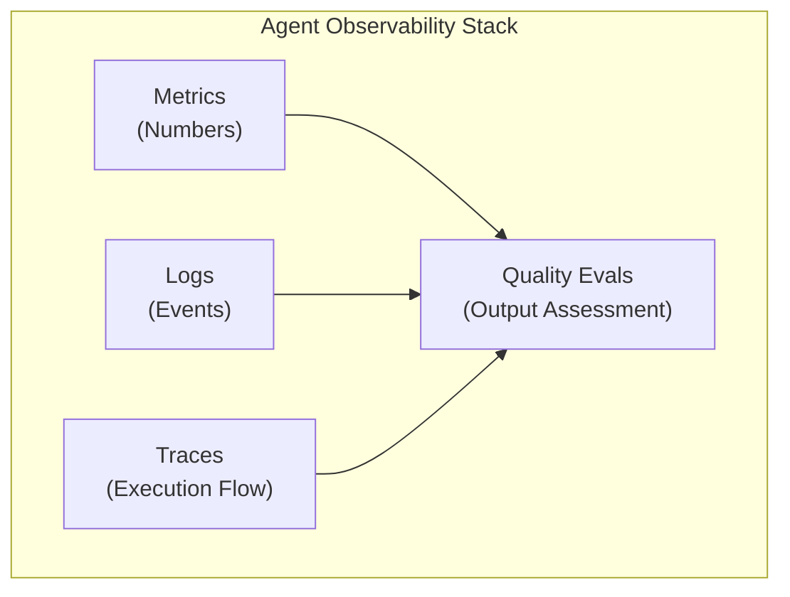
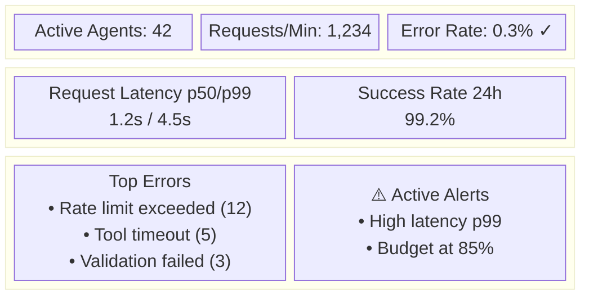
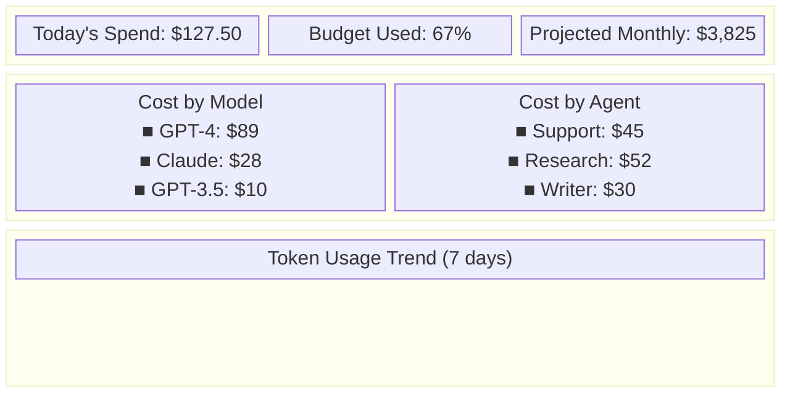
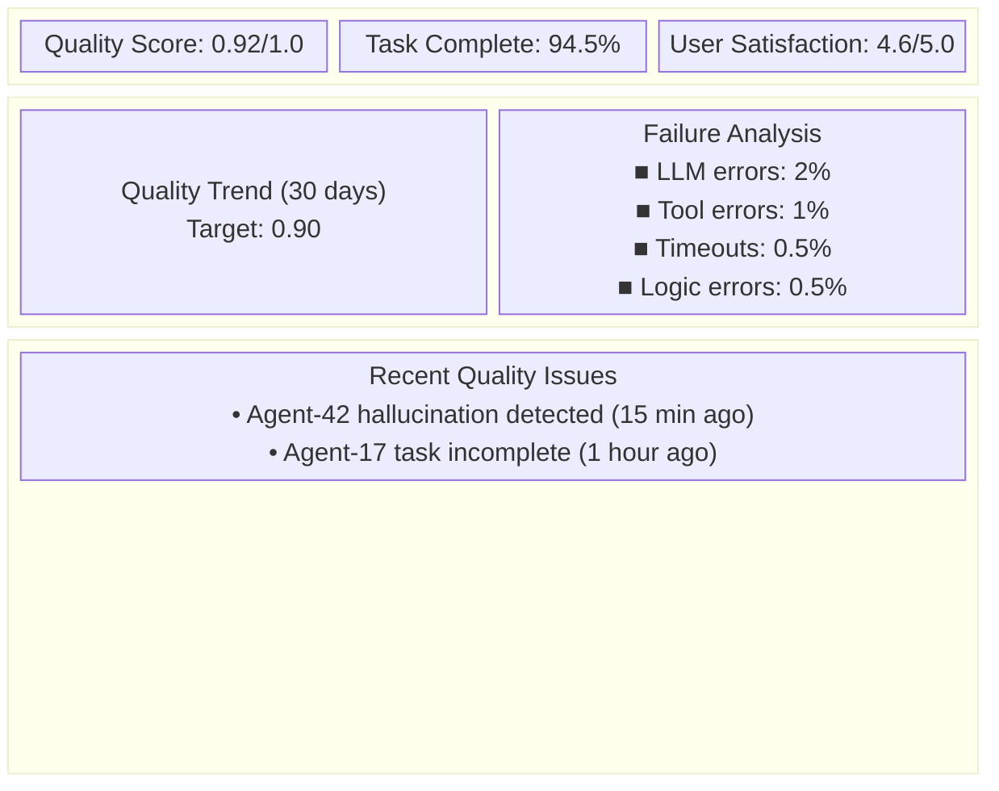
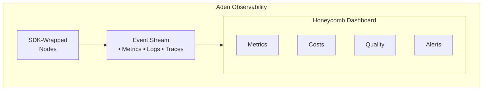

# AI Agent Observability & Monitoring: The Complete Guide

*How to know what your AI agents are actually doing*

---

AI agents are autonomous systems that make decisions, call tools, and interact with the world. Without proper observability, they become black boxes. This guide covers everything you need to monitor AI agents effectively.

---

## Why Agent Observability Is Different

Traditional application monitoring tracks requests and responses. Agent monitoring must track:

| Traditional Apps | AI Agents |
|------------------|-----------|
| Request/Response | Multi-step reasoning chains |
| Deterministic behavior | Probabilistic decisions |
| Fixed execution paths | Dynamic tool selection |
| Predictable costs | Variable LLM spending |
| Clear errors | Subtle quality degradation |

---

## The Four Pillars of Agent Observability



### 1. Metrics
Quantitative measurements over time:
- Requests per minute
- Success/failure rates
- Latency distributions
- Token usage
- Cost per request
- Tool call frequencies

### 2. Logs
Discrete events with context:
- Agent decisions
- Tool inputs/outputs
- Error messages
- User interactions
- System events

### 3. Traces
End-to-end execution flows:
- Full reasoning chains
- Token-by-token generation
- Tool call sequences
- Parent-child relationships
- Cross-agent communication

### 4. Quality Evals
Output quality assessment:
- Accuracy scoring
- Hallucination detection
- Task completion rates
- User satisfaction
- Regression detection

---

## Key Metrics to Track

### Performance Metrics
| Metric | Description | Alert Threshold |
|--------|-------------|-----------------|
| `agent.latency.p50` | Median response time | > 5s |
| `agent.latency.p99` | 99th percentile latency | > 30s |
| `agent.throughput` | Requests/second | < baseline * 0.5 |
| `agent.queue.depth` | Pending requests | > 100 |
| `agent.timeout.rate` | Timeout percentage | > 5% |

### Reliability Metrics
| Metric | Description | Alert Threshold |
|--------|-------------|-----------------|
| `agent.success.rate` | Successful completions | < 95% |
| `agent.error.rate` | Error percentage | > 5% |
| `agent.retry.rate` | Retries needed | > 10% |
| `agent.fallback.rate` | Fallback usage | > 20% |
| `agent.circuit.open` | Circuit breaker status | true |

### Cost Metrics
| Metric | Description | Alert Threshold |
|--------|-------------|-----------------|
| `agent.cost.total` | Total spend | > budget * 0.9 |
| `agent.cost.per.request` | Cost per request | > $0.50 |
| `agent.tokens.input` | Input tokens used | anomaly detection |
| `agent.tokens.output` | Output tokens used | anomaly detection |
| `agent.model.usage` | Calls by model | unusual patterns |

### Quality Metrics
| Metric | Description | Alert Threshold |
|--------|-------------|-----------------|
| `agent.quality.score` | Output quality (0-1) | < 0.7 |
| `agent.hallucination.rate` | Detected hallucinations | > 5% |
| `agent.task.completion` | Tasks fully completed | < 80% |
| `agent.user.satisfaction` | User ratings | < 4.0/5.0 |

---

## Logging Best Practices

### Structured Logging Format
```json
{
  "timestamp": "2025-01-15T10:30:00Z",
  "level": "info",
  "event": "agent_tool_call",
  "agent_id": "agent-123",
  "session_id": "session-456",
  "trace_id": "trace-789",
  "tool": "search_web",
  "input": {"query": "latest AI news"},
  "output_tokens": 150,
  "latency_ms": 1200,
  "success": true
}
```

### What to Log

**Always Log:**
- Agent start/stop
- Tool calls (name, duration, success)
- LLM calls (model, tokens, latency)
- Errors and exceptions
- Human interventions
- Budget events

**Log Carefully (PII concerns):**
- User inputs (may need redaction)
- Agent outputs (may contain sensitive data)
- Full prompts (can be large)

**Never Log:**
- API keys
- User credentials
- Full conversation transcripts in production
- Raw model weights

### Log Levels for Agents

| Level | Use Case |
|-------|----------|
| DEBUG | Full prompts, token-level details |
| INFO | Tool calls, completions, metrics |
| WARN | Retries, degradation, budget warnings |
| ERROR | Failures, exceptions, circuit breaks |
| FATAL | System crashes, unrecoverable errors |

---

## Distributed Tracing for Agents

### Why Tracing Matters
Agents involve multiple steps, LLM calls, and tool invocations. Tracing connects them all.

```
Trace: "Process customer refund"
├── Span: Agent Initialize (5ms)
├── Span: LLM Planning Call (800ms)
│   └── Attribute: model=gpt-4, tokens=500
├── Span: Tool: fetch_order (200ms)
│   └── Attribute: order_id=12345
├── Span: Tool: check_policy (50ms)
├── Span: LLM Decision Call (600ms)
│   └── Attribute: decision=approve
├── Span: Tool: process_refund (300ms)
└── Span: Agent Complete (10ms)
    └── Attribute: success=true, cost=$0.08
```

### Key Trace Attributes
- `agent.id`: Unique agent identifier
- `agent.type`: Agent type/role
- `session.id`: User session
- `parent.agent`: For multi-agent systems
- `llm.model`: Model used
- `llm.tokens`: Token counts
- `tool.name`: Tool being called
- `tool.success`: Tool outcome

---

## Dashboard Design

### Dashboard 1: Operations Overview


### Dashboard 2: Cost & Usage


### Dashboard 3: Quality & Reliability


---

## Alerting Strategy

### Critical Alerts (Page immediately)
- Error rate > 10% for 5 minutes
- All agents offline
- Budget exceeded
- Security anomaly detected

### Warning Alerts (Notify during business hours)
- Error rate > 5% for 15 minutes
- Latency p99 > 30s
- Budget > 90% of limit
- Quality score drops > 10%

### Informational (Daily digest)
- Token usage trends
- Cost projections
- Quality score changes
- New error types detected

### Alert Fatigue Prevention
- Use anomaly detection vs fixed thresholds
- Group related alerts
- Implement progressive escalation
- Review and tune alert thresholds monthly

---

## Tool Comparison

| Tool | Best For | Agent-Specific Features |
|------|----------|------------------------|
| Datadog | Enterprise, full-stack | APM for LLM calls |
| Grafana | Self-hosted, flexibility | Custom dashboards |
| LangSmith | LangChain users | Prompt tracing |
| Weights & Biases | ML teams | Experiment tracking |
| Helicone | LLM-focused | Token analytics |
| Aden | Production agents | Built-in observability |

---

## How Aden Handles Observability

Aden provides built-in observability without additional setup:

### Automatic Collection


### What Aden Tracks Automatically
- Every LLM call (model, tokens, latency, cost)
- Every tool invocation (name, duration, success)
- Agent lifecycle events (start, stop, error)
- Budget consumption in real-time
- Quality metrics via failure tracking
- HITL intervention points

### Built-in Dashboards
- Real-time agent status
- Cost breakdown by agent/model
- Quality trends over time
- Failure analysis
- Self-improvement metrics

### No Configuration Required
Unlike external tools, Aden's observability requires no setup:
```python
# Just wrap your node with the SDK
from aden import sdk

@sdk.node
async def my_agent(input):
    # All metrics automatically collected
    return await process(input)
```

---

## Implementation Checklist

### Phase 1: Basic (Week 1)
- [ ] Structured logging in place
- [ ] Basic metrics: latency, errors, throughput
- [ ] Cost tracking per request
- [ ] Simple dashboard with key metrics

### Phase 2: Comprehensive (Week 2-3)
- [ ] Distributed tracing implemented
- [ ] Quality evaluation pipeline
- [ ] Alerting rules configured
- [ ] Full dashboards built

### Phase 3: Advanced (Week 4+)
- [ ] Anomaly detection
- [ ] Automated regression detection
- [ ] Cost optimization insights
- [ ] Self-healing triggers

---

## Common Pitfalls

### 1. Logging Too Much
**Problem:** Full prompts in production logs
**Solution:** Log hashes or summaries, full content only for debugging

### 2. Alert Fatigue
**Problem:** Too many non-actionable alerts
**Solution:** Use anomaly detection, tune thresholds, require action plans

### 3. Missing Context
**Problem:** Can't correlate events across agents
**Solution:** Propagate trace IDs, use correlation IDs

### 4. Ignoring Quality
**Problem:** Only track operational metrics
**Solution:** Implement quality scoring, track user feedback

### 5. No Baselines
**Problem:** Don't know what "normal" looks like
**Solution:** Establish baselines before alerting, use relative thresholds

---

## Conclusion

Effective agent observability requires:

1. **Metrics**: Know your numbers (latency, errors, cost)
2. **Logs**: Capture events with context
3. **Traces**: Follow execution flows end-to-end
4. **Quality**: Assess output, not just uptime

Modern agent platforms like Aden provide this built-in. For other frameworks, plan to invest significant effort in observability infrastructure.

The goal: Never wonder what your agents are doing—always know.

---

*Last updated: January 2025*
