# Multi-Agent vs Single-Agent Systems: When to Use Each

*A practical guide to choosing the right architecture for your AI application*

---

When building AI applications, one of the first architectural decisions is whether to use a single agent or multiple agents working together. This guide breaks down when each approach makes sense.

---

## Single-Agent Systems

### What They Are
A single agent handles all tasks, tool calls, and decision-making within one unified process.

```mermaid
flowchart TB
    subgraph SingleAgent [Single Agent]
        LLM["LLM Brain\n• Reasoning\n• Planning\n• Tool Selection\n• Execution"]
        LLM --> Tools["Tools: A · B · C · D · E · F"]
    end
```



### Advantages
- **Simpler to build**: One agent, one context, one conversation
- **Lower latency**: No inter-agent communication overhead
- **Easier debugging**: Single point of execution to trace
- **Lower cost**: Fewer LLM calls overall
- **Unified context**: All information in one place

### Disadvantages
- **Context limits**: One agent must fit everything in its context window
- **Jack of all trades**: Hard to optimize for specialized tasks
- **Single point of failure**: If the agent fails, everything fails
- **Limited parallelism**: Sequential execution of tasks

### Best Use Cases
1. **Simple Q&A chatbots**: Direct user interaction
2. **Single-purpose tools**: One task done well
3. **Prototype development**: Quick iteration
4. **Low-complexity workflows**: Linear task sequences
5. **Cost-sensitive applications**: Minimizing LLM usage

---

## Multi-Agent Systems

### What They Are
Multiple specialized agents collaborate, each handling specific tasks or domains.

```mermaid
flowchart TB
    subgraph MAS [Multi-Agent System]
        A["Agent A\nResearcher 🔍"] --> Coord["Coordinator\n/ Orchestrator"]
        B["Agent B\nWriter ✍️"] --> Coord
        C["Agent C\nReviewer ✓"] --> Coord
    end
```



### Advantages
- **Specialization**: Each agent optimized for its domain
- **Scalability**: Add new agents for new capabilities
- **Parallelism**: Multiple agents work simultaneously
- **Fault isolation**: One agent failing doesn't crash everything
- **Better context management**: Each agent has focused context

### Disadvantages
- **Coordination complexity**: Managing agent communication
- **Higher latency**: Inter-agent handoffs add time
- **More expensive**: More LLM calls for coordination
- **Debugging difficulty**: Distributed execution traces
- **Potential conflicts**: Agents may have conflicting outputs

### Best Use Cases
1. **Complex research tasks**: Multiple perspectives needed
2. **Content pipelines**: Research → Write → Edit → Publish
3. **Enterprise workflows**: Different departments/functions
4. **Self-improving systems**: Separate learning from execution
5. **High-reliability systems**: Redundancy and verification

---

## Framework Comparison

| Framework | Single-Agent | Multi-Agent | Coordination Style |
|-----------|--------------|-------------|-------------------|
| LangChain | Excellent | Basic | Manual chains |
| CrewAI | Good | Excellent | Role-based crews |
| AutoGen | Good | Excellent | Conversation-based |
| Aden | Excellent | Excellent | Goal-driven + Self-improving |

---

## Aden's Hybrid Approach

Aden takes a unique approach by combining both paradigms:

### The Two-Agent Core

```mermaid
flowchart TB
    subgraph AdenSystem [Aden System]
        CA["Coding Agent\n(Single, Meta)\n• Generates\n• Improves\n• Orchestrates"] -->|creates| WA
        subgraph WA [Worker Agents - Multi, Specialized]
            A1["Agent1"]
            A2["Agent2"]
            A3["..."]
        end
        CA --> CP["Control Plane\nBudgets • Policies"]
        WA --> CP
    end
```


### How It Works
1. **Single Meta-Agent**: The Coding Agent acts as a single intelligent orchestrator
2. **Multi-Agent Execution**: Worker Agents are specialized and run in parallel
3. **Best of Both**: Simple development (goal-based) with multi-agent power
4. **Self-Improving**: The system evolves based on execution feedback

### When Aden Shines
- You want multi-agent power without multi-agent complexity
- Your system needs to improve itself over time
- You need production controls (budgets, HITL, monitoring)
- You're building complex workflows from natural language goals

---

## Decision Framework

Use this flowchart to decide:


---

## Practical Examples

### Example 1: Customer Support Bot
**Recommended: Single Agent**

Why: Direct Q&A, unified context, low latency needed
```
User Question → Single Agent → Answer
```

### Example 2: Research Report Generator
**Recommended: Multi-Agent**

Why: Multiple sources, different skills, quality review
```
Topic → Researcher Agent → Writer Agent → Editor Agent → Report
```

### Example 3: E-commerce Order Processing
**Recommended: Multi-Agent with Aden**

Why: Multiple systems, needs reliability, self-improvement valuable
```
Order → Inventory Agent ─┐
                         ├──► Coordinator → Fulfillment
Payment → Finance Agent ─┘
```

### Example 4: Code Review Assistant
**Recommended: Hybrid (Aden)**

Why: Needs specialization but also coordination
```
PR → Coding Agent generates → [Security Agent, Style Agent, Logic Agent]
                           → Synthesize Review
```

---

## Migration Strategies

### Single → Multi-Agent
1. Identify natural task boundaries
2. Extract specialized agents one at a time
3. Add coordination layer
4. Implement inter-agent communication
5. Add monitoring for new failure modes

### Multi → Single-Agent
1. Consolidate related agents
2. Merge context and tools
3. Simplify coordination logic
4. Reduce LLM calls
5. Improve response latency

---

## Key Metrics to Track

| Metric | Single-Agent | Multi-Agent |
|--------|--------------|-------------|
| Latency | Lower baseline | Higher, but parallelizable |
| Cost/Request | Predictable | Variable, needs budgets |
| Success Rate | Simpler to optimize | More failure points |
| Throughput | Limited by one agent | Scales with agents |
| Debugging Time | Linear | Exponential without tooling |

---

## Conclusion

**Choose Single-Agent when:**
- Building simple, focused applications
- Latency is critical
- Budget is tight
- Quick iteration is needed

**Choose Multi-Agent when:**
- Tasks require different expertise
- Parallelism improves outcomes
- Reliability through redundancy matters
- System complexity warrants specialization

**Choose Aden's Hybrid Approach when:**
- You want multi-agent power with single-agent simplicity
- Self-improvement is valuable
- Production controls are essential
- You're scaling from prototype to production

The right architecture depends on your specific use case. Start simple, measure results, and evolve your architecture as needs become clearer.

---

*Last updated: January 2025*
