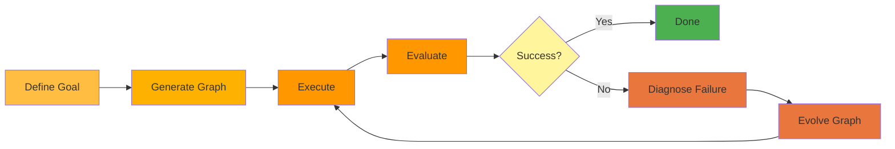

# Self-Evolving Agents: Mental Model

## Understanding "Self-Evolving" vs "Self-Learning"

When working with Hive, it's important to understand what we mean by "self-evolving" and how it differs from traditional "self-learning" AI systems.

## Self-Learning (Traditional AI)

**Self-learning** systems improve through training data:
- Learn patterns from large datasets
- Update model weights during training
- Improve accuracy on similar tasks
- Require retraining for fundamental changes
- Examples: Image classifiers, recommendation engines, LLMs

```
Input → Model → Output
         ↑
    Training Data
```

## Self-Evolving (Hive Agents)

**Self-evolving** systems improve their *architecture and behavior* based on outcomes:
- Modify their own graph structure
- Add or remove nodes dynamically
- Adjust connection logic
- Optimize workflows based on failures
- No retraining required

```
Goal → Graph → Execution → Evaluation
        ↑                      ↓
        └──── Evolution ───────┘
```

## How Hive Agents Evolve

### 1. Goal-Driven Architecture

You define **what** the agent should achieve, not **how**:

```python
goal = Goal(
    id="sales-automation",
    name="Outbound Sales Agent",
    description="Qualify leads and schedule demos",
    success_criteria=[
        SuccessCriterion(
            id="demo-scheduled",
            description="Successfully schedule demo with qualified lead"
        )
    ]
)
```

The Coding Agent generates the initial graph structure from this goal.

### 2. Execution with Monitoring

The agent executes and captures rich telemetry:
- Node execution results
- Edge traversal decisions
- Tool outputs
- LLM responses
- Failure points

### 3. Outcome Evaluation

After execution, the Judge evaluates:
- Did we achieve the goal?
- Which nodes succeeded/failed?
- Where did execution get stuck?
- What constraints were violated?

### 4. Adaptive Evolution

When failures occur, the system:

**Identifies the problem:**
```
Node "qualify_lead" failed 3 times
→ Lead data format changed
→ Current validation logic is outdated
```

**Evolves the graph:**
```python
# The Coding Agent generates new connection code
def evolve_qualification_node():
    # Add flexible parsing
    # Update validation rules
    # Add error recovery
    return updated_node
```

**Redeploys automatically:**
```
New graph version deployed
→ Re-run failed executions
→ Verify success criteria
```

## Key Differences

| Aspect | Self-Learning | Self-Evolving (Hive) |
|--------|--------------|---------------------|
| **What changes** | Model weights | Graph structure |
| **How it changes** | Gradient descent | Code generation |
| **Trigger** | Training phase | Execution failure |
| **Speed** | Hours/days | Minutes |
| **Human role** | Provide data | Define goals |
| **Persistence** | Requires retraining | Permanent code changes |

## Mental Model: The Adaptive Loop

Think of Hive agents as **living systems** that adapt to their environment:



### Example: Sales Agent Evolution

**Initial State:**
```python
nodes = [
    qualify_lead,    # Checks email format
    send_email,      # Sends template
    schedule_demo    # Books calendar
]
```

**Failure:** Email bounces for leads with new domain format

**Evolution:**
```python
nodes = [
    validate_email,      # NEW: Advanced email validation
    qualify_lead,        # UPDATED: More flexible checks
    send_email,          # UPDATED: Retry logic
    handle_bounce,       # NEW: Bounce recovery
    schedule_demo
]

# NEW edge: validate_email → qualify_lead (on_success)
# NEW edge: send_email → handle_bounce (on_failure)
```

The agent **evolved** its structure to handle the new requirement.

## What Hive Does NOT Do

Hive agents are **not**:

❌ Training their own neural networks
❌ Learning from data like supervised learning
❌ Updating LLM weights
❌ Performing gradient descent

Hive agents **are**:

✅ Evolving their graph architecture
✅ Generating new connection code
✅ Adapting workflows based on outcomes
✅ Self-improving through code generation

## Practical Implications

### For Developers

**Traditional approach:**
```python
# Manually update code when something breaks
if lead.email.endswith('.xyz'):
    # Add special case
    ...
```

**Hive approach:**
```python
# Define the goal, let the agent evolve
goal = Goal(
    description="Handle all valid email formats",
    success_criteria=[...]
)
# Agent detects failure and evolves its own code
```

### For Operations

**Traditional approach:**
- Monitor for failures
- File bugs
- Wait for dev fix
- Deploy manually

**Hive approach:**
- Failures trigger evolution
- Coding Agent generates fix
- Auto-redeploy
- Verify with Judge

## When to Use Self-Evolving Agents

Self-evolving agents excel when:

✅ **Requirements change frequently**
   Example: Integrating with external APIs that update

✅ **Failure patterns emerge over time**
   Example: Lead data formats vary by industry

✅ **Workflows need optimization**
   Example: Finding the best sequence of steps

✅ **Edge cases appear in production**
   Example: Handling unexpected input formats

Stick with traditional approaches when:

❌ Workflows are completely stable
❌ Requirements never change
❌ You need deterministic behavior 100% of the time

## Further Reading

- [Agent Architecture](../architecture/README.md) - Technical details of the graph structure
- [Coding Agent](./coding-agent.md) - How the Coding Agent generates graphs
- [Judge System](./judge-system.md) - How evaluation drives evolution
- [Goal-Driven Development](./goal-driven-development.md) - Defining effective goals

## Summary

**Self-evolving** means the agent's **architecture adapts** based on real-world outcomes, not that it trains its own model weights. Hive uses a Coding Agent to generate new graph structures when failures occur, creating a continuous improvement loop that requires minimal human intervention.

The power of self-evolution is that agents become more reliable over time **without requiring you to manually update code or retrain models**.
