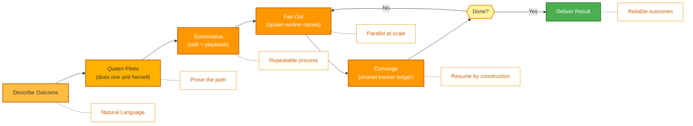

<p align="center">
  
</p>

<p align="center">
  <a href="../../README.md">English</a> |
  <a href="zh-CN.md">简体中文</a> |
  <a href="es.md">Español</a> |
  <a href="hi.md">हिन्दी</a> |
  <a href="pt.md">Português</a> |
  <a href="ja.md">日本語</a> |
  <a href="ru.md">Русский</a> |
  <a href="ko.md">한국어</a> |
  <a href="id.md">Bahasa Indonesia</a>
</p>

<p align="center">
  <a href="https://github.com/aden-hive/hive/blob/main/LICENSE"></a>
  <a href="https://www.ycombinator.com/companies/aden"></a>
  <a href="https://discord.com/invite/MXE49hrKDk"></a>
  <a href="https://x.com/aden_hq"></a>
  <a href="https://www.linkedin.com/company/teamaden/"></a>
  
</p>

<p align="center">
  
  
  
  
  
  
</p>
<p align="center">
  
  
  
</p>

<p align="center"><em>El arnés (harness) de agentes para cargas de trabajo en producción — gestión de estado, recuperación ante fallos, observabilidad y supervisión humana para que tus agentes realmente funcionen.</em></p>

## Descripción General

OpenHive es un runtime sin configuración y agnóstico de modelo para **colonias de agentes**. Una colonia es un grupo de agentes especializados que trabajan juntos para ejecutar un proceso de negocio: una **Queen** (Reina) — la líder persistente y de cara al cliente — más cuantos agentes **trabajadores** (worker) requiera el trabajo. Tú describes el resultado; la Queen hace el trabajo y luego hace crecer una colonia a su alrededor para ejecutar ese trabajo de forma confiable y a escala.

El mecanismo subyacente es **un bucle que controla muchos bucles**. Hive tiene una única primitiva de ejecución: la Queen *es* un bucle de agente (agent loop), y cada trabajador es un **clon** de ella — las mismas herramientas, el mismo modelo, su propia tarea. No hay ningún grafo que compilar ni código repetitivo de orquestación que escribir. La colonia se coordina a través de un registro compartido (ledger) y un plan persistente, con estado a prueba de caídas, observabilidad profunda y supervisión humana integradas en la única primitiva que comparte cada agente. Consulta el **[Resumen de la Arquitectura](../architecture/README.md)** para ver cómo funciona.

## Características

- ✅ Colonias de agentes — una Queen genera clones trabajadores bajo demanda para trabajos paralelos y de larga duración
- ✅ Una primitiva, muchos bucles — sin grafo que cablear; la Queen hace crecer la colonia en tiempo de ejecución
- ✅ Registro compartido del tracker + plan de tareas persistente para coordinar sin un búfer de datos
- ✅ Personas de Queen con enrutamiento estilo CEO y memoria evolutiva y acotada
- ✅ Pausa/reanudación a prueba de caídas, aplicación de límites de costo e intervención humana fuera de banda (Sentinel)
- ✅ Sin Configuración — no se requiere configuración técnica
- ✅ Uso General de Cómputo (General Compute Use) y Uso del Navegador (Browser Use) con Extensión Nativa
- ✅ Soporte de Modelos Personalizados

Visita [adenhq.com](https://adenhq.com) para documentación completa, ejemplos y guías.

Visita [HoneyComb](http://honeycomb.open-hive.com/) para ver qué empleos está automatizando la IA. Es un mercado de valores para empleos, impulsado por el progreso de los agentes de IA de nuestra comunidad. Puedes tomar posiciones largas y cortas sobre empleos (sin dinero real, sino con tokens de cómputo) según cuánto creas que un empleo será reemplazado por la IA.

https://github.com/user-attachments/assets/bf10edc3-06ba-48b6-98ba-d069b15fb69d


## ¿Para Quién es Hive?

Hive es la capa de arnés multiagente para equipos que llevan agentes de IA del prototipo a la producción. Los agentes individuales como Openclaw y Cowork pueden completar tareas personales bastante bien, pero carecen del rigor para cumplir procesos de negocio.

Hive es una buena opción si:

- Quieres agentes de IA que **ejecuten procesos de negocio reales**, no demos
- Necesitas un **runtime que gestione el estado, la recuperación y la ejecución en paralelo** a escala
- Necesitas **agentes auto-reparables y adaptativos** que mejoren con el tiempo
- Requieres **control con humano en el bucle**, observabilidad y límites de costo
- Planeas ejecutar agentes en **producción** donde importan el tiempo de actividad, el costo y la auditabilidad

Hive puede no ser la mejor opción si solo estás experimentando con cadenas de agentes simples o scripts puntuales.

## ¿Cuándo Deberías Usar Hive?

Usa Hive cuando el cuello de botella ya no es el modelo, sino el arnés que lo rodea:

- Agentes de larga duración que necesitan **persistencia de estado y recuperación ante caídas**
- Cargas de trabajo de producción que requieren **aplicación de límites de costo, observabilidad y registros de auditoría**
- Agentes que **mejoran con el tiempo** mediante reflexión, memoria acotada y habilidades aprendidas
- Trabajo paralelo y multiagente coordinado mediante un **registro compartido del tracker y un plan persistente**
- Un framework que **escala con las mejoras de los modelos** en lugar de luchar contra ellas

## Enlaces Rápidos

- **[Documentación](https://docs.adenhq.com/)** - Guías completas y referencia de API
- **[Guía de Auto-Hospedaje](https://docs.adenhq.com/getting-started/quickstart)** - Despliega Hive en tu infraestructura
- **[Registro de Cambios](https://github.com/aden-hive/hive/releases)** - Últimas actualizaciones y versiones
- **[Hoja de Ruta](../roadmap.md)** - Funciones y planes próximos
- **[Reportar Problemas](https://github.com/aden-hive/hive/issues)** - Reportes de errores y solicitudes de funciones
- **[Contribuir](../../CONTRIBUTING.md)** - Cómo contribuir y enviar PRs

## Inicio Rápido

### Prerrequisitos

- Python 3.11+ para el desarrollo de agentes
- Un proveedor de LLM que impulse a los agentes
- **ripgrep (opcional, recomendado en Windows):** Las herramientas de búsqueda `terminal_rg` / `terminal_glob` usan ripgrep para búsquedas de archivos más rápidas. Si no está instalado, se usa una alternativa en Python. En Windows: `winget install BurntSushi.ripgrep` o `scoop install ripgrep`

> **Usuarios de Windows:** Windows nativo es compatible mediante `quickstart.ps1` y `hive.ps1`. Ejecútalos en PowerShell 5.1+. WSL también es una opción, pero no es obligatorio.

### Instalación

> **Nota**
> Hive usa una disposición de workspace de `uv` y no se instala con `pip install`.
> Ejecutar `pip install -e .` desde la raíz del repositorio creará un paquete de marcador de posición (placeholder) y Hive no funcionará correctamente.
> Por favor, usa el script de inicio rápido a continuación para configurar el entorno.

```bash
# Clone the repository
git clone https://github.com/aden-hive/hive.git
cd hive

# Run quickstart setup (macOS/Linux)
./quickstart.sh

# Windows (PowerShell)
.\quickstart.ps1
```

Esto configura:

- **framework** - Runtime principal del agente y ejecutor de grafos (en `core/.venv`)
- **aden_tools** - Herramientas MCP para las capacidades de los agentes (en `tools/.venv`)
- **credential store** - Almacenamiento cifrado de claves API (`~/.hive/credentials`)
- **LLM provider** - Configuración interactiva del modelo predeterminado, incluyendo Hive LLM y OpenRouter
- Todas las dependencias de Python requeridas con `uv`

- Por último, abrirá la interfaz de Hive en tu navegador

> **Consejo:** Para volver a abrir el panel más tarde, ejecuta `hive open` desde el directorio del proyecto.

### Construye Tu Primer Agente

Escribe el agente que quieres construir en el cuadro de entrada de la pantalla principal. La Queen te hará preguntas y elaborará una solución contigo.


### Usa Agentes de Plantilla

Haz clic en "Try a sample agent" y revisa las plantillas. Puedes ejecutar una plantilla directamente o elegir construir tu versión sobre la plantilla existente.

### Ejecutar Agentes

Ahora puedes ejecutar un agente seleccionándolo (ya sea un agente existente o un agente de ejemplo). Puedes hacer clic en el botón Run en la parte superior izquierda, o hablar con el agente Queen y este puede ejecutar el agente por ti.


## Integración

<a href="https://github.com/aden-hive/hive/tree/main/tools/src/aden_tools/tools"></a>
Hive está construido para ser agnóstico de modelo y agnóstico de sistema.

- **Flexibilidad de LLM** - Hive Framework es compatible con Anthropic, OpenAI, OpenRouter, Hive LLM y otros modelos alojados o locales a través de proveedores compatibles con LiteLLM.
- **Conectividad con sistemas de negocio** - Hive Framework está diseñado para conectarse a todo tipo de sistemas de negocio como herramientas, tales como CRM, soporte, mensajería, datos, archivos y APIs internas mediante MCP.

## Por Qué Hive

A medida que los modelos mejoran, el límite superior de lo que los agentes pueden hacer aumenta — pero su confiabilidad y su valor en producción los determina el arnés. Hive se enfoca en ejecutar procesos de negocio reales en lugar de agentes genéricos. En lugar de obligarte a cablear a mano un grafo de flujo de trabajo, definir cada interacción entre agentes y manejar los fallos de forma reactiva, Hive invierte el paradigma: **tú describes el resultado, la Queen hace el trabajo primero y luego hace crecer una colonia para escalarlo** — una experiencia adaptativa y orientada a resultados con un conjunto de herramientas e integraciones fácil de usar.



### Cómo Funciona

1. **[Describe el resultado](../key_concepts/goals_outcome.md)** → Di lo que quieres en lenguaje simple; un enrutador estilo CEO elige la [Queen](../key_concepts/queen.md) adecuada
2. **La Queen pilota** → Ella misma realiza una unidad del trabajo, demostrando el camino y registrándolo en el tracker compartido
3. **[Sistematizar](../key_concepts/improvement.md)** → Ella convierte el protocolo demostrado en una habilidad (skill) + un manual (playbook) — un proceso repetible
4. **[Distribuir](../key_concepts/colony.md)** → `run_worker` genera [clones trabajadores](../key_concepts/worker_agent.md) que se ejecutan en paralelo e informan de vuelta
5. **Converger y monitorear** → Los trabajadores escriben los resultados en el tracker; la Queen valida mediante SQL, con métricas en tiempo real, aplicación de presupuesto y reanudación a prueba de caídas

## Documentación

- **[Guía del Desarrollador](../developer-guide.md)** - Guía completa para desarrolladores
- [Primeros Pasos](../getting-started.md) - Instrucciones de configuración rápida
- [Guía de Configuración](../configuration.md) - Todas las opciones de configuración
- [Resumen de la Arquitectura](../architecture/README.md) - Diseño y estructura del sistema

## Contribuir
¡Damos la bienvenida a las contribuciones de la comunidad! Buscamos especialmente ayuda para construir herramientas, integraciones y agentes de ejemplo para el framework ([consulta #2805](https://github.com/aden-hive/hive/issues/2805)). Si te interesa extender su funcionalidad, este es el lugar perfecto para empezar. Por favor, consulta [CONTRIBUTING.md](../../CONTRIBUTING.md) para las directrices.

**Importante:** Por favor, solicita que se te asigne un issue antes de enviar un PR. Comenta en un issue para reclamarlo y un mantenedor te lo asignará. Se priorizan los issues con pasos reproducibles y propuestas. Esto ayuda a evitar trabajo duplicado.

1. Encuentra o crea un issue y solicita que te lo asignen
2. Haz un fork del repositorio
3. Crea tu rama de funcionalidad (`git checkout -b feature/amazing-feature`)
4. Haz commit de tus cambios (`git commit -m 'Add amazing feature'`)
5. Haz push a la rama (`git push origin feature/amazing-feature`)
6. Abre un Pull Request

## Comunidad y Soporte

Usamos [Discord](https://discord.com/invite/MXE49hrKDk) para soporte, solicitudes de funciones y discusiones de la comunidad.

- Discord - [Únete a nuestra comunidad](https://discord.com/invite/MXE49hrKDk)
- Twitter/X - [@adenhq](https://x.com/aden_hq)
- LinkedIn - [Página de la Empresa](https://www.linkedin.com/company/teamaden/)

## Únete a Nuestro Equipo

**¡Estamos contratando!** Únete a nosotros en roles de ingeniería, investigación y comercialización.

[Ver Posiciones Abiertas](https://jobs.adenhq.com/a8cec478-cdbc-473c-bbd4-f4b7027ec193/applicant)

## Seguridad

Para cuestiones de seguridad, por favor consulta [SECURITY.md](../../SECURITY.md).

## Licencia

Este proyecto está licenciado bajo la Licencia Apache 2.0 - consulta el archivo [LICENSE](../../LICENSE) para más detalles.

## Preguntas Frecuentes (FAQ)

**P: ¿Qué proveedores de LLM soporta Hive?**

Hive soporta más de 100 proveedores de LLM a través de la integración con LiteLLM, incluyendo OpenAI (GPT-4, GPT-4o), Anthropic (modelos Claude), Google Gemini, DeepSeek, Mistral, Groq, OpenRouter y Hive LLM. Simplemente configura la variable de entorno de la clave API apropiada y especifica el nombre del modelo. Consulta [docs/configuration.md](../configuration.md) para ver ejemplos de configuración específicos de cada proveedor.

**P: ¿Puedo usar Hive con modelos de IA locales como Ollama?**

¡Sí! Hive soporta modelos locales a través de LiteLLM. Simplemente usa el formato de nombre de modelo `ollama/model-name` (por ejemplo, `ollama/llama3`, `ollama/mistral`) y asegúrate de que Ollama esté ejecutándose localmente.

**P: ¿Qué hace que Hive sea diferente de otros frameworks de agentes?**

Hive ejecuta **colonias de agentes**, no agentes individuales ni grafos de agentes cableados a mano. La mayoría de los frameworks te obligan a compilar un grafo de nodos y aristas distintos; Hive tiene una única primitiva de ejecución — la Queen *es* un bucle de agente, y cada trabajador es un [clon](../key_concepts/the_loop.md) de ella. La orquestación es una distribución (fan-out) con `run_worker` en tiempo de ejecución, no un DAG compilado, y la colonia se coordina a través de un [registro compartido del tracker](../key_concepts/coordination.md) en lugar de un búfer de datos. Sobre ese núcleo de "un bucle, muchos bucles", Hive es un arnés de producción — pausa/reanudación a prueba de caídas, aplicación de límites de costo, observabilidad en tiempo real e intervención humana fuera de banda — heredado por cada agente porque solo hay un tipo de agente. Consulta el [Resumen de la Arquitectura](../architecture/README.md).

**P: ¿Hive es de código abierto?**

Sí, Hive es completamente de código abierto bajo la Licencia Apache 2.0. Fomentamos activamente las contribuciones y la colaboración de la comunidad.

**P: ¿Hive soporta flujos de trabajo con humano en el bucle?**

Sí. Una Queen escala a un humano fuera de banda a través de **Sentinel** — un canal de Slack/Telegram vinculado a la cuenta. El bucle del agente se pausa (persistiendo su estado en disco), notifica al humano y se reanuda exactamente donde lo dejó cuando esta persona responde. Como la escalación no es un nodo en un grafo, cualquier agente de una colonia puede pausarse para el juicio humano en cualquier punto, con tiempos de espera y políticas de escalación configurables. Consulta el [Resumen de la Arquitectura](../architecture/README.md#reliability-is-in-the-primitive).

**P: ¿Qué lenguajes de programación soporta Hive?**

El framework Hive está construido en Python. Un SDK de JavaScript/TypeScript está en la hoja de ruta.

**P: ¿Pueden los agentes de Hive interactuar con herramientas y APIs externas?**

Sí. Cada agente de una colonia tiene acceso integrado a herramientas, y Hive se conecta a APIs, bases de datos y servicios externos a través de MCP — incluyendo más de 100 herramientas de integración, además del Uso General de Cómputo (General Compute Use) y el Uso del Navegador (Browser Use) mediante la extensión nativa. Como la Queen y sus trabajadores comparten una única superficie de herramientas, cualquier capacidad que agregues está disponible para toda la colonia.

**P: ¿Cómo funciona el control de costos en Hive?**

Hive proporciona controles de presupuesto granulares, incluyendo límites de gasto, limitadores y políticas de degradación automática de modelos. Puedes establecer presupuestos a nivel de equipo, agente o flujo de trabajo, con seguimiento de costos en tiempo real y alertas.

**P: ¿Dónde puedo encontrar ejemplos y documentación?**

Visita [docs.adenhq.com](https://docs.adenhq.com/) para guías completas, referencia de API y tutoriales para empezar. El repositorio también incluye documentación en la carpeta `docs/` y una [guía del desarrollador](../developer-guide.md) completa.

**P: ¿Cómo puedo contribuir a Aden?**

¡Las contribuciones son bienvenidas! Haz un fork del repositorio, crea tu rama de funcionalidad, implementa tus cambios y envía un pull request. Consulta [CONTRIBUTING.md](../../CONTRIBUTING.md) para directrices detalladas.

## Historial de Estrellas

<a href="https://www.star-history.com/?type=date&repos=aden-hive%2Fhive">
 <picture>
   <source media="(prefers-color-scheme: dark)" srcset="https://api.star-history.com/chart?repos=aden-hive/hive&type=date&theme=dark&legend=top-left&sealed_token=vfX1DG8w_KTkonUUtIEjFRLvBopgDzxQpyb8hiYT22sobcDIpvQiMciZghLsDu5hyU3LJs-ZddFjl8eYFx5zRrY-kcMRsfyQ3vAiacsroPoqgRYmZaES3Q" />
   <source media="(prefers-color-scheme: light)" srcset="https://api.star-history.com/chart?repos=aden-hive/hive&type=date&legend=top-left&sealed_token=vfX1DG8w_KTkonUUtIEjFRLvBopgDzxQpyb8hiYT22sobcDIpvQiMciZghLsDu5hyU3LJs-ZddFjl8eYFx5zRrY-kcMRsfyQ3vAiacsroPoqgRYmZaES3Q" />
   
 </picture>
</a>

---

<p align="center">
  Hecho con 🔥 Pasión en San Francisco
</p>
