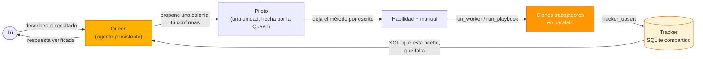

<p align="center">
  
</p>

<p align="center">
  <a href="../../README.md">English</a> |
  <a href="zh-CN.md">简体中文</a> |
  <a href="es.md">Español</a> |
  <a href="hi.md">हिन्दी</a> |
  <a href="pt.md">Português</a> |
  <a href="ja.md">日本語</a> |
  <a href="ru.md">Русский</a> |
  <a href="ko.md">한국어</a>
</p>

<p align="center">
  <a href="https://github.com/aden-hive/hive/blob/main/LICENSE"></a>
  <a href="https://www.ycombinator.com/companies/aden"></a>
  <a href="https://discord.com/invite/MXE49hrKDk"></a>
  <a href="https://x.com/aden_hq"></a>
  <a href="https://www.linkedin.com/company/teamaden/"></a>
</p>

<h3 align="center">Colonias de agentes de IA que ejecutan los procesos de tu negocio.</h3>

<p align="center">
  Describe un resultado. Una Queen hace ella misma la primera parte del trabajo y luego hace crecer una colonia de agentes trabajadores que terminan el resto en paralelo, con cada resultado en un registro compartido que puedes consultar, reanudar y auditar.
</p>

<p align="center">
  <a href="../assets/readme/demo.mp4"></a>
  <br />
  <sub>Grabado de una ejecución real; solo se aceleraron las esperas. <a href="../assets/readme/demo.mp4">Ver en calidad completa (MP4)</a>.</sub>
</p>

## Lo que acabas de ver

Un equipo de growth que prepara un Show HN quiere saber cómo les fue en Hacker News a los lanzamientos propios de cinco herramientas para desarrolladores. Esto es lo que hizo Hive con ese único mensaje:

1. **Se lo encargas a una Queen.** Cada Queen (reina) es un agente persistente con un rol, en este caso Head of Growth, además de su propia memoria y sus herramientas.
2. **Hace la única pregunta que cambia la respuesta:** ¿solo los lanzamientos originales o cualquier lanzamiento? Eliges una opción y ella sigue adelante.
3. **Propone una colonia y tú la confirmas.** Cinco productos son cinco trabajos en paralelo, así que el chat se convierte en una colonia: la Queen más tantos agentes trabajadores como requiera el trabajo.
4. **Hace ella misma una unidad.** Toma Supabase, el caso complicado (su mayor hilo de lanzamiento no lleva "Launch HN" en el título), decide qué cuenta como lanzamiento y deja el método por escrito como una habilidad (skill) reutilizable.
5. **Lo ejecuta como un manual (playbook):** un trabajador por producto, en paralelo, cada uno siguiendo la habilidad que ella escribió y guardando su fila en el tracker de la colonia, una tabla SQLite compartida.
6. **Revisa cada fila antes de responder.** Los casos límite quedan a la vista: Cal.com no tuvo ningún lanzamiento válido con ninguno de sus dos nombres, así que el gráfico lo muestra como sin datos, no como cero.

Nada de ese flujo estaba definido de antemano. No hay ningún grafo de flujo de trabajo que diseñar: la Queen hace crecer la colonia en tiempo de ejecución, y es el tracker en disco, no la memoria de nadie, el que registra qué está hecho y qué falta.

## Inicio rápido

**Necesitas:** Python 3.11+, Node.js 20+ y git. El quickstart instala `uv` y `ripgrep` si faltan y se ofrece a instalar Node.

**Y un modelo.** El quickstart te guía para configurar cualquiera de estas opciones:

- una API key: Anthropic, OpenAI, Google Gemini, Groq, Cerebras u OpenRouter
- una suscripción de programación que ya tengas: Claude Code, OpenAI Codex, Kimi Code, MiniMax, Z.AI o Antigravity
- Hive LLM
- un modelo local con Ollama, sin ninguna clave

```bash
git clone https://github.com/aden-hive/hive.git
cd hive
./quickstart.sh          # macOS / Linux
.\quickstart.ps1         # Windows (PowerShell 5.1+)
```

El quickstart crea un único entorno de Python para el workspace, guarda tu API key en un almacén de credenciales cifrado dentro de `~/.hive`, te pregunta qué modelo usar, compila el panel y lo abre en `http://127.0.0.1:8787`. Para volver a abrirlo más tarde, ejecuta `hive open` desde el repositorio.

> [!NOTE]
> Hive es un workspace de `uv`, no un paquete de pip. `pip install -e .` instala un paquete de marcador de posición que no funciona; usa el quickstart.

**Después:** escribe una tarea en la pantalla de inicio y elige a qué Queen encargársela, o abre la **Prompt Library** y envía un prompt ya preparado directamente a la Queen para la que se escribió.

## Cómo funciona


```mermaid
flowchart LR
    You(["Tú"]) -->|"describes el resultado"| Queen["Queen<br/>(agente persistente)"]
    Queen -->|"propone una colonia,<br/>tú confirmas"| Pilot["Piloto<br/>(una unidad, hecha por la Queen)"]
    Pilot -->|"deja el método por escrito"| Skill["Habilidad + manual"]
    Skill -->|"run_worker / run_playbook"| W["Clones trabajadores<br/>en paralelo"]
    W -->|"tracker_upsert"| T[("Tracker<br/>SQLite compartido")]
    T -->|"SQL: qué está hecho,<br/>qué falta"| Queen
    Queen -->|"respuesta verificada"| You

    style Queen fill:#ffb100,stroke:#cc5d00,color:#333
    style T fill:#fff3d6,stroke:#cc5d00,color:#333
    style W fill:#ff9800,stroke:#cc5d00,color:#fff
```

Hive tiene **una única primitiva de ejecución**: un bucle de agente. La Queen es uno de ellos; cada trabajador es un clon suyo con su propia tarea, un conjunto de herramientas más reducido y un presupuesto estricto. La orquestación es una llamada a herramienta, no un grafo compilado:

- **`run_worker`** reparte las tareas y devuelve el control de inmediato, así que la Queen sigue hablando contigo mientras los trabajadores se ejecutan. Por defecto se ejecutan hasta cuatro a la vez; el resto espera en cola. El informe de cada trabajador que termina llega a la conversación de la Queen como un turno nuevo.
- **El tracker** es el estado compartido de la colonia. La Queen define la tabla y qué columnas pueden escribir los trabajadores; los trabajadores hacen upsert de una fila por unidad de trabajo; la Queen revisa el progreso con SQL. Se guarda en disco, en `~/.hive/colonies/<name>/tracker/tracker.db`.
- **`run_playbook`** aplica un protocolo probado a cada fila: reintentos con backoff, carriles con límite de tasa y una lista dead-letter para las filas que siguen fallando. Como "lo que falta" siempre es una consulta nueva al tracker, volver a ejecutar un manual lo reanuda.

El **[resumen de la arquitectura](../architecture/README.md)** explica el bucle, la superficie de herramientas, la memoria, la supervisión humana y cómo sobrevive el estado a una caída.

<table>
  <tr>
    <td width="50%"><br /><sub><b>Inicio.</b> Tus Queens y sus colonias en un solo mapa. Describe una tarea y elige quién se encarga.</sub></td>
    <td width="50%"><br /><sub><b>Trabajadores.</b> Uno por unidad de trabajo, cada uno con su propia tarea y presupuesto, y todos informan a la Queen.</sub></td>
  </tr>
  <tr>
    <td width="50%"><br /><sub><b>Tracker.</b> Los resultados llegan a una tabla compartida a medida que terminan los trabajadores, listos para consultarlos, exportarlos o retomar el trabajo desde ahí.</sub></td>
    <td width="50%"><br /><sub><b>Resultado.</b> Una respuesta verificada, con fuentes y un gráfico, en el chat.</sub></td>
  </tr>
</table>

## Qué incluye

**Queens con un puesto y memoria.** Hive trae trece Queens con perfiles predefinidos: seis están activas por defecto (Growth, RevOps, Content, Lead Generation, Outbound, Brand & Design), el resto se puede contratar desde el Org Chart y también puedes crear las tuyas. Cada una mantiene una memoria acotada en markdown que escribe un paso de reflexión, y las conversaciones pasadas relevantes se recuperan automáticamente en su contexto.

**Herramientas integradas, en el mismo proceso.** Comandos de shell y tareas en segundo plano, edición de archivos, búsqueda rápida de código, PDF, adjuntos e imágenes, web scraping, gráficos (ECharts y Mermaid), archivos CSV y generación de imágenes con Hive LLM. Se ejecutan dentro del propio Hive, sin servidores de herramientas que arrancar.

**Tu navegador, manejado por tus agentes.** La extensión Hive Browser Bridge permite a los agentes usar tu propio Chrome, donde ya tienes tus sesiones iniciadas. Cada trabajador tiene su propio grupo de pestañas.

**Habilidades (skills).** Instrucciones reutilizables en el formato abierto [Agent Skills](https://agentskills.io). Hive incluye un conjunto de serie, las Queens escriben otras nuevas cuando un protocolo demuestra que funciona, y puedes gestionarlas en la Skills Library.

**Cualquier MCP server.** Agrega un MCP server externo con `hive mcp add` y sus herramientas se suman a las mismas allowlists que las integradas. El catálogo completo de integraciones de [`tools/`](../../tools/src/aden_tools/tools) (GitHub, Gmail, HubSpot, Slack, Notion y muchas más) funciona como uno de ellos; consulta [docs/tools.md](../tools.md).

**Sigue trabajando cuando no estás.** Las colonias pueden programarse solas con disparadores de cron, por intervalo o por webhook. **Sentinel**, que se activa por colonia, vigila a una Queen cuando se detiene: le da un empujón para que siga o te escala el caso a través de la bandeja de entrada de Hive, Telegram o Slack, y ella retoma el trabajo cuando respondes.

**Hecho para resistir.** Cada agente guarda su estado en disco y, tras una caída o un reinicio, continúa exactamente donde lo dejó. Los resultados grandes de las herramientas se vuelcan a archivos en lugar de saturar el contexto, las sesiones largas se compactan solas, se detectan los turnos atascados o en bucle, y cada trabajador funciona con un presupuesto estricto de llamadas a herramientas.

**Cualquier modelo.** Todo lo que admite [LiteLLM](https://docs.litellm.ai/docs/providers), incluidos OpenAI, Anthropic, Gemini, OpenRouter, Hive LLM, cualquier endpoint compatible con OpenAI y modelos locales con Ollama. Los trabajadores pueden usar un modelo distinto al de su Queen, y los modelos que solo manejan texto pueden ver imágenes gracias a un fallback de visión.

## ¿Es Hive para ti?

Hive encaja cuando lo difícil ya no es el modelo, sino todo lo que lo rodea:

- Un proceso con **muchas unidades de trabajo similares**, como leads, cuentas, tickets, repositorios o documentos, que quieres resolver en paralelo y siempre de la misma forma.
- Trabajo que **dura horas o se ejecuta de forma programada** y tiene que sobrevivir a los reinicios.
- Resultados que necesitas **revisar, consultar y auditar**, no solo leer en un chat.
- Una **persona que sigue al mando** de las decisiones importantes.

Para un solo prompt o un script puntual, un agente normal es más sencillo.

## Documentación

- [Primeros pasos](../getting-started.md): la instalación con más detalle
- [Resumen de la arquitectura](../architecture/README.md): cómo encajan las colonias, el bucle, las herramientas y la memoria
- Conceptos clave: [colonia](../key_concepts/colony.md), [Queen](../key_concepts/queen.md), [trabajadores](../key_concepts/worker_agent.md), [coordinación](../key_concepts/coordination.md), [el bucle](../key_concepts/the_loop.md), [objetivos y resultados](../key_concepts/goals_outcome.md), [cómo mejoran las colonias](../key_concepts/improvement.md)
- [Herramientas](../tools.md): herramientas integradas, MCP servers y el catálogo de integraciones
- [Configuración](../configuration.md) y la [guía para desarrolladores](../developer-guide.md)
- [docs.adenhq.com](https://docs.adenhq.com/): documentación en línea

## Preguntas frecuentes

**¿Qué modelos admite Hive?**
Cualquier proveedor que admita [LiteLLM](https://docs.litellm.ai/docs/providers), además de cualquier endpoint compatible con OpenAI. El quickstart configura los más habituales, incluidas suscripciones de programación como Claude Code y OpenAI Codex; [docs/configuration.md](../configuration.md) explica el resto.

**¿Puedo usarlo con modelos locales?**
Sí. Elige Ollama en el quickstart, o configura un modelo como `ollama/llama3` con Ollama ejecutándose en local.

**¿En qué se diferencia de otros frameworks de agentes?**
La mayoría de los frameworks te hacen diseñar un grafo de agentes y conectar sus entradas y salidas. Hive tiene un solo tipo de agente: la Queen es un bucle de agente y cada trabajador es un clon suyo. La orquestación ocurre en tiempo de ejecución mediante llamadas a herramientas, y la coordinación pasa por un tracker SQL compartido en lugar de mensajes que circulan por las aristas. Las funciones del arnés (persistencia, reanudación, presupuestos, compactación, supervisión) viven en ese único bucle, así que todos los agentes las tienen.

**¿Dónde se guardan mis datos?**
En tu máquina. Las sesiones, las colonias, los trackers y la memoria son archivos normales dentro de `~/.hive` (o donde apunte `HIVE_HOME`), y las API keys se guardan ahí cifradas.

**¿Cómo mantengo los costos bajo control?**
Cada trabajador funciona con límites estrictos de turnos y llamadas a herramientas, así que un trabajador atascado se detiene solo, y la concurrencia está limitada. El uso se mide en cada llamada al modelo. Todavía no hay límites de gasto en dólares.

**¿Pueden los agentes usar mis propias herramientas y APIs?**
Sí: con la shell y el navegador integrados, con cualquier MCP server que agregues y con habilidades que les enseñan tus procedimientos.

**¿Hive es de código abierto?**
Sí, bajo la [Licencia Apache 2.0](../../LICENSE).

## Contribuir

Las contribuciones son bienvenidas, sobre todo herramientas, integraciones y habilidades ([#2805](https://github.com/aden-hive/hive/issues/2805)). Lee primero [CONTRIBUTING.md](../../CONTRIBUTING.md) y pide que te asignen un issue antes de abrir un pull request: comenta en el issue y un mantenedor te lo asignará. Se priorizan los issues con pasos para reproducirlos o con una propuesta.

## Comunidad

- [Discord](https://discord.com/invite/MXE49hrKDk) para preguntas, solicitudes de funciones y debate
- [X / Twitter](https://x.com/aden_hq) y [LinkedIn](https://www.linkedin.com/company/teamaden/) para novedades
- [HoneyComb](http://honeycomb.open-hive.com/): un mercado comunitario que sigue qué empleos están automatizando los agentes de IA. Toma posiciones largas o cortas sobre un empleo con tokens de cómputo, no con dinero.

**Estamos contratando** en ingeniería, investigación y go-to-market. [Ver vacantes](https://jobs.adenhq.com/a8cec478-cdbc-473c-bbd4-f4b7027ec193/applicant).

## Seguridad

Para reportar una vulnerabilidad, consulta [SECURITY.md](../../SECURITY.md).

## Licencia

Licencia Apache 2.0. Consulta [LICENSE](../../LICENSE).

## Historial de estrellas

<a href="https://www.star-history.com/?type=date&repos=aden-hive%2Fhive">
 <picture>
   <source media="(prefers-color-scheme: dark)" srcset="https://api.star-history.com/chart?repos=aden-hive/hive&type=date&theme=dark&legend=top-left&sealed_token=vfX1DG8w_KTkonUUtIEjFRLvBopgDzxQpyb8hiYT22sobcDIpvQiMciZghLsDu5hyU3LJs-ZddFjl8eYFx5zRrY-kcMRsfyQ3vAiacsroPoqgRYmZaES3Q" />
   <source media="(prefers-color-scheme: light)" srcset="https://api.star-history.com/chart?repos=aden-hive/hive&type=date&legend=top-left&sealed_token=vfX1DG8w_KTkonUUtIEjFRLvBopgDzxQpyb8hiYT22sobcDIpvQiMciZghLsDu5hyU3LJs-ZddFjl8eYFx5zRrY-kcMRsfyQ3vAiacsroPoqgRYmZaES3Q" />
   
 </picture>
</a>

---

<p align="center">Hecho con 🔥 Pasión en San Francisco</p>
