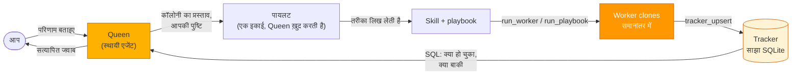
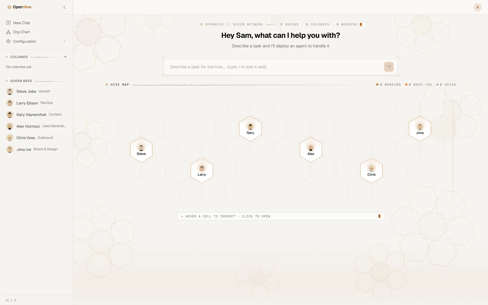
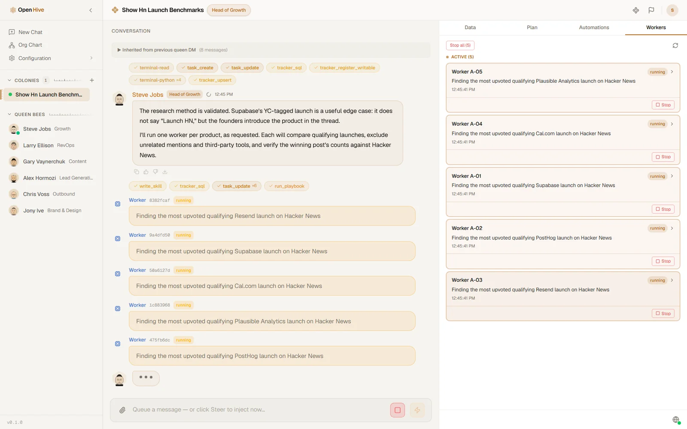
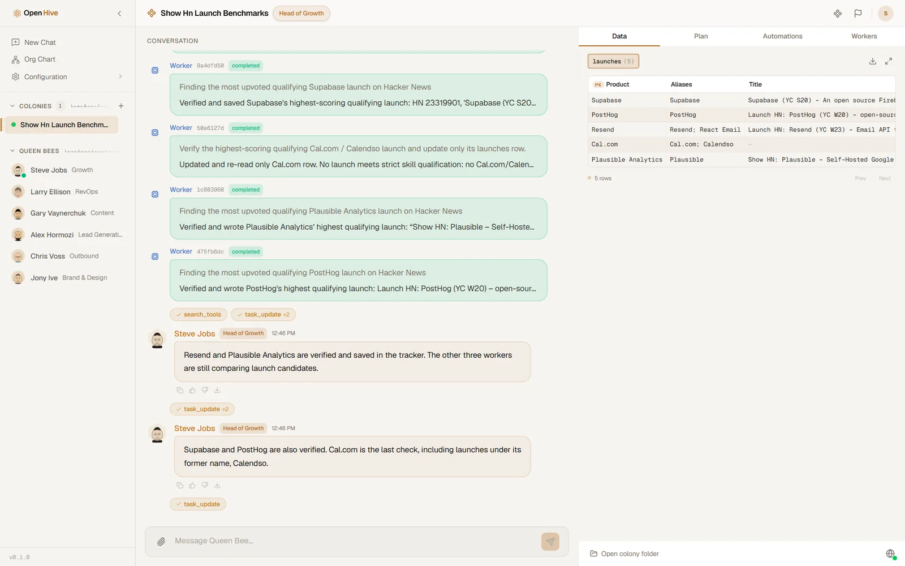
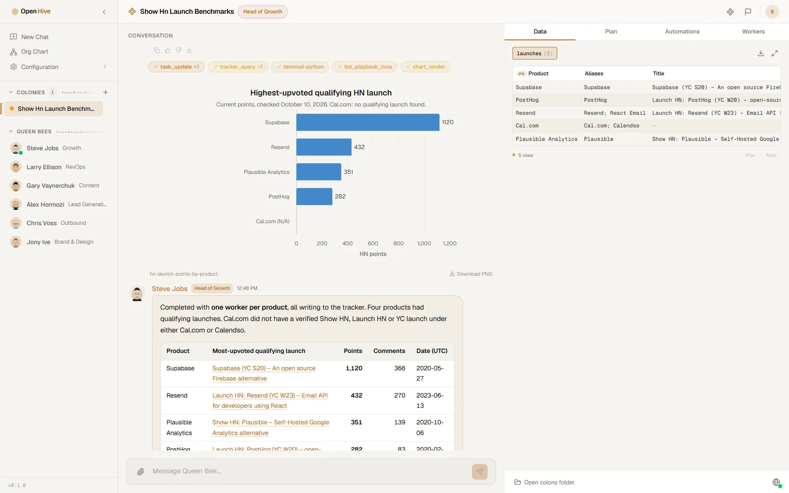

<p align="center">
  
</p>

<p align="center">
  <a href="../../README.md">English</a> |
  <a href="zh-CN.md">简体中文</a> |
  <a href="es.md">Español</a> |
  <a href="hi.md">हिन्दी</a> |
  <a href="pt.md">Português</a> |
  <a href="ja.md">日本語</a> |
  <a href="ru.md">Русский</a> |
  <a href="ko.md">한국어</a>
</p>

<p align="center">
  <a href="https://github.com/aden-hive/hive/blob/main/LICENSE"></a>
  <a href="https://www.ycombinator.com/companies/aden"></a>
  <a href="https://discord.com/invite/MXE49hrKDk"></a>
  <a href="https://x.com/aden_hq"></a>
  <a href="https://www.linkedin.com/company/teamaden/"></a>
</p>

<h3 align="center">AI एजेंट्स की कॉलोनियाँ, जो आपकी व्यावसायिक प्रक्रियाएँ चलाती हैं।</h3>

<p align="center">
  आप बस परिणाम बताइए। एक Queen काम का पहला हिस्सा ख़ुद करती है, फिर बाकी काम समानांतर में पूरा करने के लिए worker एजेंट्स की एक कॉलोनी विकसित करती है। हर नतीजा एक साझा लेजर में दर्ज होता है, जिस पर आप query चला सकते हैं, जहाँ से काम फिर शुरू कर सकते हैं और जिसका ऑडिट कर सकते हैं।
</p>

<p align="center">
  <a href="../assets/readme/demo.mp4"></a>
  <br />
  <sub>एक असली रन की रिकॉर्डिंग; सिर्फ़ इंतज़ार वाला हिस्सा तेज़ किया गया है। <a href="../assets/readme/demo.mp4">पूरी क्वालिटी में देखें (MP4)</a>।</sub>
</p>

## आपने अभी क्या देखा

Show HN की तैयारी कर रही एक ग्रोथ टीम जानना चाहती है कि पाँच डेवलपर टूल्स के अपने लॉन्च Hacker News पर कैसे रहे। उस एक मैसेज पर Hive ने यह किया:

1. **आप यह काम एक Queen को सौंपते हैं।** हर Queen एक स्थायी एजेंट है, जिसकी एक भूमिका होती है (यहाँ Head of Growth) और साथ में उसकी अपनी मेमोरी और टूल्स।
2. **वह वही एक सवाल पूछती है जिससे जवाब बदल जाता है:** सिर्फ़ पहले लॉन्च, या कोई भी लॉन्च? आप एक विकल्प चुनते हैं और वह आगे बढ़ जाती है।
3. **वह एक कॉलोनी का प्रस्ताव रखती है, और आप पुष्टि करते हैं।** पाँच प्रोडक्ट यानी पाँच समानांतर काम, इसलिए चैट एक कॉलोनी बन जाती है: Queen और उतने worker एजेंट जितने इस काम को चाहिए।
4. **काम की एक इकाई वह ख़ुद करती है।** वह Supabase को लेती है, जो सबसे पेचीदा मामला है (उसके सबसे बड़े लॉन्च थ्रेड के शीर्षक में "Launch HN" है ही नहीं), तय करती है कि किसे लॉन्च माना जाए, और उस तरीके को दोबारा इस्तेमाल होने वाली एक skill के रूप में लिख लेती है।
5. **वह इसे एक playbook के रूप में चलाती है:** हर प्रोडक्ट के लिए एक worker, सब समानांतर में; हर worker उसकी skill का पालन करता है और अपनी पंक्ति कॉलोनी के tracker में लिखता है, जो एक साझा SQLite टेबल है।
6. **जवाब देने से पहले वह हर पंक्ति जाँचती है।** एज केस छिपते नहीं: Cal.com के दोनों में से किसी भी नाम से कोई योग्य लॉन्च नहीं मिला, इसलिए चार्ट में उसे शून्य नहीं, बल्कि अनुपलब्ध दिखाया गया है।

इस फ़्लो में कुछ भी पहले से वायर नहीं किया गया था। कोई वर्कफ़्लो ग्राफ़ डिज़ाइन नहीं करना पड़ता: Queen रनटाइम पर कॉलोनी विकसित करती है, और क्या हो चुका है और क्या बाकी है, यह किसी की याददाश्त नहीं, बल्कि डिस्क पर मौजूद tracker दर्ज करता है।

## त्वरित शुरुआत

**आपको चाहिए:** Python 3.11+, Node.js 20+ और git। अगर `uv` और `ripgrep` मौजूद नहीं हैं तो क्विकस्टार्ट उन्हें इंस्टॉल कर देता है, और Node इंस्टॉल करने का विकल्प भी देता है।

**और एक मॉडल।** क्विकस्टार्ट इनमें से किसी को भी सेट अप करने में आपकी मदद करता है:

- एक API key: Anthropic, OpenAI, Google Gemini, Groq, Cerebras या OpenRouter
- आपका मौजूदा कोडिंग सब्सक्रिप्शन: Claude Code, OpenAI Codex, Kimi Code, MiniMax, Z.AI या Antigravity
- Hive LLM
- Ollama के ज़रिए एक लोकल मॉडल, बिना किसी key के

```bash
git clone https://github.com/aden-hive/hive.git
cd hive
./quickstart.sh          # macOS / Linux
.\quickstart.ps1         # Windows (PowerShell 5.1+)
```

क्विकस्टार्ट पूरे वर्कस्पेस के लिए एक Python एनवायरनमेंट बनाता है, आपकी API key को `~/.hive` के अंदर एक एन्क्रिप्टेड credential store में रखता है, पूछता है कि कौन-सा मॉडल इस्तेमाल करना है, डैशबोर्ड बिल्ड करता है और उसे `http://127.0.0.1:8787` पर खोल देता है। बाद में इसे दोबारा खोलने के लिए रिपॉज़िटरी से `hive open` चलाएँ।

> [!NOTE]
> Hive एक `uv` वर्कस्पेस है, pip पैकेज नहीं। `pip install -e .` सिर्फ़ एक प्लेसहोल्डर इंस्टॉल करता है जो चलेगा नहीं; क्विकस्टार्ट का ही इस्तेमाल करें।

**इसके बाद:** होम स्क्रीन पर कोई टास्क टाइप करें और चुनें कि उसे किस Queen को सौंपना है, या **Prompt Library** खोलें और कोई तैयार प्रॉम्प्ट सीधे उसी Queen को डिप्लॉय करें जिसके लिए वह लिखा गया है।

## यह कैसे काम करता है



Hive में **एक ही एक्ज़ीक्यूशन प्रिमिटिव** है: एजेंट लूप। Queen भी एक एजेंट लूप है; हर worker उसका एक clone है, जिसका अपना टास्क, सीमित टूल सेट और सख़्त बजट होता है। ऑर्केस्ट्रेशन एक टूल कॉल है, कंपाइल किया हुआ ग्राफ़ नहीं:

- **`run_worker`** टास्क्स को workers में बाँटकर तुरंत लौट आता है, ताकि workers के चलते समय भी Queen आपसे बात करती रहे। डिफ़ॉल्ट रूप से एक साथ अधिकतम चार workers चलते हैं; बाकी कतार में रहते हैं। काम पूरा करने वाले हर worker की रिपोर्ट Queen की बातचीत में एक नए टर्न के रूप में आती है।
- **Tracker** कॉलोनी की साझा स्टेट है। Queen टेबल तय करती है और यह भी कि workers किन कॉलम में लिख सकते हैं; workers काम की हर इकाई के लिए एक पंक्ति upsert करते हैं; Queen SQL से प्रगति जाँचती है। यह डिस्क पर `~/.hive/colonies/<name>/tracker/tracker.db` में रहता है।
- **`run_playbook`** एक परखा हुआ प्रोटोकॉल हर पंक्ति पर चलाता है: backoff के साथ retries, rate-limited lanes, और बार-बार फ़ेल होने वाली पंक्तियों के लिए एक dead-letter सूची। चूँकि "क्या बाकी है" हमेशा tracker पर एक ताज़ा query होती है, इसलिए playbook को दोबारा चलाने पर वह वहीं से आगे बढ़ता है।

**[आर्किटेक्चर का अवलोकन](../architecture/README.md)** लूप, टूल सरफेस, मेमोरी, मानवीय निगरानी और क्रैश के बाद स्टेट कैसे बची रहती है, इन सबको समझाता है।

<table>
  <tr>
    <td width="50%"><br /><sub><b>होम।</b> आपकी Queens और उनकी कॉलोनियाँ, एक ही मैप पर। टास्क बताइए और चुनिए कि उसे कौन लेगा।</sub></td>
    <td width="50%"><br /><sub><b>Workers।</b> काम की हर इकाई के लिए एक, हर एक का अपना टास्क और बजट, और सभी Queen को रिपोर्ट करते हैं।</sub></td>
  </tr>
  <tr>
    <td width="50%"><br /><sub><b>Tracker।</b> जैसे-जैसे workers काम पूरा करते हैं, नतीजे एक साझा टेबल में आते जाते हैं, जिन पर आप query चला सकते हैं, उन्हें export कर सकते हैं या वहीं से काम फिर शुरू कर सकते हैं।</sub></td>
    <td width="50%"><br /><sub><b>नतीजा।</b> चैट में ही स्रोतों और चार्ट के साथ एक सत्यापित जवाब।</sub></td>
  </tr>
</table>

## इसमें क्या है

**ज़िम्मेदारी और मेमोरी वाली Queens।** Hive के साथ तेरह persona Queens आती हैं: छह डिफ़ॉल्ट रूप से सक्रिय हैं (Growth, RevOps, Content, Lead Generation, Outbound, Brand & Design), बाकी को Org Chart से नियुक्त किया जा सकता है, और आप अपनी Queens भी बना सकते हैं। हर Queen की अपनी स्कोप्ड markdown मेमोरी होती है, जिसे एक reflection चरण लिखता है, और पिछली प्रासंगिक बातचीत अपने-आप उसके context में आ जाती है।

**बिल्ट-इन टूल्स, उसी प्रोसेस में।** Shell कमांड और बैकग्राउंड जॉब्स, फ़ाइल एडिटिंग, तेज़ कोड सर्च, PDF, अटैचमेंट और इमेज, वेब स्क्रैपिंग, चार्ट (ECharts और Mermaid), CSV फ़ाइलें, और Hive LLM से इमेज जनरेशन। ये Hive के अंदर ही चलते हैं, कोई टूल सर्वर शुरू करने की ज़रूरत नहीं।

**आपका ब्राउज़र, आपके एजेंट्स के हाथ में।** Hive Browser Bridge एक्सटेंशन की मदद से एजेंट्स आपका अपना Chrome चला सकते हैं, जहाँ आप पहले से लॉग इन हैं। हर worker को अपना अलग टैब ग्रुप मिलता है।

**Skills।** खुले [Agent Skills](https://agentskills.io) फ़ॉर्मेट में दोबारा इस्तेमाल होने वाले निर्देश। Hive के साथ कुछ skills पहले से आती हैं, कोई प्रोटोकॉल कारगर साबित होने पर Queens नई skills लिखती हैं, और आप इन्हें Skills Library में मैनेज कर सकते हैं।

**कोई भी MCP server।** `hive mcp add` से कोई बाहरी MCP server जोड़ें, और उसके टूल्स उन्हीं allowlists में शामिल हो जाते हैं जिनमें बिल्ट-इन टूल्स हैं। [`tools/`](../../tools/src/aden_tools/tools) में मौजूद पूरा इंटीग्रेशन कैटलॉग (GitHub, Gmail, HubSpot, Slack, Notion और बहुत कुछ) भी एक MCP server के रूप में चलता है; देखें [docs/tools.md](../tools.md)।

**आपकी ग़ैरमौजूदगी में भी चलता है।** कॉलोनियाँ cron, interval या webhook ट्रिगर्स से ख़ुद को शेड्यूल कर सकती हैं। **Sentinel**, जिसे हर कॉलोनी के लिए अलग से चालू करना होता है, Queen के रुकने पर उस पर नज़र रखता है: वह उसे आगे बढ़ने का इशारा करता है, या Hive inbox, Telegram या Slack के ज़रिए मामला आप तक पहुँचाता है, और आपके जवाब देते ही Queen फिर से काम शुरू कर देती है।

**टिके रहने के लिए बना।** हर एजेंट अपनी स्टेट डिस्क पर सहेजता है और क्रैश या रीस्टार्ट के बाद ठीक वहीं से शुरू होता है जहाँ रुका था। बड़े टूल नतीजे context को भरने के बजाय फ़ाइलों में चले जाते हैं, लंबे सेशन अपने-आप compact हो जाते हैं, अटके हुए या लूप में फँसे टर्न पकड़ लिए जाते हैं, और हर worker एक सख़्त tool-call बजट के भीतर चलता है।

**कोई भी मॉडल।** [LiteLLM](https://docs.litellm.ai/docs/providers) जो कुछ भी सपोर्ट करता है, जिसमें OpenAI, Anthropic, Gemini, OpenRouter, Hive LLM, कोई भी OpenAI-compatible endpoint और Ollama के ज़रिए लोकल मॉडल शामिल हैं। Workers अपनी Queen से अलग मॉडल इस्तेमाल कर सकते हैं, और सिर्फ़ टेक्स्ट वाले मॉडल भी vision fallback के ज़रिए इमेज देख पाते हैं।

## क्या Hive आपके लिए है?

Hive तब काम आता है जब मुश्किल हिस्सा मॉडल नहीं, बल्कि उसके इर्द-गिर्द का सब कुछ हो:

- ऐसी प्रक्रिया जिसमें **काम की कई मिलती-जुलती इकाइयाँ** हों, जैसे लीड्स, अकाउंट्स, टिकट्स, रिपॉज़िटरी या दस्तावेज़, और आप चाहते हों कि वे समानांतर में और एक ही तरीके से पूरी हों।
- ऐसा काम जो **घंटों तक या किसी शेड्यूल पर चलता है** और जिसे रीस्टार्ट के बाद भी जारी रहना है।
- ऐसे नतीजे जिन्हें आपको सिर्फ़ चैट में पढ़ना नहीं, बल्कि **जाँचना, query करना और ऑडिट करना** है।
- अहम फ़ैसलों पर **इंसान का नियंत्रण** बना रहे।

एक अकेले प्रॉम्प्ट या एकबारगी स्क्रिप्ट के लिए साधारण एजेंट ज़्यादा आसान है।

## दस्तावेज़ीकरण

- [शुरुआत करें](../getting-started.md): सेटअप का विस्तृत विवरण
- [आर्किटेक्चर का अवलोकन](../architecture/README.md): कॉलोनियाँ, लूप, टूल्स और मेमोरी आपस में कैसे जुड़ते हैं
- मुख्य अवधारणाएँ: [कॉलोनी](../key_concepts/colony.md), [Queen](../key_concepts/queen.md), [workers](../key_concepts/worker_agent.md), [समन्वय](../key_concepts/coordination.md), [लूप](../key_concepts/the_loop.md), [लक्ष्य और परिणाम](../key_concepts/goals_outcome.md), [कॉलोनियाँ कैसे बेहतर होती हैं](../key_concepts/improvement.md)
- [टूल्स](../tools.md): बिल्ट-इन टूल्स, MCP servers और इंटीग्रेशन कैटलॉग
- [कॉन्फ़िगरेशन](../configuration.md) और [डेवलपर गाइड](../developer-guide.md)
- [रोडमैप](../roadmap.md): V1 में क्या शामिल है और क्या अभी बाकी है
- [docs.adenhq.com](https://docs.adenhq.com/): ऑनलाइन दस्तावेज़ीकरण

## अक्सर पूछे जाने वाले प्रश्न (FAQ)

**Hive कौन-से मॉडल सपोर्ट करता है?**
[LiteLLM](https://docs.litellm.ai/docs/providers) द्वारा सपोर्ट किया जाने वाला कोई भी प्रदाता, और साथ में कोई भी OpenAI-compatible endpoint। क्विकस्टार्ट आम विकल्पों को सेट अप करता है, जिनमें Claude Code और OpenAI Codex जैसे कोडिंग सब्सक्रिप्शन भी शामिल हैं; बाकी के लिए [docs/configuration.md](../configuration.md) देखें।

**क्या मैं इसे लोकल मॉडल्स के साथ चला सकता हूँ?**
हाँ। क्विकस्टार्ट में Ollama चुनें, या Ollama को लोकली चलाते हुए `ollama/llama3` जैसा कोई मॉडल सेट करें।

**यह दूसरे एजेंट फ़्रेमवर्क्स से कैसे अलग है?**
ज़्यादातर फ़्रेमवर्क्स में आपको एजेंट्स का एक ग्राफ़ डिज़ाइन करना पड़ता है और उनके इनपुट-आउटपुट आपस में वायर करने पड़ते हैं। Hive में एजेंट का एक ही प्रकार है: Queen एक एजेंट लूप है और हर worker उसका clone है। ऑर्केस्ट्रेशन रनटाइम पर टूल कॉल्स के ज़रिए होता है, और समन्वय edges के रास्ते भेजे गए मैसेजों के बजाय एक साझा SQL tracker के ज़रिए होता है। हार्नेस की सुविधाएँ (परसिस्टेंस, रिज़्यूम, बजट, कम्पैक्शन, निगरानी) उसी एक लूप में हैं, इसलिए हर एजेंट को ये अपने-आप मिलती हैं।

**मेरा डेटा कहाँ रहता है?**
आपकी अपनी मशीन पर। सेशन, कॉलोनियाँ, trackers और मेमोरी `~/.hive` (या जहाँ भी `HIVE_HOME` पॉइंट करता हो) के अंदर सामान्य फ़ाइलों के रूप में रहते हैं, और API keys वहीं एन्क्रिप्ट करके रखी जाती हैं।

**लागत को काबू में कैसे रखूँ?**
हर worker टर्न्स और टूल कॉल्स की सख़्त सीमाओं के भीतर चलता है, इसलिए अटका हुआ worker अपने-आप रुक जाता है, और एक साथ चलने वाले workers की संख्या भी सीमित है। हर मॉडल कॉल पर उपयोग मापा जाता है। डॉलर में खर्च की सीमा तय करने की सुविधा अभी नहीं है।

**क्या एजेंट्स मेरे अपने टूल्स और APIs इस्तेमाल कर सकते हैं?**
हाँ: बिल्ट-इन shell और ब्राउज़र के ज़रिए, आपके जोड़े गए किसी भी MCP server के ज़रिए, और उन skills के ज़रिए जो उन्हें आपकी प्रक्रियाएँ सिखाती हैं।

**क्या Hive ओपन-सोर्स है?**
हाँ, [Apache License 2.0](../../LICENSE) के तहत।

## योगदान करें

योगदान का स्वागत है, ख़ासकर टूल्स, इंटीग्रेशन्स और skills ([#2805](https://github.com/aden-hive/hive/issues/2805))। पहले [CONTRIBUTING.md](../../CONTRIBUTING.md) पढ़ें, और pull request खोलने से पहले किसी issue पर ख़ुद को असाइन करवाएँ: issue पर कमेंट करें और कोई मेंटेनर आपको असाइन कर देगा। जिन issues में रिप्रोडक्शन स्टेप्स या कोई प्रस्ताव हो, उन्हें प्राथमिकता दी जाती है।

## समुदाय

- [Discord](https://discord.com/invite/MXE49hrKDk) पर सवाल पूछें, फ़ीचर अनुरोध भेजें और चर्चा करें
- [X / Twitter](https://x.com/aden_hq) और [LinkedIn](https://www.linkedin.com/company/teamaden/) पर अपडेट्स पाएँ
- [HoneyComb](http://honeycomb.open-hive.com/): एक कम्युनिटी मार्केट, जो ट्रैक करता है कि AI एजेंट्स कौन-से जॉब्स ऑटोमेट कर रहे हैं। किसी जॉब पर लॉन्ग या शॉर्ट जाएँ, पैसे से नहीं बल्कि compute tokens से।

इंजीनियरिंग, रिसर्च और गो-टू-मार्केट में **हम भर्ती कर रहे हैं**। [खुले पद देखें](https://jobs.adenhq.com/a8cec478-cdbc-473c-bbd4-f4b7027ec193/applicant)।

## सुरक्षा

किसी सुरक्षा कमज़ोरी की रिपोर्ट करने के लिए [SECURITY.md](../../SECURITY.md) देखें।

## लाइसेंस

Apache License 2.0। विवरण के लिए [LICENSE](../../LICENSE) देखें।

## स्टार इतिहास

<a href="https://www.star-history.com/?type=date&repos=aden-hive%2Fhive">
 <picture>
   <source media="(prefers-color-scheme: dark)" srcset="https://api.star-history.com/chart?repos=aden-hive/hive&type=date&theme=dark&legend=top-left&sealed_token=vfX1DG8w_KTkonUUtIEjFRLvBopgDzxQpyb8hiYT22sobcDIpvQiMciZghLsDu5hyU3LJs-ZddFjl8eYFx5zRrY-kcMRsfyQ3vAiacsroPoqgRYmZaES3Q" />
   <source media="(prefers-color-scheme: light)" srcset="https://api.star-history.com/chart?repos=aden-hive/hive&type=date&legend=top-left&sealed_token=vfX1DG8w_KTkonUUtIEjFRLvBopgDzxQpyb8hiYT22sobcDIpvQiMciZghLsDu5hyU3LJs-ZddFjl8eYFx5zRrY-kcMRsfyQ3vAiacsroPoqgRYmZaES3Q" />
   
 </picture>
</a>

---

<p align="center">सैन फ्रांसिस्को में 🔥 जुनून के साथ बनाया गया</p>
