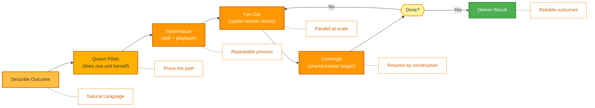

<p align="center">
  
</p>

<p align="center">
  <a href="../../README.md">English</a> |
  <a href="zh-CN.md">简体中文</a> |
  <a href="es.md">Español</a> |
  <a href="hi.md">हिन्दी</a> |
  <a href="pt.md">Português</a> |
  <a href="ja.md">日本語</a> |
  <a href="ru.md">Русский</a> |
  <a href="ko.md">한국어</a> |
  <a href="id.md">Bahasa Indonesia</a>
</p>

<p align="center">
  <a href="https://github.com/aden-hive/hive/blob/main/LICENSE"></a>
  <a href="https://www.ycombinator.com/companies/aden"></a>
  <a href="https://discord.com/invite/MXE49hrKDk"></a>
  <a href="https://x.com/aden_hq"></a>
  <a href="https://www.linkedin.com/company/teamaden/"></a>
  
</p>

<p align="center">
  
  
  
  
  
  
</p>
<p align="center">
  
  
  
</p>

<p align="center"><em>The agent harness for production workloads — state management, failure recovery, observability, and human oversight so your agents actually run.</em></p>

## 概要

OpenHive は、**エージェントのコロニー（colony）**のためのゼロセットアップかつモデル非依存のランタイムです。コロニーとは、1 つのビジネスプロセスを実行するために協働する専門エージェントのグループであり、**Queen（クイーン）**—永続的でクライアントと対話する司令塔—と、ジョブが必要とするだけの数の **worker（ワーカー）** エージェントで構成されます。あなたは成果（アウトカム）を記述するだけで、Queen がまず自ら作業を行い、その作業を確実かつ大規模に実行するために、その周りにコロニーを成長させます。

その根底にある仕組みは、**1 つのループが多数のループを制御する**というものです。Hive には単一の実行プリミティブしかありません。Queen は文字どおりエージェントループそのものであり、すべての worker はその **clone（クローン）**—同じツール、同じモデル、そして独自のタスクを持つ—です。コンパイルすべきグラフも、記述すべきオーケストレーションの定型コードもありません。コロニーは共有台帳と永続的なプランを通じて連携し、クラッシュセーフな状態管理、深い可観測性、そして人間による監督が、すべてのエージェントが共有するこの唯一のプリミティブに組み込まれています。仕組みの詳細については、**[アーキテクチャ概要](../architecture/README.md)** をご覧ください。

## 機能

- ✅ エージェントのコロニー — Queen が必要に応じて worker クローンを生成し、並列かつ長時間実行の作業を行う
- ✅ 1 つのプリミティブ、多数のループ — 配線すべきグラフはなく、Queen が実行時にコロニーを成長させる
- ✅ 共有トラッカー（tracker）台帳 + 永続的なタスクプランにより、データバッファなしで連携
- ✅ CEO スタイルのルーティングと、進化するスコープ付きメモリを備えた Queen ペルソナ
- ✅ クラッシュセーフな一時停止／再開（park/resume）、コスト制御、帯域外のヒューマンインザループ（Sentinel）
- ✅ ゼロセットアップ — 技術的な設定は不要
- ✅ ネイティブ拡張機能による汎用コンピュータ操作（General Compute Use）とブラウザ操作（Browser Use）
- ✅ カスタムモデルのサポート

完全なドキュメント、例、ガイドについては [adenhq.com](https://adenhq.com) をご覧ください。

どのような仕事が AI によって自動化されつつあるかを見るには、[HoneyComb](http://honeycomb.open-hive.com/) をご覧ください。これは、私たちのコミュニティの AI エージェントの進歩によって動く、仕事のための株式市場です。ある仕事がどれだけ AI に置き換えられると考えるかに基づいて、（実際の資金ではなくコンピュートトークンで）仕事をロング・ショートできます。

https://github.com/user-attachments/assets/bf10edc3-06ba-48b6-98ba-d069b15fb69d


## Hive は誰のためのものか？

Hive は、AI エージェントをプロトタイプから本番環境へと移行させるチームのためのマルチエージェントハーネス層です。Openclaw や Cowork のような単一エージェントは個人的なジョブをかなりうまくこなせますが、ビジネスプロセスを遂行するための厳密さに欠けています。

Hive が適しているのは、次のような場合です：

- デモではなく、**実際のビジネスプロセスを実行する** AI エージェントが欲しい
- 大規模に**状態、リカバリ、並列実行を処理するランタイム**が必要
- 時間とともに改善される**自己修復・適応型エージェント**が必要
- **ヒューマンインザループ制御**、可観測性、コスト制限が必要
- 稼働時間、コスト、監査可能性が重要となる**本番環境**でエージェントを実行する予定がある

シンプルなエージェントチェーンや単発のスクリプトを試すだけであれば、Hive は最適ではないかもしれません。

## いつ Hive を使うべきか？

ボトルネックがもはやモデルではなく、その周りのハーネスになったときに Hive を使用してください：

- **状態の永続化とクラッシュリカバリ**を必要とする長時間実行エージェント
- **コスト制御、可観測性、監査証跡**を必要とする本番ワークロード
- リフレクション、スコープ付きメモリ、習得したスキルを通じて**時間とともに改善する**エージェント
- **共有トラッカー台帳と永続的なプラン**を通じて連携される、並列マルチエージェント作業
- モデルの改善に抗うのではなく、それと**ともにスケールする**フレームワーク

## クイックリンク

- **[ドキュメント](https://docs.adenhq.com/)** - 完全なガイドと API リファレンス
- **[セルフホスティングガイド](https://docs.adenhq.com/getting-started/quickstart)** - 自分のインフラに Hive をデプロイ
- **[変更履歴](https://github.com/aden-hive/hive/releases)** - 最新の更新とリリース
- **[ロードマップ](../roadmap.md)** - 今後の機能と計画
- **[問題を報告](https://github.com/aden-hive/hive/issues)** - バグレポートと機能リクエスト
- **[貢献](../../CONTRIBUTING.md)** - 貢献方法と PR の提出方法

## クイックスタート

### 前提条件

- Python 3.11+ — エージェント開発用
- エージェントを動かす LLM プロバイダー
- **ripgrep（オプション、Windows では推奨）：** `terminal_rg` / `terminal_glob` 検索ツールは、より高速なファイル検索のために ripgrep を使用します。インストールされていない場合は、Python のフォールバックが使用されます。Windows の場合：`winget install BurntSushi.ripgrep` または `scoop install ripgrep`

> **Windows ユーザーへ：** ネイティブ Windows は `quickstart.ps1` および `hive.ps1` を介してサポートされています。これらは PowerShell 5.1+ で実行してください。WSL も選択肢の 1 つですが、必須ではありません。

### インストール

> **注意**
> Hive は `uv` ワークスペースレイアウトを使用しており、`pip install` ではインストールされません。
> リポジトリのルートから `pip install -e .` を実行すると、プレースホルダーパッケージが作成され、Hive は正しく動作しません。
> 環境をセットアップするには、以下のクイックスタートスクリプトをご使用ください。

```bash
# Clone the repository
git clone https://github.com/aden-hive/hive.git
cd hive

# Run quickstart setup (macOS/Linux)
./quickstart.sh

# Windows (PowerShell)
.\quickstart.ps1
```

これにより以下がセットアップされます：

- **framework** - コアエージェントランタイムとグラフエグゼキュータ（`core/.venv` 内）
- **aden_tools** - エージェント機能のための MCP ツール（`tools/.venv` 内）
- **credential store** - 暗号化された API キーストレージ（`~/.hive/credentials`）
- **LLM provider** - Hive LLM や OpenRouter を含む、インタラクティブなデフォルトモデル設定
- `uv` による必要な Python 依存関係すべて

- 最後に、ブラウザで Hive インターフェースが起動します

> **ヒント：** 後でダッシュボードを再度開くには、プロジェクトディレクトリから `hive open` を実行してください。

### 最初のエージェントを構築

ホームの入力ボックスに、構築したいエージェントを入力してください。Queen があなたに質問し、一緒に解決策を練り上げます。


### テンプレートエージェントを使用

「Try a sample agent」をクリックしてテンプレートを確認してください。テンプレートを直接実行することも、既存のテンプレートをベースに独自のバージョンを構築することもできます。

### エージェントの実行

これで、エージェント（既存のエージェントまたはサンプルエージェント）を選択して実行できます。左上の Run ボタンをクリックするか、Queen エージェントに話しかけてエージェントを実行してもらうことができます。


## 統合

<a href="https://github.com/aden-hive/hive/tree/main/tools/src/aden_tools/tools"></a>
Hive はモデル非依存かつシステム非依存に設計されています。

- **LLM の柔軟性** - Hive フレームワークは、LiteLLM 互換プロバイダーを通じて、Anthropic、OpenAI、OpenRouter、Hive LLM、およびその他のホスト型またはローカルモデルをサポートします。
- **ビジネスシステム接続性** - Hive フレームワークは、CRM、サポート、メッセージング、データ、ファイル、内部 API など、あらゆる種類のビジネスシステムに MCP を介してツールとして接続するように設計されています。

## なぜ Hive か

モデルが改善するにつれて、エージェントにできることの上限は上がります—しかし、その信頼性と本番環境での価値はハーネスによって決まります。Hive は、汎用的なエージェントではなく、実際のビジネスプロセスを実行することに焦点を当てています。ワークフローグラフを手作業で配線し、すべてのエージェントの相互作用を定義し、障害を事後的に処理させる代わりに、Hive はパラダイムを逆転させます：**あなたが成果を記述すると、Queen がまず自ら作業を行い、それをスケールさせるためにコロニーを成長させます**—使いやすいツールと統合のセットを備えた、成果駆動型で適応的な体験です。



### 仕組み

1. **[成果を記述](../key_concepts/goals_outcome.md)** → 望むことを平易な言葉で伝えると、CEO スタイルのルーターが適切な [Queen](../key_concepts/queen.md) を選びます
2. **Queen が先導** → Queen が自ら 1 単位の作業を行い、その道筋を実証して共有トラッカーに記録します
3. **[体系化](../key_concepts/improvement.md)** → 実証済みのプロトコルをスキル + プレイブック（再現可能なプロセス）へと落とし込みます
4. **[ファンアウト](../key_concepts/colony.md)** → `run_worker` が [worker クローン](../key_concepts/worker_agent.md) を生成し、それらが並列で実行して結果を報告します
5. **収束と監視** → worker が結果をトラッカーに書き込み、Queen が SQL で検証します。リアルタイムメトリクス、予算の執行、クラッシュセーフな再開を伴います

## ドキュメント

- **[開発者ガイド](../developer-guide.md)** - 開発者向けの総合ガイド
- [はじめに](../getting-started.md) - クイックセットアップ手順
- [設定ガイド](../configuration.md) - すべての設定オプション
- [アーキテクチャ概要](../architecture/README.md) - システム設計と構造

## 貢献
コミュニティからの貢献を歓迎します！特に、フレームワークのツール、統合、サンプルエージェントの構築にご協力いただける方を募集しています（[#2805 を確認](https://github.com/aden-hive/hive/issues/2805)）。機能拡張に興味がある方にとって、ここは最適な出発点です。ガイドラインについては [CONTRIBUTING.md](../../CONTRIBUTING.md) をご覧ください。

**重要：** PR を提出する前に、まず Issue にアサインされてください。Issue にコメントして担当を申請すると、メンテナーがアサインします。再現手順と提案を含む Issue が優先されます。これにより重複作業を防ぐことができます。

1. Issue を見つけるか作成し、アサインを受ける
2. リポジトリをフォーク
3. 機能ブランチを作成（`git checkout -b feature/amazing-feature`）
4. 変更をコミット（`git commit -m 'Add amazing feature'`）
5. ブランチにプッシュ（`git push origin feature/amazing-feature`）
6. プルリクエストを開く

## コミュニティとサポート

サポート、機能リクエスト、コミュニティディスカッションには [Discord](https://discord.com/invite/MXE49hrKDk) を使用しています。

- Discord - [コミュニティに参加](https://discord.com/invite/MXE49hrKDk)
- Twitter/X - [@adenhq](https://x.com/aden_hq)
- LinkedIn - [会社ページ](https://www.linkedin.com/company/teamaden/)

## チームに参加

**採用中です！** エンジニアリング、リサーチ、市場開拓（go-to-market）の役職で私たちに参加してください。

[オープンポジションを見る](https://jobs.adenhq.com/a8cec478-cdbc-473c-bbd4-f4b7027ec193/applicant)

## セキュリティ

セキュリティに関する懸念については、[SECURITY.md](../../SECURITY.md) をご覧ください。

## ライセンス

このプロジェクトは Apache License 2.0 の下でライセンスされています - 詳細は [LICENSE](../../LICENSE) ファイルをご覧ください。

## よくある質問 (FAQ)

**Q: Hive はどの LLM プロバイダーをサポートしていますか？**

Hive は LiteLLM 統合を通じて 100 以上の LLM プロバイダーをサポートしており、OpenAI（GPT-4、GPT-4o）、Anthropic（Claude モデル）、Google Gemini、DeepSeek、Mistral、Groq、OpenRouter、Hive LLM が含まれます。適切な API キー環境変数を設定し、モデル名を指定するだけです。プロバイダー固有の設定例については [docs/configuration.md](../configuration.md) をご覧ください。

**Q: Ollama のようなローカル AI モデルで Hive を使用できますか？**

はい！Hive は LiteLLM を通じてローカルモデルをサポートしています。モデル名の形式 `ollama/model-name`（例：`ollama/llama3`、`ollama/mistral`）を使用し、Ollama がローカルで実行されていることを確認してください。

**Q: Hive は他のエージェントフレームワークと何が違いますか？**

Hive は、単一エージェントや手作業で配線したエージェントグラフではなく、**エージェントのコロニー**を実行します。ほとんどのフレームワークでは、個別のノードとエッジからなるグラフをコンパイルさせられますが、Hive には実行プリミティブが 1 つしかありません—Queen は文字どおりエージェントループそのものであり、すべての worker はその [clone](../key_concepts/the_loop.md) です。オーケストレーションはコンパイルされた DAG ではなく、実行時の `run_worker` によるファンアウトであり、コロニーはデータバッファではなく [共有トラッカー台帳](../key_concepts/coordination.md) を通じて連携します。この「1 つのループ、多数のループ」というコアの上に、Hive は本番向けハーネス—クラッシュセーフな一時停止／再開、コスト制御、リアルタイム可観測性、帯域外のヒューマンインザループ—を提供します。エージェントの種類が 1 つしかないため、これらはすべてのエージェントに継承されます。[アーキテクチャ概要](../architecture/README.md) をご覧ください。

**Q: Hive はオープンソースですか？**

はい、Hive は Apache License 2.0 の下で完全にオープンソースです。コミュニティの貢献とコラボレーションを積極的に奨励しています。

**Q: Hive はヒューマンインザループワークフローをサポートしていますか？**

はい。Queen は、アカウントに紐づいた Slack/Telegram チャネルである **Sentinel** を通じて、帯域外で人間へエスカレーションします。エージェントループは一時停止し（状態をディスクに永続化し）、人間に通知し、返信があると中断したまさにその地点から再開します。エスカレーションはグラフ内のノードではないため、コロニー内のどのエージェントも、設定可能なタイムアウトとエスカレーションポリシーとともに、いつでも人間の判断を仰ぐために停止できます。[アーキテクチャ概要](../architecture/README.md#reliability-is-in-the-primitive) をご覧ください。

**Q: Hive はどのプログラミング言語をサポートしていますか？**

Hive フレームワークは Python で構築されています。JavaScript/TypeScript SDK はロードマップに含まれています。

**Q: Hive エージェントは外部ツールや API と連携できますか？**

はい。コロニー内のすべてのエージェントは組み込みのツールアクセスを持ち、Hive は MCP を通じて外部 API、データベース、サービスに接続します—100 以上の統合ツールに加え、ネイティブ拡張機能による汎用コンピュータ操作（General Compute Use）とブラウザ操作（Browser Use）を含みます。Queen とその worker は 1 つのツール面を共有するため、あなたが追加した機能はコロニー全体で利用可能になります。

**Q: Hive のコスト制御はどのように機能しますか？**

Hive は、支出制限、スロットル、自動的なモデル劣化ポリシーを含む、きめ細かな予算制御を提供します。チーム、エージェント、またはワークフローのレベルで予算を設定でき、リアルタイムのコスト追跡とアラートが利用できます。

**Q: 例やドキュメントはどこにありますか？**

完全なガイド、API リファレンス、入門チュートリアルについては [docs.adenhq.com](https://docs.adenhq.com/) をご覧ください。リポジトリには `docs/` フォルダ内のドキュメントと、包括的な[開発者ガイド](../developer-guide.md)も含まれています。

**Q: Aden に貢献するにはどうすればよいですか？**

貢献を歓迎します！リポジトリをフォークし、機能ブランチを作成し、変更を実装し、プルリクエストを提出してください。詳細なガイドラインについては [CONTRIBUTING.md](../../CONTRIBUTING.md) をご覧ください。

## Star History

<a href="https://www.star-history.com/?type=date&repos=aden-hive%2Fhive">
 <picture>
   <source media="(prefers-color-scheme: dark)" srcset="https://api.star-history.com/chart?repos=aden-hive/hive&type=date&theme=dark&legend=top-left&sealed_token=vfX1DG8w_KTkonUUtIEjFRLvBopgDzxQpyb8hiYT22sobcDIpvQiMciZghLsDu5hyU3LJs-ZddFjl8eYFx5zRrY-kcMRsfyQ3vAiacsroPoqgRYmZaES3Q" />
   <source media="(prefers-color-scheme: light)" srcset="https://api.star-history.com/chart?repos=aden-hive/hive&type=date&legend=top-left&sealed_token=vfX1DG8w_KTkonUUtIEjFRLvBopgDzxQpyb8hiYT22sobcDIpvQiMciZghLsDu5hyU3LJs-ZddFjl8eYFx5zRrY-kcMRsfyQ3vAiacsroPoqgRYmZaES3Q" />
   
 </picture>
</a>

---

<p align="center">
  Made with 🔥 Passion in San Francisco
</p>
