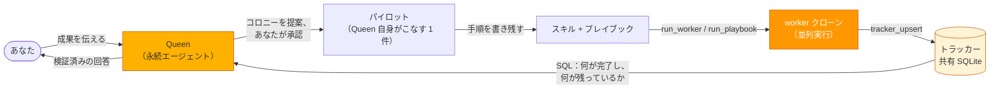

<p align="center">
  
</p>

<p align="center">
  <a href="../../README.md">English</a> |
  <a href="zh-CN.md">简体中文</a> |
  <a href="es.md">Español</a> |
  <a href="hi.md">हिन्दी</a> |
  <a href="pt.md">Português</a> |
  <a href="ja.md">日本語</a> |
  <a href="ru.md">Русский</a> |
  <a href="ko.md">한국어</a>
</p>

<p align="center">
  <a href="https://github.com/aden-hive/hive/blob/main/LICENSE"></a>
  <a href="https://www.ycombinator.com/companies/aden"></a>
  <a href="https://discord.com/invite/MXE49hrKDk"></a>
  <a href="https://x.com/aden_hq"></a>
  <a href="https://www.linkedin.com/company/teamaden/"></a>
</p>

<h3 align="center">ビジネスプロセスを動かす、AI エージェントのコロニー。</h3>

<p align="center">
  欲しい成果を伝えるだけ。Queen が最初の作業を自ら手がけ、worker エージェントのコロニーを育てて残りを並列で仕上げます。結果はすべて共有台帳に記録され、いつでもクエリ、再開、監査ができます。
</p>

<p align="center">
  <a href="../assets/readme/demo.mp4"></a>
  <br />
  <sub>実際の実行を録画したものです。早送りしているのは待ち時間だけです。<a href="../assets/readme/demo.mp4">高画質版（MP4）で見る</a>。</sub>
</p>

## デモで起きていたこと

Show HN を準備中のグロースチームが、5 つの開発者ツールについて、それぞれの公式ローンチが Hacker News でどれだけ反響を得たかを尋ねます。この 1 通のメッセージを受けて、Hive は次のように動きました。

1. **Queen に任せる。** Queen はそれぞれ役割（ここではグロース責任者）を持つ永続エージェントで、自分専用のメモリとツールを備えています。
2. **答えを左右する質問を 1 つだけする：** 初回のローンチだけか、すべてのローンチか？ あなたが選択肢を選ぶと、Queen はそのまま作業を続けます。
3. **Queen がコロニーを提案し、あなたが承認する。** 5 製品なら並列ジョブが 5 つ。そこでチャットはコロニーになります。コロニーとは、Queen と、ジョブに必要な数の worker エージェントの集まりです。
4. **1 件は Queen 自身がこなす。** 扱いの難しい Supabase（最大のローンチスレッドのタイトルに「Launch HN」が入っていない）を自ら担当し、何をローンチとみなすかを決め、その手順を再利用可能なスキルとして書き残します。
5. **それをプレイブックとして実行する：** 製品ごとに worker を 1 つずつ並列で走らせます。各 worker は Queen のスキルに従い、コロニーのトラッカー（共有の SQLite テーブル）に自分の行を書き込みます。
6. **回答する前に全行をチェックする。** エッジケースも埋もれません。Cal.com はどちらの名前でも条件に合うローンチがなかったため、ゼロではなく「欠損」としてグラフに示されます。

この流れには、事前に組み込まれたものが何もありません。設計すべきワークフローグラフはなく、Queen が実行時にコロニーを育てます。何が終わり何が残っているかを記録するのは、誰かの記憶ではなく、ディスク上のトラッカーです。

## クイックスタート

**必要なもの：** Python 3.11+、Node.js 20+、git。`uv` と `ripgrep` がなければクイックスタートがインストールし、Node のインストールも提案します。

**加えて、モデルが必要です。** クイックスタートでは、次のいずれも案内に沿って設定できます：

- API キー：Anthropic、OpenAI、Google Gemini、Groq、Cerebras、OpenRouter
- 契約済みのコーディング向けサブスクリプション：Claude Code、OpenAI Codex、Kimi Code、MiniMax、Z.AI、Antigravity
- Hive LLM
- Ollama 経由のローカルモデル（キー不要）

```bash
git clone https://github.com/aden-hive/hive.git
cd hive
./quickstart.sh          # macOS / Linux
.\quickstart.ps1         # Windows (PowerShell 5.1+)
```

クイックスタートは、ワークスペース用の Python 環境を 1 つ作成し、API キーを `~/.hive` 配下の暗号化された認証情報ストアに保存し、使用するモデルを尋ね、ダッシュボードをビルドして `http://127.0.0.1:8787` で開きます。あとで開き直すときは、リポジトリで `hive open` を実行してください。

> [!NOTE]
> Hive は `uv` ワークスペースであり、pip パッケージではありません。`pip install -e .` では動作しないプレースホルダーがインストールされるだけなので、クイックスタートを使ってください。

**準備ができたら：** ホーム画面にタスクを入力して任せる Queen を選ぶか、**プロンプトライブラリ**（Prompt Library）を開いて、用意されたプロンプトを想定先の Queen にそのままデプロイします。

## 仕組み


```mermaid
flowchart LR
    You(["あなた"]) -->|"成果を伝える"| Queen["Queen<br/>（永続エージェント）"]
    Queen -->|"コロニーを提案、<br/>あなたが承認"| Pilot["パイロット<br/>（Queen 自身がこなす 1 件）"]
    Pilot -->|"手順を書き残す"| Skill["スキル + プレイブック"]
    Skill -->|"run_worker / run_playbook"| W["worker クローン<br/>（並列実行）"]
    W -->|"tracker_upsert"| T[("トラッカー<br/>共有 SQLite")]
    T -->|"SQL：何が完了し、<br/>何が残っているか"| Queen
    Queen -->|"検証済みの回答"| You

    style Queen fill:#ffb100,stroke:#cc5d00,color:#333
    style T fill:#fff3d6,stroke:#cc5d00,color:#333
    style W fill:#ff9800,stroke:#cc5d00,color:#fff
```

Hive が持つ**実行プリミティブはひとつだけ**、エージェントループです。Queen もエージェントループであり、すべての worker はそのクローンです。各 worker は固有のタスク、より絞り込まれたツールセット、厳格な予算を持ちます。オーケストレーションはコンパイル済みのグラフではなく、ツール呼び出しで行います：

- **`run_worker`** はタスクをファンアウトしてすぐに戻るので、worker の実行中も Queen はあなたと会話を続けられます。デフォルトでは同時に最大 4 つまで実行し、残りはキューに入ります。完了した worker の報告は、新しいターンとして Queen の会話に届きます。
- **トラッカー**はコロニーの共有状態です。Queen がテーブルと、worker が書き込める列を定義します。worker は作業単位ごとに 1 行を upsert し、Queen は SQL で進捗を確認します。実体はディスク上の `~/.hive/colonies/<name>/tracker/tracker.db` にあります。
- **`run_playbook`** は、実証済みのプロトコルを全行に対して実行します。バックオフ付きのリトライ、レート制限付きのレーン、失敗し続ける行を集めるデッドレターリストを備えています。「残り」は常にトラッカーへの最新のクエリで求めるため、プレイブックを再実行すれば続きから再開します。

**[アーキテクチャ概要](../architecture/README.md)** では、ループ、ツール群、メモリ、人間による監督、そしてクラッシュ後も状態が保たれる仕組みを解説しています。

<table>
  <tr>
    <td width="50%"><br /><sub><b>ホーム。</b>Queen とそのコロニーを 1 枚のマップで一望できます。タスクを入力し、誰に任せるかを選びます。</sub></td>
    <td width="50%"><br /><sub><b>Worker。</b>作業単位ごとに 1 つずつ。それぞれ固有のタスクと予算を持ち、すべて Queen に報告します。</sub></td>
  </tr>
  <tr>
    <td width="50%"><br /><sub><b>トラッカー。</b>worker が完了するたびに結果が共有テーブルに入り、そのままクエリ、エクスポート、再開に使えます。</sub></td>
    <td width="50%"><br /><sub><b>結果。</b>出典とグラフを添えた検証済みの回答が、チャットに届きます。</sub></td>
  </tr>
</table>

## 主な機能

**役割と記憶を持つ Queen。** Hive には 13 人のペルソナ Queen が付属しています。6 人はデフォルトで有効（グロース、RevOps、コンテンツ、リードジェネレーション、アウトバウンド、ブランド＆デザイン）で、残りは組織図（Org Chart）から採用できます。独自の Queen を作ることも可能です。各 Queen はリフレクションのステップで書かれるスコープ付きの Markdown メモリを持ち、関連する過去の会話は自動的にコンテキストに呼び出されます。

**組み込みツールはプロセス内で動作。** シェルコマンドとバックグラウンドジョブ、ファイル編集、高速なコード検索、PDF、添付ファイルと画像、Web スクレイピング、グラフ（ECharts と Mermaid）、CSV ファイル、Hive LLM による画像生成。いずれも Hive 自体の中で動くため、ツールサーバーを起動する必要はありません。

**あなたのブラウザをエージェントが操作。** Hive Browser Bridge 拡張機能を使うと、エージェントがあなた自身の Chrome を操作できます。ログイン済みの状態がそのまま使えます。worker ごとに専用のタブグループが割り当てられます。

**スキル。** オープンな [Agent Skills](https://agentskills.io) 形式で書かれた、再利用可能な指示書です。Hive には一式が同梱されているほか、プロトコルの有効性が実証されると Queen が新しいスキルを書きます。スキルはスキルライブラリ（Skills Library）で管理できます。

**あらゆる MCP サーバー。** `hive mcp add` で外部の MCP サーバーを追加すると、そのツールは組み込みツールと同じ許可リストに加わります。[`tools/`](../../tools/src/aden_tools/tools) にある統合カタログ全体（GitHub、Gmail、HubSpot、Slack、Notion ほか多数）も、1 つの MCP サーバーとして動作します。詳しくは [docs/tools.md](../tools.md) を参照してください。

**不在中も動き続ける。** コロニーは cron、インターバル、webhook のトリガーで自らスケジュール実行できます。コロニーごとにオプトインできる **Sentinel** は、Queen が停止したときに見張り役を務めます。Queen に続行を促すか、Hive の受信トレイ、Telegram、Slack を通じてあなたにエスカレーションし、あなたが返信すると Queen は再開します。

**障害に強い設計。** すべてのエージェントは状態をディスクに永続化し、クラッシュや再起動のあとも、止まった地点からそのまま再開します。大きなツール結果はコンテキストにあふれさせずファイルに書き出し、長いセッションは自動でコンパクションされ、行き詰まったターンやループしているターンは検出されます。さらに、すべての worker はツール呼び出し回数の厳格な上限のもとで動作します。

**あらゆるモデル。** [LiteLLM](https://docs.litellm.ai/docs/providers) がサポートするものなら何でも使えます。OpenAI、Anthropic、Gemini、OpenRouter、Hive LLM、OpenAI 互換の任意のエンドポイント、Ollama 経由のローカルモデルなどです。worker は Queen とは別のモデルを使うこともでき、テキスト専用モデルでもビジョンフォールバックによって画像を扱えます。

## Hive はあなたに向いているか？

難しいのがもはやモデルそのものではなく、その周りのすべてになったとき、Hive が力を発揮します：

- リード、アカウント、チケット、リポジトリ、ドキュメントなど、**似た作業単位が大量にある**プロセスを、並列に、しかも同じやり方で処理したい。
- **何時間も、あるいはスケジュールに沿って動き続け**、再起動を乗り越えなければならない作業がある。
- チャットで読むだけでなく、**確認、クエリ、監査**が必要な結果を扱う。
- 重要な判断については、**人間が主導権を握り続けたい**。

単発のプロンプトや使い捨てのスクリプトなら、普通のエージェントのほうがシンプルです。

## ドキュメント

- [はじめに](../getting-started.md)：セットアップの詳細
- [アーキテクチャ概要](../architecture/README.md)：コロニー、ループ、ツール、メモリがどう組み合わさっているか
- 主要コンセプト：[コロニー](../key_concepts/colony.md)、[Queen](../key_concepts/queen.md)、[worker](../key_concepts/worker_agent.md)、[連携](../key_concepts/coordination.md)、[ループ](../key_concepts/the_loop.md)、[目標と成果](../key_concepts/goals_outcome.md)、[コロニーが改善していく仕組み](../key_concepts/improvement.md)
- [ツール](../tools.md)：組み込みツール、MCP サーバー、統合カタログ
- [設定](../configuration.md) と [開発者ガイド](../developer-guide.md)
- [ロードマップ](../roadmap.md)：V1 で提供済みの機能と、まだ残っている課題
- [docs.adenhq.com](https://docs.adenhq.com/)：オンラインドキュメント

## よくある質問

**Hive はどのモデルに対応していますか？**
[LiteLLM](https://docs.litellm.ai/docs/providers) がサポートするすべてのプロバイダーと、OpenAI 互換の任意のエンドポイントに対応しています。Claude Code や OpenAI Codex といったコーディング向けサブスクリプションを含め、主要なものはクイックスタートで設定できます。それ以外は [docs/configuration.md](../configuration.md) を参照してください。

**ローカルモデルで動かせますか？**
はい。クイックスタートで Ollama を選ぶか、Ollama をローカルで起動したうえで `ollama/llama3` などのモデルを指定してください。

**他のエージェントフレームワークと何が違うのですか？**
多くのフレームワークでは、エージェントのグラフを設計し、その入出力を配線する必要があります。Hive にあるエージェントは 1 種類だけです。Queen はエージェントループであり、すべての worker はそのクローンです。オーケストレーションは実行時にツール呼び出しで行われ、連携はエッジに沿って受け渡されるメッセージではなく、共有の SQL トラッカーを通じて行われます。ハーネスの機能（永続化、再開、予算、コンパクション、監督）はこの 1 つのループに組み込まれているため、すべてのエージェントがそれを備えています。

**データはどこに保存されますか？**
あなたのマシン上です。セッション、コロニー、トラッカー、メモリは `~/.hive`（または `HIVE_HOME` が指す場所）配下のプレーンなファイルで、API キーもそこに暗号化して保存されます。

**コストはどう管理すればよいですか？**
各 worker はターン数とツール呼び出し回数の厳格な上限のもとで動作するため、行き詰まった worker は自動的に停止します。同時実行数にも上限があります。使用量はモデル呼び出しのたびに計測されます。金額ベースの支出上限は、まだありません。

**エージェントに自前のツールや API を使わせられますか？**
はい。組み込みのシェルとブラウザ、追加した任意の MCP サーバー、そして独自の手順を教えるスキルを通じて利用できます。

**Hive はオープンソースですか？**
はい。[Apache License 2.0](../../LICENSE) のもとで公開されています。

## 貢献

コントリビューションを歓迎します。特にツール、統合、スキルを募集しています（[#2805](https://github.com/aden-hive/hive/issues/2805)）。まず [CONTRIBUTING.md](../../CONTRIBUTING.md) を読み、プルリクエストを開く前に Issue にアサインされてください。Issue にコメントすれば、メンテナーがアサインします。再現手順や提案を含む Issue が優先されます。

## コミュニティ

- [Discord](https://discord.com/invite/MXE49hrKDk)：質問、機能リクエスト、ディスカッション
- [X / Twitter](https://x.com/aden_hq) と [LinkedIn](https://www.linkedin.com/company/teamaden/)：最新情報
- [HoneyComb](http://honeycomb.open-hive.com/)：AI エージェントがどの仕事を自動化しつつあるかを追跡するコミュニティマーケット。お金ではなくコンピュートトークンで、仕事をロングまたはショートできます。

エンジニアリング、リサーチ、市場開拓（go-to-market）の各分野で**採用中です**。[募集中のポジションを見る](https://jobs.adenhq.com/a8cec478-cdbc-473c-bbd4-f4b7027ec193/applicant)。

## セキュリティ

脆弱性の報告については、[SECURITY.md](../../SECURITY.md) をご覧ください。

## ライセンス

Apache License 2.0。詳細は [LICENSE](../../LICENSE) をご覧ください。

## スター履歴

<a href="https://www.star-history.com/?type=date&repos=aden-hive%2Fhive">
 <picture>
   <source media="(prefers-color-scheme: dark)" srcset="https://api.star-history.com/chart?repos=aden-hive/hive&type=date&theme=dark&legend=top-left&sealed_token=vfX1DG8w_KTkonUUtIEjFRLvBopgDzxQpyb8hiYT22sobcDIpvQiMciZghLsDu5hyU3LJs-ZddFjl8eYFx5zRrY-kcMRsfyQ3vAiacsroPoqgRYmZaES3Q" />
   <source media="(prefers-color-scheme: light)" srcset="https://api.star-history.com/chart?repos=aden-hive/hive&type=date&legend=top-left&sealed_token=vfX1DG8w_KTkonUUtIEjFRLvBopgDzxQpyb8hiYT22sobcDIpvQiMciZghLsDu5hyU3LJs-ZddFjl8eYFx5zRrY-kcMRsfyQ3vAiacsroPoqgRYmZaES3Q" />
   
 </picture>
</a>

---

<p align="center">サンフランシスコから 🔥 情熱を込めて</p>
