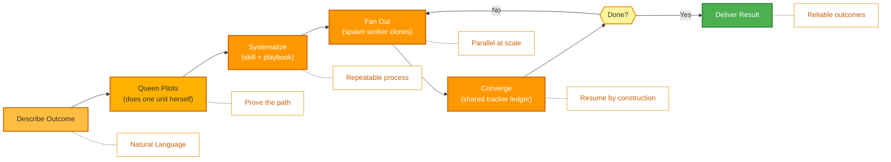

<p align="center">
  
</p>

<p align="center">
  <a href="../../README.md">English</a> |
  <a href="zh-CN.md">简体中文</a> |
  <a href="es.md">Español</a> |
  <a href="hi.md">हिन्दी</a> |
  <a href="pt.md">Português</a> |
  <a href="ja.md">日本語</a> |
  <a href="ru.md">Русский</a> |
  <a href="ko.md">한국어</a> |
  <a href="id.md">Bahasa Indonesia</a>
</p>

<p align="center">
  <a href="https://github.com/aden-hive/hive/blob/main/LICENSE"></a>
  <a href="https://www.ycombinator.com/companies/aden"></a>
  <a href="https://discord.com/invite/MXE49hrKDk"></a>
  <a href="https://x.com/aden_hq"></a>
  <a href="https://www.linkedin.com/company/teamaden/"></a>
  
</p>

<p align="center">
  
  
  
  
  
  
</p>
<p align="center">
  
  
  
</p>

<p align="center"><em>프로덕션 워크로드를 위한 에이전트 하네스(harness) — 상태 관리, 실패 복구, 관측성, 그리고 사람의 감독까지 갖춰 에이전트가 실제로 작동하게 합니다.</em></p>

## 개요

OpenHive는 **에이전트 colony(군집)** 를 위한, 별도 설정이 필요 없고(zero-setup) 모델에 구애받지 않는(model-agnostic) 런타임입니다. colony란 하나의 비즈니스 프로세스를 함께 수행하는 특화된 에이전트들의 그룹으로, 지속적으로 유지되며 클라이언트를 직접 응대하는 리더인 **Queen(퀸)** 과 작업에 필요한 만큼의 **worker(워커)** 에이전트로 구성됩니다. 원하는 결과(outcome)를 설명하면, Queen이 직접 작업을 수행한 뒤 그 주위로 colony를 키워 해당 작업을 안정적으로, 그리고 대규모로 실행합니다.

그 이면의 메커니즘은 **하나의 루프가 여러 루프를 제어하는(one loop controlling many loops)** 방식입니다. Hive에는 단 하나의 실행 프리미티브가 있습니다. Queen은 그 자체로 하나의 AgentLoop(에이전트 루프)이며, 모든 worker는 그것의 **clone(클론, 복제본)** — 동일한 도구, 동일한 모델, 자신만의 과제를 가진 복제본 — 입니다. 컴파일해야 할 그래프도 없고, 작성해야 할 오케스트레이션 보일러플레이트도 없습니다. colony는 공유 원장(ledger)과 지속적인 계획(plan)을 통해 협업하며, 크래시에 안전한 상태, 깊이 있는 관측성, 사람의 감독이 모든 에이전트가 공유하는 이 단일 프리미티브에 내장되어 있습니다. 작동 방식은 **[아키텍처 개요](../architecture/README.md)** 를 참고하세요.

## 주요 기능

- ✅ 에이전트 colony(군집) — Queen이 필요에 따라 worker clone을 생성하여 병렬로 장시간 실행되는 작업을 수행
- ✅ 하나의 프리미티브, 여러 루프 — 배선해야 할 그래프가 없으며, Queen이 런타임에 colony를 키움
- ✅ 데이터 버퍼 없이도 협업을 가능하게 하는 공유 tracker 원장(ledger)과 지속적인 작업 계획
- ✅ CEO 스타일 라우팅과, 발전하며 범위가 지정된(scoped) 메모리를 갖춘 Queen 페르소나
- ✅ 크래시에 안전한 대기/재개(park/resume), 비용 강제(cost enforcement), 대역 외(out-of-band) 사람 개입(human-in-the-loop) (Sentinel)
- ✅ 제로 설정(Zero Setup) — 기술적 구성 불필요
- ✅ 네이티브 확장(Native Extension)을 통한 범용 컴퓨터 사용(General Compute Use) 및 브라우저 사용(Browser Use)
- ✅ 커스텀 모델 지원(Custom Model Support)

자세한 문서, 예제, 가이드는 [adenhq.com](https://adenhq.com)에서 확인하세요.

[HoneyComb](http://honeycomb.open-hive.com/)를 방문하여 어떤 직무가 AI에 의해 자동화되고 있는지 확인해 보세요. 이곳은 커뮤니티의 AI 에이전트 발전에 따라 움직이는 직무(jobs)를 위한 주식 시장입니다. 어떤 직무가 AI로 얼마나 대체될 것이라 생각하는지에 따라 (실제 돈이 아닌 컴퓨트 토큰으로) 직무를 롱(long)/숏(short) 할 수 있습니다.

https://github.com/user-attachments/assets/bf10edc3-06ba-48b6-98ba-d069b15fb69d


## Hive는 누구를 위한 것인가?

Hive는 AI 에이전트를 프로토타입에서 프로덕션으로 옮기는 팀을 위한 멀티 에이전트 하네스(harness) 계층입니다. Openclaw나 Cowork 같은 단일 에이전트는 개인적인 작업을 꽤 잘 완수하지만, 비즈니스 프로세스를 이행하기에는 엄밀함이 부족합니다.

다음과 같은 경우 Hive가 적합합니다:

- 데모가 아닌 **실제 비즈니스 프로세스를 실행하는** AI 에이전트를 원하는 경우
- 대규모로 **상태, 복구, 병렬 실행을 처리하는 런타임**이 필요한 경우
- 시간이 지남에 따라 개선되는 **자가 복구(self-healing) 및 적응형 에이전트**가 필요한 경우
- **사람 개입(human-in-the-loop) 제어**, 관측성, 비용 한도가 필요한 경우
- 가동 시간, 비용, 감사 가능성이 중요한 **프로덕션** 환경에서 에이전트를 실행할 계획인 경우

단순한 에이전트 체인이나 일회성 스크립트만 실험하는 경우라면 Hive가 최선의 선택이 아닐 수 있습니다.

## 언제 Hive를 사용해야 하나요?

병목이 더 이상 모델이 아니라 그것을 둘러싼 하네스(harness)일 때 Hive를 사용하세요:

- **상태 지속성과 크래시 복구**가 필요한 장기 실행 에이전트
- **비용 강제, 관측성, 감사 추적(audit trail)** 이 필요한 프로덕션 워크로드
- reflexion(성찰), 범위가 지정된(scoped) 메모리, 학습된 스킬을 통해 **시간이 지남에 따라 개선되는** 에이전트
- **공유 tracker 원장(ledger)과 지속적인 계획**을 통해 협업하는 병렬 멀티 에이전트 작업
- 모델의 발전과 싸우기보다 **모델의 발전에 맞춰 확장되는** 프레임워크

## 빠른 링크

- **[문서](https://docs.adenhq.com/)** - 전체 가이드와 API 레퍼런스
- **[셀프 호스팅 가이드](https://docs.adenhq.com/getting-started/quickstart)** - 자체 인프라에 Hive 배포하기
- **[변경 사항(Changelog)](https://github.com/aden-hive/hive/releases)** - 최신 업데이트 및 릴리스
- **[로드맵](../roadmap.md)** - 향후 기능 및 계획
- **[이슈 신고](https://github.com/aden-hive/hive/issues)** - 버그 리포트 및 기능 요청
- **[기여하기](../../CONTRIBUTING.md)** - 기여 방법 및 PR 제출 안내

## 빠른 시작

### 사전 요구 사항

- 에이전트 개발을 위한 Python 3.11+
- 에이전트를 구동하는 LLM 제공자
- **ripgrep (선택 사항, Windows에서 권장):** `terminal_rg` / `terminal_glob` 검색 도구는 더 빠른 파일 검색을 위해 ripgrep을 사용합니다. 설치되어 있지 않으면 Python 폴백이 사용됩니다. Windows에서는: `winget install BurntSushi.ripgrep` 또는 `scoop install ripgrep`

> **Windows 사용자:** 네이티브 Windows는 `quickstart.ps1` 및 `hive.ps1`을 통해 지원됩니다. 이들을 PowerShell 5.1+ 에서 실행하세요. WSL도 선택 가능하지만 필수는 아닙니다.

### 설치

> **참고**
> Hive는 `uv` 워크스페이스 레이아웃을 사용하며 `pip install`로 설치하지 않습니다.
> 저장소 루트에서 `pip install -e .`를 실행하면 플레이스홀더 패키지만 생성되어 Hive가 올바르게 작동하지 않습니다.
> 아래의 quickstart 스크립트를 사용하여 환경을 설정해 주세요.

```bash
# Clone the repository
git clone https://github.com/aden-hive/hive.git
cd hive

# Run quickstart setup (macOS/Linux)
./quickstart.sh

# Windows (PowerShell)
.\quickstart.ps1
```

다음 요소들이 설정됩니다:

- **framework** - 핵심 에이전트 런타임 및 그래프 실행기 (`core/.venv` 내)
- **aden_tools** - 에이전트 기능을 위한 MCP 도구 (`tools/.venv` 내)
- **credential store** - 암호화된 API 키 저장소 (`~/.hive/credentials`)
- **LLM provider** - Hive LLM 및 OpenRouter를 포함한 대화형 기본 모델 설정
- `uv`를 통한 모든 필수 Python 의존성

- 마지막으로, 브라우저에서 Hive 인터페이스가 열립니다

> **팁:** 나중에 대시보드를 다시 열려면 프로젝트 디렉터리에서 `hive open`을 실행하세요.

### 첫 번째 에이전트 만들기

홈 화면의 입력 상자에 만들고 싶은 에이전트를 입력하세요. Queen이 여러분에게 질문을 던지고 함께 해결책을 만들어 나갑니다.


### 템플릿 에이전트 사용하기

"Try a sample agent"를 클릭하고 템플릿을 확인하세요. 템플릿을 바로 실행하거나, 기존 템플릿을 기반으로 자신만의 버전을 구축할 수 있습니다.

### 에이전트 실행

이제 에이전트(기존 에이전트 또는 예제 에이전트)를 선택하여 실행할 수 있습니다. 좌측 상단의 Run 버튼을 클릭하거나, Queen 에이전트와 대화하면 대신 에이전트를 실행해 줍니다.


## 통합

<a href="https://github.com/aden-hive/hive/tree/main/tools/src/aden_tools/tools"></a>
Hive는 모델에 구애받지 않고 시스템에 구애받지 않도록 설계되었습니다.

- **LLM 유연성** - Hive Framework는 LiteLLM 호환 제공자를 통해 Anthropic, OpenAI, OpenRouter, Hive LLM 및 기타 호스팅 또는 로컬 모델을 지원합니다.
- **비즈니스 시스템 연결** - Hive Framework는 MCP를 통해 CRM, 지원, 메시징, 데이터, 파일, 내부 API 등 모든 종류의 비즈니스 시스템을 도구로 연결하도록 설계되었습니다.

## 왜 Hive인가

모델이 발전할수록 에이전트가 할 수 있는 일의 상한선은 높아지지만, 그 신뢰성과 프로덕션 가치는 하네스(harness)에 의해 결정됩니다. Hive는 범용 에이전트가 아니라 실제 비즈니스 프로세스를 실행하는 데 초점을 맞춥니다. 워크플로 그래프를 손수 배선하고, 모든 에이전트 상호작용을 정의하며, 실패를 사후적으로 처리하도록 요구하는 대신, Hive는 패러다임을 뒤집습니다. **원하는 결과를 설명하면, Queen이 먼저 작업을 수행한 뒤 colony를 키워 이를 확장합니다** — 사용하기 쉬운 도구와 통합 세트를 갖춘, 결과 중심의 적응형 경험입니다.



### 작동 방식

1. **[결과 설명하기](../key_concepts/goals_outcome.md)** → 원하는 바를 평이한 언어로 말하면, CEO 스타일 라우터가 적절한 [Queen](../key_concepts/queen.md)을 선택합니다
2. **Queen이 직접 수행(pilot)** → Queen이 작업의 한 단위를 직접 수행하여 경로를 증명하고 이를 공유 tracker에 기록합니다
3. **[체계화(Systematize)](../key_concepts/improvement.md)** → 검증된 프로토콜을 스킬 + 플레이북, 즉 반복 가능한 프로세스로 정리합니다
4. **[팬 아웃(Fan out)](../key_concepts/colony.md)** → `run_worker`가 병렬로 실행되며 결과를 보고하는 [worker clone](../key_concepts/worker_agent.md)들을 생성합니다
5. **수렴 및 모니터링** → worker들이 결과를 tracker에 기록하고, Queen이 SQL로 이를 검증하며, 실시간 메트릭, 예산 강제, 크래시에 안전한 재개를 제공합니다

## 문서

- **[개발자 가이드](../developer-guide.md)** - 개발자를 위한 종합 가이드
- [시작하기](../getting-started.md) - 빠른 설정 방법
- [설정 가이드](../configuration.md) - 모든 설정 옵션
- [아키텍처 개요](../architecture/README.md) - 시스템 설계 및 구조

## 기여하기
커뮤니티의 기여를 환영합니다! 특히 프레임워크를 위한 도구, 통합, 예제 에이전트 구축에 도움을 주실 분을 찾고 있습니다 ([#2805 확인](https://github.com/aden-hive/hive/issues/2805)). 기능 확장에 관심이 있으시다면 여기가 시작하기에 최적의 장소입니다. 가이드라인은 [CONTRIBUTING.md](../../CONTRIBUTING.md)를 참고해 주세요.

**중요:** PR을 제출하기 전에 먼저 이슈에 할당받으세요. 이슈에 댓글을 달아 담당을 요청하면 유지관리자가 할당해 드립니다. 재현 가능한 단계와 제안이 포함된 이슈가 우선 처리됩니다. 이는 중복 작업을 방지하는 데 도움이 됩니다.

1. 이슈를 찾거나 생성하고 할당받습니다
2. 저장소를 포크합니다
3. 기능 브랜치를 생성합니다 (`git checkout -b feature/amazing-feature`)
4. 변경 사항을 커밋합니다 (`git commit -m 'Add amazing feature'`)
5. 브랜치에 푸시합니다 (`git push origin feature/amazing-feature`)
6. Pull Request를 생성합니다

## 커뮤니티 및 지원

지원, 기능 요청, 커뮤니티 토론을 위해 [Discord](https://discord.com/invite/MXE49hrKDk)를 사용합니다.

- Discord - [커뮤니티 참여하기](https://discord.com/invite/MXE49hrKDk)
- Twitter/X - [@adenhq](https://x.com/aden_hq)
- LinkedIn - [회사 페이지](https://www.linkedin.com/company/teamaden/)

## 팀에 합류하세요

**채용 중입니다!** 엔지니어링, 연구, Go-To-Market 분야에서 함께하실 분을 찾고 있습니다.

[채용 공고 보기](https://jobs.adenhq.com/a8cec478-cdbc-473c-bbd4-f4b7027ec193/applicant)

## 보안

보안 관련 문의 사항은 [SECURITY.md](../../SECURITY.md)를 참고해 주세요.

## 라이선스

본 프로젝트는 Apache License 2.0 하에 배포됩니다. 자세한 내용은 [LICENSE](../../LICENSE) 파일을 참고해 주세요.

## 자주 묻는 질문 (FAQ)

**Q: Hive는 어떤 LLM 제공자를 지원하나요?**

Hive는 LiteLLM 연동을 통해 OpenAI(GPT-4, GPT-4o), Anthropic(Claude 모델), Google Gemini, DeepSeek, Mistral, Groq, OpenRouter, Hive LLM 등 100개 이상의 LLM 제공자를 지원합니다. 적절한 API 키 환경 변수를 설정하고 모델 이름만 지정하면 됩니다. 제공자별 설정 예시는 [docs/configuration.md](../configuration.md)를 참고하세요.

**Q: Ollama 같은 로컬 AI 모델과 함께 Hive를 사용할 수 있나요?**

네, 가능합니다! Hive는 LiteLLM을 통해 로컬 모델을 지원합니다. `ollama/model-name` 형식(예: `ollama/llama3`, `ollama/mistral`)으로 모델 이름을 지정하고 Ollama가 로컬에서 실행 중인지 확인하기만 하면 됩니다.

**Q: Hive가 다른 에이전트 프레임워크와 다른 점은 무엇인가요?**

Hive는 단일 에이전트나 손수 배선한 에이전트 그래프가 아니라 **에이전트 colony(군집)** 를 실행합니다. 대부분의 프레임워크는 서로 다른 노드와 엣지로 이루어진 그래프를 컴파일하도록 요구하지만, Hive에는 단 하나의 실행 프리미티브가 있습니다. Queen은 그 자체로 하나의 AgentLoop(에이전트 루프)이며, 모든 worker는 그것의 [clone](../key_concepts/the_loop.md)입니다. 오케스트레이션은 컴파일된 DAG가 아니라 런타임 `run_worker` 팬 아웃(fan-out)이며, colony는 데이터 버퍼 대신 [공유 tracker 원장(ledger)](../key_concepts/coordination.md)을 통해 협업합니다. 이 "하나의 루프, 여러 루프(one loop, many loops)" 코어 위에서, Hive는 프로덕션 하네스입니다 — 크래시에 안전한 대기/재개, 비용 강제, 실시간 관측성, 대역 외 사람 개입이 모두 제공되며, 에이전트 종류가 단 하나뿐이기에 모든 에이전트가 이를 상속받습니다. [아키텍처 개요](../architecture/README.md)를 참고하세요.

**Q: Hive는 오픈소스인가요?**

네. Hive는 Apache License 2.0 하에 배포되는 완전한 오픈소스입니다. 커뮤니티의 기여와 협업을 적극적으로 장려합니다.

**Q: Hive는 Human-in-the-Loop 워크플로를 지원하나요?**

네. Queen은 계정에 연결된 Slack/Telegram 채널인 **Sentinel** 을 통해 대역 외(out-of-band)로 사람에게 에스컬레이션합니다. AgentLoop는 대기 상태로 전환되어(상태를 디스크에 저장) 사람에게 알린 뒤, 답변이 오면 정확히 멈췄던 지점에서 재개합니다. 에스컬레이션이 그래프의 노드가 아니기 때문에, colony 내 어떤 에이전트든 언제든지 멈춰 사람의 판단을 기다릴 수 있으며, 타임아웃과 에스컬레이션 정책을 설정할 수 있습니다. [아키텍처 개요](../architecture/README.md#reliability-is-in-the-primitive)를 참고하세요.

**Q: Hive는 어떤 프로그래밍 언어를 지원하나요?**

Hive 프레임워크는 Python으로 구축되었습니다. JavaScript/TypeScript SDK는 로드맵에 포함되어 있습니다.

**Q: Hive 에이전트는 외부 도구 및 API와 상호작용할 수 있나요?**

네. colony 내 모든 에이전트는 기본 도구 접근 권한을 가지며, Hive는 MCP를 통해 외부 API, 데이터베이스, 서비스에 연결됩니다 — 100개 이상의 통합 도구와, 네이티브 확장을 통한 범용 컴퓨터 사용(General Compute Use) 및 브라우저 사용(Browser Use)이 포함됩니다. Queen과 그 worker들이 하나의 도구 표면(tool surface)을 공유하기 때문에, 여러분이 추가한 기능은 colony 전체에서 사용할 수 있습니다.

**Q: Hive에서 비용 제어는 어떻게 이루어지나요?**

Hive는 지출 한도, 스로틀(throttle), 자동 모델 다운그레이드 정책 등 세밀한 예산 제어 기능을 제공합니다. 팀, 에이전트, 워크플로 단위로 예산을 설정할 수 있으며, 실시간 비용 추적과 알림을 제공합니다.

**Q: 예제와 문서는 어디에서 확인할 수 있나요?**

전체 가이드, API 레퍼런스, 시작 튜토리얼은 [docs.adenhq.com](https://docs.adenhq.com/)에서 확인하세요. 저장소에는 `docs/` 폴더의 문서와 종합적인 [개발자 가이드](../developer-guide.md)도 포함되어 있습니다.

**Q: Aden에 기여하려면 어떻게 해야 하나요?**

기여를 환영합니다! 저장소를 포크하고 기능 브랜치를 생성한 뒤 변경 사항을 구현하여 Pull Request를 제출해 주세요. 자세한 가이드라인은 [CONTRIBUTING.md](../../CONTRIBUTING.md)를 참고하세요.

## 스타 히스토리

<a href="https://www.star-history.com/?type=date&repos=aden-hive%2Fhive">
 <picture>
   <source media="(prefers-color-scheme: dark)" srcset="https://api.star-history.com/chart?repos=aden-hive/hive&type=date&theme=dark&legend=top-left&sealed_token=vfX1DG8w_KTkonUUtIEjFRLvBopgDzxQpyb8hiYT22sobcDIpvQiMciZghLsDu5hyU3LJs-ZddFjl8eYFx5zRrY-kcMRsfyQ3vAiacsroPoqgRYmZaES3Q" />
   <source media="(prefers-color-scheme: light)" srcset="https://api.star-history.com/chart?repos=aden-hive/hive&type=date&legend=top-left&sealed_token=vfX1DG8w_KTkonUUtIEjFRLvBopgDzxQpyb8hiYT22sobcDIpvQiMciZghLsDu5hyU3LJs-ZddFjl8eYFx5zRrY-kcMRsfyQ3vAiacsroPoqgRYmZaES3Q" />
   
 </picture>
</a>

---

<p align="center">
  Made with 🔥 Passion in San Francisco
</p>
