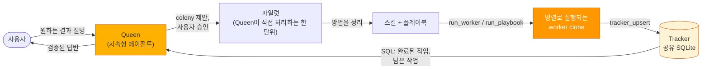

<p align="center">
  
</p>

<p align="center">
  <a href="../../README.md">English</a> |
  <a href="zh-CN.md">简体中文</a> |
  <a href="es.md">Español</a> |
  <a href="hi.md">हिन्दी</a> |
  <a href="pt.md">Português</a> |
  <a href="ja.md">日本語</a> |
  <a href="ru.md">Русский</a> |
  <a href="ko.md">한국어</a>
</p>

<p align="center">
  <a href="https://github.com/aden-hive/hive/blob/main/LICENSE"></a>
  <a href="https://www.ycombinator.com/companies/aden"></a>
  <a href="https://discord.com/invite/MXE49hrKDk"></a>
  <a href="https://x.com/aden_hq"></a>
  <a href="https://www.linkedin.com/company/teamaden/"></a>
</p>

<h3 align="center">AI 에이전트 colony가 비즈니스 프로세스를 실행합니다.</h3>

<p align="center">
  원하는 결과를 설명하세요. Queen이 작업의 첫 부분을 직접 처리한 뒤, worker 에이전트로 이루어진 colony(군집)를 키워 나머지를 병렬로 끝냅니다. 모든 결과는 공유 원장(ledger)에 남아 언제든 조회하고, 재개하고, 감사할 수 있습니다.
</p>

<p align="center">
  <a href="../assets/readme/demo.mp4"></a>
  <br />
  <sub>실제 실행을 녹화했으며, 대기 시간만 빨리 감았습니다. <a href="../assets/readme/demo.mp4">원본 화질로 보기 (MP4)</a>.</sub>
</p>

## 데모에서 일어난 일

Show HN을 준비하는 그로스 팀이, 개발자 도구 다섯 개가 Hacker News에서 직접 진행한 런칭의 성과를 묻습니다. 이 메시지 하나로 Hive가 한 일은 다음과 같습니다.

1. **Queen에게 일을 맡깁니다.** Queen은 역할(여기서는 그로스 총괄)과 자신만의 메모리, 도구를 갖춘 지속형 에이전트입니다.
2. **결과를 좌우하는 질문 하나를 던집니다:** 최초 런칭만 볼까요, 모든 런칭을 볼까요? 선택지를 고르면 Queen이 작업을 이어갑니다.
3. **Queen이 colony를 제안하면 승인합니다.** 제품 다섯 개는 곧 병렬 작업 다섯 개이므로, 채팅이 colony, 즉 Queen과 작업에 필요한 만큼의 worker 에이전트로 이루어진 팀이 됩니다.
4. **한 단위는 Queen이 직접 처리합니다.** 까다로운 사례인 Supabase(가장 큰 런칭 스레드 제목에 "Launch HN"이 없음)를 맡아 무엇을 런칭으로 볼지 기준을 정하고, 그 방법을 재사용 가능한 스킬로 정리합니다.
5. **이를 플레이북으로 실행합니다:** 제품마다 worker를 하나씩 병렬로 돌리고, 각 worker는 Queen의 스킬을 따라 colony의 tracker(공유 SQLite 테이블)에 자기 행을 기록합니다.
6. **답하기 전에 모든 행을 검증합니다.** 예외 사례도 그대로 드러납니다. Cal.com은 두 이름 중 어느 쪽으로도 조건에 맞는 런칭이 없었기 때문에, 0이 아니라 누락으로 차트에 표시됩니다.

이 흐름에서 미리 연결해 둔 것은 하나도 없습니다. 설계할 워크플로 그래프도 없습니다. Queen이 런타임에 colony를 키우고, 무엇이 끝났고 무엇이 남았는지는 누군가의 기억이 아니라 디스크에 있는 tracker가 기록합니다.

## 빠른 시작

**필요한 것:** Python 3.11+, Node.js 20+, git. quickstart는 `uv`와 `ripgrep`이 없으면 설치하고, Node 설치도 제안합니다.

**모델도 필요합니다.** quickstart에서 다음 중 무엇이든 설정할 수 있습니다:

- API 키: Anthropic, OpenAI, Google Gemini, Groq, Cerebras, OpenRouter
- 이미 사용 중인 코딩 구독: Claude Code, OpenAI Codex, Kimi Code, MiniMax, Z.AI, Antigravity
- Hive LLM
- Ollama를 통한 로컬 모델 (키가 전혀 필요 없음)

```bash
git clone https://github.com/aden-hive/hive.git
cd hive
./quickstart.sh          # macOS / Linux
.\quickstart.ps1         # Windows (PowerShell 5.1+)
```

quickstart는 워크스페이스용 Python 환경을 하나 만들고, API 키를 `~/.hive` 아래의 암호화된 자격 증명 저장소에 보관하고, 사용할 모델을 물은 뒤, 대시보드를 빌드해 `http://127.0.0.1:8787`에서 엽니다. 나중에 다시 열려면 저장소에서 `hive open`을 실행하세요.

> [!NOTE]
> Hive는 pip 패키지가 아니라 `uv` 워크스페이스입니다. `pip install -e .`로는 실행되지 않는 플레이스홀더만 설치되니 quickstart를 사용하세요.

**그다음:** 홈 화면에 작업을 입력하고 맡길 Queen을 고르세요. 또는 **Prompt Library**를 열어 미리 만들어 둔 프롬프트를 그 프롬프트가 겨냥한 Queen에게 바로 배포할 수 있습니다.

## 작동 방식


```mermaid
flowchart LR
    You(["사용자"]) -->|"원하는 결과 설명"| Queen["Queen<br/>(지속형 에이전트)"]
    Queen -->|"colony 제안,<br/>사용자 승인"| Pilot["파일럿<br/>(Queen이 직접 처리하는 한 단위)"]
    Pilot -->|"방법을 정리"| Skill["스킬 + 플레이북"]
    Skill -->|"run_worker / run_playbook"| W["병렬로 실행되는<br/>worker clone"]
    W -->|"tracker_upsert"| T[("Tracker<br/>공유 SQLite")]
    T -->|"SQL: 완료된 작업,<br/>남은 작업"| Queen
    Queen -->|"검증된 답변"| You

    style Queen fill:#ffb100,stroke:#cc5d00,color:#333
    style T fill:#fff3d6,stroke:#cc5d00,color:#333
    style W fill:#ff9800,stroke:#cc5d00,color:#fff
```

Hive에는 **실행 프리미티브가 단 하나** 있습니다. 바로 에이전트 루프입니다. Queen도 에이전트 루프이고, 모든 worker는 그 clone으로서 각자의 작업, 더 좁은 도구 세트, 엄격한 예산을 가집니다. 오케스트레이션은 컴파일된 그래프가 아니라 도구 호출입니다:

- **`run_worker`** 도구는 작업을 팬아웃한 뒤 즉시 반환하므로, worker가 실행되는 동안에도 Queen과 계속 대화할 수 있습니다. 기본적으로 최대 4개가 동시에 실행되고 나머지는 대기열에 들어갑니다. worker가 끝나면 그 보고가 Queen의 대화에 새 턴으로 도착합니다.
- **tracker**는 colony의 공유 상태입니다. Queen이 테이블과 worker가 쓸 수 있는 열을 정의하면, worker는 작업 단위마다 행 하나를 upsert하고, Queen은 SQL로 진행 상황을 확인합니다. tracker는 디스크의 `~/.hive/colonies/<name>/tracker/tracker.db`에 저장됩니다.
- **`run_playbook`** 도구는 검증된 프로토콜을 모든 행에 적용합니다. 백오프를 적용한 재시도, 레이트 리밋이 걸린 레인, 계속 실패하는 행을 모아 두는 dead-letter 목록을 갖추고 있습니다. "남은 작업"은 언제나 tracker를 새로 조회해 구하므로, 플레이북을 다시 실행하면 중단된 지점부터 이어서 진행합니다.

루프, 도구 표면, 메모리, 사람의 감독, 그리고 크래시 후에도 상태가 유지되는 방식은 **[아키텍처 개요](../architecture/README.md)** 문서에서 다룹니다.

<table>
  <tr>
    <td width="50%"><br /><sub><b>홈.</b> Queen들과 각 colony를 하나의 맵에서 볼 수 있습니다. 작업을 설명하고 맡을 Queen을 고르세요.</sub></td>
    <td width="50%"><br /><sub><b>Worker.</b> 작업 단위마다 하나씩, 각자의 작업과 예산을 갖고 모두 Queen에게 보고합니다.</sub></td>
  </tr>
  <tr>
    <td width="50%"><br /><sub><b>Tracker.</b> worker가 끝날 때마다 결과가 공유 테이블에 쌓이며, 바로 조회하거나 내보내거나 그 지점부터 재개할 수 있습니다.</sub></td>
    <td width="50%"><br /><sub><b>결과.</b> 출처와 차트를 갖춘 검증된 답변이 채팅에 표시됩니다.</sub></td>
  </tr>
</table>

## 주요 기능

**역할과 메모리를 갖춘 Queen.** Hive에는 페르소나 Queen 13명이 함께 제공됩니다. 그중 6명(그로스, RevOps, 콘텐츠, 리드 생성, 아웃바운드, 브랜드 & 디자인)은 기본으로 활성화되어 있고, 나머지는 Org Chart(조직도)에서 채용할 수 있으며, 직접 만들 수도 있습니다. 각 Queen은 성찰(reflection) 단계에서 작성되는 범위 지정(scoped) 마크다운 메모리를 유지하고, 관련된 과거 대화는 자동으로 컨텍스트에 불러옵니다.

**프로세스 안에서 실행되는 기본 도구.** 셸 명령과 백그라운드 작업, 파일 편집, 빠른 코드 검색, PDF·첨부 파일·이미지, 웹 스크래핑, 차트(ECharts, Mermaid), CSV 파일, Hive LLM을 이용한 이미지 생성까지 지원합니다. 모두 Hive 안에서 직접 실행되므로 따로 띄울 도구 서버가 없습니다.

**에이전트가 조작하는 내 브라우저.** Hive Browser Bridge 확장 프로그램을 쓰면 에이전트가 이미 로그인되어 있는 내 Chrome을 직접 조작할 수 있습니다. worker마다 별도의 탭 그룹이 할당됩니다.

**스킬.** 개방형 [Agent Skills](https://agentskills.io) 형식으로 작성된 재사용 가능한 지침입니다. Hive에 기본 스킬 세트가 포함되어 있고, 프로토콜이 검증되면 Queen이 새 스킬을 작성하며, Skills Library에서 관리할 수 있습니다.

**모든 MCP 서버 지원.** `hive mcp add`로 외부 MCP 서버를 추가하면 그 도구도 기본 도구와 같은 허용 목록(allowlist)에 포함됩니다. [`tools/`](../../tools/src/aden_tools/tools)에 있는 전체 통합 카탈로그(GitHub, Gmail, HubSpot, Slack, Notion 등 다수)도 하나의 MCP 서버로 실행됩니다. 자세한 내용은 [docs/tools.md](../tools.md)를 참고하세요.

**자리를 비운 동안에도 실행.** colony는 cron, 주기(interval), webhook 트리거로 스스로 일정을 잡을 수 있습니다. colony별로 켤 수 있는 **Sentinel**은 Queen이 멈추면 이를 감지해 작업을 계속하도록 재촉하거나, Hive 인박스·Telegram·Slack으로 사용자에게 에스컬레이션합니다. 사용자가 답하면 Queen이 작업을 재개합니다.

**장애에 강한 설계.** 모든 에이전트는 상태를 디스크에 저장하며, 크래시나 재시작 후에도 멈췄던 바로 그 지점에서 재개합니다. 큰 도구 결과는 컨텍스트를 가득 채우는 대신 파일로 넘기고, 긴 세션은 스스로 압축(compaction)하며, 멈추거나 루프에 빠진 턴을 감지하고, 모든 worker는 엄격한 도구 호출 예산 안에서 실행됩니다.

**모든 모델 지원.** OpenAI, Anthropic, Gemini, OpenRouter, Hive LLM, OpenAI 호환 엔드포인트, Ollama를 통한 로컬 모델 등 [LiteLLM](https://docs.litellm.ai/docs/providers)이 지원하는 모든 모델을 사용할 수 있습니다. worker는 Queen과 다른 모델을 쓸 수 있으며, 텍스트 전용 모델도 비전 폴백(vision fallback)을 통해 이미지를 인식합니다.

## Hive가 적합할까요?

어려운 부분이 더 이상 모델이 아니라 모델을 둘러싼 모든 것일 때 Hive가 잘 맞습니다:

- 리드, 계정, 티켓, 저장소, 문서처럼 **비슷한 작업 단위가 많고**, 이를 병렬로 같은 방식으로 처리하고 싶은 프로세스
- **몇 시간씩 또는 일정에 따라 실행되며**, 재시작에도 살아남아야 하는 작업
- 채팅에서 읽고 끝나는 것이 아니라 **검증하고, 조회하고, 감사해야 하는** 결과
- 중요한 결정만큼은 **사람이 주도권을 유지해야 하는** 상황

프롬프트 하나나 일회성 스크립트라면 일반 에이전트가 더 간단합니다.

## 문서

- [시작하기](../getting-started.md): 더 자세한 설치 방법
- [아키텍처 개요](../architecture/README.md): colony, 루프, 도구, 메모리가 어떻게 맞물려 동작하는지
- 핵심 개념: [colony](../key_concepts/colony.md), [Queen](../key_concepts/queen.md), [worker](../key_concepts/worker_agent.md), [협업](../key_concepts/coordination.md), [루프](../key_concepts/the_loop.md), [목표와 결과](../key_concepts/goals_outcome.md), [colony가 개선되는 방식](../key_concepts/improvement.md)
- [도구](../tools.md): 기본 도구, MCP 서버, 통합 카탈로그
- [설정](../configuration.md) 및 [개발자 가이드](../developer-guide.md)
- [로드맵](../roadmap.md): V1에 포함된 기능과 아직 남은 작업
- [docs.adenhq.com](https://docs.adenhq.com/): 온라인 문서

## 자주 묻는 질문

**Hive는 어떤 모델을 지원하나요?**
[LiteLLM](https://docs.litellm.ai/docs/providers)이 지원하는 모든 제공자와 OpenAI 호환 엔드포인트를 지원합니다. quickstart는 Claude Code, OpenAI Codex 같은 코딩 구독을 포함해 자주 쓰이는 것들을 설정해 주며, 나머지는 [docs/configuration.md](../configuration.md)에서 다룹니다.

**로컬 모델로 실행할 수 있나요?**
네. quickstart에서 Ollama를 선택하거나, 로컬에서 Ollama를 실행한 상태로 `ollama/llama3` 같은 모델을 지정하면 됩니다.

**다른 에이전트 프레임워크와 무엇이 다른가요?**
대부분의 프레임워크는 에이전트 그래프를 설계하고 각 에이전트의 입출력을 직접 연결하게 합니다. Hive에는 에이전트가 한 종류뿐입니다. Queen은 에이전트 루프이고, 모든 worker는 그 clone입니다. 오케스트레이션은 런타임에 도구 호출로 이루어지고, 협업은 엣지를 따라 전달되는 메시지가 아니라 공유 SQL tracker를 통해 이루어집니다. 하네스 기능(영속성, 재개, 예산, 압축, 감독)이 그 하나의 루프에 들어 있으므로 모든 에이전트가 이 기능을 갖습니다.

**데이터는 어디에 저장되나요?**
내 컴퓨터에 저장됩니다. 세션, colony, tracker, 메모리는 모두 `~/.hive`(또는 `HIVE_HOME`이 가리키는 위치) 아래의 일반 파일이며, API 키도 이곳에 암호화되어 저장됩니다.

**비용은 어떻게 관리하나요?**
각 worker는 턴 수와 도구 호출 수에 엄격한 상한이 걸린 채 실행되므로 막힌 worker는 스스로 멈추고, 동시 실행 수에도 상한이 있습니다. 모든 모델 호출마다 사용량이 측정됩니다. 다만 금액 기준의 지출 한도는 아직 없습니다.

**에이전트가 내 도구와 API를 사용할 수 있나요?**
네. 내장 셸과 브라우저, 직접 추가한 MCP 서버, 그리고 업무 절차를 가르쳐 주는 스킬을 통해 사용할 수 있습니다.

**Hive는 오픈소스인가요?**
네. [Apache License 2.0](../../LICENSE)으로 배포됩니다.

## 기여하기

기여를 환영합니다. 특히 도구, 통합, 스킬 기여를 기다리고 있습니다([#2805](https://github.com/aden-hive/hive/issues/2805)). 먼저 [CONTRIBUTING.md](../../CONTRIBUTING.md)를 읽어 주세요. Pull Request를 열기 전에 이슈에 할당받아야 합니다. 이슈에 댓글을 남기면 유지관리자가 할당해 드립니다. 재현 단계나 제안이 포함된 이슈를 우선 처리합니다.

## 커뮤니티

- 질문, 기능 요청, 토론은 [Discord](https://discord.com/invite/MXE49hrKDk)에서
- 새 소식은 [X / Twitter](https://x.com/aden_hq)와 [LinkedIn](https://www.linkedin.com/company/teamaden/)에서
- [HoneyComb](http://honeycomb.open-hive.com/): AI 에이전트가 어떤 직무를 자동화하고 있는지 추적하는 커뮤니티 마켓입니다. 실제 돈이 아닌 컴퓨트 토큰으로 직무에 롱 또는 숏 포지션을 잡을 수 있습니다.

엔지니어링, 연구, Go-To-Market 분야에서 **채용 중입니다**. [채용 공고 보기](https://jobs.adenhq.com/a8cec478-cdbc-473c-bbd4-f4b7027ec193/applicant).

## 보안

취약점을 제보하려면 [SECURITY.md](../../SECURITY.md)를 참고하세요.

## 라이선스

Apache License 2.0. 자세한 내용은 [LICENSE](../../LICENSE)를 참고하세요.

## 스타 히스토리

<a href="https://www.star-history.com/?type=date&repos=aden-hive%2Fhive">
 <picture>
   <source media="(prefers-color-scheme: dark)" srcset="https://api.star-history.com/chart?repos=aden-hive/hive&type=date&theme=dark&legend=top-left&sealed_token=vfX1DG8w_KTkonUUtIEjFRLvBopgDzxQpyb8hiYT22sobcDIpvQiMciZghLsDu5hyU3LJs-ZddFjl8eYFx5zRrY-kcMRsfyQ3vAiacsroPoqgRYmZaES3Q" />
   <source media="(prefers-color-scheme: light)" srcset="https://api.star-history.com/chart?repos=aden-hive/hive&type=date&legend=top-left&sealed_token=vfX1DG8w_KTkonUUtIEjFRLvBopgDzxQpyb8hiYT22sobcDIpvQiMciZghLsDu5hyU3LJs-ZddFjl8eYFx5zRrY-kcMRsfyQ3vAiacsroPoqgRYmZaES3Q" />
   
 </picture>
</a>

---

<p align="center">샌프란시스코에서 🔥 열정을 담아 만들었습니다</p>
