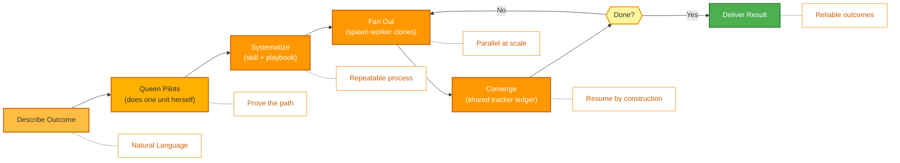

<p align="center">
  
</p>

<p align="center">
  <a href="../../README.md">English</a> |
  <a href="zh-CN.md">简体中文</a> |
  <a href="es.md">Español</a> |
  <a href="hi.md">हिन्दी</a> |
  <a href="pt.md">Português</a> |
  <a href="ja.md">日本語</a> |
  <a href="ru.md">Русский</a> |
  <a href="ko.md">한국어</a> |
  <a href="id.md">Bahasa Indonesia</a>
</p>

<p align="center">
  <a href="https://github.com/aden-hive/hive/blob/main/LICENSE"></a>
  <a href="https://www.ycombinator.com/companies/aden"></a>
  <a href="https://discord.com/invite/MXE49hrKDk"></a>
  <a href="https://x.com/aden_hq"></a>
  <a href="https://www.linkedin.com/company/teamaden/"></a>
  
</p>

<p align="center">
  
  
  
  
  
  
</p>
<p align="center">
  
  
  
</p>

<p align="center"><em>O agent harness para cargas de trabalho de produção — gerenciamento de estado, recuperação de falhas, observabilidade e supervisão humana para que seus agentes realmente funcionem.</em></p>

## Visão Geral

O OpenHive é um runtime sem configuração e agnóstico em relação a modelos para **colônias de agentes**. Uma colônia é um grupo de agentes especializados que trabalham juntos para executar um único processo de negócio: uma **Queen** — a líder persistente e voltada ao cliente — mais quantos agentes **worker** o trabalho exigir. Você descreve o resultado; a Queen faz o trabalho e, em seguida, faz crescer uma colônia ao redor dele para executar esse trabalho de forma confiável e em escala.

O mecanismo por baixo é **um loop controlando muitos loops**. O Hive tem uma única primitiva de execução: a Queen *é* um agent loop, e cada worker é um **clone** dela — mesmas ferramentas, mesmo modelo, sua própria tarefa. Não há grafo para compilar nem código boilerplate de orquestração para escrever. A colônia se coordena através de um ledger compartilhado e um plano persistente, com estado à prova de falhas, observabilidade profunda e supervisão humana integradas à única primitiva que todo agente compartilha. Veja a **[Visão Geral da Arquitetura](../architecture/README.md)** para entender como funciona.

## Funcionalidades

- ✅ Colônias de agentes — uma Queen gera clones de worker sob demanda para trabalho paralelo e de longa duração
- ✅ Uma primitiva, muitos loops — sem grafo para conectar; a Queen faz a colônia crescer em tempo de execução
- ✅ Ledger de tracker compartilhado + plano de tarefas persistente para coordenação sem um buffer de dados
- ✅ Personas de Queen com roteamento no estilo CEO e memória com escopo que evolui
- ✅ Park/resume à prova de falhas, aplicação de custos e human-in-the-loop fora de banda (Sentinel)
- ✅ Zero Configuração — nenhuma configuração técnica necessária
- ✅ General Compute Use e Browser Use com Extensão Nativa
- ✅ Suporte a Modelos Personalizados

Visite [adenhq.com](https://adenhq.com) para documentação completa, exemplos e guias.

Visite o [HoneyComb](http://honeycomb.open-hive.com/) para ver quais trabalhos estão sendo automatizados por IA. É um mercado de ações para trabalhos, movido pelo progresso dos agentes de IA da nossa comunidade. Você pode comprar (long) e vender a descoberto (short) trabalhos (sem dinheiro real, mas com token de computação) com base em quanto você acha que um trabalho será substituído pela IA.

https://github.com/user-attachments/assets/bf10edc3-06ba-48b6-98ba-d069b15fb69d


## Para Quem é o Hive?

O Hive é a camada de harness multi-agente para equipes que estão levando agentes de IA do protótipo para a produção. Agentes individuais como o Openclaw e o Cowork conseguem concluir tarefas pessoais muito bem, mas carecem do rigor necessário para cumprir processos de negócio.

O Hive é uma boa escolha se você:

- Deseja agentes de IA que **executem processos de negócio reais**, não demos
- Precisa de um **runtime que gerencie estado, recuperação e execução paralela** em escala
- Precisa de **agentes auto-reparáveis e adaptáveis** que melhoram ao longo do tempo
- Requer **controle com human-in-the-loop**, observabilidade e limites de custo
- Planeja executar agentes em **produção**, onde disponibilidade, custo e auditabilidade importam

O Hive pode não ser a melhor escolha se você está apenas experimentando cadeias de agentes simples ou scripts únicos.

## Quando Você Deve Usar o Hive?

Use o Hive quando o gargalo não é mais o modelo, mas o harness ao seu redor:

- Agentes de longa duração que precisam de **persistência de estado e recuperação de falhas**
- Cargas de trabalho de produção que exigem **aplicação de custos, observabilidade e trilhas de auditoria**
- Agentes que **melhoram ao longo do tempo** através de reflexion, memória com escopo e habilidades aprendidas
- Trabalho paralelo e multi-agente coordenado através de um **ledger de tracker compartilhado e plano persistente**
- Um framework que **escala com as melhorias dos modelos** em vez de lutar contra elas

## Links Rápidos

- **[Documentação](https://docs.adenhq.com/)** - Guias completos e referência de API
- **[Guia de Auto-Hospedagem](https://docs.adenhq.com/getting-started/quickstart)** - Implante o Hive em sua infraestrutura
- **[Changelog](https://github.com/aden-hive/hive/releases)** - Últimas atualizações e versões
- **[Roadmap](../roadmap.md)** - Funcionalidades e planos futuros
- **[Reportar Problemas](https://github.com/aden-hive/hive/issues)** - Relatórios de bugs e solicitações de funcionalidades
- **[Contribuindo](../../CONTRIBUTING.md)** - Como contribuir e enviar PRs

## Início Rápido

### Pré-requisitos

- Python 3.11+ para desenvolvimento de agentes
- Um provedor de LLM que alimenta os agentes
- **ripgrep (opcional, recomendado no Windows):** As ferramentas de busca `terminal_rg` / `terminal_glob` usam o ripgrep para uma busca de arquivos mais rápida. Se não estiver instalado, um fallback em Python é utilizado. No Windows: `winget install BurntSushi.ripgrep` ou `scoop install ripgrep`

> **Usuários Windows:** O Windows nativo é suportado via `quickstart.ps1` e `hive.ps1`. Execute-os no PowerShell 5.1+. O WSL também é uma opção, mas não é obrigatório.

### Instalação

> **Nota**
> O Hive usa um layout de workspace `uv` e não é instalado com `pip install`.
> Executar `pip install -e .` a partir da raiz do repositório criará um pacote placeholder e o Hive não funcionará corretamente.
> Por favor, use o script de quickstart abaixo para configurar o ambiente.

```bash
# Clone the repository
git clone https://github.com/aden-hive/hive.git
cd hive

# Run quickstart setup (macOS/Linux)
./quickstart.sh

# Windows (PowerShell)
.\quickstart.ps1
```

Isto configura:

- **framework** - Runtime principal do agente e executor de grafos (em `core/.venv`)
- **aden_tools** - Ferramentas MCP para capacidades de agentes (em `tools/.venv`)
- **credential store** - Armazenamento criptografado de chaves API (`~/.hive/credentials`)
- **LLM provider** - Configuração interativa de modelo padrão, incluindo Hive LLM e OpenRouter
- Todas as dependências Python necessárias com `uv`

- Por fim, ele abrirá a interface do Hive no seu navegador

> **Dica:** Para reabrir o dashboard mais tarde, execute `hive open` a partir do diretório do projeto.

### Construa Seu Primeiro Agente

Digite o agente que deseja construir na caixa de entrada da tela inicial. A queen vai fazer perguntas e elaborar uma solução junto com você.


### Use Agentes de Template

Clique em "Try a sample agent" e confira os templates. Você pode executar um template diretamente ou escolher construir sua versão em cima do template existente.

### Executar Agentes

Agora você pode executar um agente selecionando o agente (seja um agente existente ou um agente de exemplo). Você pode clicar no botão Executar no canto superior esquerdo, ou conversar com o agente queen e ele pode executar o agente para você.


## Integração

<a href="https://github.com/aden-hive/hive/tree/main/tools/src/aden_tools/tools"></a>
O Hive é construído para ser agnóstico em relação a modelos e sistemas.

- **Flexibilidade de LLM** - O Hive Framework suporta Anthropic, OpenAI, OpenRouter, Hive LLM e outros modelos hospedados ou locais através de provedores compatíveis com LiteLLM.
- **Conectividade com sistemas empresariais** - O Hive Framework é projetado para conectar-se a todos os tipos de sistemas empresariais como ferramentas, como CRM, suporte, mensagens, dados, arquivos e APIs internas via MCP.

## Por que Hive

À medida que os modelos melhoram, o limite superior do que os agentes podem fazer aumenta — mas sua confiabilidade e valor de produção são determinados pelo harness. O Hive foca em executar processos de negócio reais em vez de agentes genéricos. Em vez de fazer você conectar manualmente um grafo de fluxo de trabalho, definir cada interação de agente e lidar com falhas de forma reativa, o Hive inverte o paradigma: **você descreve o resultado, a Queen faz o trabalho primeiro e, em seguida, faz crescer uma colônia para escalá-lo** — uma experiência adaptativa e orientada a resultados, com um conjunto fácil de usar de ferramentas e integrações.



### Como Funciona

1. **[Descreva o resultado](../key_concepts/goals_outcome.md)** → Diga o que você quer em linguagem simples; um roteador no estilo CEO escolhe a [Queen](../key_concepts/queen.md) certa
2. **A Queen pilota** → Ela mesma faz uma unidade do trabalho, provando o caminho e registrando-o no tracker compartilhado
3. **[Sistematize](../key_concepts/improvement.md)** → Ela fatora o protocolo comprovado em uma skill + playbook — um processo repetível
4. **[Fan out](../key_concepts/colony.md)** → `run_worker` gera [clones de worker](../key_concepts/worker_agent.md) que executam em paralelo e reportam de volta
5. **Convergir e monitorar** → Os workers escrevem os resultados no tracker; a Queen valida via SQL, com métricas em tempo real, aplicação de orçamento e resume à prova de falhas

## Documentação

- **[Guia do Desenvolvedor](../developer-guide.md)** - Guia abrangente para desenvolvedores
- [Começando](../getting-started.md) - Instruções de configuração rápida
- [Guia de Configuração](../configuration.md) - Todas as opções de configuração
- [Visão Geral da Arquitetura](../architecture/README.md) - Design e estrutura do sistema

## Contribuindo
Aceitamos contribuições da comunidade! Estamos especialmente procurando ajuda para construir ferramentas, integrações e agentes de exemplo para o framework ([confira #2805](https://github.com/aden-hive/hive/issues/2805)). Se você está interessado em estender a funcionalidade, este é o lugar perfeito para começar. Por favor, consulte [CONTRIBUTING.md](../../CONTRIBUTING.md) para diretrizes.

**Importante:** Por favor, seja atribuído a uma issue antes de enviar um PR. Comente em uma issue para reivindicá-la e um mantenedor irá atribuí-la a você. Issues com passos reproduzíveis e propostas são priorizadas. Isso ajuda a evitar trabalho duplicado.

1. Encontre ou crie uma issue e seja atribuído
2. Faça fork do repositório
3. Crie sua branch de funcionalidade (`git checkout -b feature/amazing-feature`)
4. Faça commit das suas alterações (`git commit -m 'Add amazing feature'`)
5. Faça push para a branch (`git push origin feature/amazing-feature`)
6. Abra um Pull Request

## Comunidade e Suporte

Usamos o [Discord](https://discord.com/invite/MXE49hrKDk) para suporte, solicitações de funcionalidades e discussões da comunidade.

- Discord - [Junte-se à nossa comunidade](https://discord.com/invite/MXE49hrKDk)
- Twitter/X - [@adenhq](https://x.com/aden_hq)
- LinkedIn - [Página da Empresa](https://www.linkedin.com/company/teamaden/)

## Junte-se ao Nosso Time

**Estamos contratando!** Junte-se a nós em funções de engenharia, pesquisa e go-to-market.

[Ver Posições Abertas](https://jobs.adenhq.com/a8cec478-cdbc-473c-bbd4-f4b7027ec193/applicant)

## Segurança

Para questões de segurança, por favor consulte [SECURITY.md](../../SECURITY.md).

## Licença

Este projeto está licenciado sob a Licença Apache 2.0 - veja o arquivo [LICENSE](../../LICENSE) para detalhes.

## Perguntas Frequentes (FAQ)

**P: Quais provedores de LLM o Hive suporta?**

O Hive suporta mais de 100 provedores de LLM através da integração LiteLLM, incluindo OpenAI (GPT-4, GPT-4o), Anthropic (modelos Claude), Google Gemini, DeepSeek, Mistral, Groq, OpenRouter e Hive LLM. Simplesmente configure a variável de ambiente da chave API apropriada e especifique o nome do modelo. Veja [docs/configuration.md](../configuration.md) para exemplos de configuração específicos de cada provedor.

**P: Posso usar o Hive com modelos de IA locais como o Ollama?**

Sim! O Hive suporta modelos locais através do LiteLLM. Simplesmente use o formato de nome de modelo `ollama/model-name` (ex.: `ollama/llama3`, `ollama/mistral`) e certifique-se de que o Ollama esteja rodando localmente.

**P: O que torna o Hive diferente de outros frameworks de agentes?**

O Hive executa **colônias de agentes**, não agentes individuais nem grafos de agentes conectados manualmente. A maioria dos frameworks faz você compilar um grafo de nós e arestas distintos; o Hive tem uma única primitiva de execução — a Queen *é* um agent loop, e cada worker é um [clone](../key_concepts/the_loop.md) dela. A orquestração é um fan-out `run_worker` em tempo de execução, não um DAG compilado, e a colônia se coordena através de um [ledger de tracker compartilhado](../key_concepts/coordination.md) em vez de um buffer de dados. Sobre esse núcleo de "um loop, muitos loops", o Hive é um harness de produção — park/resume à prova de falhas, aplicação de custos, observabilidade em tempo real e human-in-the-loop fora de banda — herdado por todos os agentes porque existe apenas um tipo de agente. Veja a [Visão Geral da Arquitetura](../architecture/README.md).

**P: O Hive é open-source?**

Sim, o Hive é totalmente open-source sob a Licença Apache 2.0. Incentivamos ativamente contribuições e colaboração da comunidade.

**P: O Hive suporta fluxos de trabalho com human-in-the-loop?**

Sim. Uma Queen escala para um humano fora de banda através do **Sentinel** — um canal do Slack/Telegram vinculado à conta. O agent loop faz park (persistindo seu estado em disco), notifica o humano e retoma exatamente de onde parou quando ele responde. Como o escalonamento não é um nó em um grafo, qualquer agente em uma colônia pode pausar para o julgamento humano a qualquer momento, com timeouts configuráveis e políticas de escalonamento. Veja a [Visão Geral da Arquitetura](../architecture/README.md#reliability-is-in-the-primitive).

**P: Quais linguagens de programação o Hive suporta?**

O framework Hive é construído em Python. Um SDK JavaScript/TypeScript está no roadmap.

**P: Os agentes do Hive podem interagir com ferramentas e APIs externas?**

Sim. Todo agente em uma colônia tem acesso integrado a ferramentas, e o Hive conecta-se a APIs externas, bancos de dados e serviços através do MCP — incluindo mais de 100 ferramentas de integração, além de General Compute Use e Browser Use via a extensão nativa. Como a Queen e seus workers compartilham uma única superfície de ferramentas, uma capacidade que você adiciona fica disponível para toda a colônia.

**P: Como funciona o controle de custos no Hive?**

O Hive fornece controles de orçamento granulares, incluindo limites de gastos, throttles e políticas de degradação automática de modelo. Você pode definir orçamentos no nível de equipe, agente ou fluxo de trabalho, com rastreamento de custos e alertas em tempo real.

**P: Onde posso encontrar exemplos e documentação?**

Visite [docs.adenhq.com](https://docs.adenhq.com/) para guias completos, referência de API e tutoriais de introdução. O repositório também inclui documentação na pasta `docs/` e um abrangente [guia do desenvolvedor](../developer-guide.md).

**P: Como posso contribuir para o Aden?**

Contribuições são bem-vindas! Faça fork do repositório, crie sua branch de funcionalidade, implemente suas alterações e envie um pull request. Consulte [CONTRIBUTING.md](../../CONTRIBUTING.md) para diretrizes detalhadas.

## Histórico de Estrelas

<a href="https://www.star-history.com/?type=date&repos=aden-hive%2Fhive">
 <picture>
   <source media="(prefers-color-scheme: dark)" srcset="https://api.star-history.com/chart?repos=aden-hive/hive&type=date&theme=dark&legend=top-left&sealed_token=vfX1DG8w_KTkonUUtIEjFRLvBopgDzxQpyb8hiYT22sobcDIpvQiMciZghLsDu5hyU3LJs-ZddFjl8eYFx5zRrY-kcMRsfyQ3vAiacsroPoqgRYmZaES3Q" />
   <source media="(prefers-color-scheme: light)" srcset="https://api.star-history.com/chart?repos=aden-hive/hive&type=date&legend=top-left&sealed_token=vfX1DG8w_KTkonUUtIEjFRLvBopgDzxQpyb8hiYT22sobcDIpvQiMciZghLsDu5hyU3LJs-ZddFjl8eYFx5zRrY-kcMRsfyQ3vAiacsroPoqgRYmZaES3Q" />
   
 </picture>
</a>

---

<p align="center">
  Feito com 🔥 Paixão em San Francisco
</p>
