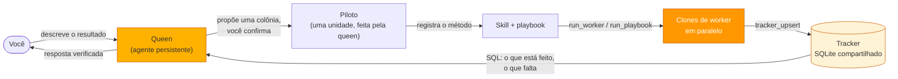

<p align="center">
  
</p>

<p align="center">
  <a href="../../README.md">English</a> |
  <a href="zh-CN.md">简体中文</a> |
  <a href="es.md">Español</a> |
  <a href="hi.md">हिन्दी</a> |
  <a href="pt.md">Português</a> |
  <a href="ja.md">日本語</a> |
  <a href="ru.md">Русский</a> |
  <a href="ko.md">한국어</a>
</p>

<p align="center">
  <a href="https://github.com/aden-hive/hive/blob/main/LICENSE"></a>
  <a href="https://www.ycombinator.com/companies/aden"></a>
  <a href="https://discord.com/invite/MXE49hrKDk"></a>
  <a href="https://x.com/aden_hq"></a>
  <a href="https://www.linkedin.com/company/teamaden/"></a>
</p>

<h3 align="center">Colônias de agentes de IA que executam os processos do seu negócio.</h3>

<p align="center">
  Descreva o resultado que você quer. Uma queen faz ela mesma a primeira parte do trabalho e depois faz crescer uma colônia de agentes worker para terminar o resto em paralelo, com cada resultado registrado em um ledger compartilhado que você pode consultar, retomar e auditar.
</p>

<p align="center">
  <a href="../assets/readme/demo.mp4"></a>
  <br />
  <sub>Gravado de uma execução real; só as esperas foram aceleradas. <a href="../assets/readme/demo.mp4">Assista em qualidade máxima (MP4)</a>.</sub>
</p>

## O que você acabou de ver

Um time de growth que está planejando um Show HN quer saber como foram, no Hacker News, os lançamentos de cinco ferramentas para desenvolvedores. Veja o que o Hive fez com essa única mensagem:

1. **Você entrega a tarefa a uma queen.** Cada queen é um agente persistente com um papel (aqui, Head of Growth), além de memória e ferramentas próprias.
2. **Ela faz a única pergunta que muda a resposta:** só os lançamentos originais ou qualquer lançamento? Você escolhe uma opção e ela segue em frente.
3. **Ela propõe uma colônia, e você confirma.** Cinco produtos são cinco tarefas paralelas, então o chat vira uma colônia: a queen mais quantos agentes worker o trabalho exigir.
4. **Ela mesma faz uma unidade.** Ela pega o Supabase, o caso mais complicado (a maior thread de lançamento dele não tem "Launch HN" no título), define o que conta como lançamento e registra o método como uma skill reutilizável.
5. **Ela executa tudo como um playbook:** um worker por produto, em paralelo, cada um seguindo a skill dela e gravando sua linha no tracker da colônia, uma tabela SQLite compartilhada.
6. **Ela confere cada linha antes de responder.** Os casos de borda continuam visíveis: o Cal.com não teve nenhum lançamento válido com nenhum dos seus dois nomes, então aparece no gráfico como ausente, e não como zero.

Nada nesse fluxo foi montado de antemão. Não há grafo de workflow para desenhar: a queen faz a colônia crescer em tempo de execução, e quem registra o que já foi feito e o que falta é o tracker em disco, não a memória de alguém.

## Início rápido

**Você precisa de:** Python 3.11+, Node.js 20+ e git. O quickstart instala o `uv` e o `ripgrep` se eles não estiverem instalados e se oferece para instalar o Node.

**E de um modelo.** O quickstart guia você na configuração de qualquer uma destas opções:

- uma chave de API: Anthropic, OpenAI, Google Gemini, Groq, Cerebras ou OpenRouter
- uma assinatura de ferramenta de código que você já tenha: Claude Code, OpenAI Codex, Kimi Code, MiniMax, Z.AI ou Antigravity
- Hive LLM
- um modelo local via Ollama, sem precisar de chave nenhuma

```bash
git clone https://github.com/aden-hive/hive.git
cd hive
./quickstart.sh          # macOS / Linux
.\quickstart.ps1         # Windows (PowerShell 5.1+)
```

O quickstart cria um único ambiente Python para o workspace, guarda sua chave de API em um armazenamento criptografado de credenciais em `~/.hive`, pergunta qual modelo usar, faz o build do dashboard e o abre em `http://127.0.0.1:8787`. Para abri-lo de novo depois, execute `hive open` a partir do repositório.

> [!NOTE]
> O Hive é um workspace `uv`, não um pacote pip. O comando `pip install -e .` instala um placeholder que não funciona; use o quickstart.

**Depois:** digite uma tarefa na tela inicial e escolha a queen que vai recebê-la, ou abra a **Prompt Library** e envie um prompt pronto direto para a queen para quem ele foi escrito.

## Como funciona


```mermaid
flowchart LR
    You(["Você"]) -->|"descreve o resultado"| Queen["Queen<br/>(agente persistente)"]
    Queen -->|"propõe uma colônia,<br/>você confirma"| Pilot["Piloto<br/>(uma unidade, feita pela queen)"]
    Pilot -->|"registra o método"| Skill["Skill + playbook"]
    Skill -->|"run_worker / run_playbook"| W["Clones de worker<br/>em paralelo"]
    W -->|"tracker_upsert"| T[("Tracker<br/>SQLite compartilhado")]
    T -->|"SQL: o que está feito,<br/>o que falta"| Queen
    Queen -->|"resposta verificada"| You

    style Queen fill:#ffb100,stroke:#cc5d00,color:#333
    style T fill:#fff3d6,stroke:#cc5d00,color:#333
    style W fill:#ff9800,stroke:#cc5d00,color:#fff
```

O Hive tem **uma única primitiva de execução**: um agent loop. A queen é um deles; cada worker é um clone dela, com sua própria tarefa, um conjunto mais restrito de ferramentas e um orçamento rígido. A orquestração é uma chamada de ferramenta, não um grafo compilado:

- **`run_worker`** distribui as tarefas e retorna na hora, então a queen continua conversando com você enquanto os workers rodam. Por padrão, até quatro rodam ao mesmo tempo; o resto fica na fila. O relatório de cada worker que termina chega à conversa da queen como um novo turno.
- **O tracker** é o estado compartilhado da colônia. A queen define a tabela e em quais colunas os workers podem escrever; os workers fazem upsert de uma linha por unidade de trabalho; a queen acompanha o progresso com SQL. Ele fica em disco, em `~/.hive/colonies/<name>/tracker/tracker.db`.
- **`run_playbook`** aplica um protocolo já validado a todas as linhas: retentativas com backoff, lanes com rate limit e uma lista de dead letter para as linhas que continuam falhando. Como "o que falta" é sempre uma consulta nova ao tracker, rodar um playbook de novo retoma a execução de onde ela parou.

A **[visão geral da arquitetura](../architecture/README.md)** explica o loop, a superfície de ferramentas, a memória, a supervisão humana e como o estado sobrevive a um crash.

<table>
  <tr>
    <td width="50%"><br /><sub><b>Tela inicial.</b> Suas queens e as colônias delas em um único mapa. Descreva uma tarefa e escolha quem vai assumi-la.</sub></td>
    <td width="50%"><br /><sub><b>Workers.</b> Um por unidade de trabalho, cada um com sua própria tarefa e orçamento, todos reportando à queen.</sub></td>
  </tr>
  <tr>
    <td width="50%"><br /><sub><b>Tracker.</b> Os resultados entram em uma tabela compartilhada à medida que os workers terminam, prontos para consultar, exportar ou retomar a partir deles.</sub></td>
    <td width="50%"><br /><sub><b>Resultado.</b> Uma resposta verificada, com fontes e gráfico, no próprio chat.</sub></td>
  </tr>
</table>

## O que tem dentro

**Queens com uma função e uma memória.** O Hive vem com treze queens com personas: seis ficam ativas por padrão (Growth, RevOps, Content, Lead Generation, Outbound, Brand & Design), as demais podem ser contratadas no Org Chart, e você pode criar as suas. Cada uma mantém uma memória em markdown com escopo, escrita por uma etapa de reflexão, e conversas anteriores relevantes são trazidas automaticamente para o contexto dela.

**Ferramentas nativas, no mesmo processo.** Comandos de shell e jobs em segundo plano, edição de arquivos, busca rápida em código, PDFs, anexos e imagens, web scraping, gráficos (ECharts e Mermaid), arquivos CSV e geração de imagens com o Hive LLM. Elas rodam dentro do próprio Hive, sem nenhum servidor de ferramentas para iniciar.

**Seu navegador, controlado pelos seus agentes.** A extensão Hive Browser Bridge permite que os agentes operem o seu próprio Chrome, onde você já está logado. Cada worker ganha seu próprio grupo de abas.

**Skills.** Instruções reutilizáveis no formato aberto [Agent Skills](https://agentskills.io). O Hive já vem com um conjunto delas, as queens escrevem novas quando um protocolo se prova, e você pode gerenciá-las na Skills Library.

**Qualquer servidor MCP.** Adicione um servidor MCP externo com `hive mcp add` e as ferramentas dele entram nas mesmas allowlists das ferramentas nativas. O catálogo completo de integrações em [`tools/`](../../tools/src/aden_tools/tools) (GitHub, Gmail, HubSpot, Slack, Notion e muitas outras) roda como um servidor MCP; veja [docs/tools.md](../tools.md).

**Roda enquanto você está fora.** As colônias podem se agendar sozinhas com gatilhos de cron, de intervalo ou de webhook. O **Sentinel**, que você ativa por colônia, observa uma queen quando ela para: dá um empurrão para ela continuar ou escala o caso para você pela caixa de entrada do Hive, pelo Telegram ou pelo Slack, e ela retoma o trabalho quando você responde.

**Feito para sobreviver.** Todo agente persiste seu estado em disco e, depois de um crash ou reinício, retoma exatamente de onde parou. Resultados grandes de ferramentas vão para arquivos em vez de inundar o contexto, sessões longas se compactam sozinhas, turnos travados ou em loop são detectados, e todo worker roda com um limite rígido de chamadas de ferramenta.

**Qualquer modelo.** Tudo o que o [LiteLLM](https://docs.litellm.ai/docs/providers) suporta, incluindo OpenAI, Anthropic, Gemini, OpenRouter, Hive LLM, qualquer endpoint compatível com OpenAI e modelos locais via Ollama. Os workers podem usar um modelo diferente do da sua queen, e modelos só de texto continuam enxergando imagens graças a um fallback de visão.

## O Hive é para você?

O Hive faz sentido quando a parte difícil já não é o modelo, e sim tudo ao redor dele:

- Um processo com **muitas unidades de trabalho parecidas**, como leads, contas, tickets, repositórios ou documentos, que você quer executar em paralelo e sempre do mesmo jeito.
- Trabalho que **roda por horas ou de forma agendada** e precisa sobreviver a reinícios.
- Resultados que você precisa **conferir, consultar e auditar**, e não só ler em um chat.
- Um **humano que continua no comando** das decisões que importam.

Para um único prompt ou um script pontual, um agente comum é mais simples.

## Documentação

- [Primeiros passos](../getting-started.md): a configuração em mais detalhes
- [Visão geral da arquitetura](../architecture/README.md): como colônias, o loop, as ferramentas e a memória se encaixam
- Conceitos principais: [colônia](../key_concepts/colony.md), [queen](../key_concepts/queen.md), [workers](../key_concepts/worker_agent.md), [coordenação](../key_concepts/coordination.md), [o loop](../key_concepts/the_loop.md), [objetivos e resultados](../key_concepts/goals_outcome.md), [como as colônias melhoram](../key_concepts/improvement.md)
- [Ferramentas](../tools.md): ferramentas nativas, servidores MCP e o catálogo de integrações
- [Configuração](../configuration.md) e o [guia do desenvolvedor](../developer-guide.md)
- [docs.adenhq.com](https://docs.adenhq.com/): documentação online

## Perguntas frequentes

**Quais modelos o Hive suporta?**
Qualquer provedor suportado pelo [LiteLLM](https://docs.litellm.ai/docs/providers), além de qualquer endpoint compatível com OpenAI. O quickstart configura os mais comuns, incluindo assinaturas de ferramentas de código como Claude Code e OpenAI Codex; o [docs/configuration.md](../configuration.md) cobre o resto.

**Posso rodar com modelos locais?**
Sim. Escolha Ollama no quickstart ou configure um modelo como `ollama/llama3` com o Ollama rodando localmente.

**Qual a diferença para outros frameworks de agentes?**
Na maioria dos frameworks, você desenha um grafo de agentes e conecta as entradas e saídas deles. O Hive tem um único tipo de agente: a queen é um agent loop e cada worker é um clone dela. A orquestração acontece em tempo de execução, por meio de chamadas de ferramenta, e a coordenação passa por um tracker SQL compartilhado, e não por mensagens trocadas ao longo das arestas. Os recursos do harness (persistência, retomada, orçamentos, compactação, supervisão) ficam nesse único loop, então todo agente já vem com eles.

**Onde ficam meus dados?**
Na sua máquina. Sessões, colônias, trackers e memória são arquivos comuns em `~/.hive` (ou onde `HIVE_HOME` apontar), e as chaves de API ficam guardadas ali, criptografadas.

**Como mantenho os custos sob controle?**
Cada worker roda com limites rígidos de turnos e de chamadas de ferramenta, então um worker travado para sozinho, e a concorrência tem um teto. O uso é medido em cada chamada ao modelo. Ainda não há limites de gasto em dólares.

**Os agentes podem usar minhas próprias ferramentas e APIs?**
Sim: pelo shell e pelo navegador nativos, por qualquer servidor MCP que você adicionar e por skills que ensinam a eles os seus procedimentos.

**O Hive é open source?**
Sim, sob a [Licença Apache 2.0](../../LICENSE).

## Contribuindo

Contribuições são bem-vindas, principalmente ferramentas, integrações e skills ([#2805](https://github.com/aden-hive/hive/issues/2805)). Leia o [CONTRIBUTING.md](../../CONTRIBUTING.md) primeiro e seja atribuído a uma issue antes de abrir um pull request: comente na issue e um mantenedor vai atribuí-la a você. Issues com passos para reproduzir ou com uma proposta têm prioridade.

## Comunidade

- [Discord](https://discord.com/invite/MXE49hrKDk) para dúvidas, pedidos de funcionalidades e discussões
- [X / Twitter](https://x.com/aden_hq) e [LinkedIn](https://www.linkedin.com/company/teamaden/) para novidades
- [HoneyComb](http://honeycomb.open-hive.com/): um mercado da comunidade que acompanha quais profissões os agentes de IA estão automatizando. Aposte na alta ou na baixa de uma profissão com tokens de computação, não com dinheiro.

**Estamos contratando** para engenharia, pesquisa e go-to-market. [Veja as vagas abertas](https://jobs.adenhq.com/a8cec478-cdbc-473c-bbd4-f4b7027ec193/applicant).

## Segurança

Para reportar uma vulnerabilidade, veja o [SECURITY.md](../../SECURITY.md).

## Licença

Licença Apache 2.0. Veja [LICENSE](../../LICENSE).

## Histórico de estrelas

<a href="https://www.star-history.com/?type=date&repos=aden-hive%2Fhive">
 <picture>
   <source media="(prefers-color-scheme: dark)" srcset="https://api.star-history.com/chart?repos=aden-hive/hive&type=date&theme=dark&legend=top-left&sealed_token=vfX1DG8w_KTkonUUtIEjFRLvBopgDzxQpyb8hiYT22sobcDIpvQiMciZghLsDu5hyU3LJs-ZddFjl8eYFx5zRrY-kcMRsfyQ3vAiacsroPoqgRYmZaES3Q" />
   <source media="(prefers-color-scheme: light)" srcset="https://api.star-history.com/chart?repos=aden-hive/hive&type=date&legend=top-left&sealed_token=vfX1DG8w_KTkonUUtIEjFRLvBopgDzxQpyb8hiYT22sobcDIpvQiMciZghLsDu5hyU3LJs-ZddFjl8eYFx5zRrY-kcMRsfyQ3vAiacsroPoqgRYmZaES3Q" />
   
 </picture>
</a>

---

<p align="center">Feito com 🔥 Paixão em San Francisco</p>
