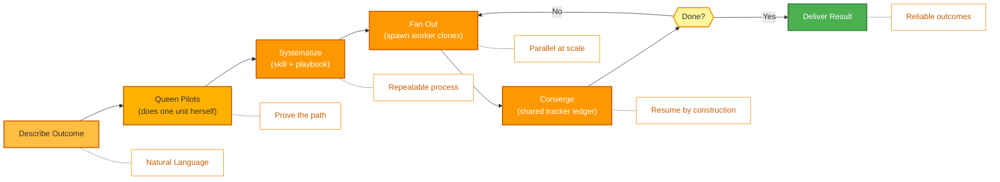

<p align="center">
  
</p>

<p align="center">
  <a href="../../README.md">English</a> |
  <a href="zh-CN.md">简体中文</a> |
  <a href="es.md">Español</a> |
  <a href="hi.md">हिन्दी</a> |
  <a href="pt.md">Português</a> |
  <a href="ja.md">日本語</a> |
  <a href="ru.md">Русский</a> |
  <a href="ko.md">한국어</a> |
  <a href="id.md">Bahasa Indonesia</a>
</p>

<p align="center">
  <a href="https://github.com/aden-hive/hive/blob/main/LICENSE"></a>
  <a href="https://www.ycombinator.com/companies/aden"></a>
  <a href="https://discord.com/invite/MXE49hrKDk"></a>
  <a href="https://x.com/aden_hq"></a>
  <a href="https://www.linkedin.com/company/teamaden/"></a>
  
</p>

<p align="center">
  
  
  
  
  
  
</p>
<p align="center">
  
  
  
</p>

<p align="center"><em>The agent harness for production workloads — state management, failure recovery, observability, and human oversight so your agents actually run.</em></p>

## Обзор

OpenHive — это среда выполнения без настройки и независимая от модели, предназначенная для **колоний агентов** (colonies of agents). Колония (colony) — это группа специализированных агентов, которые работают вместе, чтобы выполнять один бизнес-процесс: **Queen** («Матка») — постоянный, обращённый к клиенту руководитель — плюс столько **worker**-агентов («рабочих»), сколько требует задача. Вы описываете желаемый результат; Queen выполняет работу сама, а затем выращивает вокруг неё колонию, чтобы выполнять эту работу надёжно и в масштабе.

В основе лежит механизм **«один цикл управляет многими циклами»** (one loop controlling many loops). У Hive есть единственный примитив выполнения: Queen *является* циклом агента (AgentLoop), а каждый worker — это её **clone** («клон»): те же инструменты, та же модель, но своя задача. Нет графа, который нужно компилировать, и нет шаблонного кода оркестрации, который нужно писать. Колония координируется через общий журнал (ledger) и постоянный план, а устойчивое к сбоям состояние, глубокая наблюдаемость и человеческий надзор встроены в тот единственный примитив, который разделяют все агенты. О том, как это работает, читайте в **[Обзоре архитектуры](../architecture/README.md)**.

## Возможности

- ✅ Колонии агентов — Queen по требованию порождает клонов-worker'ов для параллельной, длительной работы
- ✅ Один примитив, множество циклов — никакого графа для связывания; Queen выращивает колонию во время выполнения
- ✅ Общий журнал-tracker + постоянный план задач для координации без буфера данных
- ✅ Персоны Queen с маршрутизацией в стиле CEO и развивающейся памятью с ограниченной областью видимости
- ✅ Устойчивые к сбоям приостановка/возобновление (park/resume), контроль затрат и внеполосное вмешательство человека в контуре (Sentinel)
- ✅ Нулевая настройка — не требуется никакой технической конфигурации
- ✅ Общее использование компьютера (General Compute Use) и управление браузером (Browser Use) с нативным расширением
- ✅ Поддержка пользовательских моделей

Посетите [adenhq.com](https://adenhq.com) для полной документации, примеров и руководств.

Посетите [HoneyComb](http://honeycomb.open-hive.com/), чтобы увидеть, какие рабочие места автоматизируются ИИ. Это биржа рабочих мест, движимая прогрессом ИИ-агентов нашего сообщества. Вы можете открывать длинные и короткие позиции по рабочим местам (без реальных денег, но с помощью compute-токенов) в зависимости от того, насколько сильно, по вашему мнению, та или иная работа будет заменена ИИ.

https://github.com/user-attachments/assets/bf10edc3-06ba-48b6-98ba-d069b15fb69d


## Для кого создан Hive?

Hive — это уровень оснастки (harness) для мультиагентных систем, предназначенный для команд, переводящих ИИ-агентов из прототипа в продакшен. Одиночные агенты, такие как Openclaw и Cowork, вполне неплохо справляются с личными задачами, но им не хватает строгости для выполнения бизнес-процессов.

Hive хорошо вам подойдёт, если вы:

- Хотите ИИ-агентов, которые **выполняют реальные бизнес-процессы**, а не демо
- Нуждаетесь в **среде выполнения, которая управляет состоянием, восстановлением и параллельным выполнением** в масштабе
- Нуждаетесь в **самовосстанавливающихся и адаптивных агентах**, которые улучшаются со временем
- Требуете **контроля с человеком в контуре**, наблюдаемости и лимитов затрат
- Планируете запускать агентов в **продакшене**, где важны время безотказной работы, затраты и возможность аудита

Hive может не быть лучшим выбором, если вы лишь экспериментируете с простыми цепочками агентов или одноразовыми скриптами.

## Когда следует использовать Hive?

Используйте Hive, когда узким местом становится уже не модель, а оснастка (harness) вокруг неё:

- Длительно работающие агенты, которым нужны **сохранение состояния и восстановление после сбоев**
- Продакшен-нагрузки, требующие **контроля затрат, наблюдаемости и журналов аудита**
- Агенты, которые **улучшаются со временем** за счёт рефлексии, памяти с ограниченной областью видимости и выученных навыков
- Параллельная мультиагентная работа, координируемая через **общий журнал-tracker и постоянный план**
- Фреймворк, который **масштабируется вместе с улучшениями моделей**, а не борется с ними

## Быстрые ссылки

- **[Документация](https://docs.adenhq.com/)** - Полные руководства и справочник API
- **[Руководство по самостоятельному хостингу](https://docs.adenhq.com/getting-started/quickstart)** - Разверните Hive в своей инфраструктуре
- **[История изменений](https://github.com/aden-hive/hive/releases)** - Последние обновления и релизы
- **[Дорожная карта](../roadmap.md)** - Предстоящие функции и планы
- **[Сообщить о проблемах](https://github.com/aden-hive/hive/issues)** - Отчёты об ошибках и запросы функций
- **[Участие в разработке](../../CONTRIBUTING.md)** - Как внести вклад и отправить PR

## Быстрый старт

### Предварительные требования

- Python 3.11+ для разработки агентов
- LLM-провайдер, который обеспечивает работу агентов
- **ripgrep (опционально, рекомендуется в Windows):** Поисковые инструменты `terminal_rg` / `terminal_glob` используют ripgrep для более быстрого поиска файлов. Если он не установлен, используется резервный вариант на Python. В Windows: `winget install BurntSushi.ripgrep` или `scoop install ripgrep`

> **Пользователи Windows:** Нативная поддержка Windows обеспечивается через `quickstart.ps1` и `hive.ps1`. Запускайте их в PowerShell 5.1+. WSL также возможен, но не обязателен.

### Установка

> **Примечание**
> Hive использует структуру рабочего пространства `uv` и не устанавливается через `pip install`.
> Выполнение `pip install -e .` из корня репозитория создаст пакет-заглушку, и Hive не будет работать корректно.
> Пожалуйста, используйте скрипт быстрого старта ниже для настройки окружения.

```bash
# Clone the repository
git clone https://github.com/aden-hive/hive.git
cd hive

# Run quickstart setup (macOS/Linux)
./quickstart.sh

# Windows (PowerShell)
.\quickstart.ps1
```

Это установит:

- **framework** - Основная среда выполнения агентов и исполнитель графов (в `core/.venv`)
- **aden_tools** - MCP-инструменты для возможностей агентов (в `tools/.venv`)
- **credential store** - Зашифрованное хранилище API-ключей (`~/.hive/credentials`)
- **LLM provider** - Интерактивная настройка модели по умолчанию, включая Hive LLM и OpenRouter
- Все необходимые зависимости Python через `uv`

- В конце будет открыт интерфейс Hive в вашем браузере

> **Совет:** Чтобы снова открыть панель управления позже, выполните `hive open` из каталога проекта.

### Создайте своего первого агента

Введите описание агента, которого хотите создать, в поле ввода на главном экране. Queen задаст вам вопросы и вместе с вами выработает решение.


### Используйте шаблоны агентов

Нажмите «Try a sample agent» и просмотрите шаблоны. Вы можете запустить шаблон напрямую или создать свою версию на основе существующего шаблона.

### Запуск агентов

Теперь вы можете запустить агента, выбрав его (существующего агента или пример агента). Вы можете нажать кнопку «Run» в верхнем левом углу или поговорить с агентом Queen, и она запустит агента за вас.


## Интеграция

<a href="https://github.com/aden-hive/hive/tree/main/tools/src/aden_tools/tools"></a>
Hive создан модельно-агностичным и системно-агностичным.

- **Гибкость LLM** - Hive Framework поддерживает Anthropic, OpenAI, OpenRouter, Hive LLM и другие облачные или локальные модели через LiteLLM-совместимых провайдеров.
- **Подключение к бизнес-системам** - Hive Framework разработан для подключения ко всем видам бизнес-систем в качестве инструментов, таким как CRM, поддержка, мессенджеры, данные, файлы и внутренние API через MCP.

## Почему Hive

По мере совершенствования моделей растёт верхняя граница того, что могут делать агенты, — но их надёжность и ценность для продакшена определяются оснасткой (harness). Hive сосредоточен на выполнении реальных бизнес-процессов, а не на создании универсальных агентов. Вместо того чтобы заставлять вас вручную связывать граф рабочего процесса, определять каждое взаимодействие агентов и реактивно обрабатывать сбои, Hive переворачивает парадигму: **вы описываете результат, Queen сначала выполняет работу сама, а затем выращивает колонию, чтобы масштабировать её** — ориентированный на результат, адаптивный опыт с простым в использовании набором инструментов и интеграций.



### Как это работает

1. **[Опишите результат](../key_concepts/goals_outcome.md)** → Скажите, чего хотите, простым языком; маршрутизатор в стиле CEO выбирает подходящую [Queen](../key_concepts/queen.md)
2. **Queen выполняет пилот** → Она сама выполняет одну единицу работы, проверяя путь и записывая его в общий tracker
3. **[Систематизируйте](../key_concepts/improvement.md)** → Она превращает проверенный протокол в навык + плейбук — повторяемый процесс
4. **[Разветвление](../key_concepts/colony.md)** → `run_worker` порождает [клонов-worker'ов](../key_concepts/worker_agent.md), которые работают параллельно и отчитываются о результатах
5. **Сведение и мониторинг** → Worker'ы записывают результаты в tracker; Queen проверяет их через SQL, с метриками в реальном времени, контролем бюджета и устойчивым к сбоям возобновлением

## Документация

- **[Руководство разработчика](../developer-guide.md)** - Полное руководство для разработчиков
- [Начало работы](../getting-started.md) - Инструкции по быстрой настройке
- [Руководство по конфигурации](../configuration.md) - Все опции конфигурации
- [Обзор архитектуры](../architecture/README.md) - Дизайн и структура системы

## Участие в разработке
Мы приветствуем вклад сообщества! Мы особенно ищем помощь в создании инструментов, интеграций и примеров агентов для фреймворка ([см. #2805](https://github.com/aden-hive/hive/issues/2805)). Если вы заинтересованы в расширении его функциональности, это идеальное место для начала. Пожалуйста, ознакомьтесь с руководствами в [CONTRIBUTING.md](../../CONTRIBUTING.md).

**Важно:** Пожалуйста, получите назначение на issue перед отправкой PR. Оставьте комментарий в issue, чтобы заявить о своём желании работать над ним, и мейнтейнер назначит вас. Issue с воспроизводимыми шагами и предложениями приоритизируются. Это помогает избежать дублирования работы.

1. Найдите или создайте issue и получите назначение
2. Сделайте форк репозитория
3. Создайте ветку функции (`git checkout -b feature/amazing-feature`)
4. Зафиксируйте изменения (`git commit -m 'Add amazing feature'`)
5. Отправьте в ветку (`git push origin feature/amazing-feature`)
6. Откройте Pull Request

## Сообщество и поддержка

Мы используем [Discord](https://discord.com/invite/MXE49hrKDk) для поддержки, запросов функций и обсуждений сообщества.

- Discord - [Присоединиться к сообществу](https://discord.com/invite/MXE49hrKDk)
- Twitter/X - [@adenhq](https://x.com/aden_hq)
- LinkedIn - [Страница компании](https://www.linkedin.com/company/teamaden/)

## Присоединяйтесь к команде

**Мы нанимаем!** Присоединяйтесь к нам на позициях в инженерии, исследованиях и выходе на рынок.

[Посмотреть открытые позиции](https://jobs.adenhq.com/a8cec478-cdbc-473c-bbd4-f4b7027ec193/applicant)

## Безопасность

По вопросам безопасности, пожалуйста, обратитесь к [SECURITY.md](../../SECURITY.md).

## Лицензия

Этот проект лицензирован под лицензией Apache 2.0 — см. файл [LICENSE](../../LICENSE) для деталей.

## Часто задаваемые вопросы (FAQ)

**В: Каких провайдеров LLM поддерживает Hive?**

Hive поддерживает более 100 провайдеров LLM через интеграцию LiteLLM, включая OpenAI (GPT-4, GPT-4o), Anthropic (модели Claude), Google Gemini, DeepSeek, Mistral, Groq, OpenRouter и Hive LLM. Просто настройте соответствующую переменную окружения с API-ключом и укажите имя модели. Примеры конфигурации для конкретных провайдеров см. в [docs/configuration.md](../configuration.md).

**В: Могу ли я использовать Hive с локальными ИИ-моделями, такими как Ollama?**

Да! Hive поддерживает локальные модели через LiteLLM. Просто используйте формат имени модели `ollama/model-name` (например, `ollama/llama3`, `ollama/mistral`) и убедитесь, что Ollama запущен локально.

**В: Что отличает Hive от других фреймворков агентов?**

Hive запускает **колонии агентов**, а не одиночных агентов или вручную связанные графы агентов. Большинство фреймворков заставляют вас компилировать граф из отдельных узлов и рёбер; у Hive есть один примитив выполнения — Queen *является* циклом агента (AgentLoop), а каждый worker — это её [clone](../key_concepts/the_loop.md). Оркестрация — это разветвление `run_worker` во время выполнения, а не скомпилированный DAG, и колония координируется через [общий журнал-tracker](../key_concepts/coordination.md) вместо буфера данных. Поверх этого ядра «один цикл, множество циклов» Hive представляет собой продакшен-оснастку (harness) — устойчивые к сбоям приостановка/возобновление, контроль затрат, наблюдаемость в реальном времени и внеполосное вмешательство человека в контуре — которую наследует каждый агент, потому что существует лишь один вид агентов. См. [Обзор архитектуры](../architecture/README.md).

**В: Является ли Hive проектом с открытым исходным кодом?**

Да, Hive полностью с открытым исходным кодом под лицензией Apache 2.0. Мы активно поощряем вклад и сотрудничество сообщества.

**В: Поддерживает ли Hive рабочие процессы с человеком в контуре?**

Да. Queen эскалирует вопрос человеку внеполосно через **Sentinel** — привязанный к учётной записи канал Slack/Telegram. Цикл агента (AgentLoop) приостанавливается (сохраняя своё состояние на диск), уведомляет человека и возобновляется ровно с того места, где остановился, когда человек отвечает. Поскольку эскалация не является узлом в графе, любой агент в колонии может приостановиться для человеческого решения в любой момент, с настраиваемыми таймаутами и политиками эскалации. См. [Обзор архитектуры](../architecture/README.md#reliability-is-in-the-primitive).

**В: Какие языки программирования поддерживает Hive?**

Фреймворк Hive написан на Python. JavaScript/TypeScript SDK находится в дорожной карте.

**В: Могут ли агенты Hive взаимодействовать с внешними инструментами и API?**

Да. Каждый агент в колонии имеет встроенный доступ к инструментам, и Hive подключается к внешним API, базам данных и сервисам через MCP — включая более 100 интеграционных инструментов, а также General Compute Use и Browser Use через нативное расширение. Поскольку Queen и её worker'ы разделяют единую поверхность инструментов, добавленная вами возможность становится доступна всей колонии.

**В: Как работает контроль затрат в Hive?**

Hive предоставляет детальный контроль бюджета, включая лимиты расходов, ограничения и политики автоматической деградации модели. Вы можете устанавливать бюджеты на уровне команды, агента или рабочего процесса с отслеживанием затрат в реальном времени и оповещениями.

**В: Где найти примеры и документацию?**

Посетите [docs.adenhq.com](https://docs.adenhq.com/) для полных руководств, справочника API и обучающих материалов по началу работы. Репозиторий также включает документацию в папке `docs/` и подробное [руководство разработчика](../developer-guide.md).

**В: Как я могу внести вклад в Aden?**

Вклад приветствуется! Сделайте форк репозитория, создайте ветку функции, реализуйте изменения и отправьте pull request. Подробные руководства см. в [CONTRIBUTING.md](../../CONTRIBUTING.md).

## История звёзд

<a href="https://www.star-history.com/?type=date&repos=aden-hive%2Fhive">
 <picture>
   <source media="(prefers-color-scheme: dark)" srcset="https://api.star-history.com/chart?repos=aden-hive/hive&type=date&theme=dark&legend=top-left&sealed_token=vfX1DG8w_KTkonUUtIEjFRLvBopgDzxQpyb8hiYT22sobcDIpvQiMciZghLsDu5hyU3LJs-ZddFjl8eYFx5zRrY-kcMRsfyQ3vAiacsroPoqgRYmZaES3Q" />
   <source media="(prefers-color-scheme: light)" srcset="https://api.star-history.com/chart?repos=aden-hive/hive&type=date&legend=top-left&sealed_token=vfX1DG8w_KTkonUUtIEjFRLvBopgDzxQpyb8hiYT22sobcDIpvQiMciZghLsDu5hyU3LJs-ZddFjl8eYFx5zRrY-kcMRsfyQ3vAiacsroPoqgRYmZaES3Q" />
   
 </picture>
</a>

---

<p align="center">
  Made with 🔥 Passion in San Francisco
</p>
