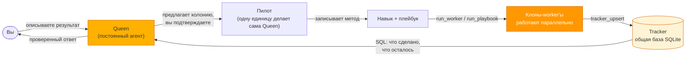

<p align="center">
  
</p>

<p align="center">
  <a href="../../README.md">English</a> |
  <a href="zh-CN.md">简体中文</a> |
  <a href="es.md">Español</a> |
  <a href="hi.md">हिन्दी</a> |
  <a href="pt.md">Português</a> |
  <a href="ja.md">日本語</a> |
  <a href="ru.md">Русский</a> |
  <a href="ko.md">한국어</a>
</p>

<p align="center">
  <a href="https://github.com/aden-hive/hive/blob/main/LICENSE"></a>
  <a href="https://www.ycombinator.com/companies/aden"></a>
  <a href="https://discord.com/invite/MXE49hrKDk"></a>
  <a href="https://x.com/aden_hq"></a>
  <a href="https://www.linkedin.com/company/teamaden/"></a>
</p>

<h3 align="center">Колонии ИИ-агентов, которые ведут ваши бизнес-процессы.</h3>

<p align="center">
  Опишите нужный результат. Queen сама выполняет первую часть работы, а затем выращивает колонию worker-агентов, которые параллельно доделывают остальное. Все результаты попадают в общий журнал: по нему можно делать запросы, продолжать прерванную работу и проводить аудит.
</p>

<p align="center">
  <a href="../assets/readme/demo.mp4"></a>
  <br />
  <sub>Запись реального запуска; ускорено только ожидание. <a href="../assets/readme/demo.mp4">Смотреть в полном качестве (MP4)</a>.</sub>
</p>

## Что вы только что увидели

Growth-команда готовит Show HN и хочет узнать, как прошли на Hacker News собственные запуски пяти инструментов для разработчиков. Вот что Hive сделал с одним этим сообщением:

1. **Вы передаёте задачу Queen.** Каждая Queen — это постоянный агент со своей ролью (здесь это Head of Growth), собственной памятью и инструментами.
2. **Она задаёт единственный вопрос, от которого зависит ответ:** учитывать только первые запуски или любые? Вы выбираете вариант, и она продолжает.
3. **Она предлагает колонию, вы подтверждаете.** Пять продуктов — это пять параллельных задач, поэтому чат превращается в колонию: Queen плюс столько worker-агентов, сколько нужно для работы.
4. **Одну единицу работы она делает сама.** Она берёт Supabase, самый неудобный случай (в заголовке его крупнейшего треда о запуске нет «Launch HN»), решает, что считать запуском, и записывает метод как переиспользуемый навык.
5. **Она запускает его как плейбук:** по одному worker'у на продукт, параллельно; каждый следует её навыку и записывает свою строку в tracker колонии — общую таблицу SQLite.
6. **Перед ответом она проверяет каждую строку.** Пограничные случаи остаются на виду: у Cal.com не нашлось подходящего запуска ни под одним из двух его названий, поэтому на графике он отмечен как отсутствующий, а не как ноль.

Ничего в этом процессе не было настроено заранее. Не нужно проектировать граф рабочего процесса: Queen выращивает колонию во время выполнения, а что сделано и что осталось, фиксирует tracker на диске, а не чья-то память.

## Быстрый старт

**Что понадобится:** Python 3.11+, Node.js 20+ и git. Quickstart сам установит `uv` и `ripgrep`, если их нет, и предложит установить Node.

**И модель.** Quickstart поможет подключить любой из вариантов:

- API-ключ: Anthropic, OpenAI, Google Gemini, Groq, Cerebras или OpenRouter
- уже имеющаяся подписка на инструмент для программирования: Claude Code, OpenAI Codex, Kimi Code, MiniMax, Z.AI или Antigravity
- Hive LLM
- локальная модель через Ollama, вообще без ключа

```bash
git clone https://github.com/aden-hive/hive.git
cd hive
./quickstart.sh          # macOS / Linux
.\quickstart.ps1         # Windows (PowerShell 5.1+)
```

Quickstart создаёт одно Python-окружение для всего рабочего пространства, сохраняет API-ключ в зашифрованное хранилище учётных данных в `~/.hive`, спрашивает, какую модель использовать, собирает панель управления и открывает её по адресу `http://127.0.0.1:8787`. Чтобы открыть её снова, выполните `hive open` в каталоге репозитория.

> [!NOTE]
> Hive — это рабочее пространство `uv`, а не pip-пакет. `pip install -e .` установит нерабочую заглушку; используйте quickstart.

**Дальше:** введите задачу на главном экране и выберите Queen, которой её передать, или откройте **Prompt Library** и отправьте готовый промпт прямо той Queen, для которой он написан.

## Как это работает


```mermaid
flowchart LR
    You(["Вы"]) -->|"описываете результат"| Queen["Queen<br/>(постоянный агент)"]
    Queen -->|"предлагает колонию,<br/>вы подтверждаете"| Pilot["Пилот<br/>(одну единицу делает сама Queen)"]
    Pilot -->|"записывает метод"| Skill["Навык + плейбук"]
    Skill -->|"run_worker / run_playbook"| W["Клоны-worker'ы<br/>работают параллельно"]
    W -->|"tracker_upsert"| T[("Tracker<br/>общая база SQLite")]
    T -->|"SQL: что сделано,<br/>что осталось"| Queen
    Queen -->|"проверенный ответ"| You

    style Queen fill:#ffb100,stroke:#cc5d00,color:#333
    style T fill:#fff3d6,stroke:#cc5d00,color:#333
    style W fill:#ff9800,stroke:#cc5d00,color:#fff
```

У Hive **один примитив выполнения** — цикл агента. Queen — это такой цикл, а каждый worker — его клон со своей задачей, более узким набором инструментов и жёстким бюджетом. Оркестрация — это вызов инструмента, а не скомпилированный граф:

- **`run_worker`** раздаёт задачи и сразу возвращает управление, поэтому Queen продолжает общаться с вами, пока worker'ы работают. По умолчанию одновременно работают до четырёх, остальные ждут в очереди. Отчёт каждого завершившегося worker'а приходит в диалог Queen новым сообщением.
- **Tracker** — общее состояние колонии. Queen задаёт таблицу и столбцы, в которые worker'ам разрешено писать; worker'ы делают upsert по одной строке на единицу работы; Queen проверяет прогресс через SQL. Tracker хранится на диске: `~/.hive/colonies/<name>/tracker/tracker.db`.
- **`run_playbook`** прогоняет проверенный протокол по каждой строке: повторные попытки с нарастающей задержкой (backoff), очереди с ограничением частоты запросов, dead-letter-список для строк, которые раз за разом падают. «Что осталось» — это всегда свежий запрос к tracker, поэтому повторный запуск плейбука продолжает его с места остановки.

В **[обзоре архитектуры](../architecture/README.md)** описаны цикл, набор инструментов, память, контроль со стороны человека и то, как состояние переживает сбой.

<table>
  <tr>
    <td width="50%"><br /><sub><b>Главный экран.</b> Ваши Queen и их колонии на одной карте. Опишите задачу и выберите, кто за неё возьмётся.</sub></td>
    <td width="50%"><br /><sub><b>Worker'ы.</b> По одному на единицу работы, у каждого своя задача и бюджет, и все отчитываются перед Queen.</sub></td>
  </tr>
  <tr>
    <td width="50%"><br /><sub><b>Tracker.</b> Результаты попадают в общую таблицу по мере того, как worker'ы заканчивают работу. Их можно запрашивать, экспортировать и продолжать с них работу.</sub></td>
    <td width="50%"><br /><sub><b>Результат.</b> Проверенный ответ с источниками и графиком прямо в чате.</sub></td>
  </tr>
</table>

## Что внутри

**Queen с должностью и памятью.** В комплекте Hive тринадцать Queen-персон: шесть активны по умолчанию (Growth, RevOps, Content, Lead Generation, Outbound, Brand & Design), остальных можно «нанять» в Org Chart, а ещё можно создать свою. Каждая ведёт markdown-память с ограниченной областью видимости, которую пополняет шаг рефлексии, а релевантные прошлые разговоры автоматически подтягиваются в её контекст.

**Встроенные инструменты в том же процессе.** Shell-команды и фоновые задачи, редактирование файлов, быстрый поиск по коду, PDF, вложения и изображения, веб-скрейпинг, графики (ECharts и Mermaid), CSV-файлы и генерация изображений через Hive LLM. Всё это работает внутри самого Hive, никаких серверов инструментов запускать не нужно.

**Ваш браузер под управлением ваших агентов.** Расширение Hive Browser Bridge позволяет агентам работать в вашем собственном Chrome, где вы уже вошли во все нужные аккаунты. Каждый worker получает свою группу вкладок.

**Навыки.** Переиспользуемые инструкции в открытом формате [Agent Skills](https://agentskills.io). Hive поставляется с готовым набором, Queen пишут новые, когда протокол себя оправдывает, а управлять ими можно в Skills Library.

**Любой MCP-сервер.** Добавьте внешний MCP-сервер командой `hive mcp add`, и его инструменты попадут в те же списки разрешённых, что и встроенные. Полный каталог интеграций в [`tools/`](../../tools/src/aden_tools/tools) (GitHub, Gmail, HubSpot, Slack, Notion и многие другие) работает как один такой сервер; см. [docs/tools.md](../tools.md).

**Работает, пока вас нет.** Колонии могут запускаться сами по cron, по интервалу или по webhook. **Sentinel**, который включается отдельно для каждой колонии, следит за Queen, когда она останавливается: подталкивает её продолжать или эскалирует вопрос вам через входящие Hive, Telegram или Slack, а когда вы отвечаете, она продолжает работу.

**Переживает сбои.** Каждый агент сохраняет состояние на диск и после сбоя или перезапуска продолжает ровно с того места, где остановился. Большие результаты инструментов выгружаются в файлы, а не забивают контекст, длинные сессии сами себя сжимают, зависшие и зациклившиеся ходы обнаруживаются, а каждый worker работает в жёстком бюджете вызовов инструментов.

**Любая модель.** Всё, что поддерживает [LiteLLM](https://docs.litellm.ai/docs/providers), включая OpenAI, Anthropic, Gemini, OpenRouter, Hive LLM, любой OpenAI-совместимый эндпоинт и локальные модели через Ollama. Worker'ы могут работать на другой модели, чем их Queen, а чисто текстовые модели всё равно «видят» изображения благодаря резервной vision-модели.

## Подходит ли вам Hive?

Hive подходит, когда сложность уже не в модели, а во всём, что её окружает:

- Процесс с **множеством однотипных единиц работы** (лиды, аккаунты, тикеты, репозитории или документы), которые нужно обрабатывать параллельно и одинаково.
- Работа, которая **идёт часами или по расписанию** и должна переживать перезапуски.
- Результаты, которые нужно **проверять, запрашивать и аудировать**, а не просто читать в чате.
- **Человек, который сохраняет контроль** над важными решениями.

Для одного промпта или разового скрипта проще обычный агент.

## Документация

- [Начало работы](../getting-started.md): подробнее об установке
- [Обзор архитектуры](../architecture/README.md): как связаны колонии, цикл, инструменты и память
- Ключевые понятия: [колония](../key_concepts/colony.md), [Queen](../key_concepts/queen.md), [worker'ы](../key_concepts/worker_agent.md), [координация](../key_concepts/coordination.md), [цикл](../key_concepts/the_loop.md), [цели и результаты](../key_concepts/goals_outcome.md), [как колонии совершенствуются](../key_concepts/improvement.md)
- [Инструменты](../tools.md): встроенные инструменты, MCP-серверы и каталог интеграций
- [Конфигурация](../configuration.md) и [руководство разработчика](../developer-guide.md)
- [Дорожная карта](../roadmap.md): что вошло в V1 и что ещё предстоит сделать
- [docs.adenhq.com](https://docs.adenhq.com/): онлайн-документация

## Частые вопросы

**Какие модели поддерживает Hive?**
Любого провайдера, которого поддерживает [LiteLLM](https://docs.litellm.ai/docs/providers), а также любой OpenAI-совместимый эндпоинт. Quickstart настраивает популярные варианты, включая подписки для программирования вроде Claude Code и OpenAI Codex; об остальных читайте в [docs/configuration.md](../configuration.md).

**Можно ли запускать Hive на локальных моделях?**
Да. Выберите Ollama в quickstart или укажите модель вроде `ollama/llama3` и запустите Ollama локально.

**Чем Hive отличается от других агентных фреймворков?**
Большинство фреймворков заставляют проектировать граф агентов и связывать их входы и выходы. В Hive один вид агента: Queen — это цикл агента, а каждый worker — её клон. Оркестрация происходит во время выполнения через вызовы инструментов, а координация идёт через общий SQL-tracker, а не через сообщения, которые передаются по рёбрам графа. Возможности оснастки (сохранение состояния, возобновление, бюджеты, сжатие контекста, надзор) встроены в этот единственный цикл, поэтому они есть у каждого агента.

**Где хранятся мои данные?**
На вашем компьютере. Сессии, колонии, tracker'ы и память — это обычные файлы в `~/.hive` (или там, куда указывает `HIVE_HOME`), и API-ключи хранятся там же в зашифрованном виде.

**Как держать расходы под контролем?**
Каждый worker работает с жёсткими лимитами на число ходов и вызовов инструментов, поэтому зависший worker останавливается сам, а число одновременно работающих worker'ов ограничено. Расход учитывается при каждом вызове модели. Лимитов расходов в долларах пока нет.

**Могут ли агенты пользоваться моими инструментами и API?**
Да: через встроенные shell и браузер, через любой добавленный вами MCP-сервер и через навыки, которые обучают их вашим процедурам.

**Hive — проект с открытым исходным кодом?**
Да, под лицензией [Apache License 2.0](../../LICENSE).

## Участие в разработке

Мы рады любому вкладу, особенно инструментам, интеграциям и навыкам ([#2805](https://github.com/aden-hive/hive/issues/2805)). Сначала прочитайте [CONTRIBUTING.md](../../CONTRIBUTING.md) и, прежде чем открывать pull request, получите назначение на issue: оставьте в нём комментарий, и мейнтейнер вас назначит. Issue с шагами воспроизведения или конкретным предложением рассматриваются в первую очередь.

## Сообщество

- [Discord](https://discord.com/invite/MXE49hrKDk): вопросы, запросы функций и обсуждения
- [X / Twitter](https://x.com/aden_hq) и [LinkedIn](https://www.linkedin.com/company/teamaden/): новости проекта
- [HoneyComb](http://honeycomb.open-hive.com/): рынок сообщества, который отслеживает, какие профессии автоматизируют ИИ-агенты. Открывайте длинные или короткие позиции по профессиям за compute-токены, а не за деньги.

**Мы нанимаем** инженеров, исследователей и специалистов по go-to-market. [Открытые вакансии](https://jobs.adenhq.com/a8cec478-cdbc-473c-bbd4-f4b7027ec193/applicant).

## Безопасность

Как сообщить об уязвимости, описано в [SECURITY.md](../../SECURITY.md).

## Лицензия

Apache License 2.0. См. [LICENSE](../../LICENSE).

## История звёзд

<a href="https://www.star-history.com/?type=date&repos=aden-hive%2Fhive">
 <picture>
   <source media="(prefers-color-scheme: dark)" srcset="https://api.star-history.com/chart?repos=aden-hive/hive&type=date&theme=dark&legend=top-left&sealed_token=vfX1DG8w_KTkonUUtIEjFRLvBopgDzxQpyb8hiYT22sobcDIpvQiMciZghLsDu5hyU3LJs-ZddFjl8eYFx5zRrY-kcMRsfyQ3vAiacsroPoqgRYmZaES3Q" />
   <source media="(prefers-color-scheme: light)" srcset="https://api.star-history.com/chart?repos=aden-hive/hive&type=date&legend=top-left&sealed_token=vfX1DG8w_KTkonUUtIEjFRLvBopgDzxQpyb8hiYT22sobcDIpvQiMciZghLsDu5hyU3LJs-ZddFjl8eYFx5zRrY-kcMRsfyQ3vAiacsroPoqgRYmZaES3Q" />
   
 </picture>
</a>

---

<p align="center">Сделано с 🔥 любовью в Сан-Франциско</p>
