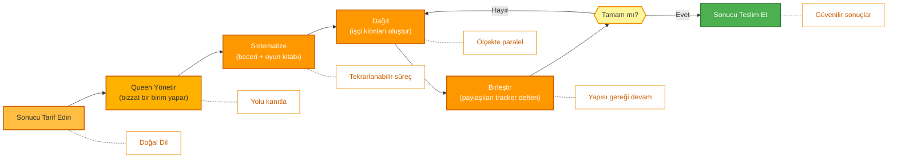

<p align="center">
  
</p>

<p align="center">
  <a href="../../README.md">English</a> |
  <a href="zh-CN.md">简体中文</a> |
  <a href="es.md">Español</a> |
  <a href="hi.md">हिन्दी</a> |
  <a href="pt.md">Português</a> |
  <a href="ja.md">日本語</a> |
  <a href="ru.md">Русский</a> |
  <a href="ko.md">한국어</a> |
  <a href="tr.md">Türkçe</a>
</p>

<p align="center">
  <a href="https://github.com/aden-hive/hive/blob/main/LICENSE"></a>
  <a href="https://www.ycombinator.com/companies/aden"></a>
  <a href="https://discord.com/invite/MXE49hrKDk"></a>
  <a href="https://x.com/aden_hq"></a>
  <a href="https://www.linkedin.com/company/teamaden/"></a>
  
</p>

<p align="center">
  
  
  
  
  
  
</p>
<p align="center">
  
  
  
</p>

<p align="center"><em>Üretim iş yükleri için ajan çerçevesi (agent harness) — durum yönetimi, hata kurtarma, gözlemlenebilirlik ve insan denetimi; böylece ajanlarınız gerçekten çalışır.</em></p>

## Genel Bakış

OpenHive, **ajan kolonileri** için sıfır kurulum gerektiren, modelden bağımsız bir çalışma zamanıdır (runtime). Koloni, bir iş sürecini birlikte yürütmek için çalışan uzman ajanlardan oluşan bir gruptur: kalıcı ve müşteriyle temas halinde olan lider olan bir **Queen** (Kraliçe) ile işin gerektirdiği sayıda **worker** (işçi) ajan. Siz sonucu tarif edersiniz; Queen işi kendisi yapar, ardından bu işi güvenilir ve ölçekli biçimde yürütmek için etrafında bir koloni büyütür.

Temeldeki mekanizma **tek bir döngünün birçok döngüyü kontrol etmesidir**. Hive'ın tek bir yürütme ilkesi (execution primitive) vardır: Queen *zaten* bir ajan döngüsüdür ve her işçi onun bir **klonudur** — aynı araçlar, aynı model, kendi görevi. Derlenecek bir graf yok, yazılacak bir orkestrasyon şablon kodu yok. Koloni, paylaşılan bir defter ve kalıcı bir plan aracılığıyla koordine olur; çökme güvenli durum, derin gözlemlenebilirlik ve insan denetimi, her ajanın paylaştığı bu tek ilkele gömülüdür. Nasıl çalıştığını görmek için **[Mimari Genel Bakış](../architecture/README.md)** sayfasına bakın.

## Özellikler

- ✅ Ajan kolonileri — Queen, paralel ve uzun süren işler için ihtiyaç anında işçi klonları oluşturur
- ✅ Tek ilkel, birçok döngü — kablolanacak graf yok; Queen koloniyi çalışma zamanında büyütür
- ✅ Koordinasyon için veri arabelleği olmadan paylaşılan tracker defteri + kalıcı görev planı
- ✅ CEO tarzı yönlendirme ve gelişen, kapsamı belirlenmiş bellekle Queen kişilikleri
- ✅ Çökme güvenli duraklatma/devam ettirme, maliyet uygulaması ve bant dışı insan-in-the-loop (Sentinel)
- ✅ Sıfır Kurulum — teknik yapılandırma gerekmez
- ✅ Genel Hesaplama Kullanımı ve Yerel Eklenti ile Tarayıcı Kullanımı
- ✅ Özel Model Desteği

Eksiksiz belgeler, örnekler ve rehberler için [adenhq.com](https://adenhq.com) adresini ziyaret edin.

AI tarafından hangi işlerin otomatikleştirildiğini görmek için [HoneyComb](http://honeycomb.open-hive.com/) adresini ziyaret edin. İşler için bir borsa, topluluğumuzun AI ajanı ilerlemesiyle yönlendirilir. Bir işin AI tarafından ne kadarının devralınacağına dair görüşünüze göre işlerde uzun ve kısa pozisyon alabilirsiniz (gerçek para değil, hesaplama token'i ile).

https://github.com/user-attachments/assets/bf10edc3-06ba-48b6-98ba-d069b15fb69d


## Hive Kimin İçindir?

Hive, AI ajanlarını prototipten üretime taşıyan ekipler için çoklu ajan çerçeve katmanıdır. Openclaw ve Cowork gibi tekil ajanlar kişisel işleri epey iyi tamamlayabilir, ancak iş süreçlerini yerine getirmek için gereken titizlikten yoksundur.

Hive şu durumlarda iyi bir seçimdir:

- AI ajanlarının **gerçek iş süreçlerini yürütmesini** istiyorsanız, yalnızca demo değil
- Ölçekli olarak **durum, kurtarma ve paralel yürütmeyi yöneten bir çalışma zamanına** ihtiyacınız varsa
- Zaman içinde **refleksiyon, bellek ve öğrenilen becerilerle gelişen adaptif ajanlara** ihtiyacınız varsa
- **İnsan-in-the-loop kontrolü**, gözlemlenebilirlik ve maliyet sınırları gerektiriyorsanız
- Ajanları, çalışma süresi, maliyet ve denetlenebilirliğin önemli olduğu **üretim** ortamında çalıştırmayı planlıyorsanız

Yalnızca basit ajan zincirleriyle ya da tek seferlik betiklerle deney yapıyorsanız Hive sizin için en iyi seçim olmayabilir.

## Hive Ne Zaman Kullanılmalı?

Darboğazın artık model değil, etrafındaki çerçeve olduğu durumlarda Hive'ı kullanın:

- **Durum kalıcılığı ve çökme kurtarma** gerektiren uzun süreli ajanlar
- **Maliyet uygulaması, gözlemlenebilirlik ve denetim izleri** gerektiren üretim iş yükleri
- Refleksiyon, kapsamlı bellek ve öğrenilen becerilerle **zaman içinde gelişen** ajanlar
- **Paylaşılan bir tracker defteri ve kalıcı plan** aracılığıyla koordine edilen paralel, çoklu ajan işleri
- Model iyileştirmeleriyle **uyum içinde ölçeklenen**, onlara karşı koymayan bir çerçeve

## Hızlı Bağlantılar

- **[Belgeler](https://docs.adenhq.com/)** - Eksiksiz rehberler ve API referansı
- **[Kendi Barındırma Rehberi](https://docs.adenhq.com/getting-started/quickstart)** - Hive'ı kendi altyapınızda dağıtın
- **[Değişiklik Günlüğü](https://github.com/aden-hive/hive/releases)** - En son güncellemeler ve sürümler
- **[Yol Haritası](../roadmap.md)** - Yaklaşan özellikler ve planlar
- **[Sorun Bildirin](https://github.com/aden-hive/hive/issues)** - Hata raporları ve özellik istekleri
- **[Katkıda Bulunma](../../CONTRIBUTING.md)** - Nasıl katkıda bulunulur ve PR gönderilir

## Hızlı Başlangıç

### Önkoşullar

- Ajan geliştirme için Python 3.11+
- Ajanlara güç veren bir LLM sağlayıcısı
- **ripgrep (isteğe bağlı, Windows'ta önerilir):** `terminal_rg` / `terminal_glob` arama araçları daha hızlı dosya araması için ripgrep kullanır. Yüklü değilse bir Python yedek yolu kullanılır. Windows'ta: `winget install BurntSushi.ripgrep` veya `scoop install ripgrep`

> **Windows Kullanıcıları:** Yerel Windows, `quickstart.ps1` ve `hive.ps1` aracılığıyla desteklenir. Bunları PowerShell 5.1+ üzerinde çalıştırın. WSL de bir seçenektir ancak zorunlu değildir.

### Kurulum

> **Not**
> Hive, bir `uv` workspace düzeni kullanır ve `pip install` ile kurulmaz.
> Depo kök dizininden `pip install -e .` çalıştırmak bir yer tutucu paket oluşturur ve Hive düzgün çalışmaz.
> Lütfen ortamı kurmak için aşağıdaki hızlı başlangıç betiğini kullanın.

```bash
# Clone the repository
git clone https://github.com/aden-hive/hive.git
cd hive

# Run quickstart setup (macOS/Linux)
./quickstart.sh

# Windows (PowerShell)
.\quickstart.ps1
```

Bu komut şunları kurar:

- **framework** - Çekirdek ajan çalışma zamanı ve koloni çalışma zamanı (`core/.venv` içinde)
- **aden_tools** - Ajan yetenekleri için MCP araçları (`tools/.venv` içinde)
- **credential store** - Şifrelenmiş API anahtarı saklama (`~/.hive/credentials`)
- **LLM provider** - Hive LLM ve OpenRouter dahil etkileşimli varsayılan model yapılandırması
- `uv` ile gerekli tüm Python bağımlılıkları

- Son olarak Hive arayüzünü tarayıcınızda açacaktır

> **İpucu:** Kontrol panelini daha sonra yeniden açmak için proje dizininden `hive open` komutunu çalıştırın.

### İlk Ajanınızı Oluşturun

Oluşturmak istediğiniz ajanı ana ekrandaki giriş kutusuna yazın. Queen size sorular soracak ve birlikte bir çözüm üretecektir.


### Şablon Ajanları Kullanın

"Try a sample agent" üzerine tıklayın ve şablonlara göz atın. Bir şablonu doğrudan çalıştırabilir ya da mevcut şablonun üzerine kendi sürümünüzü inşa etmeyi seçebilirsiniz.

### Ajanları Çalıştırma

Artık bir ajanı seçerek (mevcut bir ajan veya örnek ajan) çalıştırabilirsiniz. Sol üstteki Çalıştır düğmesine tıklayabilir ya da Queen ajanıyla konuşabilirsiniz; Queen sizin için seçtiğiniz ajanı çalıştırabilir.


## Entegrasyon

<a href="https://github.com/aden-hive/hive/tree/main/tools/src/aden_tools/tools"></a>
Hive, modelden ve sistemden bağımsız olacak şekilde inşa edilmiştir.

- **LLM esnekliği** - Hive Framework, Anthropic, OpenAI, OpenRouter, Hive LLM ve LiteLLM uyumlu sağlayıcılar aracılığıyla diğer barındırılan ya da yerel modelleri destekler.
- **İş sistemi bağlanabilirliği** - Hive Framework, CRM, destek, mesajlaşma, veri, dosya ve MCP üzerinden dahili API'ler gibi her türlü iş sistemine araç olarak bağlanmak üzere tasarlanmıştır.

## Neden Hive

Modeller iyileştikçe, ajanların yapabileceklerinin üst sınırı yükselir — ancak güvenilirlikleri ve üretimdeki değerleri çerçeveye bağlıdır. Hive, genel amaçlı ajanlar yerine gerçek iş süreçlerini yürütmeye odaklanır. Sizi bir iş akışı grafiğini elle kurmaya, her ajan etkileşimini tanımlamaya ve arızaları tepkisel olarak ele almaya zorlamak yerine Hive paradigmayı tersine çevirir: **sonucu siz tarif edersiniz, Queen işi ilk önce kendisi yapar, ardından onu ölçeklendirmek için bir koloni büyütür** — kullanımı kolay araç ve entegrasyonlarla sonuç odaklı, uyarlanabilir bir deneyim.



### Nasıl Çalışır

1. **[Sonucu tarif edin](../key_concepts/goals_outcome.md)** → İstediğinizi sade bir dille söyleyin; CEO tarzı bir yönlendirici doğru [Queen](../key_concepts/queen.md)'i seçer
2. **Queen yönetir** → İşin bir birimini kendisi yapar, yolu kanıtlar ve paylaşılan tracker'a kaydeder
3. **[Sistematize](../key_concepts/improvement.md)** → Kanıtlanmış protokolü bir beceri + oyun kitabına dönüştürür — tekrarlanabilir bir süreç
4. **[Dağıt](../key_concepts/colony.md)** → `run_worker`, paralel çalışan ve geri bildirimde bulunan [işçi klonları](../key_concepts/worker_agent.md) oluşturur
5. **Birleştir ve izle** → İşçiler sonuçları tracker'a yazar; Queen SQL ile doğrular, gerçek zamanlı metrikler, bütçe uygulaması ve çökme güvenli devam ettirme ile çalışır.

## Belgeler

- **[Geliştirici Rehberi](../developer-guide.md)** - Geliştiriciler için kapsamlı rehber
- [Başlarken](../getting-started.md) - Hızlı kurulum yönergeleri
- [Yapılandırma Rehberi](../configuration.md) - Tüm yapılandırma seçenekleri
- [Mimari Genel Bakış](../architecture/README.md) - Sistem tasarımı ve yapısı

## Katkıda Bulunma
Topluluktan gelen katkıları memnuniyetle karşılıyoruz! Özellikle çerçeve için araçlar, entegrasyonlar ve örnek ajanlar oluşturma konusunda yardım arıyoruz ([#2805'e bakın](https://github.com/aden-hive/hive/issues/2805)). İşlevselliğini genişletmek ilginizi çekiyorsa başlamak için mükemmel bir yer burası. Yönergeler için lütfen [CONTRIBUTING.md](../../CONTRIBUTING.md) sayfasına bakın.

**Önemli:** Lütfen PR göndermeden önce bir konuya atanmayı talep edin. Talep etmek için ilgili konuya yorum yapın; bir bakımcı sizi atayacaktır. Tekrarlanabilir adımları ve önerileri olan konular önceliklidir. Bu, yinelenen işleri önlemeye yardımcı olur.

1. Bir konu bulun veya oluşturun ve kendinize atanmasını sağlayın
2. Depoyu fork'layın
3. Özellik dalınızı oluşturun (`git checkout -b feature/amazing-feature`)
4. Değişikliklerinizi commit'leyin (`git commit -m 'Add amazing feature'`)
5. Dala push'layın (`git push origin feature/amazing-feature`)
6. Bir Pull Request açın

## Topluluk ve Destek

Destek, özellik istekleri ve topluluk tartışmaları için [Discord](https://discord.com/invite/MXE49hrKDk) kullanıyoruz.

- Discord - [Topluluğumuza katılın](https://discord.com/invite/MXE49hrKDk)
- Twitter/X - [@adenhq](https://x.com/aden_hq)
- LinkedIn - [Şirket Sayfası](https://www.linkedin.com/company/teamaden/)

## Ekibimize Katılın

**İşe alım yapıyoruz!** Mühendislik, araştırma ve pazara giriş (go-to-market) rollerinde bize katılın.

[Açık Pozisyonları Görün](https://jobs.adenhq.com/a8cec478-cdbc-473c-bbd4-f4b7027ec193/applicant)

## Güvenlik

Güvenlik ile ilgili konular için lütfen [SECURITY.md](../../SECURITY.md) sayfasına bakın.

## Lisans

Bu proje Apache Lisansı 2.0 ile lisanslanmıştır - ayrıntılar için [LICENSE](../../LICENSE) dosyasına bakın.

## Sıkça Sorulan Sorular (SSS)

**S: Hive hangi LLM sağlayıcılarını destekler?**

Hive, LiteLLM entegrasyonu aracılığıyla OpenAI (GPT-4, GPT-4o), Anthropic (Claude modelleri), Google Gemini, DeepSeek, Mistral, Groq, OpenRouter ve Hive LLM dahil 100'den fazla LLM sağlayıcısını destekler. Uygun API anahtarı ortam değişkenini ayarlayıp model adını belirtmeniz yeterlidir. Sağlayıcıya özel yapılandırma örnekleri için [docs/configuration.md](../configuration.md) sayfasına bakın.

**S: Hive'ı Ollama gibi yerel AI modelleriyle kullanabilir miyim?**

Evet! Hive, LiteLLM aracılığıyla yerel modelleri destekler. `ollama/model-name` model adı biçimini kullanın (örn. `ollama/llama3`, `ollama/mistral`) ve Ollama'nın yerel olarak çalıştığından emin olun.

**S: Hive'ı diğer ajan çerçevelerinden farklı kılan nedir?**

Hive, tekil ajanları veya elle kablolanmış ajan grafiklerini değil **ajan kolonilerini** çalıştırır. Çoğu çerçeve sizi ayrı düğüm ve kenarlardan oluşan bir graf derlemeye zorlar; Hive tek bir yürütme ilkeline sahiptir — Queen *zaten* bir ajan döngüsüdür ve her işçi onun bir [klonudur](../key_concepts/the_loop.md). Orkestrasyon, derlenmiş bir DAG değil, çalışma zamanında bir `run_worker` dağıtımıdır; koloni, bir veri arabelleği yerine [paylaşılan bir tracker defteri](../key_concepts/coordination.md) aracılığıyla koordine olur. "Tek döngü, birçok döngü" çekirdeğinin üzerine Hive, çökme güvenli duraklatma/devam ettirme, maliyet uygulaması, gerçek zamanlı gözlemlenebilirlik ve bant dışı insan-in-the-loop özelliklerine sahip bir üretim çerçevesidir — sadece bir tür ajan olduğu için her ajan bunları devralır. [Mimari Genel Bakış](../architecture/README.md) sayfasına bakın.

**S: Hive açık kaynak mı?**

Evet, Hive tamamen açık kaynaktır ve Apache Lisansı 2.0 ile lisanslanmıştır. Topluluk katkılarını ve iş birliğini aktif olarak teşvik ediyoruz.

**S: Hive insan-in-the-loop iş akışlarını destekliyor mu?**

Evet. Bir Queen, **Sentinel** — hesaba bağlı bir Slack/Telegram kanalı — aracılığıyla bir insana bant dışı olarak yükseltme yapar. Ajan döngüsü duraklar (durumunu diske kaydeder), insana bildirimde bulunur ve insan yanıt verdiğinde tam olarak kaldığı yerden devam eder. Yükseltme graf içinde bir düğüm olmadığı için, bir kolonideki herhangi bir ajan yapılandırılabilir zaman aşımları ve yükseltme politikalarıyla herhangi bir noktada insan yargısı için duraklatılabilir. [Mimari Genel Bakış](../architecture/README.md#reliability-is-in-the-primitive) sayfasına bakın.

**S: Hive hangi programlama dillerini destekler?**

Hive çerçevesi Python ile yazılmıştır. Bir JavaScript/TypeScript SDK'sı yol haritasındadır.

**S: Hive ajanları harici araçlar ve API'lerle etkileşime girebilir mi?**

Evet. Bir kolonideki her ajan yerleşik araç erişimine sahiptir ve Hive, MCP aracılığıyla harici API'lere, veritabanlarına ve hizmetlere bağlanır — 100'den fazla entegrasyon aracının yanı sıra yerel eklenti aracılığıyla Genel Hesaplama Kullanımı ve Tarayıcı Kullanımı. Queen ve işçileri tek bir araç yüzeyini paylaştığı için, eklediğiniz bir yetenek tüm koloninin erişimine açılır.

**S: Hive'da maliyet kontrolü nasıl çalışır?**

Hive, harcama limitleri, kısıtlamalar ve otomatik model düşürme politikaları dahil ayrıntılı bütçe kontrolleri sunar. Gerçek zamanlı maliyet takibi ve uyarılarla birlikte ekip, ajan veya iş akışı düzeyinde bütçeler belirleyebilirsiniz.

**S: Örnekleri ve belgeleri nerede bulabilirim?**

Eksiksiz rehberler, API referansı ve başlangıç eğitimleri için [docs.adenhq.com](https://docs.adenhq.com/) adresini ziyaret edin. Depo ayrıca `docs/` klasöründe belgeleri ve kapsamlı bir [geliştirici rehberi](../developer-guide.md) içerir.

**S: Aden'e nasıl katkıda bulunabilirim?**

Katkılar memnuniyetle karşılanır! Depoyu fork'layın, özellik dalınızı oluşturun, değişikliklerinizi uygulayın ve bir pull request gönderin. Ayrıntılı yönergeler için [CONTRIBUTING.md](../../CONTRIBUTING.md) sayfasına bakın.

## Yıldız Geçmişi

<a href="https://www.star-history.com/?type=date&repos=aden-hive%2Fhive">
 <picture>
   <source media="(prefers-color-scheme: dark)" srcset="https://api.star-history.com/chart?repos=aden-hive/hive&type=date&theme=dark&legend=top-left&sealed_token=vfX1DG8w_KTkonUUtIEjFRLvBopgDzxQpyb8hiYT22sobcDIpvQiMciZghLsDu5hyU3LJs-ZddFjl8eYFx5zRrY-kcMRsfyQ3vAiacsroPoqgRYmZaES3Q" />
   <source media="(prefers-color-scheme: light)" srcset="https://api.star-history.com/chart?repos=aden-hive/hive&type=date&legend=top-left&sealed_token=vfX1DG8w_KTkonUUtIEjFRLvBopgDzxQpyb8hiYT22sobcDIpvQiMciZghLsDu5hyU3LJs-ZddFjl8eYFx5zRrY-kcMRsfyQ3vAiacsroPoqgRYmZaES3Q" />
   
 </picture>
</a>

---

<p align="center">
  San Francisco'da 🔥 Tutku ile yapıldı
</p>
