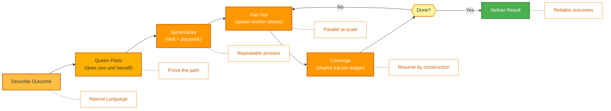

<p align="center">
  
</p>

<p align="center">
  <a href="../../README.md">English</a> |
  <a href="zh-CN.md">简体中文</a> |
  <a href="es.md">Español</a> |
  <a href="hi.md">हिन्दी</a> |
  <a href="pt.md">Português</a> |
  <a href="ja.md">日本語</a> |
  <a href="ru.md">Русский</a> |
  <a href="ko.md">한국어</a> |
  <a href="id.md">Bahasa Indonesia</a>
</p>

<p align="center">
  <a href="https://github.com/aden-hive/hive/blob/main/LICENSE"></a>
  <a href="https://www.ycombinator.com/companies/aden"></a>
  <a href="https://discord.com/invite/MXE49hrKDk"></a>
  <a href="https://x.com/aden_hq"></a>
  <a href="https://www.linkedin.com/company/teamaden/"></a>
  
</p>

<p align="center">
  
  
  
  
  
  
</p>
<p align="center">
  
  
  
</p>

<p align="center"><em>The agent harness for production workloads — state management, failure recovery, observability, and human oversight so your agents actually run.</em></p>

## 概述

OpenHive 是一个零配置、模型无关的运行时，专为**智能体蜂群（colonies of agents）**打造。一个蜂群（colony）是一组分工明确的智能体，它们协同运行同一个业务流程：一只 **Queen（女王）**——持久存在、直接面向客户的领队——外加该任务所需的任意数量的 **worker（工作蜂）**智能体。你只需描述想要的结果；Queen 会亲自完成工作，随后围绕它培育出一个蜂群，以可靠且可规模化的方式运行这项工作。

其底层机制是**一个循环控制众多循环（one loop controlling many loops）**。Hive 只有一个执行原语：Queen 本身*就是*一个智能体循环（agent loop），而每一个 worker 都是它的**克隆体（clone）**——相同的工具、相同的模型，各自承担自己的任务。没有需要编译的图，也没有需要编写的编排样板代码。蜂群通过一个共享账本和一份持久化的计划来协同，崩溃安全的状态、深度可观测性以及人工监督都内建在每个智能体共享的这唯一原语之中。工作原理请参阅 **[架构概述](../architecture/README.md)**。

## 功能特性

- ✅ 智能体蜂群——Queen 按需生成 worker 克隆体，用于并行、长时间运行的工作
- ✅ 一个原语，众多循环——无需接线的图；Queen 在运行时培育蜂群
- ✅ 共享 tracker 账本 + 持久化任务计划，无需数据缓冲区即可协同
- ✅ 具备 CEO 式路由以及不断演进、按范围隔离记忆的 Queen 人格
- ✅ 崩溃安全的暂停/恢复（park/resume）、成本强制约束，以及带外人机协作（Sentinel）
- ✅ 零配置——无需任何技术配置
- ✅ 通过原生扩展实现通用计算机操作（Compute Use）和浏览器操作（Browser Use）
- ✅ 支持自定义模型

访问 [adenhq.com](https://adenhq.com) 获取完整的文档、示例和指南。

访问 [HoneyComb](http://honeycomb.open-hive.com/) 查看有哪些工作正在被 AI 自动化。它是一个关于工作的股票市场，由我们社区的 AI 智能体进展所驱动。你可以根据你认为某项工作会在多大程度上被 AI 取代，来对它做多或做空（不使用真钱，而是使用计算代币）。

https://github.com/user-attachments/assets/bf10edc3-06ba-48b6-98ba-d069b15fb69d


## Hive 适合谁？

Hive 是面向那些正将 AI 智能体从原型推向生产的团队的多智能体运行支撑层（harness）。像 Openclaw 和 Cowork 这样的单体智能体能够相当好地完成个人任务，但缺乏履行业务流程所需的严谨性。

如果你符合以下情况，Hive 会是很好的选择：

- 希望 AI 智能体**执行真实的业务流程**，而不只是演示
- 需要一个能够大规模**处理状态、恢复和并行执行的运行时**
- 需要能够随时间不断改进的**自愈且自适应的智能体**
- 要求**人机协作控制**、可观测性和成本上限
- 计划在对可用性、成本和可审计性有要求的**生产环境**中运行智能体

如果你只是在试验简单的智能体链或一次性脚本，Hive 可能并非最佳选择。

## 何时应该使用 Hive？

当瓶颈不再是模型本身，而是围绕它的运行支撑层（harness）时，就该使用 Hive：

- 需要**状态持久化和崩溃恢复**的长时间运行智能体
- 需要**成本强制约束、可观测性和审计追踪**的生产工作负载
- 通过反思（reflexion）、按范围隔离的记忆以及习得技能而**随时间不断改进**的智能体
- 通过**共享 tracker 账本和持久化计划**来协同的并行、多智能体工作
- 一个能够**随模型进步而水涨船高**、而非与之对抗的框架

## 快速链接

- **[文档](https://docs.adenhq.com/)** - 完整的指南和 API 参考
- **[自托管指南](https://docs.adenhq.com/getting-started/quickstart)** - 在你自己的基础设施上部署 Hive
- **[更新日志](https://github.com/aden-hive/hive/releases)** - 最新更新和发布
- **[路线图](../roadmap.md)** - 即将推出的功能与计划
- **[报告问题](https://github.com/aden-hive/hive/issues)** - Bug 报告与功能请求
- **[贡献指南](../../CONTRIBUTING.md)** - 如何贡献与提交 PR

## 快速开始

### 前置要求

- Python 3.11+ 用于智能体开发
- 一个为智能体提供动力的 LLM 提供商
- **ripgrep（可选，Windows 上推荐）：** `terminal_rg` / `terminal_glob` 搜索工具使用 ripgrep 来实现更快的文件搜索。如果未安装，则会使用 Python 回退方案。在 Windows 上：`winget install BurntSushi.ripgrep` 或 `scoop install ripgrep`

> **Windows 用户：** 通过 `quickstart.ps1` 和 `hive.ps1` 支持原生 Windows。请在 PowerShell 5.1+ 中运行它们。WSL 也是一个选项，但并非必需。

### 安装

> **注意**
> Hive 使用 `uv` 工作区布局，不通过 `pip install` 安装。
> 从仓库根目录运行 `pip install -e .` 只会创建一个占位包，Hive 将无法正常运行。
> 请使用下方的 quickstart 脚本来设置环境。

```bash
# Clone the repository
git clone https://github.com/aden-hive/hive.git
cd hive

# Run quickstart setup (macOS/Linux)
./quickstart.sh

# Windows (PowerShell)
.\quickstart.ps1
```

该脚本将设置：

- **framework** - 核心智能体运行时和图执行器（在 `core/.venv` 中）
- **aden_tools** - 提供智能体能力的 MCP 工具（在 `tools/.venv` 中）
- **凭证存储** - 加密的 API 密钥存储（`~/.hive/credentials`）
- **LLM 提供商** - 交互式的默认模型配置，包括 Hive LLM 和 OpenRouter
- 使用 `uv` 安装所有必需的 Python 依赖

- 最后，它将在你的浏览器中打开 Hive 界面

> **提示：** 若要稍后重新打开仪表盘，请在项目目录中运行 `hive open`。

### 构建你的第一个智能体

在主页输入框中输入你想要构建的智能体。Queen 会向你提问，并与你一起制定解决方案。


### 使用模板智能体

点击 "Try a sample agent" 查看模板。你可以直接运行某个模板，也可以选择在现有模板的基础上构建你自己的版本。

### 运行智能体

现在你可以通过选择智能体（现有智能体或示例智能体）来运行它。你可以点击左上角的 Run 按钮，也可以与 Queen 智能体对话，让它为你运行智能体。


## 集成

<a href="https://github.com/aden-hive/hive/tree/main/tools/src/aden_tools/tools"></a>
Hive 在设计上做到模型无关和系统无关。

- **LLM 灵活性** - Hive 框架通过与 LiteLLM 兼容的提供商支持 Anthropic、OpenAI、OpenRouter、Hive LLM 以及其他托管或本地模型。
- **业务系统连接** - Hive 框架设计为通过 MCP 将各类业务系统作为工具接入，例如 CRM、客服支持、消息、数据、文件以及内部 API。

## 为什么选择 Hive

随着模型不断进步，智能体能力的上限也随之提高——但它们的可靠性和生产价值取决于围绕模型的运行支撑层（harness）。Hive 专注于运行真实的业务流程，而非通用智能体。Hive 颠覆了这一范式，不再要求你手动接线一张工作流图、定义每一次智能体交互并被动地处理故障：**你描述想要的结果，Queen 先亲自完成工作，然后培育出一个蜂群来对其进行规模化**——这是一种结果驱动、自适应的体验，并配备一套易用的工具与集成。



### 工作原理

1. **[描述想要的结果](../key_concepts/goals_outcome.md)** → 用平实的语言说出你想要什么；一个 CEO 式的路由器会挑选出合适的 [Queen](../key_concepts/queen.md)
2. **Queen 试点** → 她亲自完成其中一个工作单元，验证可行的路径并将其记录到共享的 tracker 中
3. **[系统化](../key_concepts/improvement.md)** → 她将已验证的流程提炼为一个技能 + 操作手册（playbook）——一个可复用的流程
4. **[扇出](../key_concepts/colony.md)** → `run_worker` 生成并行运行并汇报结果的 [worker 克隆体](../key_concepts/worker_agent.md)
5. **汇聚与监控** → worker 将结果写入 tracker；Queen 通过 SQL 进行校验，并配有实时指标、预算强制约束和崩溃安全的恢复

## 文档

- **[开发者指南](../developer-guide.md)** - 面向开发者的综合指南
- [入门指南](../getting-started.md) - 快速设置说明
- [配置指南](../configuration.md) - 所有配置选项
- [架构概述](../architecture/README.md) - 系统设计与结构

## 贡献
我们欢迎来自社区的贡献！我们尤其希望获得为框架构建工具、集成和示例智能体方面的帮助（[查看 #2805](https://github.com/aden-hive/hive/issues/2805)）。如果你有兴趣扩展它的功能，这里是最佳的起点。请参阅 [CONTRIBUTING.md](../../CONTRIBUTING.md) 了解相关指南。

**重要：** 请在提交 PR 之前先获得 Issue 的分配。在 Issue 下评论以认领它，维护者会将其分配给你。包含可复现步骤和提案的 Issue 会被优先处理。这有助于避免重复工作。

1. 找到或创建一个 Issue 并获得分配
2. Fork 仓库
3. 创建你的功能分支（`git checkout -b feature/amazing-feature`）
4. 提交你的更改（`git commit -m 'Add amazing feature'`）
5. 推送到分支（`git push origin feature/amazing-feature`）
6. 创建一个 Pull Request

## 社区与支持

我们使用 [Discord](https://discord.com/invite/MXE49hrKDk) 进行支持、功能请求和社区讨论。

- Discord - [加入我们的社区](https://discord.com/invite/MXE49hrKDk)
- Twitter/X - [@adenhq](https://x.com/aden_hq)
- LinkedIn - [公司主页](https://www.linkedin.com/company/teamaden/)

## 加入我们的团队

**我们正在招聘！** 加入我们的工程、研究和市场推广（go-to-market）团队。

[查看开放职位](https://jobs.adenhq.com/a8cec478-cdbc-473c-bbd4-f4b7027ec193/applicant)

## 安全

有关安全问题，请参阅 [SECURITY.md](../../SECURITY.md)。

## 许可证

本项目采用 Apache License 2.0 许可证 - 详情请参阅 [LICENSE](../../LICENSE) 文件。

## 常见问题（FAQ）

**问：Hive 支持哪些 LLM 提供商？**

Hive 通过 LiteLLM 集成支持 100 多个 LLM 提供商，包括 OpenAI（GPT-4、GPT-4o）、Anthropic（Claude 系列模型）、Google Gemini、DeepSeek、Mistral、Groq、OpenRouter 以及 Hive LLM。只需设置相应的 API 密钥环境变量并指定模型名称即可。针对特定提供商的配置示例，请参阅 [docs/configuration.md](../configuration.md)。

**问：我可以在 Hive 中使用像 Ollama 这样的本地 AI 模型吗？**

可以！Hive 通过 LiteLLM 支持本地模型。只需使用模型名称格式 `ollama/model-name`（例如 `ollama/llama3`、`ollama/mistral`），并确保 Ollama 正在本地运行即可。

**问：Hive 与其他智能体框架有何不同？**

Hive 运行的是**智能体蜂群**，而非单体智能体或手动接线的智能体图。大多数框架要求你编译一张由不同节点和边构成的图；而 Hive 只有一个执行原语——Queen 本身*就是*一个智能体循环，每一个 worker 都是它的[克隆体](../key_concepts/the_loop.md)。编排是运行时的 `run_worker` 扇出，而非编译出来的 DAG，并且蜂群通过一个[共享 tracker 账本](../key_concepts/coordination.md)来协同，而不是数据缓冲区。在这个"一个循环、众多循环"的内核之上，Hive 是一个生产级运行支撑层——崩溃安全的暂停/恢复、成本强制约束、实时可观测性以及带外人机协作——由于只存在一种智能体，这些能力被每个智能体所继承。请参阅[架构概述](../architecture/README.md)。

**问：Hive 是开源的吗？**

是的，Hive 在 Apache License 2.0 许可证下完全开源。我们积极鼓励社区贡献与协作。

**问：Hive 支持人机协作工作流吗？**

支持。Queen 通过 **Sentinel**——一个与账户绑定的 Slack/Telegram 通道——以带外方式升级给人类。智能体循环会暂停（将其状态持久化到磁盘），通知人类，并在对方回复后从中断处精确恢复。由于升级并不是图中的某个节点，蜂群中的任意智能体都可以在任意时刻暂停以等待人类判断，并支持可配置的超时和升级策略。请参阅[架构概述](../architecture/README.md#reliability-is-in-the-primitive)。

**问：Hive 支持哪些编程语言？**

Hive 框架使用 Python 构建。JavaScript/TypeScript SDK 已在路线图中。

**问：Hive 智能体可以与外部工具和 API 交互吗？**

可以。蜂群中的每个智能体都内建了工具访问能力，Hive 通过 MCP 连接到外部 API、数据库和服务——包括 100 多个集成工具，以及通过原生扩展实现的通用计算机操作（Compute Use）和浏览器操作（Browser Use）。由于 Queen 和她的 worker 共享同一个工具界面，你新增的任何一项能力都会对整个蜂群可用。

**问：Hive 的成本控制是如何工作的？**

Hive 提供精细的预算控制，包括支出上限、节流以及自动的模型降级策略。你可以在团队、智能体或工作流级别设置预算，并配有实时成本跟踪和告警。

**问：我在哪里可以找到示例和文档？**

访问 [docs.adenhq.com](https://docs.adenhq.com/) 获取完整的指南、API 参考和入门教程。仓库的 `docs/` 文件夹中也包含文档，以及一份完整的[开发者指南](../developer-guide.md)。

**问：我如何为 Aden 做贡献？**

欢迎贡献！Fork 仓库，创建你的功能分支，实现你的更改，然后提交一个 pull request。详细指南请参阅 [CONTRIBUTING.md](../../CONTRIBUTING.md)。

## Star 历史

<a href="https://www.star-history.com/?type=date&repos=aden-hive%2Fhive">
 <picture>
   <source media="(prefers-color-scheme: dark)" srcset="https://api.star-history.com/chart?repos=aden-hive/hive&type=date&theme=dark&legend=top-left&sealed_token=vfX1DG8w_KTkonUUtIEjFRLvBopgDzxQpyb8hiYT22sobcDIpvQiMciZghLsDu5hyU3LJs-ZddFjl8eYFx5zRrY-kcMRsfyQ3vAiacsroPoqgRYmZaES3Q" />
   <source media="(prefers-color-scheme: light)" srcset="https://api.star-history.com/chart?repos=aden-hive/hive&type=date&legend=top-left&sealed_token=vfX1DG8w_KTkonUUtIEjFRLvBopgDzxQpyb8hiYT22sobcDIpvQiMciZghLsDu5hyU3LJs-ZddFjl8eYFx5zRrY-kcMRsfyQ3vAiacsroPoqgRYmZaES3Q" />
   
 </picture>
</a>

---

<p align="center">
  Made with 🔥 Passion in San Francisco
</p>
