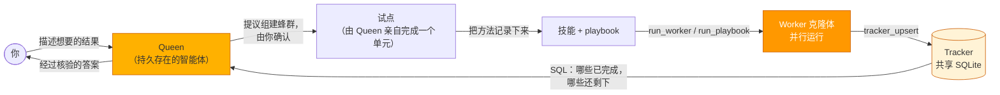

<p align="center">
  
</p>

<p align="center">
  <a href="../../README.md">English</a> |
  <a href="zh-CN.md">简体中文</a> |
  <a href="es.md">Español</a> |
  <a href="hi.md">हिन्दी</a> |
  <a href="pt.md">Português</a> |
  <a href="ja.md">日本語</a> |
  <a href="ru.md">Русский</a> |
  <a href="ko.md">한국어</a>
</p>

<p align="center">
  <a href="https://github.com/aden-hive/hive/blob/main/LICENSE"></a>
  <a href="https://www.ycombinator.com/companies/aden"></a>
  <a href="https://discord.com/invite/MXE49hrKDk"></a>
  <a href="https://x.com/aden_hq"></a>
  <a href="https://www.linkedin.com/company/teamaden/"></a>
</p>

<h3 align="center">由 AI 智能体组成的蜂群，替你运行业务流程。</h3>

<p align="center">
  描述你想要的结果。Queen 先亲自完成第一部分工作，再培育出一个由 worker 智能体组成的蜂群，并行完成其余部分。每一条结果都记录在共享账本中，可查询、可恢复、可审计。
</p>

<p align="center">
  <a href="../assets/readme/demo.mp4"></a>
  <br />
  <sub>录制自一次真实运行，只对等待的部分做了加速。<a href="../assets/readme/demo.mp4">观看完整画质版本（MP4）</a>。</sub>
</p>

## 演示中发生了什么

一个正在筹备 Show HN 的增长团队，想知道五款开发者工具当初在 Hacker News 上发布时表现如何。针对这一条消息，Hive 做了这些事：

1. **你把任务交给一位 Queen。** 每位 Queen 都是一个持久存在的智能体，有自己的角色（这里是增长负责人），也有自己的记忆和工具。
2. **她只问一个会改变答案的问题：** 只算首次发布，还是所有发布都算？你选一个选项，她接着往下做。
3. **她提议组建蜂群，由你确认。** 五款产品就是五项可以并行的任务，于是这段对话变成了一个蜂群：Queen 加上任务所需数量的 worker 智能体。
4. **她亲自完成一个单元。** 她挑了最棘手的 Supabase（它最大的那篇发布帖标题里没有“Launch HN”），明确什么才算一次发布，并把方法写成一个可复用的技能。
5. **她把方法作为操作手册（playbook）来运行：** 每款产品一个 worker，并行执行；每个 worker 都按她的技能操作，并把自己那一行写进蜂群的 tracker，也就是一张共享的 SQLite 表。
6. **回答之前，她逐行核对。** 边界情况也如实保留：Cal.com 无论用哪个名字都找不到符合条件的发布，所以图表里将它标为缺失，而不是记为零。

整个流程中没有任何环节是事先编排好的，也不需要设计工作流图：Queen 在运行时培育蜂群，哪些已完成、哪些还剩下，都由磁盘上的 tracker 记录，而不是靠谁的记忆。

## 快速开始

**你需要：** Python 3.11+、Node.js 20+ 和 git。如果缺少 `uv` 和 `ripgrep`，quickstart 脚本会自动安装，并询问是否安装 Node。

**再加一个模型。** 以下任意一种都可以，quickstart 脚本会一步步引导你完成配置：

- API key：Anthropic、OpenAI、Google Gemini、Groq、Cerebras 或 OpenRouter
- 你已有的编程订阅：Claude Code、OpenAI Codex、Kimi Code、MiniMax、Z.AI 或 Antigravity
- Hive LLM
- 通过 Ollama 运行的本地模型，完全不需要 key

```bash
git clone https://github.com/aden-hive/hive.git
cd hive
./quickstart.sh          # macOS / Linux
.\quickstart.ps1         # Windows (PowerShell 5.1+)
```

运行 quickstart 脚本后，它会为整个工作区创建一个 Python 环境，把你的 API key 存入 `~/.hive` 下的加密凭证存储，询问要使用哪个模型，然后构建仪表盘并在 `http://127.0.0.1:8787` 打开。之后想重新打开，在仓库目录下运行 `hive open` 即可。

> [!NOTE]
> Hive 是一个 `uv` 工作区，而不是 pip 包。`pip install -e .` 只会装上一个无法运行的占位包，请使用 quickstart 脚本。

**接下来：** 在主页输入一个任务，选择交给哪位 Queen；或者打开 **Prompt Library**（提示词库），把现成的提示词直接部署给它所对应的 Queen。

## 工作原理


```mermaid
flowchart LR
    You(["你"]) -->|"描述想要的结果"| Queen["Queen<br/>（持久存在的智能体）"]
    Queen -->|"提议组建蜂群，<br/>由你确认"| Pilot["试点<br/>（由 Queen 亲自完成一个单元）"]
    Pilot -->|"把方法记录下来"| Skill["技能 + playbook"]
    Skill -->|"run_worker / run_playbook"| W["Worker 克隆体<br/>并行运行"]
    W -->|"tracker_upsert"| T[("Tracker<br/>共享 SQLite")]
    T -->|"SQL：哪些已完成，<br/>哪些还剩下"| Queen
    Queen -->|"经过核验的答案"| You

    style Queen fill:#ffb100,stroke:#cc5d00,color:#333
    style T fill:#fff3d6,stroke:#cc5d00,color:#333
    style W fill:#ff9800,stroke:#cc5d00,color:#fff
```

Hive 只有**一个执行原语**：智能体循环（agent loop）。Queen 就是一个智能体循环；每个 worker 都是它的克隆体，各自拥有自己的任务、更精简的工具集和严格的预算。编排是一次工具调用，而不是一张编译好的图：

- **`run_worker`** 把任务扇出后立即返回，所以 worker 运行期间 Queen 仍能继续和你对话。默认最多同时运行四个，其余排队等待。每个 worker 完成后，它的报告会作为新的一轮消息出现在 Queen 的对话中。
- **Tracker** 是蜂群的共享状态。Queen 定义表结构以及 worker 可以写入哪些列；worker 每处理一个工作单元就 upsert 一行；Queen 用 SQL 查看进度。它保存在磁盘上，路径为 `~/.hive/colonies/<name>/tracker/tracker.db`。
- **`run_playbook`** 对每一行执行一套已验证的流程：带退避的重试、限流通道，以及存放反复失败行的死信列表。由于“还剩哪些”始终是对 tracker 的一次实时查询，重新运行 playbook 就能从中断处继续。

**[架构概述](../architecture/README.md)** 介绍了智能体循环、工具接口、记忆、人工监督，以及状态如何在崩溃后保留下来。

<table>
  <tr>
    <td width="50%"><br /><sub><b>主页。</b>你的所有 Queen 及其蜂群都在一张地图上。描述一个任务，再选择由谁接手。</sub></td>
    <td width="50%"><br /><sub><b>Worker。</b>每个工作单元对应一个 worker，各有自己的任务和预算，全部向 Queen 汇报。</sub></td>
  </tr>
  <tr>
    <td width="50%"><br /><sub><b>Tracker。</b>worker 一完成，结果就写入共享表，可随时查询、导出，或从中恢复运行。</sub></td>
    <td width="50%"><br /><sub><b>结果。</b>经过核验的答案直接出现在对话中，附带来源和图表。</sub></td>
  </tr>
</table>

## 功能一览

**有分工、有记忆的 Queen。** Hive 自带 13 位各有人设的 Queen：其中 6 位默认启用（增长、RevOps、内容、线索获取、主动外联、品牌与设计），其余可以从 Org Chart（组织架构图）中雇用，你也可以创建自己的 Queen。每位 Queen 都有按范围隔离的 Markdown 记忆，由反思步骤写入；相关的历史对话也会被自动召回到她的上下文中。

**内置工具，进程内运行。** Shell 命令和后台任务、文件编辑、快速代码搜索、PDF、附件和图片、网页抓取、图表（ECharts 和 Mermaid）、CSV 文件，以及借助 Hive LLM 生成图像。这些工具直接在 Hive 内部运行，不需要启动任何工具服务器。

**让智能体操控你的浏览器。** 借助 Hive Browser Bridge 扩展，智能体可以操作你自己的 Chrome，你已有的登录状态直接可用。每个 worker 都有自己的标签页组。

**技能。** 采用开放的 [Agent Skills](https://agentskills.io) 格式编写的可复用指令。Hive 自带一套技能；某个流程一旦被验证可行，Queen 就会编写新的技能；你可以在 Skills Library（技能库）中管理它们。

**支持任意 MCP server。** 用 `hive mcp add` 添加外部 MCP server 后，它的工具会和内置工具一起纳入同样的允许列表。[`tools/`](../../tools/src/aden_tools/tools) 中的完整集成目录（GitHub、Gmail、HubSpot、Slack、Notion 等等）就是作为一个 MCP server 运行的；详见 [docs/tools.md](../tools.md)。

**你不在时也能运行。** 蜂群可以通过 cron、固定间隔或 webhook 触发器自行调度。**Sentinel** 可以按蜂群单独开启，它会在 Queen 停下时介入：要么督促她继续，要么通过 Hive 收件箱、Telegram 或 Slack 升级给你，你回复后她会接着执行。

**经得起崩溃。** 每个智能体都会把状态持久化到磁盘，崩溃或重启后能从中断处精确恢复。较大的工具结果会写入文件，而不是塞满上下文；长会话会自动压缩；卡住或陷入循环的轮次会被检测出来；每个 worker 都在严格的工具调用预算内运行。

**任意模型。** [LiteLLM](https://docs.litellm.ai/docs/providers) 支持的模型都可以使用，包括 OpenAI、Anthropic、Gemini、OpenRouter、Hive LLM、任何兼容 OpenAI 的端点，以及通过 Ollama 运行的本地模型。worker 可以使用与其 Queen 不同的模型，纯文本模型也能借助视觉回退机制“看到”图片。

## Hive 适合你吗？

当难点不再是模型本身，而是围绕模型的一切时，Hive 就派上用场了：

- 流程中有**大量相似的工作单元**，例如销售线索、客户账户、工单、代码仓库或文档，你希望它们并行处理，并且处理方式保持一致。
- 工作需要**持续运行数小时或按计划定时运行**，并且必须能扛过重启。
- 结果需要能被**核对、查询和审计**，而不只是在聊天里看一眼。
- 关键决策始终**由人来把关**。

如果只是单个提示词或一次性脚本，用普通的智能体更简单。

## 文档

- [入门指南](../getting-started.md)：更详细的安装配置说明
- [架构概述](../architecture/README.md)：蜂群、智能体循环、工具和记忆如何协同工作
- 核心概念：[蜂群](../key_concepts/colony.md)、[Queen](../key_concepts/queen.md)、[worker](../key_concepts/worker_agent.md)、[协同](../key_concepts/coordination.md)、[智能体循环](../key_concepts/the_loop.md)、[目标与结果](../key_concepts/goals_outcome.md)、[蜂群如何持续改进](../key_concepts/improvement.md)
- [工具](../tools.md)：内置工具、MCP server 和集成目录
- [配置](../configuration.md)与[开发者指南](../developer-guide.md)
- [路线图](../roadmap.md)：V1 已交付的功能和仍待完成的事项
- [docs.adenhq.com](https://docs.adenhq.com/)：在线文档

## 常见问题

**Hive 支持哪些模型？**
[LiteLLM](https://docs.litellm.ai/docs/providers) 支持的所有提供商，以及任何兼容 OpenAI 的端点。quickstart 脚本可以配置常用的几种，包括 Claude Code、OpenAI Codex 等编程订阅；其余的请参阅 [docs/configuration.md](../configuration.md)。

**可以用本地模型运行吗？**
可以。在 quickstart 脚本中选择 Ollama；或者在本地运行 Ollama，并把模型设为 `ollama/llama3` 之类。

**它和其他智能体框架有什么不同？**
大多数框架要你设计一张智能体图，并手动连接各个智能体的输入和输出。Hive 只有一种智能体：Queen 是一个智能体循环，每个 worker 都是它的克隆体。编排在运行时通过工具调用完成，协同则依靠一个共享的 SQL tracker，而不是沿着图的边传递消息。持久化、恢复、预算、上下文压缩、人工监督这些运行支撑层（harness）能力都内建在这唯一的循环中，因此每个智能体都天然具备。

**我的数据存放在哪里？**
就在你自己的机器上。会话、蜂群、tracker 和记忆都是 `~/.hive`（或 `HIVE_HOME` 指向的目录）下的普通文件，API key 也加密存放在那里。

**如何控制成本？**
每个 worker 的轮次和工具调用次数都有硬性上限，卡住的 worker 会自行停止，并发数也有上限。每次模型调用都会计量用量。目前还不支持按金额设置支出上限。

**智能体能使用我自己的工具和 API 吗？**
可以：通过内置的 shell 和浏览器，通过你添加的任意 MCP server，还可以通过技能把你的操作流程教给它们。

**Hive 是开源的吗？**
是的，采用 [Apache License 2.0](../../LICENSE) 许可证。

## 参与贡献

欢迎贡献，尤其是工具、集成和技能方面（[#2805](https://github.com/aden-hive/hive/issues/2805)）。请先阅读 [CONTRIBUTING.md](../../CONTRIBUTING.md)，并在提交 pull request 之前先认领 issue：在 issue 下留言，维护者会把它分配给你。附带复现步骤或改进方案的 issue 会优先处理。

## 社区

- [Discord](https://discord.com/invite/MXE49hrKDk)：提问、提功能需求和参与讨论
- [X / Twitter](https://x.com/aden_hq) 和 [LinkedIn](https://www.linkedin.com/company/teamaden/)：获取最新动态
- [HoneyComb](http://honeycomb.open-hive.com/)：一个追踪 AI 智能体正在自动化哪些工作的社区市场。你可以用计算代币（而不是真钱）对某项工作做多或做空。

**我们正在招聘**工程、研究和市场推广（go-to-market）岗位。[查看开放职位](https://jobs.adenhq.com/a8cec478-cdbc-473c-bbd4-f4b7027ec193/applicant)。

## 安全

如需报告安全漏洞，请参阅 [SECURITY.md](../../SECURITY.md)。

## 许可证

Apache License 2.0。详见 [LICENSE](../../LICENSE)。

## Star 历史

<a href="https://www.star-history.com/?type=date&repos=aden-hive%2Fhive">
 <picture>
   <source media="(prefers-color-scheme: dark)" srcset="https://api.star-history.com/chart?repos=aden-hive/hive&type=date&theme=dark&legend=top-left&sealed_token=vfX1DG8w_KTkonUUtIEjFRLvBopgDzxQpyb8hiYT22sobcDIpvQiMciZghLsDu5hyU3LJs-ZddFjl8eYFx5zRrY-kcMRsfyQ3vAiacsroPoqgRYmZaES3Q" />
   <source media="(prefers-color-scheme: light)" srcset="https://api.star-history.com/chart?repos=aden-hive/hive&type=date&legend=top-left&sealed_token=vfX1DG8w_KTkonUUtIEjFRLvBopgDzxQpyb8hiYT22sobcDIpvQiMciZghLsDu5hyU3LJs-ZddFjl8eYFx5zRrY-kcMRsfyQ3vAiacsroPoqgRYmZaES3Q" />
   
 </picture>
</a>

---

<p align="center">在旧金山，用 🔥 热情打造</p>
