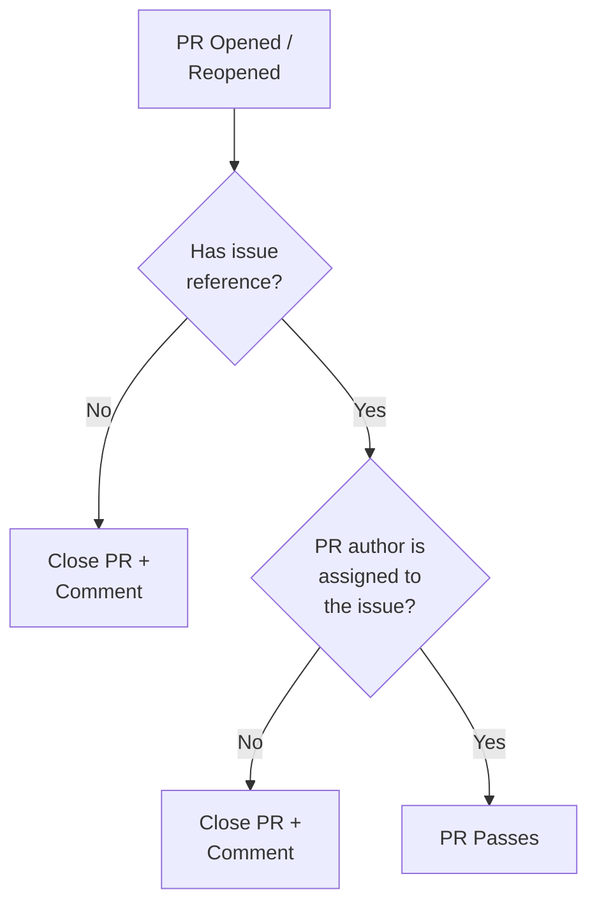

# PR Requirements Workflow

This repository enforces that all pull requests must be linked to an issue that has an assignee. PRs that don't meet this requirement are automatically closed.

## Requirements

For a PR to be accepted, it must:

1. **Reference an issue** - Include `Fixes #123`, `Closes #123`, or `#123` in the PR title or description
2. **PR author is assigned to the issue** - You must be assigned to the issue you're working on

## How It Works



## Workflow Triggers

The check runs when a PR is:
- `opened` - New PR created
- `reopened` - Previously closed PR reopened
- `edited` - PR title or description changed
- `synchronize` - New commits pushed

## Fixing a Closed PR

If your PR was automatically closed:

1. **Create or find an issue** for the work you're doing
2. **Assign yourself** to that issue
3. **Re-open your PR**
4. **Add the issue reference** to your PR description:
   ```
   Fixes #123
   ```

## Valid Issue Reference Formats

Any of these patterns in your PR title or description will work:

- `Fixes #123`
- `fixes #123`
- `Fixed #123`
- `Closes #123`
- `closes #123`
- `Closed #123`
- `Resolves #123`
- `resolves #123`
- `Resolved #123`
- `#123` (plain reference)

## Why This Requirement?

- Ensures all work is tracked in issues
- Guarantees the person submitting the PR is responsible for the work
- Prevents PRs for issues assigned to others
- Improves project organization and accountability
- Makes it easier to understand what each PR accomplishes
