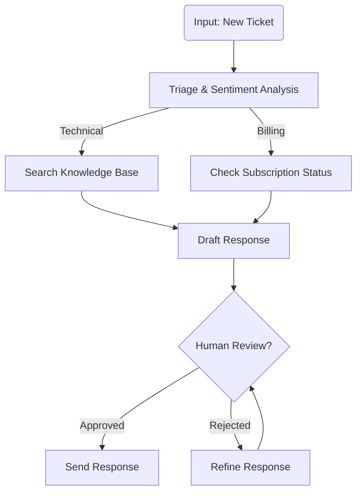

# Real-World Use Case: Customer Support Agent

This guide demonstrates how to build a production-grade **Customer Support Agent** using Aden. Unlike traditional chatbot workflows that are hardcoded and brittle, this agent is **goal-driven**, meaning Aden generates the logic graph for you and self-adapts when edge cases arise.

## 1. Business Problem

Modern customer support faces three core challenges:
1.  **Volume Spikes**: Human agents get overwhelmed during outages or improved feature launches.
2.  **Context Loss**: Chatbots often forget previous interactions or customer details.
3.  **Brittle Automation**: Hardcoded "if-then" flows break when customers ask unexpected questions.

### Suggested Metrics to Track
Instead of relying on hard metrics which vary by industry, we recommend tracking:
*   **Auto-Resolution Rate**: % of tickets closed without human intervention.
*   **Escalation Rate**: Frequency of "Human Review" nodes triggering.
*   **Average Handle Time**: Time from ticket receipt to solution draft.


**The Solution**: An autonomous Aden agent that triages incoming tickets, searches internal knowledge bases via MCP, and drafts responses for human review—adapting its strategy if it gets stuck.

## 2. Defining the Goal

In Aden, you don't start by writing code. You start by defining the **Goal** in natural language.

**Goal Statement:**
> "Monitor the incoming ticket queue. For each new ticket, analyze the sentiment and category. If it's a technical issue, search the documentation and draft a technical solution. If it's a billing issue, check the user's subscription status via the Billing MCP tool. Draft a polite response and wait for human approval before sending."

### Goal-to-Logic Mapping

When you input this goal, Aden's **Coding Agent** analyzes it and maps it to specific logical requirements:

*   "Monitor queue" → **Trigger/Input Node**
*   "Analyze sentiment" → **LLM Analysis Node** (Router)
*   "Search documentation" → **Tool Use Node** (connected to Docs MCP)
*   "Check subscription" → **Tool Use Node** (connected to Stripe/Billing MCP)
*   "Wait for approval" → **Human-in-the-Loop Node**

## 3. The Generated Agent Graph

Aden generates a `GraphSpec` (JSON) that represents this logic. Here is a simplified view of the generated structure:

> **Note**: The snippets below are illustrative pseudocode/simplified representations.




### JSON Structure (Snippet)

You don't write this manually, but it's useful to understand what's generated:

```json
{
  "nodes": [
    {
      "id": "triage",
      "node_type": "llm_router",
      "description": "Analyze sentiment and category",
      "routes": ["technical", "billing", "other"]
    },
    {
      "id": "search_docs",
      "node_type": "llm_tool_use",
      "tools": ["mcp_knowledge_base"],
      "description": "Find relevant docs for technical issues"
    },
    {
      "id": "human_review",
      "node_type": "human_intervention",
      "timeout_seconds": 3600,
      "escalation_policy": "notify_supervisor"
    }
  ]
}
```

## 4. MCP-Native State Management

One of Aden's biggest advantages is how it handles state. Instead of stuffing everything into the prompt (Context Bloat), Aden uses **Scoped Memory** via the Model Context Protocol (MCP).

*   **User Context**: The agent retrieves the user's name, plan, and history from a CRM MCP server only when needed.
*   **Ticket Context**: The specific issue details are kept in the `NodeContext`, passed cleanly from Triage to Draft.
*   **Knowledge**: Documentation is queried via vector search (RAG) through an MCP tool, keeping the prompt lean.

**Why this matters**: You can handle 50-turn conversations without degrading performance or hitting token limits.

## 5. Self-Refactoring in Action

What happens if the agent fails?

**Scenario**: The agent tries to use the `mcp_knowledge_base` tool, but the search returns empty results repeatedly for a new feature called "Flux Capacitor".

1.  **Failure Capture**: The framework detects that the "Draft Response" node has low confidence or is producing empty outputs because of missing data.
2.  **Worker-Judge Loop**: The **Judge** (Supervisor Agent) analyzes the trace and sees the missing info.
3.  **Graph Evolution**: The Judge decides to modify the graph. It inserts a new node: **"Search Public Web"** or **"Ask Engineering Channel"** before the Draft node.
4.  **Redeploy**: The agent implementation is updated automatically. The next time a "Flux Capacitor" ticket comes in, the agent knows to look beyond the internal docs.

This prevents the "Brittle Chain" problem where a single missing path breaks the entire workflow.

## 6. Example Interaction

> **Note**: These are illustrative examples of how the agent processes data internally.


**Input (Ticket):**
```json
{
  "user_id": "u123",
  "subject": "API 500 Error on /v1/generate",
  "body": "I'm getting a server error every time I call the generate endpoint. Is the system down?"
}
```

**Step 1: Triage Node**
*   Output: `{"category": "technical", "sentiment": "negative", "urgency": "high"}`

**Step 2: Search Node (MCP)**
*   Action: `call_tool("search_docs", query="API 500 error /v1/generate")`
*   Result: `{"status": "known_issue", "fix": "Rotate API key"}`

**Step 3: Draft Node**
*   Output: "Hi! I'm sorry you're seeing errors. We are aware of an issue with older keys. Please rotate your API key in the dashboard..."

**Step 4: Human Review Node**
*   Status: `PENDING_APPROVAL` via Slack/Dashboard.
*   Human Action: `Approve`

**Step 5: Send Node**
*   Action: Email sent. Ticket closed.

## 7. Production Considerations

*   **rate_limiting**: Use Aden's built-in throttles to prevent the agent from spamming your CRM.
*   **pii_masking**: Enable the PII middleware to scrub sensitive data before it hits the LLM.
*   **testing**: Use `claude> /testing-agent` to run simulated ticket batches before analyzing the real queue.
