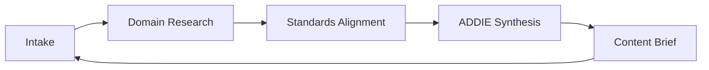

# Curriculum Research Agent

An ADDIE-based agent that researches current industry standards for a given
topic, aligns findings to learning outcomes, and produces a structured
content brief ready for instructional design.

## Pipeline



| Node | Description | Client-facing |
|------|-------------|:---:|
| **Intake** | Receive topic, audience, level, accreditation context | ✅ |
| **Domain Research** | Tavily search scoped to industry bodies and standards orgs | |
| **Standards Alignment** | Map findings to learning outcomes using Bloom's Taxonomy | |
| **ADDIE Synthesis** | Apply ADDIE framework to structure modules and assessments | |
| **Content Brief** | Present and save ID-ready brief | ✅ |

## Quickstart

### Prerequisites

1. **Tavily API key** — sign up at [tavily.com](https://tavily.com) (free tier
   available)
2. **Hive framework** — ensure the framework is installed

### Environment

```bash
export TAVILY_API_KEY="tvly-..."
```

### Run

```bash
python -m curriculum_research_agent run \
  --topic "Medication Safety for Registered Nurses" \
  --level "Continuing Education" \
  --audience "RNs with 2-5 years experience" \
  --accreditation "CNA continuing education requirements"
```

### Interactive shell

```bash
python -m curriculum_research_agent shell
```

### TUI dashboard

```bash
python -m curriculum_research_agent tui
```

### Validate structure

```bash
python -m curriculum_research_agent validate
```

## Configuration

### Input format

Pass a JSON file via `--brief-file` or supply fields directly as CLI flags.
Expected fields:

| Field | Description |
|-------|-------------|
| `topic` | Subject area (e.g. "Medication Safety for Registered Nurses") |
| `level` | Education level: Continuing Education, Certificate, Diploma |
| `audience` | Target learners |
| `accreditation_context` | Standards body or requirements |

### Domain scoping

The `domain-research` node uses Tavily's `include_domains` parameter to focus
searches on authoritative sources. Domains are automatically selected based on
the topic and accreditation context. Examples:

| Field | Domains |
|-------|---------|
| Nursing | `cna-aiic.ca`, `who.int`, `ismp.org`, `ncbi.nlm.nih.gov` |
| Business | `shrm.org`, `hbr.org`, `asq.org` |
| Technology | `ieee.org`, `acm.org`, `nist.gov` |

### ADDIE framework

The `addie-synthesis` node structures content using the ADDIE model:

- **Analysis** — Learner needs, prerequisites, performance gaps
- **Design** — Module sequencing, learning objectives, assessment strategy
- **Development** — Content topics, teaching strategies, resources
- **Implementation** — Delivery format, duration, technology requirements
- **Evaluation** — Assessment types, competency alignment, quality gates

## Output

The agent produces a **content brief** (`content_brief.md`) containing:

- Program overview (level, audience, duration)
- Needs analysis summary
- Numbered learning outcomes
- Module outline with objectives, topics, assessments
- Assessment strategy
- Curated resource list with source URLs

## Project structure

```
curriculum_research_agent/
├── __init__.py          # Package exports
├── __main__.py          # CLI entry point (click)
├── agent.py             # Graph construction, Goal, Edges, Agent class
├── agent.json           # Declarative agent descriptor
├── config.py            # RuntimeConfig + CurriculumConfig + AgentMetadata
├── mcp_servers.json     # Points to hive-tools MCP server
├── nodes/
│   └── __init__.py      # 5 NodeSpec definitions
├── tools.py             # load_curriculum_brief, save_curriculum_brief
└── README.md            # This file
```

## Related

- [Issue #5301](https://github.com/adenhq/hive/issues/5301) — Feature request
- [Hive Roadmap](https://github.com/adenhq/hive/blob/main/docs/roadmap.md) — Training & Education gap
- ADDIE Model — [Wikipedia](https://en.wikipedia.org/wiki/ADDIE_Model)
