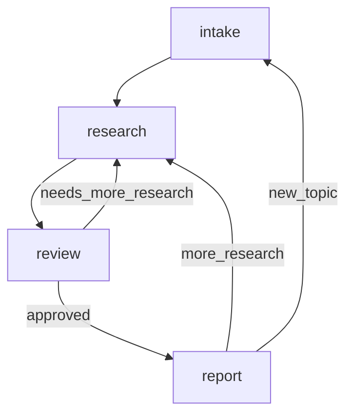

# Deep Research Agent

**Version**: 1.0.0
**Type**: Human-in-the-loop Agent
**Created**: 2026-02-15

## Overview

The Deep Research Agent is designed to perform rigorous, interactive research on any given topic. Unlike simple search bots, it employs a multi-step workflow that searches diverse sources, analyzes findings, and—crucially—involves the user in a feedback loop before generating a final cited report. This ensures the output meets specific user needs and adheres to strict quality standards.

## Architecture

### Execution Flow



### Nodes (4 total)

1.  **intake**
    *   Initializes the research session.
    *   **Goal**: specific research topic and user intent.
    *   **Writes**: `topic`, `research_questions`

2.  **research**
    *   Conducts search operations using available tools.
    *   **Goal**: Gather diverse, authoritative sources and extract relevant information.
    *   **Tools**: Search tools (e.g., `google_search`, `scrape_website`).
    *   **Writes**: `findings`, `sources`

3.  **review** (User Checkpoint)
    *   Presents gathered findings to the user for feedback.
    *   **Decision**: 
        *   If user is unsatisfied -> loops back to **research**.
        *   If user is satisfied -> proceeds to **report**.
    *   **Reads**: `findings`
    *   **Writes**: `user_feedback`, `needs_more_research`

4.  **report**
    *   Synthesizes all findings into a final, cited report.
    *   **Goal**: Answer original research questions with 100% citation coverage.
    *   **Reads**: `findings`, `sources`
    *   **Writes**: `final_report`

### Edges

*   `intake` -> `research` (Priority: 1)
*   `research` -> `review` (Priority: 1)
*   `review` -> `research` (Condition: Feedack loop requested)
*   `review` -> `report` (Condition: User approved)
*   `report` -> `research` (Condition: User requests deeper dive)
*   `report` -> `intake` (Condition: User requests new topic)

## Goal Criteria

### Success Criteria

*   **Source Diversity**: Use multiple diverse, authoritative sources (Target: >=5, Weight: 0.25)
*   **Citation Coverage**: Every factual claim in the report cites its source (Target: 100%, Weight: 0.25)
*   **User Satisfaction**: User reviews findings before report generation (Target: User Approval, Weight: 0.25)
*   **Report Completeness**: Final report answers the original research questions (Target: 90%, Weight: 0.25)

### Constraints

*   **No Hallucination**: Only include information found in fetched sources.
*   **Source Attribution**: Every claim must cite its source with a numbered reference.
*   **User Checkpoint**: Must present findings to the user before writing the final report.

## Usage

### Command Line

#### Linux / Mac
```bash
PYTHONPATH=core:examples/templates python -m deep_research_agent run --mock --topic "Artificial Intelligence"
```

#### Windows
```powershell
$env:PYTHONPATH="core;examples\templates"
python -m deep_research_agent run --mock --topic "Artificial Intelligence"
```

### Python API

```python
from framework.runner import AgentRunner

# Load the agent
runner = AgentRunner.load("examples/templates/deep_research_agent")

# Run with initial input
result = await runner.run({
    "topic": "The future of quantum computing"
})

# Access final output
print(result.output.get("final_report"))
```

## Options

*   `-t, --topic`: The research topic (required).
*   `--mock`: Run without calling real LLM APIs (simulated execution).
*   `--help`: Show all available options.
